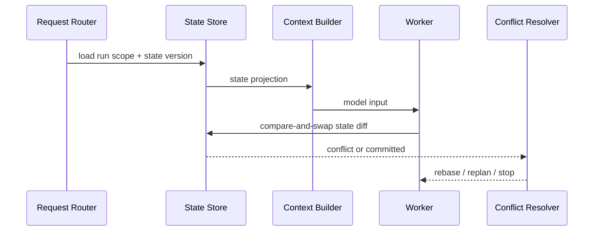

# 多轮对话上下文状态管理如何在高并发场景下保证一致性？

## 面试定位

这是短期记忆和 State 的结合题。它考的是多用户、多 session、多 Agent 同时运行时，如何避免上下文串线、状态覆盖和旧 observation 污染。回答要讲架构、数据流、指标、取舍和追问。

## 30 秒回答

高并发场景要把短期记忆绑定到 tenant、user、session、run 和 state version。每次更新使用事务或 compare-and-swap，冲突时进入 rebase、replan 或 human handoff。Context Builder 必须按 scope 读取 State、scratchpad 和 recent trace，不能从全局缓存拿未隔离上下文。指标看 state_conflict_rate、stale_context_rate、cross_session_leak_count 和 resume_success_rate。

## 标准回答

我会先说边界：一致性不是让模型记得更多，而是保证模型每轮看到的是属于当前 run 的、版本正确的上下文。多轮对话里，messages、working memory、scratchpad、tool observation 和 artifact refs 都要按作用域隔离。

状态更新要带版本。模型基于 state version N 做决策，工具返回后 reducer 写 N+1。如果此时另一个 worker 已写入 N+1，就不能盲目覆盖，要重新读取新状态，再决定是否合并或重规划。

## 架构与运行机制

数据流是 Request Router 根据 user/session/run 定位 State Store。Context Builder 读取当前 state version 和 scoped scratchpad。工具执行后，Reducer 用 optimistic lock 写入 state diff。冲突进入 Conflict Resolver，产出 rebase、retry、ask_user 或 stop。

## 可画图

图 1：高并发短期记忆的一致性写入链路。Request Router 先用 tenant、user、session 和 run 定位 State Store，Context Builder 只读取当前版本的投影，Worker 写入时通过 compare-and-swap 提交 state diff，冲突再交给 Conflict Resolver 判定 rebase、replan 或停止。

这张图的核心不是“多存几段上下文”，而是让每一轮模型输入都绑定明确的 scope 和 state_version。旧 observation、跨 run scratchpad、缓存投影和并发 reducer 都可能污染下一轮决策，所以一致性控制要发生在上下文构造和状态提交两个位置。

## 系统设计案例

客服 Agent 和财务 Agent 同时处理同一退款单。客服只能读订单和创建 preview，财务才能确认退款。两者的 working memory 可以引用同一个订单 artifact，但 run state、权限和 scratchpad 必须分开。退款状态变化后，旧 preview 失效，Context Builder 不能继续给模型旧确认上下文。

## 真实问题与排障

如果出现用户 A 看到用户 B 的上下文，先查缓存 key 是否缺 tenant/user/session。若出现状态回滚，检查 state version 和事务。若模型使用旧观察，检查 scratchpad TTL 和 projection version。指标包括 `cross_session_leak_count`、`state_conflict_rate`、`stale_context_rate`、`projection_cache_hit_error`。

## 面试官追问

- 多 worker 同时更新怎么办？用 state version 和 compare-and-swap。
- 缓存 context projection 安全吗？可以，但必须绑定权限、state version 和 evidence hash。
- 冲突都自动合并吗？不是，高风险状态冲突要停止或转人工。

## 多轮追问模拟

追问 1：如果两个 worker 都基于 version 10 执行动作，一个成功写入 version 11，另一个怎么办？
答：第二个 worker 的 diff 不能覆盖 version 11，要重新读取最新 State，把自己的观察和新状态做 rebase。如果动作是只读摘要，可以重新投影后继续；如果动作涉及退款、发信、删除或权限变更，要停止并重新请求确认。考察点是乐观并发控制；陷阱是把“后写覆盖前写”当成简单冲突解决。

追问 2：为什么 context projection cache 不能只用 session_id 做 key？
答：session_id 不能表达租户、用户、run、权限、state_version、policy_version 和 evidence hash。只用 session_id 会让旧权限、旧观察或其他用户的上下文被复用，严重时造成串线。考察点是缓存隔离；陷阱是把性能优化放在权限边界之前。

追问 3：哪些冲突可以自动合并，哪些必须人工或停止？
答：可自动合并的是低风险、可交换、无外部副作用的字段，例如两个独立检索摘要；不能自动合并的是支付、退款、删除、对外发送、权限变更和用户硬约束冲突。考察点是副作用分级；陷阱是用通用 CRDT 或 append-only 日志掩盖业务风险。

## 项目化回答

我会把短期记忆做成 scoped runtime：每个 run 有自己的 working memory 和 scratchpad，缓存 key 包含 tenant、user、session、state version。并发写入失败时不让模型继续旧路径，而是重新投影上下文。

## 常见错误

- context cache 没有 user scope。
- 状态更新没有版本。
- scratchpad 被多个 run 共享。
- 冲突后让模型按旧上下文继续。

## 深挖技术细节

高并发场景中，短期记忆要绑定 scope。推荐 key 包含 `tenant_id`、`user_id`、`session_id`、`thread_id`、`run_id`、`state_version` 和 `permission_scope`。Working memory、scratchpad、recent trace 和 tool observation 都不能用全局缓存共享。Context projection 的缓存 key 还要包含 evidence hash、tool visibility version 和 policy version。

写入要用事件日志和乐观锁。模型基于 state version N 生成 tool_call；工具 observation 返回后，Reducer 写入 N+1。如果 State Store 发现当前版本已经是 N+1 或 N+2，就拒绝旧 diff，触发 Conflict Resolver。Resolver 决定 rebase、replan、ask_user 或 stop。高风险写操作不能自动合并。

一致性还要处理旧 observation。页面、订单、文件、测试结果都可能在并发中变化，所以 memory projection 要带 `observed_at`、`artifact_hash` 和 `ttl_steps`。指标包括 `state_conflict_rate`、`stale_context_rate`、`cross_session_leak_count`、`projection_cache_hit_error`、`resume_success_rate`、`duplicate_action_rate`。

## 边界条件与反例

反例一：缓存 key 只有 session，没有 user 和 tenant，导致用户 A 看到用户 B 的上下文。反例二：两个 worker 同时处理退款，一个生成 preview，一个确认旧 preview，最后执行过期动作。反例三：scratchpad 共享导致某个 Agent 的未验证假设被另一个 run 当事实。

边界在于：低风险读任务可以允许 eventual consistency；支付、删除、发信、退款、权限变更和代码写入需要强版本校验。冲突不能总是自动合并，尤其是涉及外部副作用和用户授权时。

## 深问准备

- 问：多 worker 同时更新怎么办？答：state version + compare-and-swap，冲突进入 rebase 或 stop。
- 问：context projection 可以缓存吗？答：可以，但 key 必须包含 scope、state version、权限、evidence hash 和 tool version。
- 问：哪些冲突不能自动合并？答：外部副作用、授权、付款、删除、跨租户数据和用户硬约束冲突。
- 问：如何发现串线？答：trace 记录 scope、cache key、memory_id 和 state_version，指标看 cross_session_leak_count。

## 来源与延伸阅读

- [LangChain Short-term memory](https://docs.langchain.com/oss/python/langchain/short-term-memory)：用于支持短期记忆应作为 thread-scoped state 管理，而不是把历史消息无限追加进模型输入。
- [LangGraph Persistence](https://docs.langchain.com/oss/python/langgraph/persistence)：用于支持 checkpoint、state version 和可恢复执行是多轮 Agent 状态一致性的基础。
- [OpenAI Agents SDK Tracing](https://openai.github.io/openai-agents-python/tracing/)：用于支持每步输入、工具调用和结果都应进入 trace，方便定位 stale context、串线和冲突回放。
