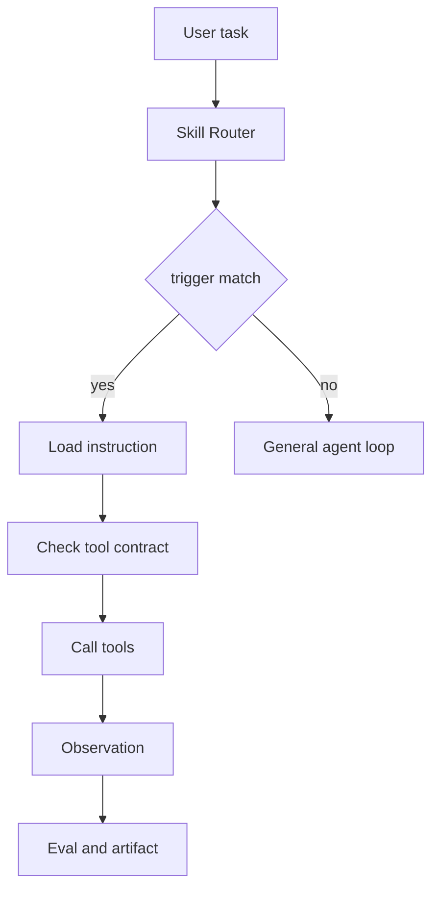

# Tool 和 Skill 的区别是什么？

## 30 秒回答

Tool 是 Agent 可以调用的动作接口，重点是 schema、权限和执行结果。Skill 是可复用工作流程，重点是 trigger、instruction、tool contract、scope、version 和 eval。简单说，tool 解决“能做什么动作”，Skill 解决“什么时候按什么方法完成一类任务”。

## 面试定位

这题考边界感。很多人会把 Skill 当成长 prompt，或者把 tool 当成 Agent 能力的全部。面试官希望你能讲出二者在架构、数据流、指标、取舍和追问里的位置。

## 标准回答

Tool 通常是确定性接口，例如搜索、读文件、调用 API、运行测试。它应该有输入 schema、输出 schema、错误码、权限和超时。Agent 调 tool 后得到 observation，再决定下一步。

Skill 更像一个任务包。它包含触发条件、执行步骤、参考资料、模板、脚本和验证方式。比如“代码审查 Skill”会规定先看 diff，再找高风险问题，最后输出按严重度排序的 findings。

两者可以组合。Skill 的 instruction 会规定什么时候使用哪些 tool，以及每一步如何验证。没有 tool，Skill 可能只剩文字流程。没有 Skill，Agent 每次都要临场组织工具调用。

## 架构与运行机制

图 1：Skill 从触发、加载说明、检查工具契约到执行验证的运行流程。

这张图里，User task 先进入 Skill Router，而不是直接进入通用 Agent loop。trigger match 决定是否加载特定 Skill；命中后只加载必要 instruction，再检查 tool contract，确认当前任务允许哪些工具、哪些动作需要确认、失败后如何回退。Call tools 和 Observation 形成执行闭环，Eval and artifact 负责验收最终产物。未命中时才回到 General agent loop。这个结构说明 Skill 的价值不是“更长的 prompt”，而是把高频任务的触发、流程、工具边界和验收方式固定下来。

## 可画图

可以画两层结构：上层是 Skill，包含 trigger、instruction、scope、version 和 eval。下层是 tools，包含 search、file、browser、test runner 等可执行能力。箭头从 Skill 指向 tool，表示流程约束动作。

## 系统设计案例

为“生成技术面试文档”做 Skill，可以定义触发为“用户要求重写知识点或面试题”。instruction 要求先读现有内容，再查官方来源，补 Mermaid 图、数据流、指标、取舍、真实排障和来源链接。tool contract 允许读写 markdown、运行校验、打开浏览器抽样。

数据流是：任务命中 Skill，加载写作模板和校验 rubric，执行文件编辑和验证命令，最后输出改动说明。这样产物更稳定，也能回放为什么用了某个资料。

## 真实问题与排障

如果 Agent 选错 Skill，先查 trigger 是否过宽或优先级冲突。如果 Skill 输出模板味太重，检查 instruction 是否缺少领域素材和 examples。如果工具调用失败，看 tool contract 是否声明了输入、权限和错误恢复。

指标可以看 skill_trigger_precision、task_success_rate、eval_pass_rate、tool_error_rate 和 user_revision_rate。

## 面试官追问

- Skill 是否一定要调用 tool？
- 多个 Skill 同时命中怎么办？
- tool contract 应该包含哪些字段？
- Skill 如何版本化和回滚？
- 怎样评估 Skill 比普通 prompt 更好？

## 多轮追问模拟

第一轮追问：Skill 是否一定要调用工具？
回答要点：不一定。Skill 可以只是流程和模板，但生产价值通常来自它能约束何时读资料、何时调用工具、如何验证产物；没有工具时要更依赖清晰输入和人工验收。考察点是 Skill 和 Tool 的解耦。陷阱是把 Skill 等同于工具集合。

第二轮追问：多个 Skill 同时命中怎么办？
回答要点：按任务意图、风险等级、scope 和优先级选择主 Skill；必要时明确组合顺序，比如先浏览器验证再前端修复。考察点是路由和冲突解决。陷阱是同时加载全部 Skill，导致上下文污染和步骤冲突。

第三轮追问：tool contract 应该包含哪些字段？
回答要点：allowed_tools、read/write scope、side_effect、requires_confirmation、timeout、retry、rollback、audit_fields、structured error 和验证命令。考察点是工具边界工程化。陷阱是只声明工具名，不说明权限和副作用。

第四轮追问：怎么证明 Skill 比普通 prompt 更好？
回答要点：用回放集比较 task_success_rate、eval_pass_rate、tool_error_rate、latency_p95 和 user_revision_rate，并在 trace 中记录 skill_version 和 verification_result。考察点是可评估性。陷阱是用“回答更长”当作效果指标。

## 项目化回答

我会说 Tool 是执行边界，Skill 是过程边界。项目里我会把高频任务沉淀为 Skill，并让 Skill 显式声明 trigger、scope、tool contract、version 和 eval。这样 Agent 的能力可以复用，也能被测试。

## 常见错误

- 把 Skill 写成一大段提示词。
- Tool 没有 schema 和权限控制。
- Skill 没有触发边界，导致误用。
- 没有 eval，无法判断质量。
- 忽略版本升级后的兼容性。

## 深挖技术细节

Skill 可以理解为“可加载的过程知识”，但生产实现要比提示词严格。一个 Skill 至少应该包含 `name`、`trigger`、`scope`、`inputs`、`allowed_tools`、`procedure`、`artifacts`、`verification`、`fallback` 和 `version`。trigger 决定何时加载，scope 决定不该接哪些任务，allowed_tools 限制可调用能力，verification 定义产物如何过线。

和 Tool 的关键区别在执行时序：Tool 是单次动作接口，输入输出应该稳定；Skill 是一段工作流约束，会影响 Agent 如何读资料、调用哪些工具、怎样写中间产物、用什么指标验收。Skill Router 如果命中多个 Skill，需要按任务意图、风险等级和优先级选择，必要时让上层 planner 明确合并顺序，避免两个 Skill 对同一文件、同一格式或同一安全边界提出冲突要求。

## 边界条件与反例

Skill 不适合承载强安全边界。比如“删除生产数据前必须审批”不能只写在 Skill instruction 里，而要由 tool runtime 或后端 policy 强制执行。Skill 可以提醒先 preview、再确认、再执行，但真正阻断危险动作的是权限系统、确认流程和审计日志。

另一个反例是把 Skill 写得过宽，例如“所有技术问题都使用架构 Skill”。这样会导致简单 bugfix 也被套入长流程，增加延迟和用户修订率。更好的做法是让 Skill 有清晰的触发条件和退出条件：当任务缺少必要输入、工具不可用或验证失败时，返回 fallback，而不是继续编造步骤。

## 深问准备

如果被问“怎么评估 Skill 有效”，我会用 A/B 或回放集比较普通 prompt 与 Skill 的 `task_success_rate`、`eval_pass_rate`、`tool_error_rate`、`latency_p95` 和 `user_revision_rate`。Skill 的价值不是让回答更长，而是让同类任务的过程更稳定、错误更可复盘、产物更容易验证。

如果追问“Skill 如何版本化”，可以回答使用语义版本和兼容性说明：小版本增加参考资料或校验项，大版本改变 artifact schema 或工具契约。trace 里记录 `skill_name`、`skill_version`、`trigger_reason` 和 `verification_result`，这样线上质量波动时能定位是模型变化、工具变化，还是 Skill 版本变化。

## 来源与延伸阅读

- [Anthropic: Equipping agents for the real world with agent skills](https://www.anthropic.com/engineering/equipping-agents-for-the-real-world-with-agent-skills)：用于理解 Skill 作为可加载任务能力包的设计动机。
- [OpenAI A practical guide to building agents](https://cdn.openai.com/business-guides-and-resources/a-practical-guide-to-building-agents.pdf)：用于补充工具、工作流、评估和人工审核在 Agent 工程中的位置。
