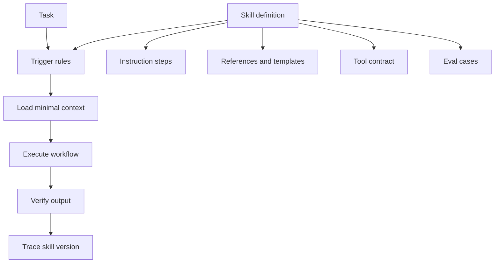

# 如何设计一个可复用、可验证的 Skill？

## 30 秒回答

一个可复用 Skill 需要清晰 trigger、可执行 instruction、受限 tool contract、明确 scope、可追踪 version、必要 references 或 templates，以及 eval。它不应把所有知识塞进上下文，而应渐进加载，并在产物完成后运行验证。

## 面试定位

这题考的是能力工程化。面试官想知道你能不能把经验沉淀成可维护模块，而不是依赖一次性的 prompt。

回答要自然覆盖架构、数据流、指标、取舍和追问。重点是可复用和可验证两个词。

## 标准回答

我会先定义 Skill 的适用范围和不适用范围。trigger 要有正例和反例，避免所有相似任务都误触发。instruction 要写成步骤和检查点，不写空泛原则。

然后设计 tool contract。Skill 可以调用哪些工具，哪些动作需要确认，失败后怎么重试或回退，都要清楚。对于文件、网络、邮件、数据库等有副作用工具，必须有权限边界。

最后是验证。每个 Skill 至少有 golden cases、rubric 或命令级检查。版本升级时跑回归，观察 eval_pass_rate 和用户返修率。

## 架构与运行机制

运行时要按需加载。入口文件只放触发和流程，长资料放 references，固定格式放 templates，重复动作放 scripts。这样可以控制 context 成本，也便于维护。

## 可画图

图里可以把 Skill 画成一个包：metadata、trigger、steps、assets、tools、eval。外部输入是用户任务，输出是 artifact、verification result 和 trace。

## 系统设计案例

设计“CI 修复 Skill”时，trigger 是用户要求修失败检查或 PR checks。instruction 要求先读失败日志，再定位最近变更，再本地复现，再最小修复，最后跑对应测试。references 可以放常见 CI 平台说明，scripts 可以封装日志下载。

数据流是：任务触发 Skill，加载 CI 诊断步骤，读取日志和代码，执行修复，跑测试，输出原因和验证证据。每次失败样本都进入回归集，用来改进 Skill。

## 真实问题与排障

如果 Skill 复用后质量下降，先看任务是否超出 scope。若 trigger 正确，再看 reference 是否过期、工具权限是否变化、eval 是否覆盖真实失败。

指标包括 trigger_precision、trigger_recall、eval_pass_rate、manual_intervention_rate、artifact_accept_rate 和 regression_failure_count。

## 面试官追问

- Skill 的最小定义包含什么？
- 如何做渐进加载？
- examples 和 templates 应该如何组织？
- Skill 版本升级失败怎么回滚？
- 如何避免 Skill 输出千篇一律？

## 项目化回答

我会说 Skill 是可以测试的工作流组件。项目中我会先写 trigger 和 scope，再把步骤、工具契约、模板、引用资料和 eval 拆开维护。这样它既能复用，也能通过指标判断是否有效。

## 常见错误

- 入口文件过长，导致每次加载大量无关内容。
- 只有步骤，没有失败处理。
- tool contract 缺少权限和 side effect 描述。
- version 改了但 eval 没跑。
- 没有负例，trigger 很容易误判。

## 深挖技术细节

一个可维护的 Skill 可以拆成 metadata、trigger、workflow、references、templates、scripts、tool contract 和 eval。metadata 至少包括 `name`、`description`、`version`、`owner`、`last_reviewed`。trigger 要写正例、反例和不适用场景。workflow 用步骤和 checkpoint 表达，避免“尽量做好”这类不可验证描述。references 放长资料，templates 放固定产物，scripts 放可重复执行动作。

Tool contract 要明确 side effect。每个工具声明 `allowed_actions`、`read_scope`、`write_scope`、`network_scope`、`requires_confirmation`、`rollback_strategy` 和 `audit_fields`。比如邮件 Skill 可以搜索和草拟，但发送必须确认；代码 Skill 可以 patch 工作区，但不能覆盖用户未保存改动。Skill 不能通过说明文字绕过宿主权限。

Eval 要覆盖 trigger 和产物质量。Trigger precision 防误触发，trigger recall 防漏触发；artifact eval 检查输出格式、必要字段、验证命令和用户返工。版本升级时跑 regression，保存 `skill_version`、`case_id`、`verdict`、`failure_reason`。指标包括 `trigger_precision`、`trigger_recall`、`eval_pass_rate`、`manual_intervention_rate`、`artifact_accept_rate` 和 `regression_failure_count`。

## 边界条件与反例

反例一：Skill 入口塞满几十页资料，每次加载都污染上下文。反例二：没有负例，用户问相邻主题也被错误触发。反例三：Skill 调用外部工具但没有说明权限和确认，导致安全边界不清。反例四：模板固定过头，所有输出千篇一律。

边界在于：Skill 适合沉淀稳定、可复用、可验证的工作流；一次性创意探索或强依赖当前上下文的任务不一定适合。第三方 Skill 应视为不可信代码，使用前要读说明、限制工具权限，并在沙箱里验证。

## 深问准备

- 问：最小 Skill 包含什么？答：metadata、trigger、scope、步骤、tool contract、验证方式和版本。
- 问：渐进加载怎么做？答：入口只放路由和流程，按任务类型加载 references、templates 或 scripts。
- 问：如何避免误触发？答：写负例、边界条件和 trigger eval，必要时让主流程确认。
- 问：版本升级失败怎么回滚？答：保留版本、回归集和变更记录，失败后回退到上一版。

## 来源与延伸阅读

- [Anthropic Skills repository](https://github.com/anthropics/skills)
- [Anthropic Agent Skills engineering note](https://www.anthropic.com/engineering/equipping-agents-for-the-real-world-with-agent-skills)
- [OpenAI Agents SDK Tools](https://openai.github.io/openai-agents-python/tools/)
