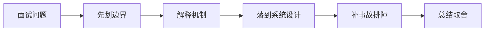

# 栈、队列、双端队列与单调结构 的核心机制是什么？

## 面试定位

这道题关联 栈、队列、双端队列与单调结构，难度 4/5，出现频率 high。面试官真正想看的是：你能否把概念回答升级成架构、数据流、指标、取舍和真实故障处理。
回答主轴可以从「栈、队列、双端队列与单调结构」切入：栈适合最近未匹配状态，队列适合层序和 BFS，单调栈/队列用维护单调性在 O(n) 内解决下一个更大、滑窗最大值等问题。

**第一句话建议**
我会先划清边界，再解释运行机制，最后用一个系统设计案例说明数据流、失败模式、指标和取舍。

**不要只答**
- 用 Stack 类而不是 ArrayDeque
- 单调队列忘记清理过期下标
- 比较符号等号处理导致重复元素错误

## 30 秒回答

先给定义和边界：栈是后进先出结构。；队列是先进先出结构。；单调结构是在栈或队列中维持元素单调顺序。；栈适合最近未匹配状态，队列适合层序和 BFS，单调栈/队列用维护单调性在 O(n) 内解决下一个更大、滑窗最大值等问题。；栈处理后进先出。

回答时必须主动补数据流、关键字段、失败模式、指标和取舍，否则很容易停留在背概念。

## 架构与运行机制

### 标准回答骨架

- 先给定义和边界：栈是后进先出结构。；队列是先进先出结构。；单调结构是在栈或队列中维持元素单调顺序。；栈适合最近未匹配状态，队列适合层序和 BFS，单调栈/队列用维护单调性在 O(n) 内解决下一个更大、滑窗最大值等问题。；栈处理后进先出。
- 再讲机制：每个元素最多进出一次才能得到 O(n)。；栈里保存什么取决于答案需要索引、值还是状态。；队列适合按距离或层数扩展。；重复元素的比较策略要和题意一致。；括号匹配、表达式、路径简化、每日温度可用栈维护待匹配元素。。
- 工程落地要说清楚：ArrayDeque stack/queue。；Monotonic stack。；Monotonic deque。；Level-order BFS queue。；每日温度类问题栈内保存待找到更大值的下标。；滑动窗口最大值队列保存下标并按值单调。。
- 最后补指标、失败模式和取舍：push_pop_count；monotonic_invariant_errors；expired_index_errors；bfs_level_errors；time_complexity；用 Stack 类而不是 ArrayDeque；单调队列忘记清理过期下标；比较符号等号处理导致重复元素错误。
- 栈适合最近未匹配状态，队列适合层序和 BFS，单调栈/队列用维护单调性在 O(n) 内解决下一个更大、滑窗最大值等问题。
- 栈是后进先出结构。
- 队列是先进先出结构。
- 单调结构是在栈或队列中维持元素单调顺序。
- 每个元素最多进出一次才能得到 O(n)。
- 栈里保存什么取决于答案需要索引、值还是状态。
- 队列适合按距离或层数扩展。
- 重复元素的比较策略要和题意一致。
- 括号匹配、表达式、路径简化、每日温度可用栈维护待匹配元素。
- 单调队列在窗口滑动时维护候选最大/最小值，下标过期要及时弹出。
- 把核心对象、状态变化、执行顺序和异常路径讲出来，避免只说结论。

### 数据流怎么讲

可以按题意翻译、输入规模、复杂度上限、数据结构选择、算法范式、状态定义、边界用例、Java 模板和验证过程来讲。数据流通常是先把题目对象化，抽出数组、图、树、区间、状态或约束；再选双指针、哈希、栈队列、二分、回溯、DP、贪心、堆、BFS/DFS、并查集或拓扑排序；最后用样例、反例、空值、重复值、极值和复杂度证明代码正确。

### 落地实现细节

- ArrayDeque stack/queue。
- Monotonic stack。
- Monotonic deque。
- Level-order BFS queue。
- 每日温度类问题栈内保存待找到更大值的下标。
- 滑动窗口最大值队列保存下标并按值单调。
- BFS 用队列时记录层数或每层 size。
- Java 推荐 ArrayDeque 实现栈和队列。
- 单调栈题要明确栈内存下标还是值，以及单调递增还是递减。
- 写代码前列出变量含义、循环不变量、边界样例和复杂度目标。
- 用 Java 模板固定数组、集合、队列、堆、递归、BFS/DFS、DP 和并查集写法。
- 刷题复盘记录题型、错误边界、卡点、正确模板、相似题和下次重做时间。
- 关键接口要有 schema、version、timeout、retry、幂等键和审计字段。
- 关键状态要能恢复，关键动作要能回放，关键结果要有验证器或指标证明。

## 可画图

图 1：这类题不要直接背结论，先划清边界，再沿机制、设计、事故和取舍回答。

## 系统设计案例

### 面试可展开的系统设计

典型面试场景是 30 到 45 分钟完成一道中等题或两道基础题。回答要包含暴力解、瓶颈分析、优化方向、核心不变量、代码结构、复杂度、测试用例和 bug 修复过程；如果卡住，要能主动降级到可运行版本并说明后续优化。

**答题时建议画出的模块**
- 题意层：提炼输入输出、数据范围、是否有序、是否可重复、是否需要稳定性和是否存在负数/空值。
- 复杂度层：根据 n、边数、字符集、值域和调用次数判断可接受的时间与空间上限。
- 范式层：选择双指针、滑窗、哈希、栈队列、二分、排序、回溯、树遍历、堆、贪心、DP、BFS/DFS、并查集或拓扑排序。
- 代码层：用 Java 模板固定变量含义、循环不变量、边界处理、返回条件和异常输入。
- 验证层：用样例、反例、极值、重复值、空输入、单元素和随机小数据对拍验证正确性。

**数据流**
- 先把自然语言题目翻译成数据结构对象，例如数组、区间、字符串、树节点、图节点、状态数组或频次数组。
- 根据数据规模确定暴力解是否可过，再识别瓶颈并选择优化范式。
- 写代码前明确变量含义、循环区间、终止条件、状态转移或递归回溯撤销动作。
- 写完后手跑样例和至少三个边界用例，再复核复杂度和内存使用。
- 如果出错，先最小化失败样例，检查下标、初始化、重复访问、溢出和 Java API 语义。

## 真实问题与排障

真实编码翻车一般从边界条件、下标越界、循环不收敛、二分边界、状态转移漏初始化、回溯忘撤销、图访问重复、堆排序方向、哈希计数更新、整数溢出和 Java API 误用看起。回答时要用打印变量、手跑样例、构造反例和复杂度复核快速定位。

**现场排障回答法**
- 先确认输入规模和复杂度是否已经超限，避免在错误算法上修小 bug。
- 检查数组下标、左右边界、闭开区间、mid 计算、循环退出条件和返回值。
- 检查哈希计数、栈顶语义、队列入出顺序、堆比较器和去重条件。
- 检查递归 base case、回溯撤销、访问标记、DP 初始化、状态转移方向和空间压缩依赖。
- 检查图算法的建图方向、重复访问、拓扑入度更新、并查集路径压缩和连通分量计数。
- 用小规模暴力解对拍优化解，快速证明思路而不是只靠直觉。

**重点指标**
- push_pop_count
- monotonic_invariant_errors
- expired_index_errors
- bfs_level_errors
- time_complexity

## 多轮追问模拟

### 追问 1：如果面试官深挖 栈、队列、双端队列与单调结构 的生产落地和排障，你怎么回答？

**回答要点**：我会先划清边界：栈是后进先出结构。；队列是先进先出结构。；单调结构是在栈或队列中维持元素单调顺序。；栈适合最近未匹配状态，队列适合层序和 BFS，单调栈/队列用维护单调性在 O(n) 内解决下一个更大、滑窗最大值等问题。。然后再解释机制、生产约束和指标，避免只背名词。

**考察点**：边界、机制

### 追问 2：如果把这个点落到真实项目，你会怎么设计？

**回答要点**：我会按输入、配置、运行、失败处理和观测展开：每日温度类问题栈内保存待找到更大值的下标。；滑动窗口最大值队列保存下标并按值单调。；BFS 用队列时记录层数或每层 size。；Java 推荐 ArrayDeque 实现栈和队列。；单调栈题要明确栈内存下标还是值，以及单调递增还是递减。。项目表达里要说明数据流、配置来源、回滚方式和指标。

**考察点**：项目设计、数据流

### 追问 3：线上出问题时先看什么？

**回答要点**：先确认影响面和最近变更，再看关键指标：push_pop_count；monotonic_invariant_errors；expired_index_errors；bfs_level_errors；time_complexity。排查时按入口、运行态、依赖、配置、资源和发布逐层收敛。

**考察点**：排障、指标

### 延伸追问 1：如果面试官深挖 栈、队列、双端队列与单调结构 的生产落地和排障，你怎么回答？

回答时继续沿着边界、架构、数据流、指标、失败模式和取舍展开。可以落到这些项目证据：可以关联项目证据：pe-coding-agent；Java 推荐 ArrayDeque 实现栈和队列。；单调栈题要明确栈内存下标还是值，以及单调递增还是递减。

### 延伸追问 2：这个点最容易和哪个概念混淆？

回答时继续沿着边界、架构、数据流、指标、失败模式和取舍展开。可以落到这些项目证据：可以关联项目证据：pe-coding-agent；Java 推荐 ArrayDeque 实现栈和队列。；单调栈题要明确栈内存下标还是值，以及单调递增还是递减。

### 延伸追问 3：线上失败时你会看哪些指标？

回答时继续沿着边界、架构、数据流、指标、失败模式和取舍展开。可以落到这些项目证据：可以关联项目证据：pe-coding-agent；Java 推荐 ArrayDeque 实现栈和队列。；单调栈题要明确栈内存下标还是值，以及单调递增还是递减。

## 项目化回答与取舍

**项目证据怎么挂钩**
- 可以关联项目证据：pe-coding-agent
- Java 推荐 ArrayDeque 实现栈和队列。
- 单调栈题要明确栈内存下标还是值，以及单调递增还是递减。

**取舍总结**
算法题的取舍是可读性、正确性、复杂度和面试表达之间的平衡。面试追问通常会围绕为什么这个结构足够、能否从 O(n^2) 优化到 O(n log n) 或 O(n)、边界怎么证明、空间能否压缩、递归能否改迭代、以及 Java 代码是否能在压力数据下通过展开。

**收尾句**
这类问题最后要回到可验证结果：设计上有什么边界，线上看什么指标，失败后怎么恢复，哪些场景不该用这个方案。这样回答才经得起连续追问。

## 深挖技术细节

- ArrayDeque stack/queue。
- Monotonic stack。
- Monotonic deque。
- Level-order BFS queue。
- 每日温度类问题栈内保存待找到更大值的下标。
- 滑动窗口最大值队列保存下标并按值单调。
- BFS 用队列时记录层数或每层 size。
- Java 推荐 ArrayDeque 实现栈和队列。
- 单调栈题要明确栈内存下标还是值，以及单调递增还是递减。
- 写代码前列出变量含义、循环不变量、边界样例和复杂度目标。
- 用 Java 模板固定数组、集合、队列、堆、递归、BFS/DFS、DP 和并查集写法。
- 刷题复盘记录题型、错误边界、卡点、正确模板、相似题和下次重做时间。
- 栈适合最近未匹配状态，队列适合层序和 BFS，单调栈/队列用维护单调性在 O(n) 内解决下一个更大、滑窗最大值等问题。
- 栈是后进先出结构。
- 队列是先进先出结构。
- 单调结构是在栈或队列中维持元素单调顺序。
- 每个元素最多进出一次才能得到 O(n)。
- 栈里保存什么取决于答案需要索引、值还是状态。
- 队列适合按距离或层数扩展。
- 重复元素的比较策略要和题意一致。
- 括号匹配、表达式、路径简化、每日温度可用栈维护待匹配元素。
- 单调队列在窗口滑动时维护候选最大/最小值，下标过期要及时弹出。
- 面试深挖时要把题目识别、复杂度、算法范式、循环不变量、边界用例和代码调试过程讲出来。不要只背模板；模板必须能解释为什么正确、为什么复杂度够、哪里最容易错。
- 关键链路要说明同步路径、异步路径、失败路径和补偿路径。

## 边界条件与反例

反例一：如果业务需要强事务一致性，不能只靠缓存、搜索索引或异步读模型承载最终正确性。

反例二：如果没有指标、trace 和回归样例，方案在线上出问题时只能靠猜，不能证明稳定性。

反例三：为了追求低延迟而省略权限、幂等、超时或降级，会把局部性能优化变成系统性风险。

## 深问准备

被追问时优先沿四条线展开：为什么需要这个方案、关键数据结构是什么、失败后如何止血和定位、最终用什么指标证明修复有效。

- 准备一个线上事故：影响面、止血、根因、修复、回归。
- 准备一个系统设计：入口、状态、执行、存储、观测。
- 准备一个取舍：一致性、延迟、吞吐、成本和可维护性。

## 来源与延伸阅读

- [LeetCode Explore](https://leetcode.com/explore/)：用于确认官方语义边界、命令行为和工程约束。
- [Algorithms for Competitive Programming](https://cp-algorithms.com/index.html)：用于确认官方语义边界、命令行为和工程约束。
- [OI Wiki: Data Structures](https://en.oi-wiki.org/ds/)：用于确认官方语义边界、命令行为和工程约束。
