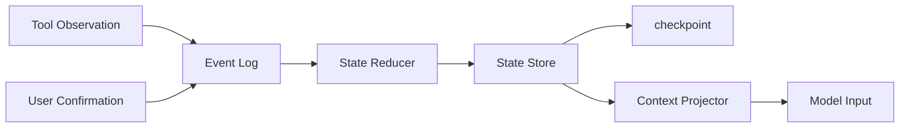

# Agent 的 State 应该保存哪些内容？

## 面试定位

这题考你是否能把 Agent 从“聊天循环”讲成可恢复的工程系统。回答要覆盖架构、数据流、指标、取舍和追问，不要把 State 简化成 messages。

## 30 秒回答

State 应保存任务执行所需的可信事实：goal、constraints、plan、current step、tool observation、artifact 引用、open risks、checkpoint、state version 和权限决策。聊天历史只是输入材料，State 是宿主系统维护的结构化运行状态。它让长任务在上下文压缩、工具失败、用户中断和服务重启后能继续，而不是让模型重新猜进度。

## 标准回答

我会先划边界。State 记录当前 run 的事实，Memory 记录跨任务偏好和经验，Context 是本轮投给模型的裁剪视图。State 不应该由模型自由写入，而应由 reducer 根据工具结果、用户确认和 verifier verdict 生成 state diff。

生产系统里至少有四类状态。Task State 保存目标、约束、计划和完成条件。Execution State 保存当前 step、最近 observation、错误、重试预算和 stop reason。Artifact State 保存文件、截图、PDF 页码、测试日志等引用。Audit State 保存 state version、checkpoint、policy decision 和 actor。

## 架构与运行机制

每次工具调用后，宿主写入 event log。State Reducer 读取上一版 state version，校验 action 是否仍然有效，计算 state diff，再写入 State Store。Context Projector 只把当前步骤需要的状态摘要放进模型上下文。写操作必须带 idempotencyKey，避免 timeout 后重复提交。

## 可画图

图 1：Agent State 从事件到模型上下文的投影链路。图中工具结果和用户确认先进入 `Event Log`，`State Reducer` 根据上一版 state 和 verifier verdict 生成可信 diff，`State Store` 保存可恢复状态，`Context Projector` 再把当前步骤需要的信息裁剪给模型。

这张图的关键边界是：模型输入不是 State 本身，聊天历史也不是 State。可信状态必须由宿主系统通过事件、工具结果和策略裁决维护。这样在上下文压缩、服务重启、工具失败或用户中断后，系统可以按 state_version 和 checkpoint 恢复，而不是让模型回忆自己做过什么。

## 系统设计案例

Coding Agent 的 State 可以保存目标、已读文件、候选 patch、测试命令、失败日志引用和当前风险。测试失败后，不把完整日志塞进 prompt，而是保存 artifact id 和失败摘要。恢复任务时读取 checkpoint，再生成“已做什么、下一步做什么”的上下文。

## 真实问题与排障

如果 Agent 重复执行同一动作，先查 state version 是否更新，再查 observation 是否进入 event log，最后看 Context Projector 是否投出了旧状态。指标看 `resume_success_rate`、`lost_constraint_rate`、`duplicate_action_rate` 和 `checkpoint_latency`。

事故处理可以从状态链路定位：影响面先判断是重复动作、目标漂移、约束丢失还是 artifact 缺失；止血可以暂停自动写操作，强制从最新 checkpoint 读取并重新投影上下文；根因查 event log 是否漏写、reducer 是否拒绝 diff、state_version 是否冲突、projector 是否缓存旧状态；回归要覆盖工具失败、用户中断、压缩恢复、重复提交和 artifact 引用失效样本。

## 面试官追问

- State 和 Memory 区别是什么？State 是当前任务事实，Memory 是跨任务长期信息。
- 为什么不能只用 messages？messages 无 schema、无版本、难恢复。
- 写操作失败后怎么恢复？先查外部事实源，再根据 idempotencyKey retry 或补偿。

## 多轮追问模拟

**追问 1：State、Memory、Context 怎么区分？**  
答题要点：State 是当前 run 的可信运行事实；Memory 是跨任务复用的偏好、经验或长期事实；Context 是本轮投给模型的裁剪视图。考察点是边界清晰。陷阱是把 messages、memory 和 state 混成一团。

**追问 2：为什么模型不能直接写可信 State？**  
答题要点：模型可以提出意图或解释，但可信状态要由 reducer 根据工具 observation、用户确认、policy verdict 和 verifier 写入；否则会把幻觉当事实。考察点是宿主控制。陷阱是模型说“已完成”就更新状态。

**追问 3：State 里为什么只存 artifact refs，不存完整日志？**  
答题要点：大文件和长日志放 Artifact Store，State 存引用、hash、摘要和使用位置；这样上下文轻、可追溯，也能避免重复复制敏感内容。考察点是状态瘦身和回放能力。陷阱是把所有原始数据塞进 State。

## 项目化回答

我会说：我的 Agent 有 State Store、Event Log、Artifact Store 和 Context Projector。每一步工具调用都产生 state diff，关键版本会 checkpoint，失败 trace 可以 replay。

## 常见错误

- 把聊天历史当 State。
- 模型直接改可信状态。
- checkpoint 只保存自然语言摘要。
- 不保存 artifact 引用，导致 replay 失败。

## 深挖技术细节

Agent State 的核心是“宿主系统维护的可信事实”。可以分成 Task State、Execution State、Artifact State 和 Audit State。Task State 包含 `goal`、`constraints`、`success_criteria`、`plan_steps`。Execution State 包含 `current_step`、`retry_budget`、`last_observation`、`pending_actions`、`stop_reason`。Artifact State 保存 `file_refs`、`screenshot_refs`、`test_log_refs`、`evidence_refs`。Audit State 保存 `state_version`、`checkpoint_id`、`policy_verdicts`、`actor` 和 `idempotency_keys`。

写入流程要走 event log 和 reducer。工具返回 observation 后先写事件，Reducer 根据上一版 state、工具 schema、policy verdict 和 verifier 结果计算 diff。模型可以建议更新，但不能直接写可信 state。Context Projector 再按当前 step 把 state 裁剪给模型，避免把所有历史都塞进上下文。

恢复和排障依赖 state version。重复动作常见原因是 observation 没进入 event log 或 Projector 投出了旧状态；目标漂移常见原因是 constraints 没有结构化保存；replay 失败常见原因是 artifact ref 丢失。指标包括 `resume_success_rate`、`lost_constraint_rate`、`duplicate_action_rate`、`state_update_error_rate`、`checkpoint_latency`、`artifact_missing_rate`。

## 边界条件与反例

反例一：把 messages 当 state，压缩或重启后只能靠模型猜当前进度。反例二：模型输出“已完成付款”，系统就更新状态，但外部支付系统并未确认。反例三：checkpoint 只有自然语言摘要，没有 state_version 和 artifact_refs，无法恢复。

边界在于：State 不应保存所有原始数据。大文件、截图、PDF、日志和测试输出放 Artifact Store，State 保存引用和 hash。长期用户偏好属于 Memory，不是当前 run 的 State；本轮模型输入是 Context，不是 State 本身。

## 深问准备

- 问：State 和 Memory 区别？答：State 是当前任务运行事实，Memory 是跨任务偏好或经验。
- 问：为什么不能只用 messages？答：messages 无 schema、无版本、难校验、难恢复，也不适合权限审计。
- 问：模型如何更新 State？答：模型提出意图，宿主通过 reducer、工具结果和 verifier 写 state diff。
- 问：写操作失败如何恢复？答：查询外部事实源，根据 idempotencyKey retry、skip 或 compensation。

## 来源与延伸阅读

- [LangGraph Persistence](https://docs.langchain.com/oss/python/langgraph/persistence)：官方文档用于说明 checkpoint、thread state 和持久化状态如何支持恢复执行。
- [LangChain Short-term memory](https://docs.langchain.com/oss/python/langchain/short-term-memory)：官方文档用于支持 agent state 与短期上下文管理的工程边界。
- [OpenAI Agents SDK Tracing](https://openai.github.io/openai-agents-python/tracing/)：官方文档用于说明 event、tool call 和 state 更新应进入可追踪链路。
