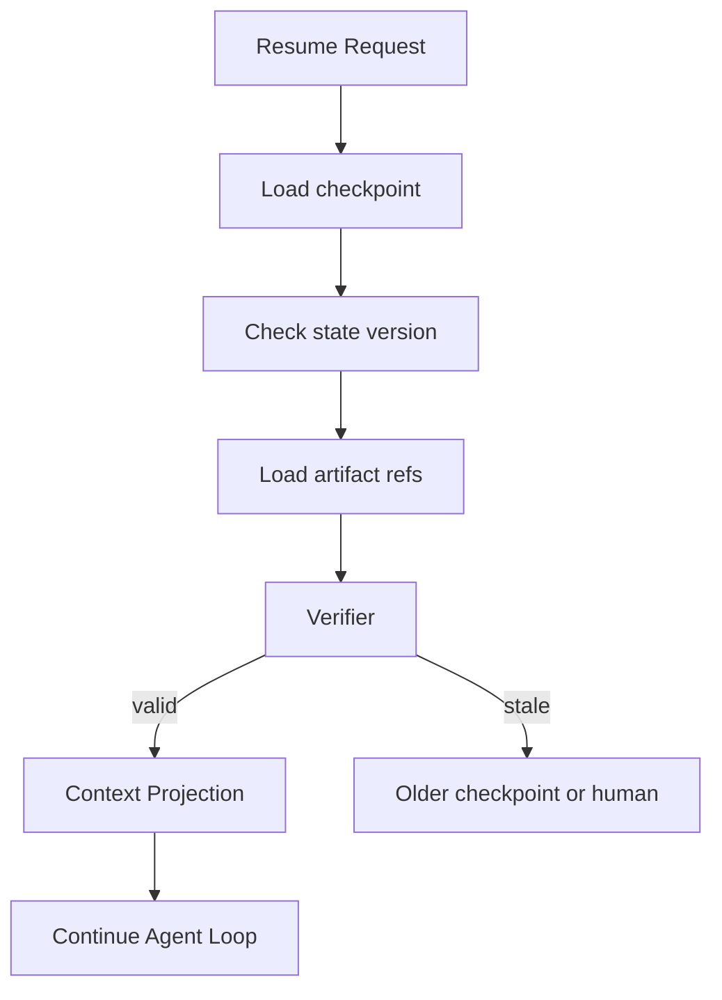

# 长任务中上下文被压缩后，如何从状态恢复？

## 面试定位

这题是 State 管理的深水区。面试官想看你能否处理 context compression 后的恢复，而不是简单说“总结一下历史”。回答要讲架构、数据流、指标、取舍和追问。

## 30 秒回答

恢复不能依赖压缩后的聊天摘要，而要依赖可信 State。流程是读取最新 checkpoint，校验 state version、工具版本和 artifact 是否可用，然后通过 Context Projector 生成本轮模型输入。如果 checkpoint 不可信，就回退到上一版或转人工。恢复后第一步应先验证当前事实，再继续执行。

## 标准回答

上下文压缩会丢细节，所以压缩结果只能作为上下文，不是可信状态。可信事实应该已经写入 State Store，例如目标、硬约束、当前计划、已完成步骤、未解决风险、工具结果和 artifact 引用。

恢复时我会分三步。第一，重建任务状态，读取 checkpoint 和 state version。第二，校验外部依赖，例如订单、文件、网页或测试环境是否仍然和 checkpoint 一致。第三，生成新的 context projection，明确“已完成、未完成、下一步、风险、不能做什么”。

## 架构与运行机制

恢复链路要记录数据流。Resume Service 读取 checkpoint，Artifact Loader 取回必要证据，Verifier 检查状态是否仍有效，Projector 生成模型可见摘要。模型拿到的是恢复后的结构化上下文，不是原始长对话。

## 可画图

图 1：上下文压缩后的状态恢复链路。图中恢复请求先读取 checkpoint，再校验 state version、artifact refs 和外部事实；只有 Verifier 判定状态仍有效时，Context Projection 才会生成模型输入；如果状态 stale，就回滚到旧 checkpoint、重新规划或交给人工。

这张图强调压缩摘要不等于可信状态。摘要可以帮助模型理解，但不能作为继续写文件、付款、发送或发布的依据。恢复流程必须重新验证当前事实，尤其是 pending side effects、文件 hash、订单价格、网页状态和工具 schema version。

## 系统设计案例

旅行 Agent 在订票前被中断。恢复时不能只看“用户想去上海”这个摘要，而要读取预算、日期、候选航班、报价时间、支付状态和确认状态。若报价已过期，恢复流程应重新查询价格，而不是继续旧计划。

## 真实问题与排障

恢复后目标漂移，通常是 hard constraints 没进入 State。恢复后重复写入，通常是 idempotencyKey 或外部状态查询缺失。恢复后模型看不到关键证据，通常是 artifact 引用失效。指标看 `checkpoint_recovery_time`、`resume_success_rate`、`stale_state_rate`、`artifact_missing_rate`。

事故处理建议按恢复链路排查：影响面先看是恢复失败、重复副作用、目标漂移还是旧 artifact 缺失；止血可以禁止自动继续 pending write，改为只读验证和人工确认；根因检查 checkpoint_id、state_version、artifact hash、tool schema version、external resource version 和 idempotency_key；回归覆盖文件被用户改动、订单报价过期、网页 DOM 改版、测试环境重建和 pending action 未知状态。

## 面试官追问

- 压缩摘要能不能当 State？不能，它只是模型输入的一部分。
- checkpoint 应包含什么？state version、关键字段、artifact refs、工具版本和 policy version。
- 环境变了怎么办？重新验证事实，必要时 replan 或 human handoff。

## 多轮追问模拟

**追问 1：恢复后为什么第一步不是继续执行，而是验证事实？**  
答题要点：压缩和中断期间外部世界可能变化，文件、订单、网页、测试环境和权限都可能 stale；继续执行前要确认 checkpoint 仍有效。考察点是恢复安全。陷阱是把旧摘要当最新事实。

**追问 2：pending side effect 如何处理？**  
答题要点：用 idempotency key、side_effect_status、外部状态查询和 preview_hash 判断是否已执行；未知状态下不重复写，必要时人工确认或补偿。考察点是副作用恢复。陷阱是 verifier 失败后直接重试付款或提交。

**追问 3：checkpoint 应该存完整聊天历史吗？**  
答题要点：不需要完整历史，存结构化 state、artifact refs、hash、schema version、policy version 和必要摘要；原始 trace 可作为回放资料。考察点是可恢复状态设计。陷阱是把 checkpoint 写成自然语言总结。

## 项目化回答

可以把 Coding Agent 作为例子。上下文压缩后，系统读取最新 patch、已读文件、测试失败摘要和 run_id，再重新投影给模型。若测试环境或文件版本变化，先重新跑验证，不直接继续旧结论。

## 常见错误

- 只靠摘要恢复长任务。
- checkpoint 不带版本和 artifact。
- 恢复后不验证外部事实。
- 写操作没有幂等和补偿设计。

## 深挖技术细节

长任务恢复要把“模型上下文”和“可信状态”拆开。可信 State 可以包含 `thread_id`、`state_version`、`goal`、`hard_constraints`、`plan_steps`、`completed_steps`、`pending_actions`、`tool_results`、`artifact_refs`、`policy_version`、`idempotency_keys` 和 `risk_flags`。压缩摘要只用于帮助模型理解，不应该成为状态来源。Checkpoint 存的是可恢复状态和 artifact 引用，而不是整段聊天历史。

Resume Service 的第一步是校验版本。它要检查 state schema version、tool schema version、policy version、artifact hash 和外部资源状态是否仍然有效。比如文件是否被用户改过，订单价格是否过期，网页 DOM 是否变化，测试环境是否重建。校验通过后，Context Projector 才把可信 state 投影成模型输入；校验失败则 rollback 到上一 checkpoint、replan 或 human handoff。

写操作恢复尤其要防重复副作用。每个外部动作要有 `idempotency_key`、`side_effect_status`、`preview_hash`、`approval_id` 和 `compensation_plan`。恢复后如果 action 状态是 pending，需要先查询外部系统确认是否已执行，再决定 retry、skip 或补偿。指标包括 `resume_success_rate`、`stale_state_rate`、`artifact_missing_rate`、`duplicate_side_effect_count`、`checkpoint_recovery_time` 和 `post_resume_regression_rate`。

## 边界条件与反例

反例一：压缩摘要写“准备付款”，恢复后直接继续付款，但报价已经过期。反例二：Coding Agent 恢复后继续应用旧 patch，没检查文件 hash 已被用户修改。反例三：checkpoint 只存自然语言计划，没有工具版本和 artifact 引用，无法复现。

边界在于：低风险阅读任务可以轻量恢复；外部写入、支付、发送、删除、代码 patch 和生产发布必须强校验。恢复时遇到 state 与现实冲突，应优先相信当前外部事实，而不是旧摘要。无法自动裁决的冲突要追问用户。

## 深问准备

- 问：压缩摘要和 State 的区别？答：摘要是模型输入，State 是系统可信事实和恢复依据。
- 问：checkpoint 存大文件吗？答：不直接存，保存 artifact ref、hash、版本和必要摘要。
- 问：恢复后第一步是什么？答：校验 state version、artifact、外部资源和 pending side effects。
- 问：如何处理重复写入？答：idempotency key、外部状态查询、side_effect_status 和 compensation plan。

## 来源与延伸阅读

- [LangGraph Persistence](https://docs.langchain.com/oss/python/langgraph/persistence)：官方文档用于说明 checkpoint 与 thread state 是恢复执行的基础，而不是普通聊天摘要。
- [LangChain Short-term memory](https://docs.langchain.com/oss/python/langchain/short-term-memory)：官方文档用于支持短期状态、messages 与 agent state 的区别。
- [OpenAI Agents SDK Tracing](https://openai.github.io/openai-agents-python/tracing/)：官方文档用于说明恢复、工具调用和 verifier 结果应保留在 trace 中以便回放。
