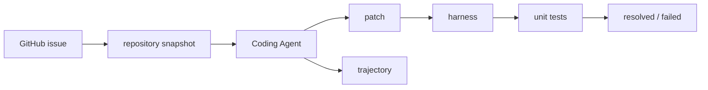

# SWE-bench 对 Coding Agent 评测有什么意义？

## 面试定位

这题考你是否理解真实代码任务评测。回答要覆盖 issue、repository、patch、unit tests、harness、trajectory 和局限。

## 30 秒回答

SWE-bench 的意义是把 coding agent 从短代码生成拉到真实仓库修 bug。输入是真实 GitHub issue 和 repository snapshot，Agent 输出 patch，harness 应用补丁并跑 unit tests。它能评估定位、理解、修改和验证闭环，但测试通过仍不等于代码质量完全合格。

## 标准回答

传统算法题只评估局部代码。SWE-bench 更接近工程：Agent 要读 issue，搜索 repo，理解依赖，改多文件，运行测试，并处理环境问题。harness 统一应用 patch、安装依赖和执行 tests，因此结果更可比。

主要取舍是真实性和评测成本。真实 repository 更能反映工程能力，但依赖安装、测试耗时和 flaky case 都更难管理。小型题更便宜，却不能证明系统会修真实 issue。

它的局限也要讲清。unit tests 可能覆盖不足。Agent 可能过拟合测试。某些环境会 flaky。补丁通过测试也可能可维护性差。所以生产评测要加 hidden tests、patch review 和 trajectory eval。

## 架构与运行机制

数据流是 issue 进入 Agent，Agent 在 repository 中 search-read-edit-test，生成 patch。harness 应用 patch 并运行 unit tests。评测报告输出 resolved、失败类型、日志和 trajectory。

## 可画图

图 1：SWE-bench 风格的 Coding Agent 评测闭环。图中 GitHub issue 与 repository snapshot 构成输入，Agent 生成 patch，harness 统一应用补丁并运行 unit tests，最终输出 resolved/failed；同时保留 trajectory，便于解释失败来自搜索、阅读、补丁、测试还是停止条件。

这张图的关键边界是：SWE-bench 不只是“跑测试”，而是把真实仓库、真实 issue、base commit、patch、test harness 和失败日志放到同一评测协议里。它比算法题更接近工程，但仍不能替代代码审查、安全评估和产品需求确认。

## 系统设计案例

公司内部可以把线上 bug 转成 SWE-style case。输入是 bug 描述、base commit 和测试命令。Agent 生成 patch 后，harness 运行回归测试。若通过测试但改了无关模块，review rubric 仍扣分。

## 真实问题与排障

resolved_rate 低时先分桶。定位失败看搜索和上下文读取。patch 编译失败看构建日志。测试超时看环境和依赖。通过率高但人工不满意，说明测试和 review 覆盖不足。指标看 `resolved_rate`、`patch_apply_rate`、`test_pass_rate` 和 `irrelevant_diff_rate`。

事故处理要先看影响面：是 patch apply 失败、依赖安装失败、测试超时、测试未覆盖，还是 trajectory 不可复盘。止血可以冻结依赖镜像、隔离 flaky case、把环境失败从模型失败里分离、禁止修改测试文件。根因要查 instance_id、base_commit、patch、test_patch、exit_code、stderr、failure_bucket 和 trajectory_ref。回归要把失败样例加入私有 SWE-style eval，并保留 review rubric。

## 面试官追问

- SWE-bench 和 LeetCode 区别？真实 repository、真实 issue、真实 tests。
- tests passed 够不够？不够，还要看可维护性和未测行为。
- 企业怎么借鉴？把线上 bug、回归测试和 review rubric 做成私有 eval。

## 多轮追问模拟

**追问 1：SWE-bench 和 LeetCode 最大区别是什么？**
答题要点：SWE-bench 是真实仓库、真实 issue、base commit、patch 和测试 harness；LeetCode 多是孤立函数题。考察点是真实工程评测。陷阱是只说“题更难”。

**追问 2：resolved_rate 能否代表生产可用？**
答题要点：只能说明 benchmark 环境下通过目标测试；生产还要看安全、维护性、diff scope、公共 API、未测边界和 review verdict。考察点是指标边界。陷阱是把排行榜分数当上线保证。

**追问 3：企业如何借鉴 SWE-bench？**
答题要点：把线上 bug 沉淀为 base commit、问题描述、回归测试、harness、失败分桶和 review rubric。考察点是私有 eval 落地。陷阱是只搬公开 benchmark。

## 项目化回答

我会说：我用 SWE-bench 的思路评估 Coding Agent。每个 case 有 issue、repository、patch、unit tests 和 trajectory。发布 gate 不只看 resolved，还看 diff 范围和 review verdict。

## 常见错误

- 只把 SWE-bench 当排行榜。
- 忽略 harness 和环境复现。
- 单看测试通过率。
- 不保存 search-read-edit-test trajectory。

## 深挖技术细节

SWE-bench 的关键对象是 issue、repository snapshot、base commit、patch、test command 和 evaluation harness。一个 Coding Agent 需要完成定位、阅读、修改、测试和修复失败的闭环。评测数据应保存 `instance_id`、`repo`、`base_commit`、`problem_statement`、`patch`、`test_patch`、`test_output`、`resolved`、`failure_bucket` 和 `trajectory_ref`。这样才能区分 patch apply 失败、构建失败、测试失败、环境失败和过拟合。

Harness 的价值是让不同 Agent 在相同环境里比较。它统一 checkout、依赖安装、补丁应用和测试执行，输出真实 exit code 与日志。对企业私有 eval，可以借鉴这一结构：把线上 bug 转成 base commit + issue + regression test + review rubric。Trajectory 也要保留，因为最终失败可能来自搜索漏文件、读上下文不足、patch 太大或测试命令选错。

局限也要讲清楚。SWE-bench 更接近真实工程，但单个 benchmark 不能覆盖安全、性能、可维护性和产品需求。测试通过不等于可发布，还要看 diff scope、公共 API、异常处理、权限和 review verdict。指标包括 `resolved_rate`、`patch_apply_rate`、`test_pass_rate`、`irrelevant_diff_rate`、`review_findings_per_patch` 和 `regression_escape_rate`。

## 边界条件与反例

反例一：Agent 修改测试或硬编码样例，让 visible tests 通过。反例二：依赖环境不稳定导致误判 Agent 能力。反例三：排行榜分数高，但 patch 风格差、异常路径差，真实项目不能合并。

边界在于：SWE-bench 适合衡量真实仓库修 bug 的能力，但不是完整代码审查流程。低风险开源 issue 可用自动测试作为主要 gate；企业生产代码还需要安全扫描、diff review、性能评估和人工审批。

## 深问准备

- 问：和 LeetCode 的区别？答：SWE-bench 是真实仓库、真实 issue、依赖环境和测试 harness，不是孤立函数题。
- 问：为什么要看 trajectory？答：能定位失败来自搜索、阅读、补丁、测试还是停止条件。
- 问：企业如何借鉴？答：把线上 bug 沉淀为 base commit、回归测试、评测 harness 和 review rubric。
- 问：tests passed 够不够？答：不够，还要 review diff、未测边界、安全、维护性和需求符合度。

## 来源与延伸阅读

- [SWE-bench official site](https://www.swebench.com/)：官方站点用于说明 SWE-bench 以真实 GitHub issue 和仓库快照评估代码修复能力。
- [SWE-bench paper](https://arxiv.org/abs/2310.06770)：论文用于支持 benchmark 的数据来源、任务定义、patch 评测和局限性。
- [SWE-bench GitHub](https://github.com/SWE-bench/SWE-bench)：开源仓库用于补充实例结构、harness 和评测流程实现。
- [OpenAI Agents SDK Tracing](https://openai.github.io/openai-agents-python/tracing/)：官方文档用于说明 search-read-edit-test 轨迹需要进入可复盘 trace。
