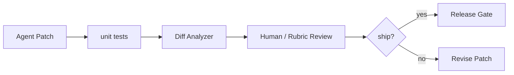

# 为什么自动测试通过后仍需要人类 review？

## 面试定位

这是 SWE-bench 和 Coding Agent Eval 的深入题。面试官想看你能否区分测试验证、代码质量和产品需求。

## 30 秒回答

自动测试通过是必要条件，但不是充分条件。测试可能覆盖不足，Agent 可能过拟合，补丁可能改了无关文件，或者牺牲可维护性和安全。人类 review 要看需求符合度、diff 最小性、边界处理、代码风格、安全风险和未来维护成本。

## 标准回答

unit tests 只能证明被测断言成立。真实工程还要看设计是否合理。比如 Agent 为了让测试过而硬编码返回值，或者跳过异常路径。tests 也可能没有覆盖性能、权限、并发和安全问题。

关键取舍是自动化效率和质量保障。纯自动 gate 速度快，但容易漏掉维护性和安全问题。人工 review 成本更高，却能发现测试外风险。

所以 Coding Agent 的评测应分三层。第一层是 harness 跑 tests。第二层是静态规则和 diff scope。第三层是 human review 或 reviewer rubric。高风险 patch 必须有人看。

## 架构与运行机制

数据流是 Patch 先进入 Test Runner。通过后进入 Diff Analyzer，检查 changed_files、复杂度和敏感区域。再进入 Review Rubric，输出 maintainability、security、requirement_fit 和 minimality。

## 可画图

## 系统设计案例

一个补丁让测试通过，但把所有错误都吞掉。Test Runner 绿了，Diff Analyzer 发现异常处理被泛化，Review 认为破坏可观测性。这个 patch 不应上线。正确反馈是要求保留错误码和日志，并补回归测试。

## 真实问题与排障

如果测试通过后仍有线上事故，检查测试覆盖和 review checklist。若 review 经常发现无关改动，看 Patch Engine 和 planner。若人工 review 成本高，可对低风险 patch 抽样，高风险 patch 必审。指标看 `review_findings_per_patch`、`regression_escape_rate`、`irrelevant_diff_rate`。

## 面试官追问

- 哪些 patch 必须人工看？权限、安全、数据迁移、支付、删除、公共 API。
- 如何降低 review 成本？diff scope、静态规则、风险分级和抽样。
- 测试不足怎么办？把事故样本沉淀成 regression case。

## 项目化回答

我会说：我不会把 tests passed 当成唯一 gate。我的 Coding Agent 输出 patch 后，还要过 diff analyzer、risk classifier 和 review rubric。高风险改动必须人工确认。

## 常见错误

- 把测试通过等同于可发布。
- 不看 diff 是否最小。
- 忽略安全和维护性。
- 线上逃逸样本没有补进 regression。

## 深挖技术细节

SWE-bench 类评测的强项是把 issue、repo、base commit、测试命令和期望补丁放在相对真实的代码环境里，能衡量 Agent 是否定位、修改并通过测试。但它仍主要验证“给定测试是否通过”，不完整覆盖产品需求、可维护性、安全、性能和团队代码规范。面试中要把它定位为自动化验证的一层，而不是发布充分条件。

人类 review 关注测试之外的风险：patch 是否过拟合隐藏测试，是否硬编码样例，是否扩大 API 行为，是否吞掉异常，是否绕开权限，是否引入性能退化，是否修改无关文件，是否破坏日志和可观测性。Diff Analyzer 可以先做机器筛查，输出 `changed_files`、`sensitive_paths`、`complexity_delta`、`test_files_touched`、`public_api_changed`、`security_risk`，再决定人工必审或抽样。

质量闭环应把 review findings 结构化。常见 bucket 包括 requirement_mismatch、overfitting、irrelevant_diff、missing_edge_case、security_regression、maintainability_issue、performance_risk。指标看 `tests_pass_rate`、`review_findings_per_patch`、`regression_escape_rate`、`irrelevant_diff_rate`、`human_review_latency`。这样能证明 review 不是形式，而是补足自动测试盲区。

## 边界条件与反例

反例一：Agent 为了让测试通过，直接修改测试或硬编码返回值。反例二：测试覆盖快乐路径，但并发、权限、性能和异常路径完全没测。反例三：补丁通过了 benchmark，却不符合项目风格或未来维护成本过高。

边界在于：低风险、局部、测试覆盖高的 patch 可以走自动 gate 加抽样 review；涉及权限、安全、支付、数据迁移、公共 API、删除、跨租户读取的 patch 必须人工看。越接近生产系统，越不能只用 benchmark 分数替代工程 review。

## 深问准备

- 问：SWE-bench 分数高是否代表能上线？答：不代表，只说明在 benchmark 环境通过测试；上线还要看安全、维护、需求和真实数据。
- 问：如何防过拟合测试？答：diff analyzer、隐藏回归、review rubric、禁止无关测试修改和新增边界测试。
- 问：哪些改动必审？答：权限、安全、数据迁移、支付、删除、公共 API、依赖升级和大范围重构。
- 问：如何降低人工成本？答：风险分级、机器预审、最小 diff、自动生成 review summary 和低风险抽样。

## 来源与延伸阅读

- [SWE-bench official site](https://www.swebench.com/)
- [SWE-bench paper](https://arxiv.org/abs/2310.06770)
- [OpenAI Agents SDK Tracing](https://openai.github.io/openai-agents-python/tracing/)
