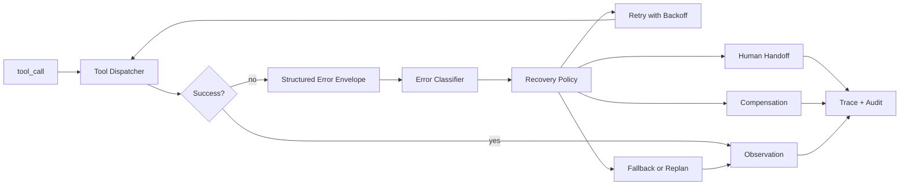

# 你做 Agent 时如何处理外部工具调用失败？

## 面试定位

这道题考的是 Agent 落地能力。外部工具一定会失败，可能是 timeout、参数错误、权限拒绝、限流、空结果、语义失败或副作用状态不明。回答不能只说“重试一下”，要讲清错误分类、数据流、恢复策略、指标、取舍和真实排障。

## 30 秒回答

我会让所有工具失败都返回结构化 error envelope，包括 `error_code`、`retryable`、`hint`、`partial_data`、`side_effect_state` 和 `safe_to_retry`。Agent 不能在失败后编造结果，而要按策略选择 retry、fallback、replan、human handoff、compensation 或安全停止。写操作尤其要用 idempotency key 和状态查询确认是否产生副作用。核心指标看 `tool_error_rate`、`retry_success_rate`、`fallback_rate`、`duplicate_side_effect_count` 和 `compensation_success_rate`。

## 标准回答

我会先分类错误。`invalid_args` 说明模型参数不符合 schema，可以把字段级错误反馈给模型修正。`permission_denied` 不能重试，要请求授权、降级或停止。`timeout` 和 `rate_limited` 可能可重试，但要有 backoff、jitter、最大次数和预算。`empty_result` 不一定是错误，可能需要改 query 或向用户澄清。`semantic_failure` 表示工具执行成功但业务目标没达成，需要重新规划。

恢复策略必须由宿主控制，不能让模型凭感觉无限 retry。模型可以参与 replan，但 retryable、预算、风险和副作用状态应由工具运行时或 orchestrator 决定。

## 架构与运行机制

工具调用的数据流是：Dispatcher 执行工具并捕获成功或失败。Error Normalizer 把异常、HTTP 状态、业务错误和空结果转成统一 error envelope。Error Classifier 标注 severity、retryable 和 side_effect_state。Recovery Policy 根据错误类型、任务风险和剩余预算选择下一步。Trace Store 保存原始错误摘要、恢复动作和最终结果。

关键取舍是自动恢复提升完成率，但会增加成本和外部副作用风险。安全停止更稳，但用户体验可能变差。上线时要按工具类型配置策略，读操作可以更积极 retry，写操作要先确认幂等和提交状态。

## 可画图

图里可以强调：失败不是异常堆栈，而是进入恢复策略的数据结构。

## 系统设计案例

以 Web Agent 抓取页面为例，`navigate` timeout 后不能直接说页面不存在。系统先判断是否网络超时、DNS 问题、页面阻塞还是目标站限流。可重试错误按指数退避重试一次或两次。仍失败时可以 fallback 到缓存、搜索结果摘要或请求用户确认 URL。整个过程写入 trace，包含 error_code、重试次数、耗时和最终降级说明。

以写操作为例，创建日程 timeout 后不能盲目再次提交。先用 idempotency key 查询是否已经创建。如果状态不明，转人工确认或创建补偿任务，避免重复创建。

## 真实问题与排障

如果线上出现大量重复副作用，我会检查写工具是否缺少 idempotency key，timeout 后是否直接 retry，trace 是否记录 side_effect_state。如果 retry 成功率很低，说明错误分类不准，可能把权限错误或业务失败当成 transient error。若 fallback 率很高，要分析外部依赖健康度和工具 SLA。

另一个常见问题是工具把 Java 或 Python 异常原样返回给模型。模型看不懂栈信息，也无法选择恢复策略。需要在边界层统一映射错误码，并隐藏敏感信息。

## 面试官追问

- timeout 能不能安全重试？读操作通常可以，写操作必须先确认幂等和外部状态。
- permission_denied 怎么办？不要重试，走授权、降级或明确告知不可用。
- Agent 失败后如何避免胡编？最终回答必须引用 observation 或 error envelope，缺证据时输出 unsupported。

## 项目化回答

我会为每个工具定义错误协议和恢复策略。开发阶段用 fixtures 覆盖 timeout、rate limit、invalid args、empty result、permission denied 和 semantic failure。上线后按工具和版本统计错误率、恢复率、重复副作用和人工介入率。这样回答能体现架构、数据流、指标、取舍和可追问的工程细节。

## 常见错误

- 失败后只让模型再试一次，没有错误分类和预算。
- 把不可重试错误当成可重试，造成重试风暴。
- 写操作 timeout 后盲目重试，产生重复副作用。
- 错误返回不可行动，模型只能猜测下一步。

## 深挖技术细节

外部工具失败处理要有统一 error protocol。推荐 envelope 包含 `error_code`、`category`、`retryable`、`safe_to_retry`、`side_effect_state`、`partial_data`、`retry_after_ms`、`hint`、`correlation_id` 和 `raw_error_ref`。模型不需要看到完整栈，但系统必须能通过 correlation id 追到原始日志。

恢复决策不应该完全交给模型。Recovery Policy 要结合工具元数据、错误类型、幂等性、剩余预算、风险等级和用户体验决定下一步。读操作 timeout 可以指数退避重试；权限拒绝要停止或请求授权；参数错误可以让模型修参；写操作 timeout 必须先查外部状态，再决定是否重试、补偿或转人工。

## 边界条件与反例

最危险的反例是“支付/改签/发邮件 timeout 后再调用一次”。客户端超时并不代表服务端未执行，重复提交会制造业务副作用。正确链路是用 idempotency key 查询状态：已提交就返回成功 observation，未提交才重试，未知就转人工或进入补偿流程。

另一个边界是 empty result。搜索无结果、数据库查不到、页面元素不存在，不一定是工具失败，可能是业务事实或 query 质量问题。系统应把它作为 observation，允许 Agent 改 query 或向用户澄清，而不是把它归类成异常无限重试。

## 深问准备

如果追问“如何避免 retry 风暴”，可以回答：按错误码控制最大重试次数，指数退避加 jitter，接入全局限流和熔断，写操作要求幂等，超过预算自动降级或停止。还要监控 `retry_success_rate`，如果很低，说明错误分类或恢复策略错了。

如果追问“如何证明恢复有效”，看 `tool_error_rate`、`retry_success_rate`、`fallback_success_rate`、`compensation_rate`、`human_handoff_rate`、`duplicate_side_effect_count` 和 `error_budget_burn`。这些指标要按工具和版本拆开，否则一个坏工具会被总体平均掩盖。

## 来源与延伸阅读

- [OpenAI A practical guide to building agents](https://cdn.openai.com/business-guides-and-resources/a-practical-guide-to-building-agents.pdf)
- [Anthropic Building effective agents](https://www.anthropic.com/engineering/building-effective-agents)
