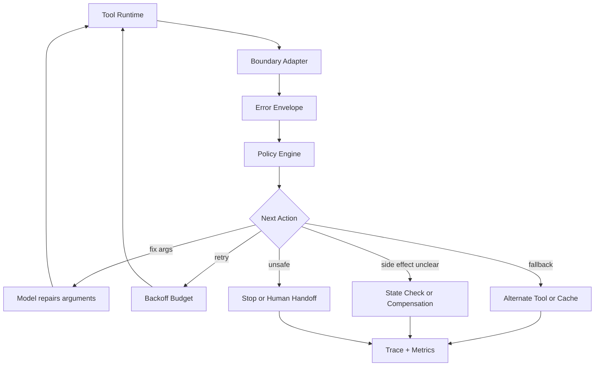

# 工具调用失败后的 feedback 策略如何设计？

## 面试定位

这是工具失败恢复的深入题。面试官想看你是否能把 feedback 设计成 Agent 可理解、可行动、可统计的协议，而不是把异常字符串塞回上下文。回答要覆盖 error envelope、retryable 决策、fallback、compensation、幂等、trace、指标和取舍。

## 30 秒回答

feedback 策略的核心是把失败转成结构化观察。每次失败都返回 `status`、`error_code`、`retryable`、`message`、`hint`、`partial_data`、`side_effect_state`、`safe_to_retry` 和 `suggested_next_action`。Orchestrator 根据策略决定 retry、修参数、换工具、降级、补偿、转人工或停止。模型可以看到摘要和建议，但重试预算、权限和高风险动作由宿主控制。这样才能避免失败后胡编和无限循环。

## 标准回答

我会先把 feedback 分成三类。第一类是给模型看的 observation，语言简洁，说明发生了什么、哪些字段可修、下一步允许做什么。第二类是给 orchestrator 的策略字段，例如 retryable、backoff、side_effect_state、risk 和 remaining budget。第三类是给工程排障的 trace，包括原始错误摘要、依赖服务、latency、request id、tool version 和恢复结果。

不同错误要给不同 feedback。`invalid_args` 返回字段级 validation error 和合法取值。`rate_limited` 返回建议等待时间和是否可降级。`permission_denied` 返回缺少的 scope，但不能泄露敏感权限结构。`empty_result` 返回已搜索范围和可尝试的 query rewrite。`semantic_failure` 返回业务原因和可重规划方向。

## 架构与运行机制

数据流是：Tool Runtime 抛出异常或返回业务失败，Boundary Adapter 把它归一化成 error envelope，Policy Engine 读取 retryable、side effect 和风险字段，Orchestrator 选择恢复动作。模型只收到裁剪后的 feedback，不直接看到内部堆栈和敏感数据。Trace 和 Eval Pipeline 保存完整结构，用于后续回归。

关键指标包括 `repeat_error_rate`、`retry_success_rate`、`fallback_usage_rate`、`human_handoff_rate`、`compensation_success_rate`、`wasted_tool_call_rate` 和 `error_feedback_helpfulness`。如果 repeat error 高，说明模型没有拿到可修复信息，或者 orchestrator 没有限制重复动作。

## 可画图

图里要说明 feedback 同时服务模型、策略和排障，不能只是一段自然语言。

## 系统设计案例

假设旅行 Agent 调用航班预订工具失败。参数错误时 feedback 告诉模型 `departureDate` 格式不合法，并给出 expected format。票价过期时返回 `semantic_failure`，提示重新查询报价。支付 timeout 时返回 `side_effect_state: unknown`，系统先查订单状态，不允许直接再次扣款。如果确认未扣款，才根据 idempotency key 重新提交。如果已扣款但出票失败，触发 compensation 或人工工单。

这个案例能体现取舍：自动恢复能提升完成率，但任何涉及金钱或外部副作用的动作都要优先保证一致性和可审计。

## 真实问题与排障

如果模型在同一个错误上重复调用，我会检查 feedback 是否给了清晰字段级原因，Policy 是否阻断重复参数，Trace 是否能识别 same error loop。解决方式包括给 error envelope 加 `blocked_reasons`、`retry_after`、`max_attempts_reached`，并把相同 arguments 的重复调用直接拦截。

如果 fallback 后答案质量下降，要把降级状态暴露给用户。例如“当前只能返回缓存结果，可能不是最新”。指标上需要区分完成率和正确率，不能因为任务看似完成就忽略错误恢复的质量。

## 面试官追问

- feedback 应该给模型多少细节？给可行动字段和安全摘要，不给内部堆栈、密钥、敏感权限和完整原始响应。
- compensation 和 retry 怎么选？副作用明确未发生才考虑 retry，副作用已发生或不明先查询状态，再决定补偿或人工处理。
- 如何评估 feedback 是否有效？看重复错误下降、修参成功率、恢复成功率和 unsupported 输出是否更诚实。

## 项目化回答

项目里我会为每类工具定义错误字典和恢复矩阵。每个 error_code 绑定可见 message、retryable 策略、模型提示、orchestrator action、trace 字段和告警阈值。上线前用回归样本覆盖空结果、限流、权限、超时、重复提交和补偿失败。这样的回答既有架构，也有数据流、指标、取舍和面试追问空间。

## 常见错误

- 把异常堆栈直接交给模型，既不安全也不可行动。
- 让模型决定 retryable，导致重试风暴或重复写入。
- feedback 只服务最终回答，没有服务 orchestrator 和排障。
- 降级后不告诉用户限制，造成错误信任。

## 深挖技术细节

feedback 策略应分成三份视图。模型视图只包含可行动信息，例如哪个字段错、还能尝试什么、是否需要用户输入；策略视图包含 `retryable`、`safe_to_retry`、`side_effect_state`、`retry_after_ms`、`remaining_budget` 和 `risk_level`；工程视图包含 request id、tool version、latency、raw error ref 和恢复动作。三者分开，才能既安全又可排障。

错误字典要和恢复矩阵绑定。`INVALID_ARGS` 允许修参，`PERMISSION_DENIED` 禁止重试，`RATE_LIMITED` 走退避或排队，`SIDE_EFFECT_UNKNOWN` 先查状态，`EMPTY_RESULT` 允许改 query 或澄清，`SEMANTIC_FAILURE` 触发重规划。模型可以参与修复参数或生成新 query，但是否重试和能否执行由 Orchestrator 决定。

## 边界条件与反例

反馈不能泄露内部细节。权限拒绝可以说明“当前用户缺少执行该动作的授权”，但不应暴露完整权限树、内部角色名或敏感资源 id。下游异常也不应把堆栈、token、SQL 或完整响应直接塞给模型。

另一个反例是降级不透明。比如实时接口失败后使用缓存，如果最终回答不标注 stale，用户会把它当成最新事实。正确做法是把 fallback 状态写入 observation 和最终输出，说明数据时间和限制。

## 深问准备

如果追问“如何避免同一错误反复发生”，可以记录 `last_error_code`、`last_args_hash` 和 `attempt_count`。相同参数触发同一错误超过阈值时，Policy 直接阻断并要求换策略、追问用户或 handoff。

如果追问“如何评估 feedback 有效”，看 `repeat_error_rate`、`argument_repair_success_rate`、`retry_success_rate`、`fallback_quality_score`、`human_handoff_rate` 和 `unsupported_answer_rate`。feedback 的价值是让系统更诚实、更可恢复，而不是让模型更会圆场。

## 来源与延伸阅读

- [OpenAI A practical guide to building agents](https://cdn.openai.com/business-guides-and-resources/a-practical-guide-to-building-agents.pdf)
- [Anthropic Building effective agents](https://www.anthropic.com/engineering/building-effective-agents)
