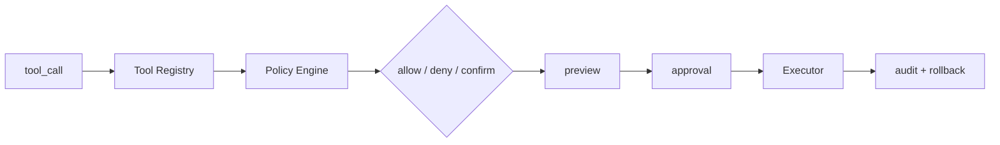

# Agent 的高风险工具如何做权限分级？

## 面试定位

这题考工具安全。要讲 read/write、riskLevel、requiresConfirmation、preview、approval、audit、rollback、指标、取舍和追问。

## 30 秒回答

高风险工具要按读写类型、外部副作用、可逆性、敏感数据、财务或法律影响分级。模型只提出 tool_call，宿主根据用户身份、资源归属、permissionScope 和 riskLevel 决定 allow、deny 或 confirm。写操作先 preview，用户 approval 后执行，结果进入 audit，失败要有 rollback 或 compensation。

## 标准回答

我会把工具分四类。低风险只读工具可以自动执行，但仍要权限过滤。敏感读工具需要业务 ACL。可逆写工具需要 preview 和确认。不可逆、财务、发布、删除类工具需要更强 approval，甚至双人确认。

requiresConfirmation 不能由模型决定，而应由 Tool Registry 元数据和运行时上下文共同决定。确认界面必须展示真实参数、影响范围、风险、证据和回滚方式。

## 架构与运行机制

数据流是模型输出 tool_call，Registry 补充 riskLevel，Policy Engine 检查 actor 和 resource，Preview Service 生成 dry-run，Approval Service 记录 decision，Executor 执行并写 audit。

## 可画图

## 系统设计案例

退款 Agent 查询订单是低风险读，创建退款预览是中风险，确认退款是高风险财务动作。确认退款必须展示金额、订单、原因、操作者、过期时间和 rollback plan。执行时校验 args_hash，避免确认内容和执行内容不一致。

## 真实问题与排障

如果发生误执行，先查 approval record，再查 args_hash 和 Policy Engine decision。如果重复扣款，查 idempotencyKey 和 retry 策略。指标看 `permission_denial_rate`、`approval_rate`、`unsafe_tool_call_block_rate`、`rollback_success_rate` 和 `audit_coverage`。

## 面试官追问

- 哪些工具可以自动执行？低敏只读、可审计、无外部副作用。
- 确认记录包含什么？actor、tool、args_hash、preview、decision、timestamp、rollback。
- 多 Agent 共用工具怎么办？统一 Registry 和 Policy Engine。

## 项目化回答

我会说：我们把工具接入 Tool Permission Gateway。模型没有执行权，所有高风险动作都要 preview、approval、audit 和 rollback。

## 常见错误

- 工具默认全权限。
- 确认框不展示真实参数。
- approval 不校验 args_hash。
- 执行层没有二次权限检查。

## 深挖技术细节

工具权限分级要从 Tool Registry 开始。每个工具应声明 `tool_id`、`operation_type`、`risk_level`、`read_write`、`resource_type`、`permission_scope`、`requires_confirmation`、`supports_preview`、`idempotency_required`、`rollback_strategy`、`sensitive_args` 和 `audit_schema`。模型只看到必要工具和 schema，不能看到自己无权调用的工具，也不能通过自然语言请求扩大权限。

执行链路要做 args 绑定。模型产生 tool_call 后，Policy Engine 根据 actor、tenant、resource ACL、risk level、session scope 和环境判断 allow/deny/confirm。需要确认时，Preview Service 生成 dry-run，包括影响对象、金额、收件人、删除范围、外部域名和回滚方式。用户确认的是 `args_hash`，Executor 执行前再次计算 hash，防止确认后参数被替换。

高风险工具还要做幂等和补偿。财务、发信、删除、发布、跨租户读写都应有 `idempotency_key`、retry policy、timeout、audit event 和 compensation plan。指标包括 `unsafe_tool_call_block_rate`、`approval_bypass_count`、`args_hash_mismatch_count`、`rollback_success_rate`、`permission_denial_rate`、`p95_policy_latency`。

## 边界条件与反例

反例一：确认框只写“是否执行操作”，没有真实参数和影响范围，用户无法做有效 approval。反例二：模型说“这是低风险”，系统就放行；风险等级必须来自 registry 和业务策略。反例三：只在 UI 层确认，Executor 不复核权限，绕过 UI 就能调用。

边界在于：低风险只读可以自动执行，但仍要做租户和资源权限过滤；中风险可逆写需要 preview；不可逆、财务、对外发送、删除、权限变更必须 confirm，必要时双人审批。历史 Memory 或模型推断不能替代当前用户授权。

## 深问准备

- 问：确认记录保存什么？答：actor、tenant、tool_id、args_hash、preview、decision、timestamp、policy_version、rollback_plan。
- 问：如何防重复执行？答：idempotency_key、事务状态、外部 request id 和 retry 去重。
- 问：多 Agent 共用工具怎么办？答：统一 Tool Registry 和 Policy Engine，Agent 身份只作为 actor 上下文。
- 问：误执行如何排障？答：查 tool_call、policy verdict、approval record、args_hash、executor audit 和 rollback 结果。

## 来源与延伸阅读

- [OpenAI Agents SDK Tools](https://openai.github.io/openai-agents-python/tools/)
- [OpenAI Agents SDK Guardrails](https://openai.github.io/openai-agents-python/guardrails/)
- [OpenTelemetry Traces](https://opentelemetry.io/docs/concepts/signals/traces/)
