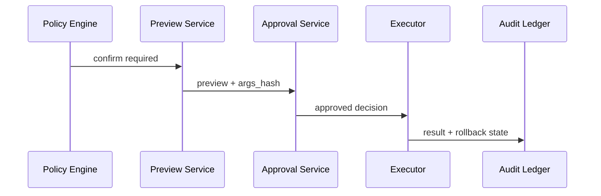

# human-in-the-loop 记录应该包含哪些审计字段？

## 面试定位

这是工具权限的深问。面试官想看你是否把 human-in-the-loop 当成审计链路，而不是按钮交互。

## 30 秒回答

human-in-the-loop 记录至少包含 run_id、step_id、actor、role、tool_name、riskLevel、permissionScope、args_hash、preview_snapshot、decision、reason、timestamp、expires_at、execution_result、rollback_plan 和 audit id。确认前后的参数必须一致，执行结果也要回写 trace。这样事故后能回答谁确认了什么、基于什么证据、执行了什么、如何回滚。

## 标准回答

我会把记录分四组。身份字段包括 actor、role、tenant、user_id。动作字段包括 tool_name、resource_id、riskLevel、requiresConfirmation、args_hash。证据字段包括 preview_snapshot、影响范围、风险说明和 evidence refs。结果字段包括 decision、reason、timestamp、executor result、error_code、rollback_plan。

关键取舍是审计完整性和确认摩擦。字段太少，事故后无法复盘。字段太多且每次都要求人工确认，会让用户绕过流程。因此高风险动作必须完整审计，低风险动作可以短期授权但仍要留 trace。

这些字段要和 run trace 关联，否则审批记录和 Agent 行为无法串起来。approval 还要有过期时间，高风险动作不能长期复用旧确认。

## 架构与运行机制

数据流是 Policy Engine 判定 confirm，Preview Service 生成快照，Approval Service 写入 approval record，Executor 执行前重新校验 args_hash 和权限，结果写 audit ledger。

## 可画图

图 1：human-in-the-loop 从策略确认到执行审计的状态链路。Policy Engine 判定需要确认后，Preview Service 固化参数、影响范围和 `args_hash`，Approval Service 保存用户 decision，Executor 执行前再次校验，最后把结果、错误码和补偿状态写入 Audit Ledger。

这张图的边界是：human-in-the-loop 不是一个前端按钮，而是一条可追责的状态机。只有把 preview、decision、execution 和 rollback 串到同一个 `run_id`/`approval_id`，事故后才能回答“谁在什么证据下批准了什么，最终系统执行了什么”。

## 系统设计案例

客服退款系统中，approval record 保存退款金额、订单号、退款原因、操作者、角色、确认时间、args_hash、过期时间和 rollback plan。若执行失败，audit ledger 记录 error_code 和 compensation status。事故复盘时可以追到完整链路。

## 真实问题与排障

如果用户说“我没有确认过”，查 actor、timestamp、preview snapshot 和 decision。如果确认 A 执行 B，查 args_hash。若审批过期仍被执行，查 expires_at 和 Executor 二次校验。指标看 `audit_coverage`、`approval_expired_block_count`、`args_hash_mismatch_count`、`rollback_success_rate`。

## 面试官追问

- 为什么要 args_hash？防止确认参数和执行参数不一致。
- preview 要保存原文吗？保存必要快照和引用，敏感字段脱敏。
- approval 可以复用吗？低风险可短期复用，高风险应每次确认。

## 多轮追问模拟

追问 1：approval record 最少要能回答哪几个问题？
答：谁确认、在什么租户和角色下确认、看到的 preview 是什么、确认的是哪组参数、何时过期、执行结果是什么、失败后如何补偿。字段可以多，但不能缺这条追责链。考察点是审计闭环；陷阱是只保存 `approved=true`。

追问 2：为什么 approval 过期时间很重要？
答：工具参数依赖上下文，订单状态、权限、价格、收件人和页面内容都可能变化。过期时间能防止旧确认在新上下文中被复用。Executor 还要校验 policy_version 和 resource version。考察点是时间一致性；陷阱是把确认当成永久授权。

追问 3：敏感 preview 脱敏后还怎么审计？
答：脱敏展示不等于丢证据。可以保存受控访问的 encrypted snapshot、字段 hash、evidence refs 和 resource version，普通日志只显示脱敏摘要。事故复盘由有权限的人解密或查引用。考察点是隐私与可追溯的平衡；陷阱是为了合规把审计证据全部删掉。

## 项目化回答

我会说：我的 human-in-the-loop 不只是弹窗，而是 Approval Service 和 Audit Ledger。每次确认都能追溯 actor、风险、参数、证据、结果和 rollback。

## 常见错误

- 只记录“用户点了确认”。
- 不保存 preview。
- 没有过期时间。
- 执行结果不回写审计。

## 深挖技术细节

human-in-the-loop 的审计记录要能回答四个问题：谁在什么上下文下，基于什么预览，批准了什么参数，最终执行结果是什么。字段可以分为 identity、request、preview、decision、execution、recovery。Identity 包含 `actor_id`、`role`、`tenant_id`、`session_id`。Request 包含 `run_id`、`step_id`、`tool_name`、`resource_id`、`risk_level`、`permission_scope`、`args_hash`。Preview 包含影响范围、敏感字段脱敏、证据引用和过期时间。

Approval 不是一次性弹窗，而是一条状态机。`pending -> approved/denied/expired -> executed/failed/compensated`。Executor 执行前必须重新校验 actor 权限、policy version、args hash 和 expires_at。执行后写入 `execution_result`、`external_request_id`、`idempotency_key`、`error_code`、`rollback_status`。如果确认的是 A、执行的是 B，args_hash_mismatch 应直接阻断。

低风险动作可以短期授权，但高风险动作不能长期复用旧确认。审计指标包括 `audit_coverage`、`approval_expired_block_count`、`args_hash_mismatch_count`、`approval_bypass_count`、`rollback_success_rate`、`human_decision_latency` 和 `post_approval_failure_rate`。

## 边界条件与反例

反例一：确认记录只保存 true/false，没有参数、预览和影响范围，事故后无法复盘。反例二：用户确认退款 100 元，执行时参数变成 1000 元。反例三：approval 永不过期，旧确认在新上下文中被复用。反例四：执行失败没有回写审计，导致用户以为操作成功。

边界在于：过多确认会造成疲劳，用户会机械点击。应按 riskLevel 分级：低风险只读自动执行，中风险可批量或短期确认，高风险每次确认并展示真实影响。敏感 preview 要脱敏，但必须保留可审计引用。

## 深问准备

- 问：为什么需要 args_hash？答：绑定确认内容和执行内容，防止 TOCTOU 与参数替换。
- 问：preview 保存原文吗？答：保存必要快照、引用和 hash，敏感字段脱敏并受访问控制。
- 问：approval 能复用吗？答：低风险可短 TTL，高风险、财务、删除、发送和权限变更不应复用。
- 问：事故后如何追责？答：沿 run_id、approval_id、args_hash、execution_result 和 audit ledger 查完整链路。

## 来源与延伸阅读

- [OpenAI Agents SDK Handoffs](https://openai.github.io/openai-agents-python/handoffs/)：用于支持人工接管和流程切换需要保留上下文，而不是只在 UI 层弹出确认。
- [OpenAI Agents SDK Tracing](https://openai.github.io/openai-agents-python/tracing/)：用于支持 approval、tool call、execution result 与错误状态应统一写入 trace，方便复盘。
- [OWASP LLM06: Excessive Agency](https://genai.owasp.org/llmrisk/llm062025-excessive-agency/)：用于支持过度代理能力会放大误执行风险，因此高影响动作需要限制权限、确认、审计和回滚。
