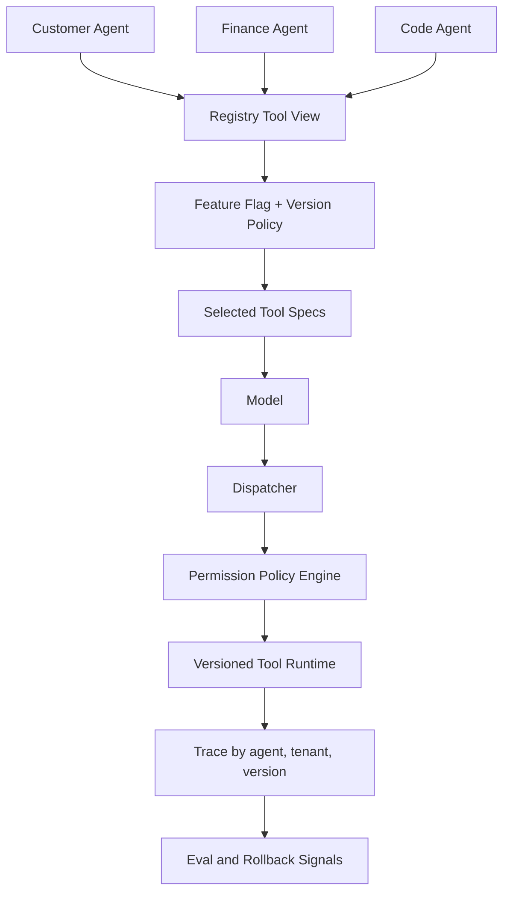

# 多 Agent 共用工具时，Registry 如何做版本、权限和灰度？

## 面试定位

这道题是工具注册表的深入追问。面试官想知道你能否从单个 Agent 扩展到多 Agent、多租户、多版本的生产环境。回答要覆盖 registry 的控制平面职责、dispatcher 的执行职责、权限模型、版本兼容、灰度策略、观测指标和故障排查。

## 30 秒回答

多 Agent 共用工具时，Registry 不能只是共享配置文件，而要成为带策略的能力目录。每个工具登记 owner、version、schema hash、riskLevel、permissionScope、tenant scope、read/write、health、SLA 和 deprecation policy。不同 Agent 根据角色和任务拿到不同工具视图。灰度按工具版本、Agent 类型、租户和模型版本分流。Dispatcher 执行时再次检查权限，并把 version、decision 和 observation 写入 trace。

## 标准回答

我会把问题拆成三个层面。第一是可见性，不同 Agent 不应该看到同一组工具。例如客服 Agent 需要查订单，财务 Agent 才能发起退款，研发 Agent 才能读代码。第二是执行权限，模型看到工具不代表一定能执行，dispatcher 还要验证用户身份、资源归属和当前任务 scope。第三是演进，schema 和 handler 都会升级，需要兼容策略和灰度监控。

工具版本至少包含 schema version 和 runtime version。schema version 影响模型参数生成，runtime version 影响后端行为。灰度时要同时记录 model version，否则你很难判断回归来自模型、schema 还是工具实现。

## 架构与运行机制

数据流可以这样讲：Agent 启动或任务开始时向 Registry 请求 tool view。Registry 根据 tenant、user、agent role、feature flag 和 risk policy 返回候选工具。Context Builder 再做任务级裁剪。模型选择工具后，Dispatcher 读取当前 active version 和 policy。Policy Engine 判断权限、速率、确认要求和审计级别。执行结果进入 Trace Store，Eval Pipeline 按版本统计质量。

关键指标包括 `tool_selection_accuracy`、`schema_compatibility_errors`、`permission_denial_rate`、`version_rollback_count`、`tool_availability`、`p95_latency` 和 `unsafe_call_block_rate`。这些指标要按 Agent 类型和租户拆分，否则平均值会掩盖局部事故。

## 可画图

图里可以强调：多 Agent 共用工具不是共用同一份上下文，而是共享治理面，再按角色生成不同视图。

## 系统设计案例

假设一个企业平台有“读客户信息”“创建退款预览”“确认退款”“读代码仓库”四类工具。客服 Agent 能读客户信息和创建退款预览，财务 Agent 能确认退款，研发 Agent 只能读代码仓库。Registry 保存工具 metadata，Policy Engine 根据用户角色、租户、数据域和风险等级决定可见性与执行权。

当 `confirm_refund` 从 v1 升到 v2，新增了 `policyEvidenceId` 必填字段。灰度时只给 5% 财务 Agent 暴露 v2，监控 invalid args、人工撤销、退款失败率和 p95 延迟。如果 invalid args 上升，先回滚 schema view，而不是回滚整个系统。

## 真实问题与排障

多 Agent 系统常见问题是工具定义漂移。不同团队复制一份 schema 后各自修改，最后同名工具行为不同。解决方式是 registry 作为单一事实源，工具必须通过 contract review 才能发布。另一个问题是权限只在可见性层做，执行层漏检。攻击者可能通过 prompt injection 诱导模型调用已暴露工具，所以 dispatcher 必须做二次授权。

灰度事故排查要按 version、agent、tenant、model 和 prompt template 维度切片。如果只看总失败率，可能发现不了某个租户的 schema 兼容性问题。Trace 里必须包含 tool id、schema hash、runtime version、policy decision 和 error_code。

## 面试官追问

- 多 Agent 共享工具会不会互相污染？不会让它们共享状态，工具 metadata 共享，运行状态按 agent、用户和任务隔离。
- 如何下线工具？先标记 deprecated，给替代工具和迁移期，保留历史 trace replay 能力，再关闭可见性。
- MCP 远程工具如何纳管？把远程工具同步进本地 registry view，执行时仍走本地 permission gate 和 audit。

## 项目化回答

我会把 Registry 做成平台能力。工具发布需要 owner、schema、examples、error contract、permission policy、eval fixture 和 rollback plan。每次调用都记录 agent id、tenant、tool version、权限决策和输出摘要。这样面试中能清晰说明架构、数据流、指标、取舍和追问，也能体现你考虑过真实生产治理。

## 常见错误

- 多个 Agent 复制工具定义，版本和行为逐渐分叉。
- 只做模型可见性控制，不在 dispatcher 执行权限校验。
- 灰度只按流量比例，不记录模型版本和 schema hash。
- 工具下线直接删除，导致历史 trace 和评测样本不可回放。

## 深挖技术细节

多 Agent 共享工具时，Registry 要输出“按身份裁剪的 tool view”，而不是全局工具清单。tool view 的生成依赖 `tenant_id`、`user_role`、`agent_role`、`task_type`、`feature_flags`、`risk_policy` 和 `tool_health`。模型只看到 view 里的 schema；Dispatcher 执行时仍按最新 policy 做二次授权。

版本要拆成 schema version 和 runtime version。schema version 影响模型如何填参数，runtime version 影响工具实际行为。trace 必须记录 `tool_id`、`schema_hash`、`runtime_version`、`model_version`、`agent_id`、`tenant_id` 和 `policy_decision`，否则灰度事故很难归因。

## 边界条件与反例

工具可见性不是权限。某工具因为任务需要被暴露给模型，不代表任何参数都能执行。比如客服 Agent 可以看到 `create_refund_preview`，但不同用户、订单状态、金额和租户仍要在执行层校验。只做可见性过滤会在 prompt injection 或模型误选时留下越权通道。

远程 MCP 或插件工具也不能绕过本地治理。可以动态发现能力，但应同步成 registry metadata，补齐 owner、risk、scope、timeout、health 和 audit policy，再通过本地 Dispatcher 执行。

## 深问准备

如果追问“如何灰度工具版本”，我会按工具版本、Agent 类型、租户、模型版本分桶，先 shadow 或小流量暴露 schema，再比较 invalid args、permission denial、业务错误、latency 和人工撤销。出问题先回滚 tool view 或 schema version，不一定要回滚后端实现。

如果问“工具下线怎么做”，答案是 deprecated 标记、替代工具、迁移期、兼容 error、历史 trace replay 保留，最后关闭可见性。直接删除会让旧评测、旧 trace 和未完成 run 无法解释。

## 来源与延伸阅读

- [Model Context Protocol](https://modelcontextprotocol.io/)
- [OpenAI A practical guide to building agents](https://cdn.openai.com/business-guides-and-resources/a-practical-guide-to-building-agents.pdf)
