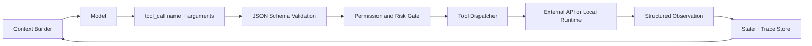

# Tool Use 是如何扩展 Agent 能力的？

## 面试定位

这道题的重点不是“Agent 可以调用函数”这么简单。面试官想看你能不能讲清楚模型、宿主程序和外部系统的责任边界，以及工具调用如何通过 schema、validation、permission、observation 和 trace 进入完整架构。回答要体现数据流、指标、取舍和真实失败处理。

## 30 秒回答

Tool Use 把模型从纯文本生成扩展成“能请求外部动作”的系统。模型只提出 `tool_call` 意图和参数，宿主程序负责 JSON Schema 校验、权限检查、资源归属、执行、错误恢复、幂等和审计。工具返回结构化 observation 后再写回状态，模型基于真实结果继续推理。核心取舍是工具越强越能办事，风险和治理成本也越高，所以需要精确 schema、最小权限和可观测指标。

## 标准回答

我会把 Tool Use 看作 Agent 和外部世界之间的 API 契约。工具名要描述动作和对象，例如 `search_code`、`read_file`、`create_calendar_draft`。description 要写清何时使用、何时不要使用、输入限制和业务前置条件。input schema 用 `required`、`enum`、type、format、范围和嵌套对象限制参数。output schema 要让模型拿到可决策结果，而不是一段不可控长文本。

真正执行工具的一定是宿主程序。模型不应该直接拿 API key，也不应该绕过权限。执行链路包括 schema validation、business validation、permission gate、rate limit、dispatcher、executor、observation normalizer 和 trace store。这个边界讲清楚后，Tool Use 才是工程能力，不是 prompt 小技巧。

## 架构与运行机制

一次工具调用的数据流是：上下文构建器选择少量候选工具，把 schema 放入模型上下文。模型输出工具名和 arguments。宿主先校验 JSON Schema，再检查用户身份、资源归属、任务 scope 和风险等级。执行器调用真实后端 API。结果被规范化为 success、empty、partial 或 error。最后 observation 写回 state 和 trace，供下一步推理使用。

关键指标包括 `valid_call_rate`、`invalid_args_rate`、`permission_denial_rate`、`tool_latency_p95`、`unsafe_call_block_rate` 和 `tool_chain_success_rate`。如果 invalid args 高，通常是 schema 过松或 description 不清楚。如果权限拒绝多，要看工具是否暴露给了错误任务。

## 可画图

这张图可以强调两个点：模型不执行工具，宿主执行工具。observation 必须可追踪，否则后续回答无法解释依据。

## 系统设计案例

以 Coding Agent 为例，工具可以分为只读、编辑和验证三类。`read_file` 返回文件摘要、路径和行号。`apply_patch` 需要明确 patch 内容、目标文件和冲突策略。`run_tests` 返回命令、退出码、失败摘要和日志引用。写操作必须有 workspace scope、dry-run 或 diff 预览，必要时要求用户确认。

这套设计让 Agent 能读代码、改代码、跑测试，但每一步都有审计记录。面试时可以用它解释架构边界：模型负责选择动作，dispatcher 负责执行，trace 负责复盘，verifier 负责判断是否通过。

## 真实问题与排障

常见问题一是工具返回太长，导致上下文污染。解决方式是返回结构化摘要、evidence id、cursor 和可再次读取的引用。常见问题二是工具名含糊，模型经常选错。修复时要重命名工具，补充正反例，并按任务裁剪候选工具。常见问题三是把后端 API 原样暴露给模型，参数过多且业务语义不清。更好的做法是加一层模型友好的 tool facade。

## 面试官追问

- 工具失败后模型应该看到什么？应该看到结构化 error，包括 `error_code`、`retryable`、`hint` 和 partial data。
- 写操作如何控制风险？使用 dry-run、preview、requires_confirmation、idempotency key 和 audit log。
- 工具越多越好吗？不是。工具太多会增加选择错误和 token 成本，需要 registry、router 和任务级裁剪。

## 项目化回答

在项目中我会说：我把工具接口按后端契约管理，每个工具都有 name、description、input schema、output schema、owner、version、timeout、risk level 和 permission scope。上线后用指标观察有效调用率、参数错误率、权限拦截率和 p95 延迟。这个回答能自然覆盖架构、数据流、指标、取舍和追问。

## 常见错误

- 说“模型调用函数”，但不讲宿主校验和执行边界。
- 工具输出一整段原始文本，模型难以稳定决策。
- 没有权限、幂等和审计，写操作风险不可控。
- 只展示 happy path，不讲 timeout、空结果和错误恢复。

## 深挖技术细节

Tool Use 的关键是把模型输出从自然语言变成可校验的动作请求。模型生成的 `tool_call` 应该只包含工具名和结构化参数，宿主系统必须执行 schema validation、业务校验、权限检查、风险分级、幂等控制和审计。也就是说，模型负责提出意图，Tool Runtime 负责把意图变成受控执行。

工具 schema 不能只是字段类型，还要表达业务边界。比如 `create_calendar_event` 不能只要求 title、time，还要声明 timezone、participant policy、是否需要确认、是否允许跨组织邀请、失败错误码和返回 observation。输出也要结构化，例如 `status`、`resource_id`、`summary`、`evidence_ref`、`error_code` 和 `retryable`，这样 Agent 才能根据事实继续决策。

## 边界条件与反例

工具越强，风险越大。只读搜索工具可以自动执行，但写文件、发邮件、支付、删除数据、创建外部资源都需要 preview、confirmation、idempotency key 和 audit log。不能把“不要做危险操作”只写进 prompt；真正的阻断要在权限和运行时策略里完成。

另一个反例是把后端 API 原封不动暴露给模型。内部 API 往往字段多、语义隐晦、错误码面向开发者，模型容易填错参数。更好的做法是做 tool facade：面向任务语义设计小而清晰的工具，再由后端适配真实 API。

## 深问准备

面试官如果追问“工具失败后模型看到什么”，我会回答结构化 observation 或 error envelope，而不是异常栈。字段包括 `error_code`、`message`、`retryable`、`safe_to_retry`、`partial_data`、`hint` 和 `correlation_id`。这样模型能决定改参数、换工具、追问用户或停止。

如果追问“如何评估 Tool Use”，可以按调用链路分指标：`tool_selection_accuracy` 看是否选对工具，`valid_call_rate` 看参数是否有效，`permission_denial_rate` 看是否暴露过多工具，`tool_latency_p95` 看性能，`tool_chain_success_rate` 看多步任务是否完成。

## 来源与延伸阅读

- [OpenAI Function Calling](https://platform.openai.com/docs/guides/function-calling)
- [OpenAI A practical guide to building agents](https://cdn.openai.com/business-guides-and-resources/a-practical-guide-to-building-agents.pdf)
