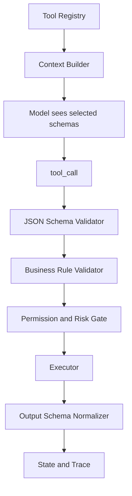

# 如何设计工具 Schema 才能避免模型乱调用？

## 面试定位

这道题考的是工具接口设计能力。浅回答会说“参数写清楚”，强回答要把工具 schema 放进模型选择、宿主校验、权限控制、错误恢复和 trace 中讲。面试官会看你是否理解 schema 只是第一层约束，真正可靠的 Agent 还要有 runtime validation、业务校验、风险分级和可观测指标。

## 30 秒回答

避免乱调用要从四层做。第一，工具名和 description 要让模型知道何时用、何时不用。第二，input schema 用 `required`、`enum`、type、format、范围和正反例约束参数。第三，output schema 返回结构化 observation，让模型能判断下一步。第四，宿主执行层做 validation、permission、rate limit、risk confirmation 和 trace。我的取舍是 schema 尽量贴近任务语义，而不是把复杂后端 API 原样暴露给模型。

## 标准回答

我会先区分“模型友好”和“后端友好”。后端 API 往往参数多、状态复杂、错误码面向程序员。模型工具应该更短、更明确、更接近任务动作。例如不要把一个通用 `handleRequest` 暴露给模型，而是拆成 `search_customer_ticket`、`create_refund_preview`、`apply_refund_after_confirmation`。

description 不只是文案，它会直接影响工具选择。好的 description 应包含适用场景、禁止场景、必要前置条件、关键参数含义和失败后的下一步。schema 通过结构约束减少 invalid args，宿主通过运行时校验保证模型不能越权。两者配合，才能稳定扩展 Agent 能力。

## 架构与运行机制

工具 schema 的数据流是：Registry 暴露候选工具，Context Builder 根据任务和权限裁剪工具列表，模型输出 tool call，Validator 检查 JSON Schema 和业务规则，Policy Gate 判断是否允许执行，Executor 调后端服务，Normalizer 生成 observation，Trace Store 保存调用证据。

关键指标包括 `tool_selection_accuracy`、`invalid_args_rate`、`schema_validation_fail_rate`、`permission_denial_rate`、`requires_confirmation_rate` 和 `tool_latency_p95`。如果工具选择错，优先看命名和 description。如果参数错，检查 required、enum、格式和示例。如果权限拦截过多，要回到工具可见性和任务裁剪策略。

## 可画图

图 1：工具 Schema 贯穿工具发现、模型选择、运行时校验、权限控制和复盘的契约链路。

图中 Tool Registry 提供候选工具及其 schema、风险和版本，Context Builder 根据任务和权限裁剪后只让模型看到 selected schemas。模型生成 tool_call 后，JSON Schema Validator 只能证明参数结构合法；Business Rule Validator 还要检查订单状态、资源归属、金额上限等业务约束；Permission and Risk Gate 再判断当前用户、租户、riskLevel 和 confirmation 是否允许执行。Executor 的结果经过 Output Schema Normalizer 转成可决策 observation，State and Trace 保存 schema version、args hash、policy decision 和 error code。这个链路说明 schema 是第一层契约，不是最终安全边界。

## 系统设计案例

假设要把“退款 API”接给 Agent。后端可能有 `POST /refunds`、`GET /orders/{id}` 和复杂状态机。面向模型时我会设计两个工具：`create_refund_preview` 和 `apply_refund_after_confirmation`。前者只读，输入是 orderId、reasonCode、amount 和 evidence，输出 preview、risk、policyCheck 和 confirmationRequired。后者是写操作，必须带 previewId、confirmationId 和 idempotencyKey。

这个拆法的取舍是多一步确认会增加交互成本，但能显著降低误操作。对于高风险业务，这个成本是合理的。上线后看 refund preview 到 apply 的转化、权限拒绝、重复提交和人工撤销率。

## 真实问题与排障

如果模型经常调用错误工具，我会先对比同一任务下暴露了哪些 schema。候选工具太多时先加 router 或按 domain 裁剪。工具名相似时改名并加入反例。description 太抽象时补充“不要用于什么场景”。如果模型参数经常缺字段，说明 schema required 不完整，或者上下文没有提供必要数据。

另一个常见问题是 output schema 不清晰。模型拿到长文本后不知道是否成功，也不知道能不能继续。解决方式是固定返回 `status`、`data`、`evidence`、`error_code`、`retryable`、`next_action_hint`，并把原始大对象放在可引用位置。

## 面试官追问

- JSON Schema 通过是否代表工具可以执行？不代表，还要做业务状态、资源归属和权限校验。
- schema 要写多细？关键字段必须强约束，低价值自由文本可以放宽，但输出要可决策。
- 如何接入高风险写操作？用 preview、confirmation、idempotency key、audit log 和 rollback plan。

## 多轮追问模拟

第一轮追问：JSON Schema 通过是否代表工具可以执行？
回答要点：不代表。Schema 只证明结构合法，执行前还要检查业务状态、资源归属、权限、风险和确认状态。考察点是 schema 与 runtime policy 的边界。陷阱是把 schema validation 当成安全边界。

第二轮追问：工具粒度应该粗一点还是细一点？
回答要点：高风险业务倾向拆成 preview/apply 两段，低风险查询可适度合并；粒度要平衡选择复杂度、交互成本和副作用风险。考察点是接口设计取舍。陷阱是做一个全能 `handleRequest` 或拆成大量无语义小工具。

第三轮追问：如何设计一个退款工具 schema？
回答要点：先做 `create_refund_preview`，输出 policyCheck、risk 和 confirmationRequired；再用 `apply_refund_after_confirmation`，要求 previewId、confirmationId 和 idempotencyKey。考察点是高风险写操作的 staged contract。陷阱是让模型直接调 `POST /refunds`。

第四轮追问：schema 变更如何上线？
回答要点：记录 version 和 schema hash，用 fixtures、trace replay 和 shadow run 验证；新增 required 字段或改变输出结构是破坏性变更，要灰度和兼容层。考察点是演进治理。陷阱是覆盖旧 schema 导致历史任务不可回放。

## 项目化回答

在项目里我会建立 Tool Contract Review。每个新工具上线前检查 name、description、input schema、output schema、error envelope、owner、version、timeout、permission scope 和 examples。灰度期间记录 invalid args、工具选择错误、权限拦截和用户撤销。这样回答能覆盖架构、数据流、指标、取舍和追问。

## 常见错误

- 把后端 API 原样丢给模型，导致参数复杂且业务语义不清。
- 只写自然语言 description，没有 required、enum 和范围约束。
- output schema 缺少 status 和 error code，模型无法稳定恢复。
- 把 schema validation 当成安全边界，忽略权限和资源归属。

## 深挖技术细节

避免乱调用的本质是缩小模型选择空间并提高每个工具的语义清晰度。工具名要表达动作和对象，description 要包含正例、反例和前置条件，input schema 要用 `required`、`enum`、`format`、`minimum`、`maximum` 和对象层级限制参数，output schema 要明确成功、空结果、部分成功和错误。

工具选择还要依赖 Context Builder。不要把所有 schema 一次性塞给模型，而是根据任务、用户权限、当前 state 和工具健康状态裁剪候选。调用后 Dispatcher 再做二次解析和权限校验，trace 记录当时模型可见的工具列表，这样才能排查“为什么模型会选它”。

## 边界条件与反例

JSON Schema 通过不等于业务允许。`amount` 是数字、`order_id` 格式正确，只说明参数合法；订单是否属于当前用户、是否在退款窗口、金额是否超过可退上限，需要业务校验。把 schema validation 当成安全边界会造成越权和错误副作用。

另一个边界是工具粒度。粒度太粗会让模型难以判断，粒度太细会增加调用步数和成本。高风险业务通常宁愿多一步 preview，也不要一个全能 apply 工具；低风险只读查询可以适当合并，以减少工具选择复杂度。

## 深问准备

被问“如何发现 schema 设计不好”，看四类指标：`tool_selection_accuracy` 低说明命名/description/候选裁剪有问题；`invalid_args_rate` 高说明 required、enum 或上下文不足；`permission_denial_rate` 高说明可见性过宽；`tool_result_used_rate` 低说明输出不可行动或噪声太大。

如果追问“schema 变更怎么处理”，回答要包括 version、schema hash、灰度和历史 trace replay。新增 required 字段是破坏性变更，必须先用 fixtures 和 shadow run 验证模型能否稳定填对，再逐步切流量。

## 来源与延伸阅读

- [OpenAI Function Calling](https://platform.openai.com/docs/guides/function-calling)：用于说明结构化工具参数、schema 约束和模型工具选择之间的关系。
- [Model Context Protocol](https://modelcontextprotocol.io/)：用于对照工具描述、能力暴露和 Host/Server 边界，补充动态工具接入场景。
