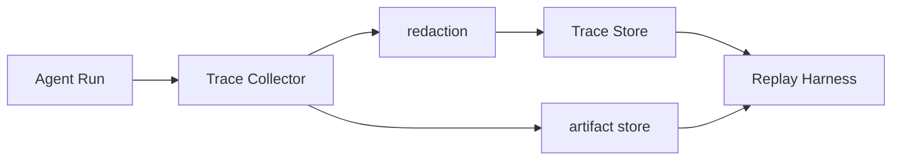

# Agent Trace 应该记录哪些内容？

## 面试定位

这题考可观测性。回答不要停在“记录日志”，要讲 run_id、step_id、span、artifact、redaction、Replay Harness、指标、取舍和追问。

## 30 秒回答

Agent Trace 应记录一次 run 的关键路径：输入、prompt manifest、model span、tool span、retrieval span、guardrail span、observation、state diff、policy verdict、cost、latency、error_code 和 artifact 引用。每条记录要有 run_id 和 step_id。敏感信息在采集层 redaction，大对象进入 artifact store，trace 保存引用和 hash。

## 标准回答

我会按 span 设计。model span 记录模型、prompt 版本、token、输出契约。tool span 记录 tool_name、schema version、arguments hash、status、error_code、latency、retryable。retrieval span 记录 query、filters、candidate ids、rerank score 和 selected evidence。guardrail span 记录 policy version、decision 和 reason。

Trace 的目标是复盘和回放，不是堆日志。它要能回答：模型看到了什么，调用了什么工具，工具返回了什么，状态如何变化，为什么继续或停止。

## 架构与运行机制

数据流是 Trace Collector 接收 span，Redaction Layer 脱敏，Trace Store 保存结构化记录，Artifact Store 保存大对象。Debug Dashboard 查询 run，Replay Harness 读取 fixture 做回归。

## 可画图

图 1：Agent Trace 从运行采集、脱敏、结构化存储到 Replay Harness 回放的链路。

这张图里，Agent Run 会产生 model span、tool span、retrieval span、guardrail span、state diff 和 artifact 引用。Trace Collector 收集结构化 span，但敏感字段必须先经过 redaction，再写入 Trace Store。截图、DOM、PDF、测试日志和长 observation 进入 artifact store，trace 只保存引用、hash、权限和 TTL。Replay Harness 同时读取 Trace Store 和 Artifact Store，把失败样本冻结成可回放 fixture，用于验证修复后同一问题不会复发。

## 系统设计案例

Web Agent 要保存 URL、DOM 摘要、截图引用、click 目标、点击后 observation 和 console error。Coding Agent 要保存文件读取、patch diff、测试命令和失败摘要。RAG Agent 要保存 query rewrite、召回候选、rerank 结果和 citation verifier verdict。

## 真实问题与排障

如果线上答错，先根据 run_id 找 trace。若没有 prompt manifest，就无法知道上下文是否缺证据。若没有 tool observation，就无法判断工具是否失败。指标看 `trace_coverage`、`artifact_missing_rate`、`redaction_violation_count` 和 `debug_time_to_root_cause`。

## 面试官追问

- Trace 和普通日志区别是什么？Trace 是结构化路径，可回放。
- 大对象怎么存？进入 artifact store，trace 存引用。
- 敏感信息怎么办？采集层 redaction，再分级访问。

## 多轮追问模拟

第一轮追问：Trace 和普通日志的本质区别是什么？
回答要点：Trace 是结构化执行路径，有 run_id、span、状态、artifact 和 replay 能力；普通日志多是文本事件。考察点是可观测对象建模。陷阱是把“多打日志”当成 trace。

第二轮追问：完整 prompt 要不要全量落盘？
回答要点：不应简单全量明文落盘；保存 prompt manifest hash、输入引用、版本和必要摘要，敏感内容采集层脱敏，大对象进受控 artifact store。考察点是调试与隐私成本平衡。陷阱是为了排障把用户文档、secret 和 PII 全量保存。

第三轮追问：如何从一次线上错答生成回归样本？
回答要点：冻结 run 输入、模型配置、检索候选、工具 observation、artifact hash、policy verdict 和 expected outcome，生成 replay fixture。考察点是从 trace 到 eval 的闭环。陷阱是只保存最终答案，无法复现上下文。

第四轮追问：Trace 设计的关键指标有哪些？
回答要点：`trace_coverage`、`artifact_missing_rate`、`redaction_violation_count`、`replay_fixture_build_rate`、`debug_time_to_root_cause` 和 `p95_trace_write_latency`。考察点是 trace 自身质量。陷阱是只看业务成功率，不监控可观测性缺口。

## 项目化回答

我会说：我的 Agent 每次 run 都有 span trace。失败样本可以从 trace 生成 replay fixture，修复后用 Replay Harness 验证同一问题不会复发。

## 常见错误

- 只保存最终答案。
- 没有 run_id 和 step_id。
- 敏感字段先落盘再清理。
- trace 无法生成 eval case。

## 深挖技术细节

Agent Trace 应采用 span 模型，而不是自由文本日志。一次 run 有 `run_id`、`user_task_id`、`thread_id`、`model_version`、`policy_version` 和 `trace_schema_version`。每一步有 `step_id`、`parent_span_id`、`span_type`、`start_time`、`end_time`、`status`、`error_code`、`latency_ms`、`cost`。模型、工具、检索、guardrail、state update、human approval 都是不同 span，便于按层排障。

各类 span 要保存不同字段。Model span 保存 prompt manifest hash、input refs、output contract、token 和 finish reason。Tool span 保存 tool name、schema version、arguments hash、status、retryable 和 observation ref。Retrieval span 保存 query、filters、candidate ids、selected evidence、rerank score。Guardrail span 保存 policy version、decision、reason 和 blocked action。State span 保存 state diff、checkpoint id 和 artifact refs。

Replay 要求 trace 能生成 fixture。大对象如 DOM、截图、PDF、日志、测试输出进入 artifact store，trace 存引用、hash、权限和过期时间。Redaction 必须在采集层发生，避免敏感信息先落盘。指标包括 `trace_coverage`、`artifact_missing_rate`、`redaction_violation_count`、`replay_fixture_build_rate`、`debug_time_to_root_cause` 和 `p95_trace_write_latency`。

## 边界条件与反例

反例一：只有普通日志，没有 span、状态和 artifact 引用，无法判断模型看到什么。反例二：为了省存储不保存工具 observation，结果无法复现。反例三：把完整 prompt 和用户文档明文全量落盘，调试方便但安全风险高。

边界在于：trace 不是越多越好，而是足够复盘和回放。高风险失败、权限事故、PII、不可逆动作要保留更完整 artifact；低风险成功样本可以采样和摘要化。存储策略要同时考虑隐私、成本和可调试性。

## 深问准备

- 问：Trace 和日志区别？答：Trace 是结构化执行路径，有 span、状态、artifact 和 replay 能力；日志只是事件文本。
- 问：大对象怎么存？答：artifact store 保存对象，trace 保存引用、hash、权限和 TTL。
- 问：如何防泄露？答：采集层 redaction、字段分级、访问控制、审计和过期删除。
- 问：怎样从 trace 生成 eval？答：冻结输入、状态、工具返回、artifact 和 expected verdict，形成 replay fixture。

## 来源与延伸阅读

- [OpenAI Agents SDK Tracing](https://openai.github.io/openai-agents-python/tracing/)：用于说明 Agent run、span、tool 调用和调试视图的 trace 组织方式。
- [OpenTelemetry Traces](https://opentelemetry.io/docs/concepts/signals/traces/)：用于支撑 span、parent-child 关系和分布式追踪的通用概念。
- [Playwright Trace Viewer](https://playwright.dev/docs/trace-viewer)：用于对照浏览器 Agent 中截图、DOM、动作和回放 artifact 的实践。
