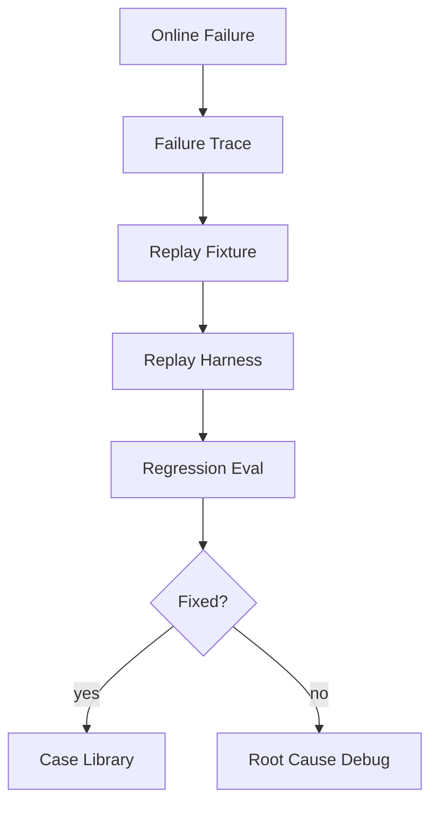

# 线上失败如何通过 Trace Replay 复现和回归？

## 面试定位

这是 Trace 的深入追问。面试官想看你能否把一次线上事故变成可重复 case，而不是只看日志截图。

## 30 秒回答

我会先从 trace 中提取失败路径，冻结 prompt manifest、工具返回、检索候选、artifact、policy version 和 state version，生成 replay fixture。Replay 不要求模型逐字一致，但要重现关键决策点。修复后用 Replay Harness 重跑，验证原 failure taxonomy 不再出现，并把 case 加入 regression。

## 标准回答

Replay 的关键是冻结环境。实时网页、实时检索、外部 API 都会变化，直接重跑线上流程没有意义。要保存当时的 DOM、截图、PDF 页、检索候选、工具 mock 和 state diff。

核心取舍是复现精度和存储成本。高风险失败要保留完整 artifact 和工具返回，低风险成功样本可以采样或只留摘要。否则系统要么复现不了关键事故，要么 trace 成本失控。

回放可以分组件级和轨迹级。组件级重跑 Context Builder、tool schema 或 citation verifier。轨迹级重建完整 step trace，验证新策略是否还会走危险路径。

## 架构与运行机制

数据流是 Failure Trace 进入 Triage，Redaction 后生成 fixture，Replay Harness 重建输入和工具返回，Eval Runner 比较新旧 verdict。若通过，case 进入 regression set。

## 可画图

图 1：线上失败到回放用例的闭环。

这张图的重点不是“把 trace 存下来”，而是把一次不可控的线上失败改造成有输入、有依赖、有期望 verdict 的工程样本。Trace 提供原始证据，Fixture 冻结当时环境，Replay Harness 复现关键状态，Regression Eval 判断修复是否覆盖原事故。Debug 分支说明回放不是为了证明修好了，而是为了在没有修好时能回到根因定位。

## 系统设计案例

Web Agent 误点删除按钮。Replay fixture 保存点击前 DOM、截图、目标 selector、用户权限、工具 riskLevel 和点击后页面状态。修复后重放同一页面，验证 Tool Permission Gate 或 verifier 能阻断危险动作。

## 真实问题与排障

如果 replay 失败复现不了，通常是 artifact 缺失、外部工具没 mock、prompt manifest 没保存或 redaction 破坏了必要字段。指标看 `replay_success_rate`、`artifact_missing_rate`、`fixture_build_time` 和 `regression_escape_rate`。

## 面试官追问

- 随机模型怎么 replay？冻结关键输入和工具结果，评估关键行为而非逐字输出。
- 什么失败必须全量 trace？高风险动作、权限事故、PII、写操作失败。
- redaction 会不会影响回放？会，所以要保留必要 hash 和脱敏映射策略。

## 项目化回答

我会说：线上事故不是只写复盘文档。我们会把 trace 转成 replay fixture，新版本上线前重放关键事故路径。这样修复有证据，指标也能追踪回归逃逸。

## 常见错误

- 依赖实时外部环境回放。
- fixture 没保存工具返回。
- 只复现最终输入，不复现中间状态。
- 事故样本没有进入 regression。

## 多轮追问模拟

第一轮追问：如果模型输出每次都不同，Replay 怎么判断通过？

回答要点：不要比较逐字输出，而要比较结构化行为和 verdict，例如是否调用同一类高风险工具、参数是否越权、state diff 是否被写入、verifier 是否阻断、最终 claim 是否有证据支撑。对于生成型答案，可以用 claim-level eval；对于工具型 Agent，可以用 action-level eval。

考察点：候选人是否理解 LLM 非确定性和工程可验证性之间的边界。

陷阱：说“固定 temperature 就能稳定复现”。固定采样参数只能降低波动，不能替代冻结工具返回、检索候选、状态版本和判定规则。

第二轮追问：Replay fixture 应该保存全量数据还是摘要？

回答要点：按风险分级。不可逆写操作、权限事故、PII、支付和安全类失败要保留完整 artifact 或受控引用；普通失败可以保存摘要、hash、schema 和必要字段。关键是保证能复现原 failure condition，同时满足隐私、成本和过期策略。

考察点：是否能把可复现性、存储成本和合规约束放在同一个设计里权衡。

陷阱：只讲“全量保存最保险”，忽略数据泄漏、权限隔离和长期成本。

第三轮追问：Redaction 之后 Replay 失败了怎么办？

回答要点：先判断是脱敏策略破坏了结构字段，还是 fixture 本身缺 artifact。常见修复是保留字段类型、长度、枚举值、稳定 hash、脱敏映射版本和受控明文引用；同时为 redaction 建回归测试，避免安全处理把 replay 语义清空。

考察点：是否知道隐私治理也会影响可观测性和回放能力。

陷阱：把 redaction 当成简单字符串替换，导致 selector、evidence span、用户权限或 state key 丢失。

## 深挖技术细节

Trace Replay 的关键是把一次失败 run 转成可重复 fixture。Fixture 应保存 `run_id`、`model_version`、`prompt_manifest_hash`、`state_version`、`policy_version`、`tool_schema_version`、`retrieval_candidates`、`tool_outputs`、`artifact_refs`、`redaction_map` 和 `expected_verdict`。对于 Web Agent，还要保存 DOM snapshot、screenshot、URL、selector、viewport 和用户权限；对于 RAG，要保存检索候选和 evidence span；对于 Coding Agent，要保存 base commit、diff、命令输出和测试结果。

Replay 不要求模型逐字输出一致，而是检查关键行为是否复现或被修复。比如原事故是未确认点击删除按钮，新版本 replay 的成功条件是 Permission Gate 阻断或要求确认；原事故是 citation unsupported，新版本条件是 verifier 标记并修订。也就是说，比较的是 policy verdict、tool action、state update 和 final quality，而不是自然语言完全相同。

存储策略要按风险分级。高风险写操作、权限事故、PII 泄露和支付类失败保留完整 artifact；普通失败可以保存摘要加 hash；成功样本抽样。指标包括 `replay_success_rate`、`artifact_missing_rate`、`redaction_breakage_rate`、`fixture_build_time`、`regression_escape_rate` 和 `p95_replay_runtime`。

## 边界条件与反例

反例一：线上事故依赖实时网页，回放时页面已经变了，导致无法复现。反例二：只保存用户输入，没保存工具返回和 state diff，根因丢失。反例三：redaction 把关键字段删掉，安全了但不能 replay。反例四：修复后没有把 fixture 加进 regression，下个版本又复发。

边界在于：不是所有 trace 都值得全量 replay。存储成本、隐私和合规要求会限制保留粒度。设计上要支持 artifact 引用、脱敏映射、访问控制和过期策略。高风险路径优先保真，低风险路径优先成本。

## 深问准备

- 问：随机模型如何稳定回放？答：冻结工具结果、检索候选、状态和策略，评估关键动作与 verdict，而不是逐字答案。
- 问：redaction 怎么不破坏回放？答：保存 hash、类型、长度、脱敏映射和必要结构字段，明文受权限控制。
- 问：Replay 和普通日志区别？答：日志用于观察，replay fixture 能重建输入和工具环境并进入回归门禁。
- 问：什么样本必须进 regression？答：权限、安全、数据泄漏、不可逆写入、用户高频路径和已修复的关键线上事故。

## 来源与延伸阅读

- [OpenAI Agents SDK Tracing](https://openai.github.io/openai-agents-python/tracing/)：用于支持 run、span、tool call 和 agent workflow 需要被结构化记录，进而具备排障和回放基础。
- [LangSmith Observability](https://docs.smith.langchain.com/observability)：用于说明 LLM 应用的 trace、dataset、evaluation 可以形成从线上样本到回归验证的闭环。
- [OpenTelemetry Traces](https://opentelemetry.io/docs/concepts/signals/traces/)：用于补充通用分布式追踪概念，强调 span、事件和上下文传播是跨组件定位问题的基础。
