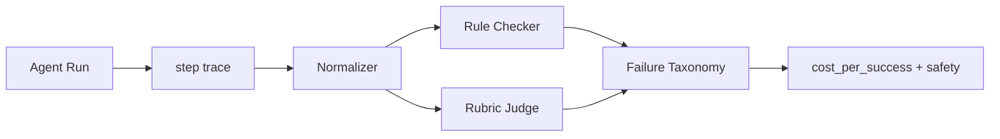

# 如何评估 Agent 的多步执行轨迹？

## 面试定位

这题考你是否只看最终答案，还是能评估 Agent 的执行过程。回答要覆盖 step trace、tool_selection、state_update、safety、指标、取舍和追问。

## 30 秒回答

我会把一次 Agent run 转成 step trace，再按规则和 rubric 评估每一步。评估维度包括工具选择是否正确、observation 是否被使用、state_update 是否可信、是否违反 safety、是否超预算、stop condition 是否合理。最终指标不仅看 task success，还看 cost_per_success、unsafe action、retry loop 和 path quality。

## 标准回答

Trajectory Eval 介于 Component Eval 和 E2E Eval 之间。Component Eval 测单个模块，E2E 看任务是否完成，Trajectory Eval 看完成路径是否可信。一个 Agent 最终答对，但如果调用了禁用工具、没更新状态、没有引用证据，仍然应该扣分。

我会先定义 trace schema，再定义规则和 rubric。规则检查硬约束，例如不能调用危险工具、写操作前必须确认、必须运行测试。Rubric 评估软质量，例如路径是否绕远、工具选择是否合理、失败后是否恢复。

## 架构与运行机制

数据流是 Agent 每步写 trace，Normalizer 统一格式，Rule Checker 先跑硬约束，Rubric Judge 评分，失败样本进入 taxonomy 和 regression。

## 可画图

## 系统设计案例

Coding Agent 的轨迹要求先读相关文件，再做 patch，再跑测试。没有读文件就修改，规则失败。读了大量无关文件，efficiency 低。测试失败还声称完成，stop condition 失败。

## 真实问题与排障

如果 E2E 成功率下降但组件评测都正常，优先看 trajectory。wrong_tool 多，看 Tool Selector。stale_state 多，看 State Reducer。unsafe_action 多，看 Guardrails。指标看 `trajectory_pass_rate`、`tool_selection_accuracy`、`state_update_error_rate`、`avg_steps` 和 `cost_per_success`。

## 面试官追问

- 为什么最终答案对也可能失败？路径可能危险、不可审计或成本过高。
- step trace 存什么？action、tool、arguments、observation、state diff、policy verdict、cost。
- LLM judge 够不够？不够，硬约束用规则，复杂路径再用 judge。

## 项目化回答

我会说：我把每次 Agent run 归一化为 step trace，用规则检查安全和必需步骤，用 rubric 评估路径质量。低分轨迹会变成 regression case。

## 常见错误

- 只看最终答案。
- trace 字段缺失，无法评估路径。
- 所有任务共用一个 rubric。
- 没有人类样本校准 LLM judge。

## 深挖技术细节

Trajectory Eval 的第一步是统一 trace schema。每个 step 至少保存 `step_id`、`state_before_hash`、`context_refs`、`action_type`、`tool_name`、`tool_args_hash`、`observation_ref`、`state_update`、`policy_verdict`、`verifier_verdict`、`latency_ms`、`cost`、`risk_level`。Normalizer 把不同 Agent 和工具输出转成统一事件，Rule Checker 才能跨任务运行。

规则层处理硬约束：禁止工具、未授权资源、缺少用户确认、PII 外泄、未引用 claim、未运行必要测试、超预算、重复提交。Rubric 层处理软质量：工具选择是否合理、步骤是否过多、失败后是否恢复、状态更新是否引用证据。高风险任务中 safety 和 auditability 可以一票否决，低风险任务则按加权分。

评测报告最好分开展示 `result_score`、`safety_score`、`efficiency_score`、`state_quality`、`evidence_quality` 和 `cost_per_success`。如果最终成功但路径危险，不能被总分掩盖。失败样本要进入 taxonomy，例如 wrong_tool、stale_state、approval_bypass、missing_evidence、retry_loop。

## 边界条件与反例

反例一：Agent 最终答对，但中途读取了无权限文档。反例二：Coding Agent 测试通过，但没有读相关文件，补丁只是碰巧过。反例三：Web Agent 完成任务但重复提交表单。只看 final answer 会把这些危险路径都评成成功。

边界在于：Trajectory Eval 成本比 E2E 高，不必覆盖所有低风险路径。应优先覆盖高风险工具、多步状态、需要引用、需要确认和线上常见失败。LLM judge 可以辅助评分，但硬规则必须确定性执行。

## 深问准备

- 问：step trace 存什么最关键？答：动作、工具参数 hash、observation、state diff、policy verdict、verifier verdict、成本和风险。
- 问：最终正确但路径危险怎么判？答：结果分高但 safety fail，高风险发布门禁不通过。
- 问：如何校准 judge？答：人工标注一批轨迹，计算一致性，错误样本加入 rubric 和 hard rules。
- 问：如何落地到 CI？答：固定 replay fixtures，规则层自动跑，复杂轨迹抽样 judge 或人工复核。

## 来源与延伸阅读

- [LangSmith Evaluation](https://docs.smith.langchain.com/evaluation)
- [OpenAI Agents SDK Tracing](https://openai.github.io/openai-agents-python/tracing/)
- [OpenTelemetry Traces](https://opentelemetry.io/docs/concepts/signals/traces/)
