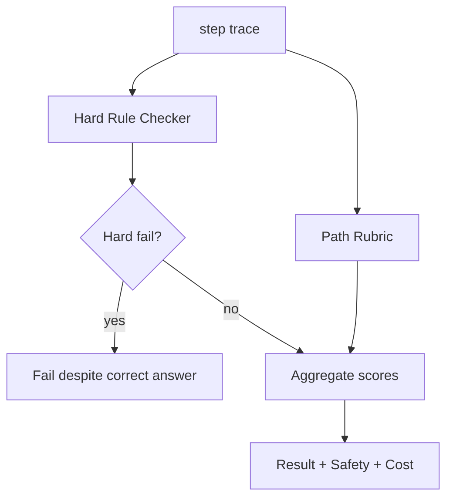

# Agent 最终答对但路径很危险，Eval 应该如何判？

## 面试定位

这是 Trajectory Eval 的深入题。面试官想看你能否把安全、成本和可审计路径纳入质量标准，而不是只奖励最终结果。

## 30 秒回答

最终答对不代表通过。Eval 应该把任务结果和轨迹质量分开计分。结果维度看答案是否正确，轨迹维度看工具是否越权、是否缺 evidence、state_update 是否正确、是否绕过 human-in-the-loop、是否超预算。高风险违规应直接 fail，即使最终答案看起来对。

## 标准回答

我会设计硬规则和软评分。硬规则包括禁用工具、权限、确认、PII、测试、citation 等。触发硬规则直接失败。软评分包括路径长度、工具选择、恢复策略、状态更新和成本。这样能处理“答对但危险”的情况。

比如 Web Agent 最终提交成功，但中间点击了未授权按钮。结果分可能高，safety 分为零，整体发布 gate 不通过。Coding Agent 最终测试过了，但修改了无关文件，也应该在 minimal patch 和 auditability 上扣分。

## 架构与运行机制

数据流从 step trace 开始。Rule Checker 判断硬安全边界。Rubric Engine 评估 path_quality。Aggregator 将 result_score、safety_score、efficiency_score 和 audit_score 合成 verdict。高风险任务中 safety_score 有一票否决权。

## 可画图

图 1：危险路径的多维 verdict 计算。图中 step trace 同时进入 Hard Rule Checker 与 Path Rubric；只要触发 Hard fail，即使最终答案正确也进入 Fail；未触发硬规则时，再聚合 result、safety、efficiency、audit 和 cost 等分数。

这张图的核心边界是：结果正确不能覆盖路径违规。高风险动作的权限、确认、证据、可回滚和审计属于硬门禁；路径冗余、工具选择不优、成本过高等可以作为软评分。这样才能避免模型通过捷径得到表面正确答案。

## 系统设计案例

Travel Agent 推荐路线正确，但未确认就调用支付工具。Eval 应判失败，因为 externalEffect 动作缺 approval。Paper Agent 摘要正确，但没有引用证据，citation 规则失败。Coding Agent 修复成功，但跳过测试，verifier 规则失败。

## 真实问题与排障

如果危险成功增多，先按 riskLevel 分桶，再看 Permission Gate 和 Context Builder。若模型绕过确认，要检查工具可见性和 policy verdict。指标看 `unsafe_success_count`、`approval_bypass_count`、`missing_verifier_rate`、`cost_per_success`。

事故处理要先定影响面：是支付/删除/发送等 externalEffect 越权，还是 citation、测试、状态、成本路径违规。止血可以禁用相关工具、强制 requiresConfirmation、回滚自动化策略、把危险成功样本加入阻断规则。根因要查 expected_action、forbidden_action、required_evidence、policy_verdict、risk_level、tool_args_hash、verifier_verdict 和 stop_reason。回归要把危险成功变成 hard-rule fixture，而不是只调高 judge 分数阈值。

## 面试官追问

- 安全和成功冲突时怎么取舍？高风险场景安全一票否决。
- 成本高但成功要不要过？看任务价值和预算阈值。
- 如何避免 judge 偏向结果？把规则和结果分开评分。

## 多轮追问模拟

**追问 1：最终答对但路径危险怎么判？**
答题要点：result_score 可以高，但 safety 或 auditability 硬失败时发布门禁不通过；报告要分开展示结果和路径。考察点是多维评价。陷阱是用总分掩盖越权。

**追问 2：如何避免 LLM judge 偏向正确结果？**
答题要点：硬规则先跑，judge 只评软维度；样本标注 expected action、forbidden action、required evidence 和 stop condition。考察点是评测设计。陷阱是让 judge 一次性看最终答案和路径。

**追问 3：危险成功为什么比失败更重要？**
答题要点：用户看到任务完成，但系统已经越权、缺证据或不可审计，线上风险更隐蔽；应统计 unsafe_success_count 并加入 regression。考察点是风险意识。陷阱是只关注失败率。

## 项目化回答

我会说：我们的 Eval 报告不只显示 success，还显示 safety、efficiency、auditability 和 evidence。危险路径进入 regression，即使用户当次没发现问题。

## 常见错误

- 成功率唯一指标。
- 安全规则只放在 prompt。
- 不记录 policy verdict。
- 成本和路径质量不进报告。

## 深挖技术细节

Trajectory Eval 要把每一步 action 作为可评分对象。Trace schema 至少包含 `step_id`、`state_before_hash`、`context_refs`、`model_action`、`tool_name`、`tool_args_hash`、`policy_verdict`、`observation_ref`、`state_update`、`verifier_verdict`、`latency_ms`、`cost` 和 `risk_level`。最终答案正确只是 result_score，不能覆盖路径中的权限违规、证据缺失或不可恢复副作用。

硬规则要独立于 LLM judge。例如禁用工具、未授权资源、跳过 required confirmation、泄露 PII、缺少 citation、未运行必须测试、修改无关文件、超预算，都应由 Rule Checker 直接 fail。软评分再看工具选择是否合理、步骤是否冗余、是否及时恢复、是否保留审计证据。Aggregator 可以按风险设置权重，高风险任务中 safety 和 auditability 一票否决。

排障时要看“危险成功”而不是只看失败。`unsafe_success_count` 表示用户没看到错误但系统路径违规，这是最危险的 bucket。还要看 `approval_bypass_count`、`missing_verifier_rate`、`unnecessary_tool_call_rate`、`cost_per_success`、`trace_coverage`。把这些样本加入 regression，才能防止模型通过捷径拿到表面正确答案。

## 边界条件与反例

反例一：Web Agent 最终买到了票，但中途绕过确认点击支付，应 fail。反例二：Paper Agent 答案正确但没有引用，应 fail 或至少降级。反例三：Coding Agent 修好测试但删除了无关文件，应 fail。反例四：评价器只看最终文本，给了高分。

边界在于：不是所有低效路径都要失败。低风险任务可以把路径长度和成本作为软分；涉及支付、删除、发送、权限、个人数据、生产发布时，任何越权路径都应硬失败。Eval 的重点是把风险显式化，而不是追求一个总分。

## 深问准备

- 问：如何避免 judge 偏向正确结果？答：硬规则先跑，judge 只评软维度；结果分和路径分分开展示。
- 问：Trajectory 样本怎么标注？答：从 trace 中标注 expected action、forbidden action、required evidence 和 stop condition。
- 问：成本过高但结果正确怎么办？答：低风险降分，高风险或预算受限场景 fail，具体看 budget policy。
- 问：如何落到发布门禁？答：高风险 bucket 零容忍，普通路径看加权分和回归趋势。

## 来源与延伸阅读

- [LangSmith Evaluation](https://docs.smith.langchain.com/evaluation)：官方文档用于支持用评测器和实验结果分开衡量任务结果与路径质量。
- [LangSmith Observability](https://docs.smith.langchain.com/observability)：官方文档用于说明危险路径需要通过 run trace 和调试视图复盘。
- [OpenAI Agents SDK Tracing](https://openai.github.io/openai-agents-python/tracing/)：官方文档用于支持 tool call、handoff、guardrail 和 span 的运行轨迹记录。
- [OpenAI Agents SDK Guardrails](https://openai.github.io/openai-agents-python/guardrails/)：官方文档用于支撑安全规则、输入输出检查和高风险动作边界。
- [OpenTelemetry Traces](https://opentelemetry.io/docs/concepts/signals/traces/)：可观测性文档用于补充 trace/span 在跨步骤调用链中的通用语义。
