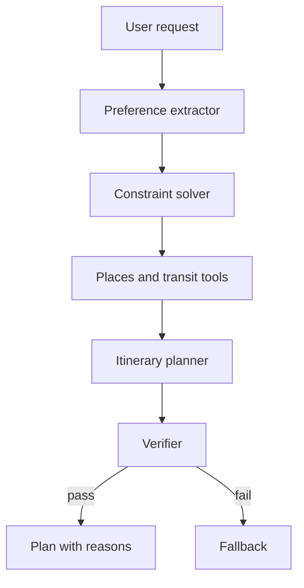

# Travel Agent 为什么适合做求职项目？

## 30 秒回答

Travel Agent 适合求职项目，因为它能展示多约束规划、工具调用、实时数据、用户偏好、fallback 和安全边界。它不是让模型写攻略，而是把需求转成 constraints，用 availability、budget、distance 和 preference 生成可解释 itinerary。

## 面试定位

这题考项目选型。面试官想知道你能不能从简单场景里讲出工程复杂度，而不是做一个花哨 demo。

回答要覆盖架构、数据流、指标、取舍和追问。尤其要说明高风险动作不自动执行。

## 标准回答

Travel Agent 有真实约束。用户有日期、预算、兴趣、同行人、节奏、交通方式和禁忌。地点有营业时间、地理距离、票价和天气影响。这些都需要结构化建模。

架构上包括 preference extractor、constraint solver、search tools、availability checker、itinerary planner、verifier 和 fallback planner。模型负责理解和解释，约束检查由系统完成。

它还能展示安全边界。预订、付款、登录、取消订单都应该 human-in-the-loop 或 unsupported。这样项目更像真实产品。

## 架构与运行机制

图 1：Travel Agent 从偏好抽取到可行性验证的规划链路。Preference Extractor 把自然语言转为结构化约束，Constraint Solver 区分硬约束和软偏好，Places/Transit Tools 提供现实数据，Verifier 检查营业时间、预算、路线和节奏，失败再进入 Fallback。

这张图的边界是：Travel Agent 的价值不在“写一篇攻略”，而在把多约束计划变成可验证的 itinerary。模型可以生成解释和候选方案，但可行性要由约束、实时字段、TTL 和 verifier 兜底；预订、付款、取消等外部副作用不能自动执行。

数据流是从自然语言到结构化 constraints，再到候选地点、路线、验证和解释。每个推荐都要有 reason、source 和 time。

## 可画图

可以画旅行规划 pipeline。图上标出硬约束、软偏好、实时工具和 verifier。

## 系统设计案例

用户说“周末两天去上海，预算 2000，喜欢建筑和咖啡，不想太赶”。系统提取 budget、pace、interest 和 dates，搜索地点和交通，生成 day plan，再检查营业时间和距离。

如果某个地点闭馆，fallback planner 替换同区域同主题地点，并解释原因。

## 真实问题与排障

常见失败是行程不可行、忽略营业时间、预算超出或误解偏好。排障先看 preference extraction，再看 availability 数据源时间，最后看 constraint solver 是否把软约束当硬约束。

指标包括 constraint_satisfaction_rate、availability_error_rate、route_feasibility、fallback_success_rate 和 user_revision_rate。

## 面试官追问

- 如何评测行程是否可行？
- 实时 API 失败怎么办？
- 用户偏好冲突时如何追问？
- 为什么不自动预订？
- 如何处理过期价格？

## 多轮追问模拟

追问 1：如果用户的偏好互相冲突怎么办？
答：先区分硬约束和软偏好。硬约束如日期、预算上限、签证/儿童限制必须满足；软偏好如咖啡、建筑、慢节奏可以排序和权衡。无法同时满足时要展示 tradeoff 或追问，而不是强行生成唯一行程。考察点是约束建模；陷阱是把所有偏好都当成 prompt 里的自然语言。

追问 2：如何证明行程不是“看起来合理”而是真的可行？
答：每个行程项要有地点 id、营业时间、查询时间、路线时间、预算估算和下一段交通。Verifier 用这些字段检查时间窗、距离、预算、节奏和禁忌，再输出失败原因。考察点是可验证计划；陷阱是只用 LLM 自评“行程合理”。

追问 3：为什么预订和付款不适合 MVP 自动化？
答：它们是外部副作用，涉及金额、身份、第三方账号和取消规则。MVP 可以生成 booking preview 或 deep link，但执行前要 human-in-the-loop，记录 args_hash、价格时间戳和取消政策。考察点是项目安全边界；陷阱是为了显得高级而自动下单。

## 项目化回答

我会说 Travel Agent 展示的是约束规划。preference extractor 结构化用户需求，constraint solver 保证可行性，availability verifier 处理现实数据，高风险动作明确走 human-in-the-loop。

## 常见错误

- 只让模型生成攻略。
- 不验证营业时间和路线。
- 预订付款自动化但无确认。
- 不区分硬约束和偏好。
- 没有 fallback。

## 深挖技术细节

Travel Agent 的工程深度来自“约束对象”和“现实数据”的结合。用户输入不能只变成一段 prompt，而要抽取成 `trip_id`、`date_range`、`city`、`budget_limit`、`pace`、`interests`、`companions`、`must_have`、`must_avoid`、`transport_mode` 和 `risk_flags`。地点候选也要有 `place_id`、`geo_point`、`opening_hours`、`price_level`、`rating_source`、`last_updated_at`、`travel_time_to_next` 和 `availability_status`。模型负责解释和补全，Constraint Verifier 负责判定是否满足。

一个可面试的实现链路可以这样讲：Preference Extractor 生成结构化约束，Places/Maps/Weather 工具提供候选与实时字段，Planner 生成 itinerary，Verifier 检查营业时间、路线时间、预算、节奏和禁忌，Fallback Planner 在失败时替换同区域同主题候选。每个推荐项都要保存 `source` 和 `retrieved_at`，因为价格、营业时间和交通时间会过期。高风险动作如预订、付款、取消、登录第三方账号应保持 unsupported 或 requiresConfirmation。

评测不是看“攻略写得美不美”，而是看 `hard_constraint_pass_rate`、`availability_error_rate`、`route_feasibility_rate`、`budget_violation_rate`、`fallback_success_rate`、`clarification_rate` 和 `user_revision_rate`。当用户反馈“不想太赶”，排障要看 pace 是否抽取为约束、travel_time 是否低估、每日活动数量是否超阈值。

## 边界条件与反例

反例一：模型直接编出“这家店营业到 22:00”，但没有工具来源和查询时间。反例二：用户说预算 2000，系统把机票、酒店和餐饮分开估算，却没有总预算 verifier。反例三：候选地点闭馆后仍推荐，只因为它语义上符合“建筑和咖啡”。

边界在于：Travel Agent 很多能力依赖实时 API，离线 demo 不能假装生产可用。没有可靠地图、交通、价格、营业时间和预订接口时，应明确显示 unavailable 或需要用户确认。多用户偏好冲突时，也不应该强行生成唯一答案，而是展示 tradeoff 或追问。

## 深问准备

- 问：为什么 Travel Agent 比普通聊天攻略更适合项目？答：它能展示约束抽取、工具调用、Verifier、fallback、安全确认和可观测指标。
- 问：实时 API 失败怎么办？答：标记字段 unknown，触发 fallback、降级或追问；不能把 unknown 当 satisfied。
- 问：如何处理过期价格？答：所有价格和营业时间带 source/time，超过 TTL 重新查询或提示不可用。
- 问：为什么不自动预订？答：预订和付款是外部副作用，必须 preview、approval、audit，MVP 中可设为 unsupported。

## 来源与延伸阅读

- [Google Places API Place Details](https://developers.google.com/maps/documentation/places/web-service/place-details)：用于支持地点详情、营业时间、价格等级和更新时间等字段应来自可追溯数据源。
- [Google Routes API](https://developers.google.com/maps/documentation/routes)：用于支持路线时间、交通方式和距离是行程可行性验证的一部分，而不是生成阶段的装饰信息。
- [OpenAI Agents SDK Tracing](https://openai.github.io/openai-agents-python/tracing/)：用于支持偏好抽取、工具查询、fallback 和 verifier 结果应进入 trace，便于解释与复盘。
