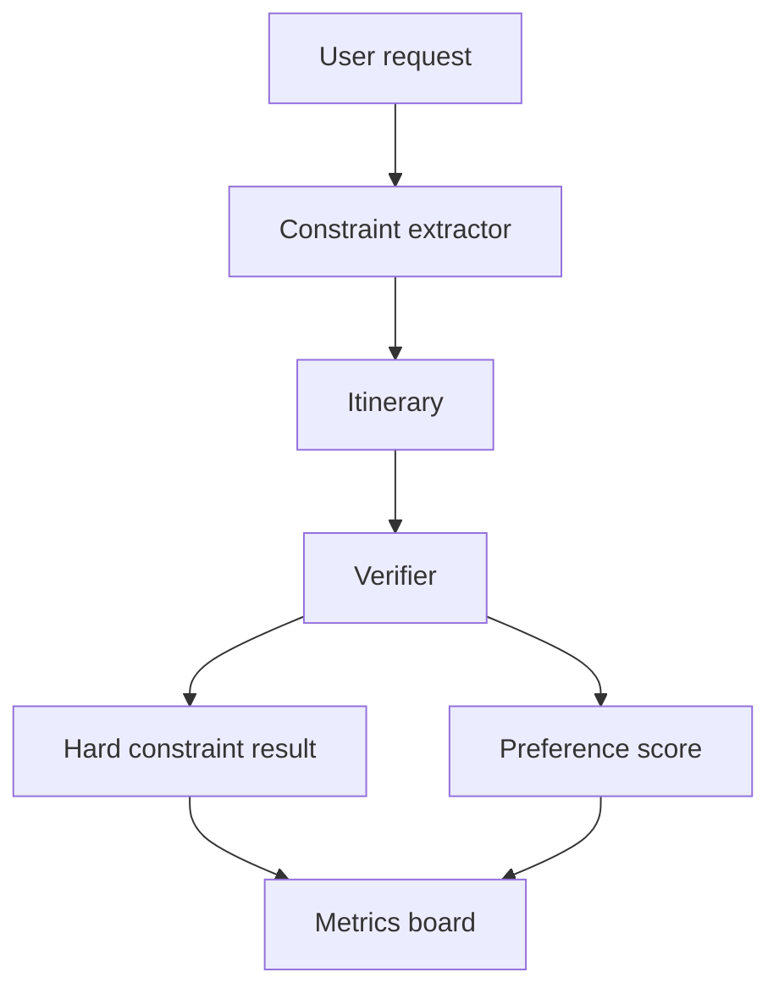

# 如何评测旅行规划 Agent 的约束满足率？

## 30 秒回答

我会把用户需求拆成硬约束和软偏好。硬约束如日期、预算、营业时间、地理范围和禁忌必须满足。软偏好如节奏、兴趣和餐厅风格可以打分。约束满足率按 verifier 对 itinerary 的逐项检查计算，并记录失败原因。

## 面试定位

这题考评测设计。面试官想知道你能否把“行程好不好”从主观感受变成可计算指标。

回答要覆盖架构、数据流、指标、取舍和追问。重点是结构化约束和 verifier。

## 标准回答

第一步是约束抽取。Preference extractor 把用户输入转成 constraints，例如 budget <= 2000、每天不超过 3 个景点、必须避开博物馆、晚餐要素食。

第二步是行程验证。Verifier 检查每个 itinerary item 的时间、距离、availability、预算和偏好匹配。实时字段要带 source/time，缺数据时不能当作满足。

第三步是评分。硬约束违反直接判失败。软偏好可以按权重计算 preference_score。最终看 constraint_satisfaction_rate、budget_violation_rate、time_conflict_rate 和 user_revision_rate。

## 架构与运行机制

数据流里要保留每条约束的来源句子和检查结果。这样用户修改时可以回溯 Agent 为什么这样安排。

## 可画图

可以画约束检查表：约束、来源、行程项、结果、失败原因。技术面试里这比展示漂亮 UI 更有价值。

## 系统设计案例

用户要求“亲子、预算 3000、不要太赶、晚上 8 点前回酒店”。Verifier 检查每一天路线是否超过预算，地点是否适合亲子，交通时间是否合理，最后一个活动是否能在 8 点前结束。

如果某约束冲突，例如预算和酒店星级无法同时满足，系统应追问或提供 tradeoff，而不是直接忽略其中一个。

## 真实问题与排障

如果用户反馈行程太赶，先看 pace 偏好是否被正确抽取，再看 travel_time 是否被低估。若预算超出，检查价格来源时间和 currency 处理。

指标包括 hard_constraint_pass_rate、preference_score、time_conflict_rate、budget_violation_rate、availability_error_rate 和 fallback_success_rate。

## 面试官追问

- 硬约束和软偏好如何区分？
- 实时数据缺失时如何评分？
- 用户修改行程如何反哺偏好？
- 多人偏好冲突怎么办？
- 如何避免模型编造价格？

## 项目化回答

我会说评测 Travel Agent 的核心是约束满足。每条用户需求都变成可检查字段，itinerary 经过 verifier，失败会进入 error bucket，系统用 fallback 或追问处理冲突。

## 常见错误

- 只让用户主观打分。
- 不保存约束来源。
- 实时字段没有 source/time。
- 软偏好违反也当硬失败。
- 数据缺失时假装满足。

## 深挖技术细节

旅行规划 Agent 的约束评测需要结构化 schema。每条约束可以表示为 `constraint_id`、`type`、`hardness`、`source_sentence`、`field`、`operator`、`expected_value`、`time_scope`、`location_scope`、`confidence`。行程项则要有 `place_id`、`start_time`、`end_time`、`travel_time_source`、`price_source`、`opening_hours_source`、`reservation_status` 和 `risk_flags`。Verifier 逐条约束对 itinerary item 打 verdict，而不是让模型主观判断“还不错”。

硬约束包括日期、预算上限、营业时间、签证/交通、儿童或老人适配、禁忌、必须返回酒店时间。软偏好包括节奏、景点类型、餐饮风格、少走路、拍照点。硬约束失败要进入 fail 或 clarification；软偏好可以进入 weighted score。实时字段必须保存 `retrieved_at`，否则价格、营业时间和交通时长会过期。

排障时按 failure bucket 看：constraint_extraction_error、availability_stale、travel_time_underestimated、budget_currency_error、preference_conflict、hallucinated_place、unsafe_route。指标包括 `hard_constraint_pass_rate`、`preference_score`、`availability_error_rate`、`revision_rate`、`clarification_rate`、`p95_planning_latency` 和 `cost_per_itinerary`。

## 边界条件与反例

反例一：模型直接生成“看起来合理”的行程，但没有结构化检查营业时间和交通时长。反例二：缺实时数据时编造价格或开放状态。反例三：把软偏好当硬约束，导致系统频繁失败；或把硬约束当软偏好，导致行程不可执行。

边界在于：旅行规划很多字段依赖外部实时数据，离线 demo 不能冒充生产能力。没有可靠地图、价格、营业时间和预订 API 时，系统应该显示 unavailable 或要求用户确认，而不是给确定性承诺。多人偏好冲突时也不能硬凑，需要展示 tradeoff 或追问。

## 深问准备

- 问：实时数据缺失怎么评估？答：标记 unknown，不计为 satisfied；高影响字段触发 fallback 或 clarification。
- 问：如何避免编造价格？答：价格必须来自带 source/time 的工具结果，缺失时输出范围或提示不可用。
- 问：多人偏好冲突怎么办？答：把偏好按人和权重建模，输出冲突矩阵和候选 tradeoff。
- 问：如何做回归？答：保留用户需求、结构化约束、行程输出和 verifier verdict，失败样本进入 golden set。

## 来源与延伸阅读

- [LangSmith Evaluation](https://docs.smith.langchain.com/evaluation)
- [OpenAI Agents SDK Tracing](https://openai.github.io/openai-agents-python/tracing/)
- [Google Maps Platform Places API](https://developers.google.com/maps/documentation/places/web-service/overview)
