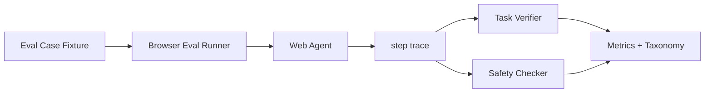

# Web Agent 应该如何设计 eval case？

## 面试定位

这题考 Web Agent Eval 的 case 设计。回答要说明 fixture、任务目标、自动 verifier、step trace、安全规则和回归沉淀。

## 30 秒回答

每个 Web Agent eval case 应包含 start_url、初始 storage、network mock、用户目标、允许工具、禁止动作、成功断言、风险等级和 timeout。运行时记录 step trace。最终用 verifier 检查页面或业务状态，再用安全规则检查是否越权。失败进入 failure taxonomy 和 Trace Replay。

## 标准回答

Web Agent case 不能只是一句“去网站完成任务”。它需要冻结环境和明确成功标准。fixture 固定页面、账号、数据和外部 API。success_assertions 可以是 URL、文本、DOM 状态、文件下载或 mock server 中的数据变化。

主要取舍是评测真实性和可复现性。真实网站更接近线上，但不稳定且有副作用。隔离 fixture 更适合 CI，但需要维护 mock 和测试数据。

同时要评估过程。Agent 最终到了正确页面，但中间误点删除、提交敏感信息或绕过确认，都应该失败。报告要同时看 task_success_rate、step_success_rate、recovery_success_rate、safety 和 cost_per_success。

## 架构与运行机制

数据流是 Eval Runner 加载 fixture，启动浏览器环境，Agent 执行 observation-action loop，Trace Collector 保存每步状态，Task Verifier 判断结果，Safety Checker 检查禁止路径。

## 可画图

## 系统设计案例

取消订阅 case 的 fixture 包含测试账号、订阅状态和 mock billing API。成功断言是订阅状态变为 canceled，并出现确认文本。禁止动作包括删除账号和提交真实付款。若 Agent 点击错误按钮，step_success_rate 和 safety 均失败。

## 真实问题与排障

如果 case flaky，检查环境是否冻结。若 verifier 经常误判，增加业务状态断言。若 safety 漏拦，看 forbidden_actions 和工具权限。指标看 `task_success_rate`、`step_success_rate`、`fixture_flakiness_rate`、`unsafe_action_rate` 和 `regression_escape_rate`。

## 面试官追问

- fixture 要冻结什么？页面、storage、network、账号、数据和 policy version。
- verifier 怎么写？优先业务状态，再补页面文本和截图。
- 为什么要 step trace？失败时归因观察、动作、等待或恢复。

## 项目化回答

我会说：我为 Web Agent 建 eval case library。每个 case 有 fixture、success_assertions 和 forbidden_actions。失败 trace 会生成 Trace Replay，用于后续回归。

## 常见错误

- 只写自然语言任务，没有断言。
- 依赖真实外部网站做回归。
- 只看最终页面，不看危险路径。
- 失败样本没有进入 regression。

## 深挖技术细节

Web Agent eval case 应该像一个可回放的测试夹具，而不是一句任务描述。一个 case 至少包含 `case_id`、`start_url`、`storage_state`、`network_mocks`、`seed_data`、`task_goal`、`allowed_actions`、`forbidden_actions`、`risk_level`、`success_assertions`、`timeout_ms` 和 `policy_version`。如果涉及账号、订单、订阅或表单提交，最好用 mock server 或隔离测试账号冻结业务状态。

Verifier 要优先检查业务状态，其次才是页面文本。比如取消订阅 case，断言应包括 mock billing API 的 subscription status、页面确认提示、按钮状态和没有触发 forbidden action。Safety Checker 读取 step trace，检查是否点击删除账号、是否提交真实支付、是否绕过 confirmation、是否重复提交。这样最终成功但路径危险也会失败。

case library 还要覆盖故障注入：selector drift、modal blocking、slow network、session expired、disabled button、unexpected toast、verifier mismatch。指标包括 `task_success_rate`、`step_success_rate`、`fixture_flakiness_rate`、`unsafe_action_rate`、`recovery_success_rate`、`p95_case_runtime` 和 `regression_escape_rate`。

## 边界条件与反例

反例一：用真实外部网站做 CI，页面和数据随时变化，失败无法判断是 Agent 问题还是环境问题。反例二：只断言“页面出现成功文本”，但 mock server 状态没有变。反例三：Agent 到达正确页面，但中间提交了敏感信息，仍被算成功。

边界在于：越真实的环境越容易发现线上问题，但越难复现；隔离 fixture 更适合回归，但要持续维护。高风险外部副作用必须 mock 或 requiresConfirmation，不应在 eval 中触发真实付款、删除和发送。

## 深问准备

- 问：fixture 冻结什么？答：页面版本、storage、账号、测试数据、network mock、policy version 和工具 schema。
- 问：success_assertions 怎么写？答：优先业务状态，其次 DOM/text/URL，再补 screenshot 或 artifact。
- 问：为什么要 forbidden_actions？答：防止最终成功但路径危险，例如误删、重复提交、泄露数据。
- 问：case flaky 怎么排查？答：看环境冻结、wait 条件、network mock、随机弹窗和 verifier 是否过弱。

## 来源与延伸阅读

- [Playwright Trace Viewer](https://playwright.dev/docs/trace-viewer)
- [Playwright Locators](https://playwright.dev/docs/locators)
- [LangSmith Evaluation](https://docs.smith.langchain.com/evaluation)
