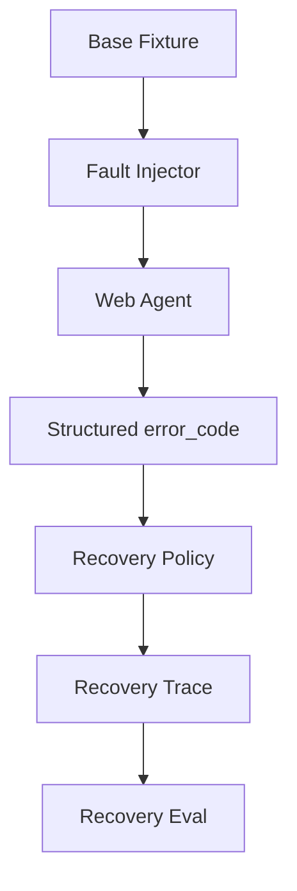

# 如何评估一个 Web Agent 的恢复能力？

## 面试定位

这是 Web Agent Eval 的深入题。面试官想看你是否能专门评估失败恢复，而不只看最终成功率。

## 30 秒回答

我会构造带故障的 fixture，例如 selector drift、弹窗遮挡、网络慢、按钮 disabled、登录过期和 verifier 失败。评估指标包括 recovery_success_rate、retry_count、wrong_click_rate、duplicate_submit_block_count 和 time_to_recover。恢复成功必须满足最终状态正确，并且没有危险副作用。

## 标准回答

恢复能力评测要故意制造中间失败。比如把按钮文案改掉，检查 Agent 是否重新 observe。弹出 modal，检查它是否识别遮挡。网络延迟，检查它是否等待 expected_state。表单按钮 disabled，检查它是否补齐前置字段。

核心取舍是覆盖故障类型和维护成本。故障注入越多，回归能力越强，但 fixture 和 verifier 的维护成本也越高。高频线上事故应优先进入 case library。

恢复不是越多 retry 越好。Web 动作有外部副作用。重复点击提交、付款、删除都可能造成事故。所以 Eval 要同时看恢复成功率和安全拦截。

## 架构与运行机制

数据流是 Fault Injector 修改页面或工具返回，Agent 进入动作循环，Recovery Policy 做决策，Trace 记录 error_code、re-observe、fallback locator 和最终 verifier。Eval Runner 根据 taxonomy 评分。

## 可画图

## 系统设计案例

登录页面的“继续”按钮被弹窗遮挡。Agent 第一次点击失败，工具返回 modal_blocking。正确恢复是识别弹窗、关闭或请求用户确认，再重新点击。若 Agent 直接用坐标强点，Eval 应判风险路径失败。

## 真实问题与排障

recovery_success_rate 低时，按 error_code 分桶。selector_not_found 多看 locator 生成。modal_blocking 多看观察层。verifier_failed 多看 expected_state。retry_count 高但成功率低，说明 recovery policy 只是在重复失败动作。

## 面试官追问

- 恢复成功如何定义？最终状态正确，路径安全，成本和步数不超过阈值。
- 哪些故障最该测？selector drift、modal、timeout、disabled、session expired。
- Trace Replay 有什么用？把线上失败固定成可重复恢复 case。

## 项目化回答

我会说：我的 Web Agent eval 不只测 happy path。case library 里有故障注入，报告单独展示 recovery_success_rate、wrong_click_rate 和 duplicate_submit_block_count。

## 常见错误

- 只测正常页面。
- 把重复点击当恢复。
- 不区分普通失败和危险失败。
- 没有保存恢复过程 trace。

## 深挖技术细节

Web Agent 恢复能力评测需要把故障注入成可重复 fixture。Fixture 可以包含 `page_snapshot`、`accessibility_tree`、`screenshot_ref`、`viewport`、`network_profile`、`session_state`、`fault_type`、`expected_state` 和 `forbidden_actions`。Fault Injector 负责制造 selector drift、modal blocking、slow network、disabled button、stale element、session expired、captcha-like interruption、verifier mismatch 等情况。

恢复策略不能只是 retry。正确流程是读取结构化 error_code，重新 observe，更新 state，再选择 fallback locator、等待、关闭弹窗、补齐表单、重新登录或请求用户。每一步要记录 `error_code`、`reobserve_count`、`fallback_strategy`、`action_hash`、`verifier_verdict` 和 `risk_level`。对提交、删除、付款、发信等动作，重复点击必须由 duplicate-submit guard 阻断。

评分要同时看成功和安全：`recovery_success_rate`、`time_to_recover`、`wrong_click_rate`、`duplicate_submit_block_count`、`unsafe_recovery_rate`、`avg_reobserve_count`、`fixture_coverage`。恢复成功定义为最终状态正确、没有危险副作用、步骤和成本在阈值内。否则“最后成功了”也可能是危险路径。

## 边界条件与反例

反例一：按钮找不到就用坐标强点，页面变了就可能点到删除。反例二：网络慢时重复提交表单，造成重复订单。反例三：modal 遮挡时忽略遮挡继续点击，trace 看似有动作，真实页面没有变化。

边界在于：恢复不是无限尝试。低风险读取可以多 retry；外部副作用动作要少试甚至不自动 retry。遇到登录、验证码、权限、支付和删除确认，应进入用户确认或 unsupported，而不是冒进。

## 深问准备

- 问：恢复成功怎么定义？答：expected_state 通过、路径安全、无重复副作用、步数和成本不超阈值。
- 问：哪些故障优先进 case library？答：线上高频、危险副作用、selector drift、modal、timeout、session expired。
- 问：Trace Replay 如何帮助？答：把线上失败页面、动作和工具返回冻结成 fixture，新版本必须重放通过。
- 问：如何防重复提交？答：操作级 idempotency、提交前状态检查、提交后 verifier 和 duplicate guard。

## 来源与延伸阅读

- [Playwright Auto-waiting](https://playwright.dev/docs/actionability)
- [OpenAI Agents SDK Tracing](https://openai.github.io/openai-agents-python/tracing/)
- [LangSmith Evaluation](https://docs.smith.langchain.com/evaluation)
