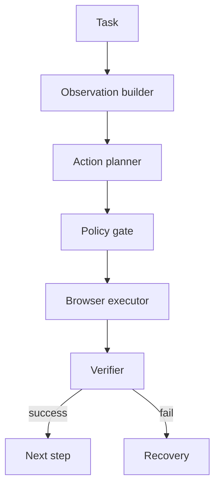

# Web Agent 项目怎么设计 MVP？

## 30 秒回答

Web Agent MVP 应该选低风险、可评测的网页任务。架构上要有 observation builder、structured action、browser executor、state verifier、trace 和 recovery。先支持 click、type、select、extract、wait 这类动作，高风险提交、付款和删除默认 requiresConfirmation 或 unsupported。

## 面试定位

这题考 Web Agent 的工程边界。面试官想知道你不是让模型随便点页面，而是用浏览器工具链做可控执行。

回答要覆盖架构、数据流、指标、取舍和追问。重点是 observation/action/verifier 闭环。

## 标准回答

MVP 场景要小而真实，例如填写表单、从网页抽取信息、完成内部系统查询。不要一开始做任意网站自治操作。

Observation 层读取 DOM、accessibility tree、可交互元素和必要截图。Action 层只接受结构化 schema，例如 click、type、select、navigate、wait。Executor 用 Playwright 执行动作，Verifier 检查 expected_state。

每一步都进入 trace，包括 observation、action、selector、screenshot、verdict 和耗时。失败时 recovery policy 尝试重观测、换 selector、返回上一步或请求用户。

## 架构与运行机制

数据流要把模型决策和宿主执行分开。模型选择动作，宿主负责权限、selector、等待和验证。

## 可画图

可以画 Web Agent loop：observe、plan、act、verify、recover、trace。图上标出每一步的输入输出。

## 系统设计案例

MVP 可以是“登录后的内部订单查询”。用户输入订单号，Agent 观察表单，输入订单号，点击查询，提取结果。Verifier 检查页面出现订单详情。

这比任意网页购物安全得多，也能评测 step_success_rate 和 task_success_rate。

## 真实问题与排障

如果点击错元素，先看 observation 是否缺少按钮，selector 是否不稳定，页面是否动态加载。若动作成功但结果错，expected_state 可能写得太弱。

指标包括 task_success_rate、step_success_rate、selector_failure_rate、recovery_success_rate、unsafe_action_block_rate 和 latency_p95。

## 面试官追问

- observation 应包含什么？
- selector 怎么设计？
- 如何评测页面任务？
- 动态页面怎么处理？
- 如何防 prompt injection？

## 项目化回答

我会说 Web Agent MVP 的核心是闭环控制。每个 action 都有 schema、selector、riskLevel 和 expected_state，执行后必须 verifier 通过，失败可 trace replay。

## 常见错误

- 直接让模型输出自由文本动作。
- 不验证页面状态。
- 一开始做任意网站全自动。
- 没有 fixture eval。
- 高风险动作没有确认。

## 深挖技术细节

Web Agent MVP 的关键是 action schema 和 verifier。Observation Builder 应输出可交互元素列表、role/name、selector candidates、visible text、DOM path、bounding box、disabled 状态、当前 URL、截图引用和页面加载状态。模型只能输出结构化 action，例如 `click(element_id)`、`type(element_id,value)`、`select(element_id,value)`、`navigate(url)`、`wait(condition)`、`extract(schema)`。Executor 再把 element_id 映射到 Playwright locator。

每个 action 都要带 `risk_level` 和 `expected_state`。只读抽取和普通导航是低风险；提交表单、发送消息、删除、购买、下载和跨站跳转是中高风险。Verifier 检查 URL、DOM、toast、表格行、表单状态或业务结果，而不是只看动作是否没有报错。失败时 Recovery Policy 才能基于 error_code 选择 re-observe、等待、换 selector、回退或询问用户。

MVP 评测要用固定 fixture，而不是人工点两次页面。指标包括 `task_success_rate`、`step_success_rate`、`selector_failure_rate`、`verifier_failure_rate`、`recovery_success_rate`、`unsafe_action_block_rate`、`p95_step_latency`。先把内部低风险流程打稳，再逐步扩展到更多页面和风险动作。

## 边界条件与反例

反例一：模型输出“点击蓝色按钮”，页面改版后就不可复现。反例二：点击成功但页面结果不对，系统没有 expected_state。反例三：一开始做任意网站购物或删数据，安全边界还没准备好。反例四：网页中的 prompt injection 被当成系统指令。

边界在于：MVP 应选择低风险、登录状态可控、页面模板稳定、结果可验证的任务。高风险动作默认 unsupported 或 requiresConfirmation；验证码、支付、外部发送、隐私数据导出等能力不要在 MVP 中假装支持。

## 深问准备

- 问：observation 应包含什么？答：accessibility tree、可交互元素、selector 候选、截图引用、URL、加载状态和关键文本。
- 问：selector 怎么设计？答：优先 role/name/test id，保留多个候选和稳定性评分，失败后重新 observe。
- 问：如何评测动态页面？答：fixture + fault injection + verifier，覆盖加载慢、modal、disabled、selector drift。
- 问：如何防 prompt injection？答：页面文本只作为 untrusted evidence，不能修改工具权限和系统目标。

## 来源与延伸阅读

- [Playwright Locators](https://playwright.dev/docs/locators)
- [Playwright Auto-waiting](https://playwright.dev/docs/actionability)
- [OpenAI Agents SDK Guardrails](https://openai.github.io/openai-agents-python/guardrails/)
