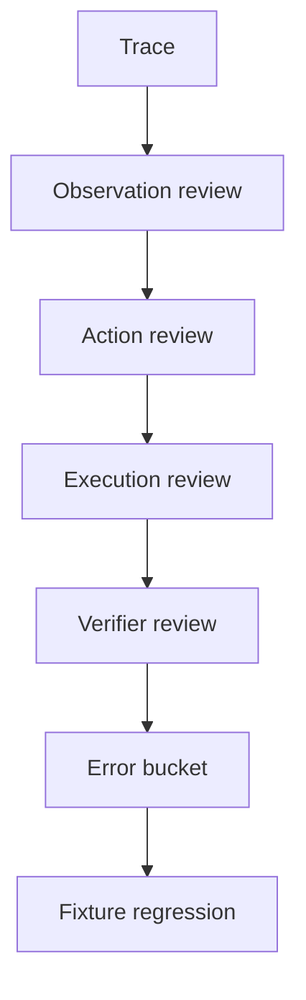

# 如何通过 trace 复盘 Web Agent 的失败？

## 30 秒回答

Web Agent 失败复盘要看每一步的 observation、action、selector、expected_state、actual_state、screenshot、console/network 和 verifier verdict。先判断失败发生在观察、计划、执行、等待、验证还是 recovery。然后把失败样本做成 fixture 回归。

## 面试定位

这是 Web Agent 的真实工程题。面试官想确认你能排查浏览器自动化失败，而不是只会演示成功路径。

回答要覆盖架构、数据流、指标、取舍和追问。重点是 trace replay 和错误分桶。

## 标准回答

Trace 至少记录 task_id、step_id、URL、DOM 摘要、accessibility tree、screenshot、候选元素、模型选择的 action、selector、执行结果、等待条件、verifier verdict 和错误信息。

复盘时先分层。观察层失败可能是页面加载不完整。计划层失败是模型选错动作。执行层失败可能是 selector 不稳定或元素不可点击。验证层失败说明动作成功但状态不符合预期。Recovery 失败说明系统没有有效备选路径。

复盘结果要进入 fixture。下次改动后自动重放，避免同类页面变化再次破坏任务。

## 架构与运行机制

数据流里 trace 不是日志堆积，而是可回放的状态序列。每一步都要能解释 Agent 为什么这么做。

## 可画图

可以画失败归因树：observation error、planning error、selector error、wait error、verification error、recovery error。每类对应修复策略。

## 系统设计案例

Agent 在表单页点击了“取消”而不是“提交”。Trace 显示 observation 中两个按钮文字都出现，但 action planner 没有使用 role 和上下文区分。修复是增强 selector 策略，要求 action 带 expected_state，并把该页面做成 fixture。

再跑回归时，verifier 检查提交后 URL 或成功提示，而不是只检查 click 返回成功。

## 真实问题与排障

如果 selector_failure_rate 高，优先使用 role、label、text 和 test id，减少脆弱 CSS。若 wait timeout 高，检查页面异步加载和 expected_state。若 recovery_success_rate 低，说明失败后重观测或回退策略不够。

指标包括 step_success_rate、selector_failure_rate、wait_timeout_rate、verifier_false_pass_rate、recovery_success_rate 和 replay_pass_rate。

## 面试官追问

- trace 里哪些字段必须脱敏？
- screenshot 和 DOM 哪个更可靠？
- 如何处理随机弹窗？
- fixture 怎么构建？
- 失败回放和线上隐私如何平衡？

## 项目化回答

我会说 Web Agent 的质量来自 trace replay。每个失败都按观察、动作、执行、验证和恢复分桶，修复后进入 fixture eval。这样项目不是只靠一次演示，而是能持续抗页面变化。

## 常见错误

- 只记录最终失败信息。
- 没有 screenshot 或 DOM 快照。
- 把 selector 失败当模型失败。
- click 成功就认为任务成功。
- 失败样本不进入回归。

## 深挖技术细节

Web Agent trace 要能还原每一步的页面状态和动作意图。建议记录 `task_id`、`step_id`、`url`、`title`、`dom_snapshot_ref`、`accessibility_tree_ref`、`screenshot_ref`、`interactive_elements`、`chosen_action`、`selector_candidates`、`final_selector`、`action_result`、`wait_condition`、`expected_state`、`actual_state`、`console_errors`、`network_events`、`verifier_verdict` 和 `error_bucket`。大对象放 artifact store，trace 只保存引用和 hash。

复盘顺序可以固定为六层：Observation 是否看见了正确元素，Planner 是否选了正确动作，Executor 是否能稳定定位并执行，Waiter 是否等到正确状态，Verifier 是否判断准确，Recovery 是否避免重复危险动作。这样不会把所有问题都粗暴归因给模型。比如 selector 失效应改 locator 策略，verifier 误判应加强业务断言，modal 遮挡应补 observation 和 recovery。

Trace Replay 要把失败样本转成 fixture。保存页面快照、网络 mock、storage state、动作序列和 expected verdict。修复后重放同一 case，要求错误 bucket 不再出现。指标包括 `replay_pass_rate`、`selector_failure_rate`、`wait_timeout_rate`、`verifier_false_pass_rate`、`recovery_success_rate` 和 `debug_time_to_root_cause`。

## 边界条件与反例

反例一：只保存“点击失败”日志，没有 before/after screenshot，无法判断遮挡、加载还是 selector 失效。反例二：click API 返回成功就结束，但页面业务状态没有变化。反例三：trace 中保存完整 PII 明文，调试方便但违反隐私边界。

边界在于：trace 要可复盘，但不能无限存储和泄露隐私。敏感字段要在采集层 redaction，大截图和 DOM 要有访问控制和过期策略。高风险失败保留更完整 artifact，普通成功样本可以抽样。

## 深问准备

- 问：DOM 和 screenshot 哪个更可靠？答：DOM 适合结构化定位，screenshot 反映用户可见状态；二者冲突时要结合 verifier。
- 问：如何处理随机弹窗？答：fixture 中注入 modal case，trace 记录遮挡和 recovery，策略里允许关闭或请求确认。
- 问：哪些字段要脱敏？答：账号、姓名、邮箱、地址、支付信息、token、订单号和业务敏感文本。
- 问：失败如何进入回归？答：从 trace 生成 fixture，保存 artifact refs、mock 和 expected verdict。

## 来源与延伸阅读

- [Playwright Trace Viewer](https://playwright.dev/docs/trace-viewer)
- [Playwright Tracing API](https://playwright.dev/docs/api/class-tracing)
- [OpenAI Agents SDK Tracing](https://openai.github.io/openai-agents-python/tracing/)
