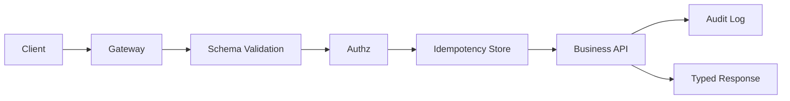

# 如何设计可演进、安全且幂等的 API 契约？

## 面试定位

这道题考 API 工程化能力。回答要覆盖 schema、版本、错误码、幂等、权限、限流、安全审计和可观测性。Agent tool schema 也可以类比成机器可调用 API 契约。

## 30 秒回答

API 契约要定义 request/response schema、错误码、版本、分页、排序、幂等和安全边界。字段新增要兼容，删除要弃用期，错误响应要包含 code、message、retryable、request_id。

写接口要支持 Idempotency-Key，服务端保存 request_hash、status 和 result，防止重复提交产生副作用。安全上要服务端认证授权、输入校验、速率限制、审计日志和敏感字段脱敏，不能只靠前端。

## 架构与运行机制

图 1 展示 API 数据流：网关限流，schema 校验，授权，幂等保护，业务执行，审计和类型化响应。图中 Idempotency Store 是写接口可靠性的关键。

## 深挖技术细节

契约演进要向后兼容。新增字段不能破坏旧客户端；删除字段要有弃用期；枚举新增要考虑旧客户端默认分支；错误码要稳定。响应中 `request_id` 用于排障，`retryable` 指导客户端是否重试。

幂等键要防误用。同一 key 不同 request_hash 应返回冲突；处理中状态要能查询；成功结果可以复用返回。过期时间要结合业务周期。

权限必须服务端校验。前端隐藏按钮只是体验，不是安全。API 要校验资源归属、角色/策略、租户边界和高风险动作审计。

## 关键数据结构与协议

| 字段 | 作用 | 追问 |
| --- | --- | --- |
| `schema_version` | 契约版本 | 兼容 |
| `request_id` | 追踪 | 排障 |
| `error_code` | 错误语义 | 可行动 |
| `retryable` | 是否可重试 | 重试策略 |
| `idempotency_key` | 防重复 | 粒度 |
| `request_hash` | 防 key 误用 | 冲突 |
| `audit_id` | 审计 | 安全 |

## 系统设计案例

支付创建 API：Gateway 限流，Schema Validator 校验请求，Authz 校验订单归属，Idempotency Store 保护重复提交，业务事务创建支付，Audit Log 记录高风险动作。数据流是 request -> schema -> authz -> idempotency -> business -> audit -> response。

取舍是：强 schema 提升稳定但影响快速迭代；幂等存储增加成本但保护副作用；审计越细越安全但隐私和存储成本更高。

## 真实问题与排障

重复订单事故先看哪些客户端、是否超时重试、idempotency_key 是否缺失、request_hash 是否冲突、服务端是否事务前写幂等记录。止血可以强制幂等、按业务键去重、暂停异常客户端。

根因定位看 API 日志、幂等表、错误码、客户端重试和订单状态机。回归要模拟重复提交、同 key 不同参数、权限失败和 rate limit。

## 边界条件与反例

反例：只前端鉴权；错误码全是 500；幂等键不校验 request_hash；schema 变更没有兼容测试。

## 项目表达

项目里可以说：我为写接口统一接入 Idempotency-Key，错误响应包含 retryable 和 request_id，权限在服务端按资源归属校验。一次重复提交事故中，我们补了幂等表、冲突错误码、审计日志和回归用例。

如果追问和 Agent tool schema 的关系，可以说工具 schema 也是 API 契约，只是调用方从人写客户端变成模型。它更需要参数校验、权限确认、幂等和审计，因为模型可能生成越权或副作用参数。

再补一个排障回答：API 事故要先看 request_id、error_code、schema validation error、permission_denied、rate_limited 和 idempotency conflict。这样能区分是客户端传参、权限、限流、幂等冲突还是服务端内部错误，而不是把所有问题都归成 500。

如果追问版本演进，可以说新增字段默认向后兼容，删除字段要经历 deprecated、双写/双读、监控旧客户端、最终下线；枚举新增要让旧客户端有 unknown 分支。契约测试要进 CI，避免前后端或工具调用同时破。

再补一句：API 契约的目标不是限制迭代，而是让客户端、服务端、网关、测试和 Agent 工具都能围绕同一份稳定语义协作。

上线后还要看指标，如 validation_error、permission_denied、rate_limited、idempotency_conflict 和 api_error_rate。

## 深问准备

1. 错误码如何设计？
2. 幂等键怎么防误用？
3. schema 如何演进？
4. API 权限如何做服务端校验？
5. Tool schema 和 API 契约有什么相同点？

## 来源与延伸阅读

- RFC 9110 HTTP Semantics：用于确认 HTTP 方法和响应语义。
- OWASP API Security：用于确认 API 安全风险。
- Model Context Protocol：用于连接工具 schema。
