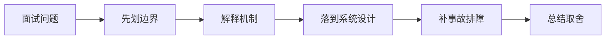

# Session、JWT、Refresh Token 和 OAuth2 登录如何做取舍？

## 面试定位

这道题关联 认证授权、Session、JWT 与 OAuth 边界、HTTP 缓存、会话与认证边界，难度 4/5，出现频率 high。面试官真正想看的是：你能否把概念回答升级成架构、数据流、指标、取舍和真实故障处理。
回答主轴可以从「认证授权、Session、JWT 与 OAuth 边界」切入：认证授权题要从身份、权限、Session、Token、JWT、OAuth、刷新、撤销、权限变更和审计展开。

**第一句话建议**
我会先划清边界，再解释运行机制，最后用一个系统设计案例说明数据流、失败模式、指标和取舍。

**不要只答**
- 把 OAuth2 等同登录态
- JWT 永不过期
- Refresh Token 不轮换
- 把权限只放在前端路由

## 30 秒回答

先区分身份认证、授权委托和会话维护：OAuth2/OIDC 用于第三方授权或身份登录，Session/JWT 用于本系统维护登录态和调用凭证。

回答时必须主动补数据流、关键字段、失败模式、指标和取舍，否则很容易停留在背概念。

## 架构与运行机制

### 标准回答骨架

- 先区分身份认证、授权委托和会话维护：OAuth2/OIDC 用于第三方授权或身份登录，Session/JWT 用于本系统维护登录态和调用凭证。
- Session 服务端可撤销、权限变化好控制，适合高风险后台；JWT 扩展性和跨服务校验方便，但撤销、权限更新、泄漏处置和 claims 膨胀更复杂。
- Refresh Token 要长期保存、轮换、防重放和绑定设备/客户端；Access Token 应短时有效，敏感操作还要二次校验权限和用户确认。
- Cookie 模式要配置 HttpOnly、Secure、SameSite 和 CSRF 防护；Bearer Token 模式要防 XSS、日志泄漏和重放，指标看 login_success_rate、token_refresh_fail_rate、revocation_latency 和 permission_denied_count。
- 认证授权题要从身份、权限、Session、Token、JWT、OAuth、刷新、撤销、权限变更和审计展开。
- 认证确认调用者是谁，授权决定调用者能访问什么。
- Session 是服务端保存登录状态并通过 Cookie 引用的机制。
- OAuth 2.0 是授权第三方客户端访问资源的框架。
- 身份状态、权限状态和业务资源归属要分开建模。
- Token 要有过期、刷新、撤销、绑定设备或权限版本的策略。
- 跨站登录回调要校验 state/redirect_uri，避免 CSRF 和开放重定向。
- 所有高风险授权决策要有审计日志和 trace_id。
- Session 服务端可控、易撤销，但依赖存储；JWT 扩展性好，但权限更新和泄露后的撤销更复杂。
- OAuth 是授权框架，不等同于登录协议；实际登录常结合 OpenID Connect。
- Web HTTP 题要讲清缓存控制、ETag、Cookie/Session/Token、CSRF、CORS、认证续期和敏感数据缓存边界。
- HTTP 缓存是浏览器、代理、CDN 和服务端围绕响应复用的协议机制。
- 认证确认用户身份，授权决定用户能访问什么资源。
- 敏感响应默认 private/no-store。
- Cookie 要设置 HttpOnly/Secure/SameSite。
- Token 要有过期和刷新策略。
- CORS 只控制浏览器跨域读取。
- CSRF 防护要结合 SameSite、token 和来源校验。
- Cache-Control、ETag 和 Last-Modified 控制浏览器/CDN 缓存。
- Cookie、Session、Token 各自有安全边界和失效策略。

### 数据流怎么讲

可以按浏览器、CDN、网关/BFF、认证授权、API 契约、缓存、文件传输、实时连接、安全策略和可观测性来讲。数据流通常是浏览器带着 cookie/token 和 trace context 访问 CDN 或 Gateway，网关做认证、限流、CORS/CSRF/权限校验，BFF/API 按 schema 执行业务，响应通过 Cache-Control、CSP、Set-Cookie、错误码和 trace_id 把协议边界暴露清楚。

### 落地实现细节

- Server-side session：集中撤销和权限控制。
- Short-lived access token + refresh token：降低泄露窗口。
- RBAC/ABAC：按角色和属性做授权。
- OAuth authorization code flow：第三方授权常见流程。
- Cookie 登录态要设置 HttpOnly、Secure、SameSite，并考虑 CSRF。
- JWT 中不要放敏感信息，签名不等于加密。
- 权限变更要让旧 session/token 失效或通过 permission_version 拦截。
- 多租户系统每次资源访问都要校验 tenant_id 归属。
- Token 要短期有效、支持 refresh、设备管理、权限版本和泄露吊销。
- 授权要在服务端按资源归属、角色、属性和租户隔离校验，不能只靠前端隐藏按钮。
- 定义 HTTP 缓存策略、会话边界、认证续期、CSRF/CORS 和敏感响应头。
- 为 API 设计 request schema、response schema、error code、idempotency key 和 version。
- 上线后跟踪 cache hit、auth error、api p95、4xx/5xx、idempotency conflict 和 security audit。
- Cache-Control/ETag。
- Session + Redis。
- JWT/opaque token。
- CSRF token。
- CORS allowlist。
- 用户态接口避免 public cache。
- Set-Cookie 配合 HttpOnly/Secure/SameSite。
- 权限变化要使 session/token 失效。
- 登录态响应要设置合适的 Cache-Control 和 SameSite/Secure/HttpOnly。
- CORS 不是权限系统，服务端仍要鉴权。
- 关键接口要有 schema、version、timeout、retry、幂等键和审计字段。

## 可画图

图 1：这类题不要直接背结论，先划清边界，再沿机制、设计、事故和取舍回答。

## 系统设计案例

### Web 登录态与缓存设计

**需求与边界**
- 公共资源可缓存。
- 敏感响应不共享缓存。
- 认证续期和退出可靠。

**架构拆解**
- Browser 缓存静态资源。
- CDN 缓存公共资源。
- API 鉴权 session/token。
- Redis 保存 session。

**数据流**
- 登录写 session。
- 请求带 cookie/token。
- 网关鉴权。
- 响应设置 cache header。

**扩展点与观测指标**
- Session 分片。
- Token 刷新限流。
- 监控 auth_error、cache_hit、csrf_block。

**取舍**
- 缓存提升性能但增加泄漏风险。
- JWT 无状态但撤销复杂。

## 真实问题与排障

真实线上问题一般从 status_code、api_error_rate、auth_error_rate、cors_error_count、csrf_block_count、xss_report_count、cache_hit_rate、cdn_origin_fetch_rate、upload_fail_rate、ws_disconnect_rate、schema_validation_error 和 trace_id 看起。回答时要先判断是浏览器策略、缓存、认证授权、网络、API 契约、实时连接还是后端依赖问题。

**现场排障回答法**
- 先说影响面：成功率、错误率、延迟、积压、成本或质量指标是否异常。
- 按数据流分段定位，不要一上来就改参数或调 prompt。
- 查看最近发布、配置变更、数据分布变化、下游限流和资源水位。
- 先止血再根因：降级、回滚、限流、暂停高风险动作、隔离异常租户或重放失败样本。
- 最后把样本沉淀为 eval/regression case，并补齐监控告警。

**重点指标**
- auth_error_rate
- permission_denied_count
- token_refresh_fail_rate
- session_revoke_count
- oauth_state_mismatch_count
- cache_hit_rate
- csrf_block_count
- cors_error_count
- session_refresh_fail_rate
- security_incident_count

## 多轮追问模拟

### 追问 1：JWT 泄漏后怎么止血？

**回答要点**：如果 JWT 是长有效且完全无状态，止血会很困难。更稳的做法是短 access token、refresh token 轮换、服务端保存 token version/session version、撤销表或黑名单，高风险操作实时查权限。泄漏后要吊销 refresh token、提升用户会话版本、审计异常访问并通知用户。

**考察点**：撤销、短 token

### 追问 2：Refresh Token 轮换为什么重要？

**回答要点**：轮换可以发现重放：每次刷新都会签发新的 refresh token 并作废旧 token，如果旧 token 再次出现，说明可能泄漏或并发异常，需要吊销整个 token family。生产还会绑定设备、客户端、IP 风险信号和 last_seen 信息。

**考察点**：rotation、重放

### 追问 3：OAuth 回调有哪些安全点？

**回答要点**：授权码流程要校验 state 防 CSRF，公共客户端使用 PKCE，redirect_uri 精确匹配，code 短有效且一次性使用。拿到 token 后还要验证 issuer、audience、过期时间和签名，不能只相信前端传来的用户信息。

**考察点**：state、PKCE

### 延伸追问 1：JWT 泄漏后怎么止血？

回答时继续沿着边界、架构、数据流、指标、失败模式和取舍展开。可以落到这些项目证据：可以讲企业后台、开放平台、第三方登录和 Web Agent 代表用户调用工具。；用 token 版本号、撤销表、设备会话、审计日志和异常登录指标表达工程深度。

### 延伸追问 2：Refresh Token 轮换为什么重要？

回答时继续沿着边界、架构、数据流、指标、失败模式和取舍展开。可以落到这些项目证据：可以讲企业后台、开放平台、第三方登录和 Web Agent 代表用户调用工具。；用 token 版本号、撤销表、设备会话、审计日志和异常登录指标表达工程深度。

### 延伸追问 3：OAuth 回调有哪些安全点？

回答时继续沿着边界、架构、数据流、指标、失败模式和取舍展开。可以落到这些项目证据：可以讲企业后台、开放平台、第三方登录和 Web Agent 代表用户调用工具。；用 token 版本号、撤销表、设备会话、审计日志和异常登录指标表达工程深度。

## 项目化回答与取舍

**项目证据怎么挂钩**
- 可以讲企业后台、开放平台、第三方登录和 Web Agent 代表用户调用工具。
- 用 token 版本号、撤销表、设备会话、审计日志和异常登录指标表达工程深度。

**取舍总结**
Web 工程的取舍是用户体验、性能、安全、兼容性、可演进和可观测性之间的平衡。面试追问通常会围绕 HTTP 缓存、Cookie/Session/JWT/OAuth、CORS/CSRF/XSS/CSP、CDN、上传下载、WebSocket/SSE、BFF、API 版本、错误码和 Agent tool schema 展开。

**收尾句**
这类问题最后要回到可验证结果：设计上有什么边界，线上看什么指标，失败后怎么恢复，哪些场景不该用这个方案。这样回答才经得起连续追问。

## 深挖技术细节

- Server-side session：集中撤销和权限控制。
- Short-lived access token + refresh token：降低泄露窗口。
- RBAC/ABAC：按角色和属性做授权。
- OAuth authorization code flow：第三方授权常见流程。
- Cookie 登录态要设置 HttpOnly、Secure、SameSite，并考虑 CSRF。
- JWT 中不要放敏感信息，签名不等于加密。
- 权限变更要让旧 session/token 失效或通过 permission_version 拦截。
- 多租户系统每次资源访问都要校验 tenant_id 归属。
- Token 要短期有效、支持 refresh、设备管理、权限版本和泄露吊销。
- 授权要在服务端按资源归属、角色、属性和租户隔离校验，不能只靠前端隐藏按钮。
- 定义 HTTP 缓存策略、会话边界、认证续期、CSRF/CORS 和敏感响应头。
- 为 API 设计 request schema、response schema、error code、idempotency key 和 version。
- 上线后跟踪 cache hit、auth error、api p95、4xx/5xx、idempotency conflict 和 security audit。
- Cache-Control/ETag。
- Session + Redis。
- JWT/opaque token。
- CSRF token。
- CORS allowlist。
- 用户态接口避免 public cache。
- Set-Cookie 配合 HttpOnly/Secure/SameSite。
- 权限变化要使 session/token 失效。
- 登录态响应要设置合适的 Cache-Control 和 SameSite/Secure/HttpOnly。
- CORS 不是权限系统，服务端仍要鉴权。
- 认证授权题要从身份、权限、Session、Token、JWT、OAuth、刷新、撤销、权限变更和审计展开。

## 边界条件与反例

反例一：如果业务需要强事务一致性，不能只靠缓存、搜索索引或异步读模型承载最终正确性。

反例二：如果没有指标、trace 和回归样例，方案在线上出问题时只能靠猜，不能证明稳定性。

反例三：为了追求低延迟而省略权限、幂等、超时或降级，会把局部性能优化变成系统性风险。

## 深问准备

被追问时优先沿四条线展开：为什么需要这个方案、关键数据结构是什么、失败后如何止血和定位、最终用什么指标证明修复有效。

- 准备一个线上事故：影响面、止血、根因、修复、回归。
- 准备一个系统设计：入口、状态、执行、存储、观测。
- 准备一个取舍：一致性、延迟、吞吐、成本和可维护性。

## 来源与延伸阅读

- [RFC 6749: The OAuth 2.0 Authorization Framework](https://www.rfc-editor.org/rfc/rfc6749)：用于确认官方语义边界、命令行为和工程约束。
- [RFC 9110: HTTP Semantics](https://www.rfc-editor.org/info/rfc9110)：用于确认官方语义边界、命令行为和工程约束。
- [OWASP API Security Project](https://owasp.org/www-project-api-security/)：用于确认官方语义边界、命令行为和工程约束。
- [RFC 9110: HTTP Semantics](https://www.rfc-editor.org/info/rfc9110)：用于确认官方语义边界、命令行为和工程约束。
- [MDN: HTTP caching](https://developer.mozilla.org/en-US/docs/Web/HTTP/Guides/Caching)：用于确认官方语义边界、命令行为和工程约束。
- [OWASP API Security Project](https://owasp.org/www-project-api-security/)：用于确认官方语义边界、命令行为和工程约束。
