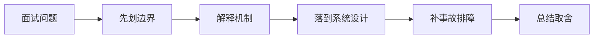

# CORS、CSRF、XSS 分别解决什么问题？为什么不能混在一起讲？

## 面试定位

这道题关联 浏览器安全：CORS、CSRF、XSS 与 CSP、HTTP 缓存、会话与认证边界，难度 4/5，出现频率 high。面试官真正想看的是：你能否把概念回答升级成架构、数据流、指标、取舍和真实故障处理。
回答主轴可以从「浏览器安全：CORS、CSRF、XSS 与 CSP」切入：浏览器安全题要讲清同源策略、CORS 边界、CSRF 成因、XSS 防护、CSP、Cookie 属性和服务端授权。

**第一句话建议**
我会先划清边界，再解释运行机制，最后用一个系统设计案例说明数据流、失败模式、指标和取舍。

**不要只答**
- 把 CORS 当服务端授权
- 只说 SameSite 不讲 token 和 Origin
- 认为 React 默认就不会有 XSS

## 30 秒回答

我会先按威胁模型区分：CORS 是浏览器跨源读取控制，CSRF 是利用用户登录态发起非预期请求，XSS 是攻击者脚本在页面上下文执行。

回答时必须主动补数据流、关键字段、失败模式、指标和取舍，否则很容易停留在背概念。

## 架构与运行机制

### 标准回答骨架

- 我会先按威胁模型区分：CORS 是浏览器跨源读取控制，CSRF 是利用用户登录态发起非预期请求，XSS 是攻击者脚本在页面上下文执行。
- CORS 不能替代鉴权，因为 curl、服务端脚本和移动端不受浏览器 CORS 限制；服务端仍要校验身份、权限、资源归属和审计。
- CSRF 防护要组合 SameSite Cookie、CSRF token、Origin/Referer 校验和危险操作二次确认，不能只靠验证码或前端隐藏按钮。
- XSS 防护要做输出编码、富文本白名单、CSP、HttpOnly Cookie、依赖治理和安全报告，指标看 cors_error_count、csrf_block_count、csp_violation_count 和 xss_report_count。
- 浏览器安全题要讲清同源策略、CORS 边界、CSRF 成因、XSS 防护、CSP、Cookie 属性和服务端授权。
- 同源策略限制脚本读取不同源的响应，是浏览器安全基础。
- CORS 是服务器声明哪些跨域来源可被浏览器读取的机制。
- CSP 是通过响应头限制脚本、样式、图片等资源加载和执行来源的策略。
- 认证授权必须在服务端完成，CORS 只是浏览器读取控制。
- CSRF 防护要保护有副作用请求，尤其是 Cookie 自动认证场景。
- XSS 防护要覆盖输入校验、输出编码、富文本净化、CSP 和依赖治理。
- 安全策略要有 report-only、灰度和误伤监控。
- CORS 控制浏览器是否允许脚本读取跨域响应，不替代服务端认证授权。
- CSRF 利用浏览器自动携带 Cookie 发起跨站请求，XSS 则利用脚本执行窃取数据或发起恶意操作。
- Web HTTP 题要讲清缓存控制、ETag、Cookie/Session/Token、CSRF、CORS、认证续期和敏感数据缓存边界。
- HTTP 缓存是浏览器、代理、CDN 和服务端围绕响应复用的协议机制。
- 认证确认用户身份，授权决定用户能访问什么资源。
- 敏感响应默认 private/no-store。
- Cookie 要设置 HttpOnly/Secure/SameSite。
- Token 要有过期和刷新策略。
- CORS 只控制浏览器跨域读取。
- CSRF 防护要结合 SameSite、token 和来源校验。
- Cache-Control、ETag 和 Last-Modified 控制浏览器/CDN 缓存。
- Cookie、Session、Token 各自有安全边界和失效策略。

### 数据流怎么讲

可以按浏览器、CDN、网关/BFF、认证授权、API 契约、缓存、文件传输、实时连接、安全策略和可观测性来讲。数据流通常是浏览器带着 cookie/token 和 trace context 访问 CDN 或 Gateway，网关做认证、限流、CORS/CSRF/权限校验，BFF/API 按 schema 执行业务，响应通过 Cache-Control、CSP、Set-Cookie、错误码和 trace_id 把协议边界暴露清楚。

### 落地实现细节

- CORS allowlist：限制可信 origin、method 和 header。
- SameSite Cookie：降低跨站自动带 Cookie 风险。
- CSRF token：为写操作增加不可预测校验值。
- CSP report-uri/report-to：发现潜在 XSS 和资源违规。
- Access-Control-Allow-Origin 不能在 credentials=true 时使用 `*`。
- 预检 OPTIONS 失败可能来自方法、header、凭证或网关未透传。
- 富文本渲染要做 HTML sanitizer，不能只相信后端已过滤。
- Agent 浏览器自动化要隔离登录态和工具权限，避免跨站脚本影响高权限操作。
- CORS 要使用明确 allowlist，不能在带凭证请求里使用泛化来源。
- 高风险写操作要结合 SameSite、CSRF token、Origin/Referer 校验和服务端权限校验。
- 定义 HTTP 缓存策略、会话边界、认证续期、CSRF/CORS 和敏感响应头。
- 为 API 设计 request schema、response schema、error code、idempotency key 和 version。
- 上线后跟踪 cache hit、auth error、api p95、4xx/5xx、idempotency conflict 和 security audit。
- Cache-Control/ETag。
- Session + Redis。
- JWT/opaque token。
- CSRF token。
- CORS allowlist。
- 用户态接口避免 public cache。
- Set-Cookie 配合 HttpOnly/Secure/SameSite。
- 权限变化要使 session/token 失效。
- 登录态响应要设置合适的 Cache-Control 和 SameSite/Secure/HttpOnly。
- CORS 不是权限系统，服务端仍要鉴权。
- 关键接口要有 schema、version、timeout、retry、幂等键和审计字段。

## 可画图

图 1：这类题不要直接背结论，先划清边界，再沿机制、设计、事故和取舍回答。

## 系统设计案例

### Web 登录态与缓存设计

**需求与边界**
- 公共资源可缓存。
- 敏感响应不共享缓存。
- 认证续期和退出可靠。

**架构拆解**
- Browser 缓存静态资源。
- CDN 缓存公共资源。
- API 鉴权 session/token。
- Redis 保存 session。

**数据流**
- 登录写 session。
- 请求带 cookie/token。
- 网关鉴权。
- 响应设置 cache header。

**扩展点与观测指标**
- Session 分片。
- Token 刷新限流。
- 监控 auth_error、cache_hit、csrf_block。

**取舍**
- 缓存提升性能但增加泄漏风险。
- JWT 无状态但撤销复杂。

## 真实问题与排障

真实线上问题一般从 status_code、api_error_rate、auth_error_rate、cors_error_count、csrf_block_count、xss_report_count、cache_hit_rate、cdn_origin_fetch_rate、upload_fail_rate、ws_disconnect_rate、schema_validation_error 和 trace_id 看起。回答时要先判断是浏览器策略、缓存、认证授权、网络、API 契约、实时连接还是后端依赖问题。

**现场排障回答法**
- 先说影响面：成功率、错误率、延迟、积压、成本或质量指标是否异常。
- 按数据流分段定位，不要一上来就改参数或调 prompt。
- 查看最近发布、配置变更、数据分布变化、下游限流和资源水位。
- 先止血再根因：降级、回滚、限流、暂停高风险动作、隔离异常租户或重放失败样本。
- 最后把样本沉淀为 eval/regression case，并补齐监控告警。

**重点指标**
- cors_error_count
- csrf_block_count
- xss_report_count
- permission_denied_count
- security_incident_count
- cache_hit_rate
- auth_error_rate
- session_refresh_fail_rate

## 多轮追问模拟

### 追问 1：预检请求为什么会失败？

**回答要点**：浏览器在非简单跨源请求前会发 OPTIONS preflight，检查允许的方法、请求头、credentials 和 origin。常见失败是后端没有处理 OPTIONS、Access-Control-Allow-Headers 缺少自定义头、credentials=true 时用了 *、网关没有透传 CORS 头，或 CDN 缓存了错误的跨源响应。

**考察点**：preflight、credentials

### 追问 2：SameSite 能不能完全防 CSRF？

**回答要点**：不能完全依赖。SameSite=Lax 可以挡掉不少跨站携带 Cookie 的场景，但老浏览器、复杂跳转、子域、OAuth 回跳和表单场景仍要谨慎。危险写操作应继续校验 CSRF token、Origin/Referer、用户会话和幂等键。

**考察点**：SameSite、Origin

### 追问 3：CSP 能不能替代输出编码？

**回答要点**：CSP 是纵深防御，不是输出编码的替代。根治 XSS 仍要按 HTML、属性、URL、JS、CSS 上下文做正确编码，富文本走白名单 sanitizer；CSP 可以限制脚本来源、禁用 inline script、上报违规，并降低绕过后的爆炸半径。

**考察点**：输出编码、CSP

### 延伸追问 1：预检请求为什么会失败？

回答时继续沿着边界、架构、数据流、指标、失败模式和取舍展开。可以落到这些项目证据：可以讲管理后台、RAG 文档权限页、Web Agent 控制台的安全边界。；用 CORS allowlist、CSRF 拦截日志、CSP report-only 灰度和安全回归用例作为证据。

### 延伸追问 2：SameSite 能不能完全防 CSRF？

回答时继续沿着边界、架构、数据流、指标、失败模式和取舍展开。可以落到这些项目证据：可以讲管理后台、RAG 文档权限页、Web Agent 控制台的安全边界。；用 CORS allowlist、CSRF 拦截日志、CSP report-only 灰度和安全回归用例作为证据。

### 延伸追问 3：CSP 能不能替代输出编码？

回答时继续沿着边界、架构、数据流、指标、失败模式和取舍展开。可以落到这些项目证据：可以讲管理后台、RAG 文档权限页、Web Agent 控制台的安全边界。；用 CORS allowlist、CSRF 拦截日志、CSP report-only 灰度和安全回归用例作为证据。

## 项目化回答与取舍

**项目证据怎么挂钩**
- 可以讲管理后台、RAG 文档权限页、Web Agent 控制台的安全边界。
- 用 CORS allowlist、CSRF 拦截日志、CSP report-only 灰度和安全回归用例作为证据。

**取舍总结**
Web 工程的取舍是用户体验、性能、安全、兼容性、可演进和可观测性之间的平衡。面试追问通常会围绕 HTTP 缓存、Cookie/Session/JWT/OAuth、CORS/CSRF/XSS/CSP、CDN、上传下载、WebSocket/SSE、BFF、API 版本、错误码和 Agent tool schema 展开。

**收尾句**
这类问题最后要回到可验证结果：设计上有什么边界，线上看什么指标，失败后怎么恢复，哪些场景不该用这个方案。这样回答才经得起连续追问。

## 深挖技术细节

- CORS allowlist：限制可信 origin、method 和 header。
- SameSite Cookie：降低跨站自动带 Cookie 风险。
- CSRF token：为写操作增加不可预测校验值。
- CSP report-uri/report-to：发现潜在 XSS 和资源违规。
- Access-Control-Allow-Origin 不能在 credentials=true 时使用 `*`。
- 预检 OPTIONS 失败可能来自方法、header、凭证或网关未透传。
- 富文本渲染要做 HTML sanitizer，不能只相信后端已过滤。
- Agent 浏览器自动化要隔离登录态和工具权限，避免跨站脚本影响高权限操作。
- CORS 要使用明确 allowlist，不能在带凭证请求里使用泛化来源。
- 高风险写操作要结合 SameSite、CSRF token、Origin/Referer 校验和服务端权限校验。
- 定义 HTTP 缓存策略、会话边界、认证续期、CSRF/CORS 和敏感响应头。
- 为 API 设计 request schema、response schema、error code、idempotency key 和 version。
- 上线后跟踪 cache hit、auth error、api p95、4xx/5xx、idempotency conflict 和 security audit。
- Cache-Control/ETag。
- Session + Redis。
- JWT/opaque token。
- CSRF token。
- CORS allowlist。
- 用户态接口避免 public cache。
- Set-Cookie 配合 HttpOnly/Secure/SameSite。
- 权限变化要使 session/token 失效。
- 登录态响应要设置合适的 Cache-Control 和 SameSite/Secure/HttpOnly。
- CORS 不是权限系统，服务端仍要鉴权。
- 浏览器安全题要讲清同源策略、CORS 边界、CSRF 成因、XSS 防护、CSP、Cookie 属性和服务端授权。

## 边界条件与反例

反例一：如果业务需要强事务一致性，不能只靠缓存、搜索索引或异步读模型承载最终正确性。

反例二：如果没有指标、trace 和回归样例，方案在线上出问题时只能靠猜，不能证明稳定性。

反例三：为了追求低延迟而省略权限、幂等、超时或降级，会把局部性能优化变成系统性风险。

## 深问准备

被追问时优先沿四条线展开：为什么需要这个方案、关键数据结构是什么、失败后如何止血和定位、最终用什么指标证明修复有效。

- 准备一个线上事故：影响面、止血、根因、修复、回归。
- 准备一个系统设计：入口、状态、执行、存储、观测。
- 准备一个取舍：一致性、延迟、吞吐、成本和可维护性。

## 来源与延伸阅读

- [MDN: Cross-Origin Resource Sharing](https://developer.mozilla.org/en-US/docs/Web/HTTP/Guides/CORS)：用于确认官方语义边界、命令行为和工程约束。
- [MDN: Content Security Policy](https://developer.mozilla.org/en-US/docs/Web/HTTP/Guides/CSP)：用于确认官方语义边界、命令行为和工程约束。
- [OWASP API Security Project](https://owasp.org/www-project-api-security/)：用于确认官方语义边界、命令行为和工程约束。
- [RFC 9110: HTTP Semantics](https://www.rfc-editor.org/info/rfc9110)：用于确认官方语义边界、命令行为和工程约束。
- [MDN: HTTP caching](https://developer.mozilla.org/en-US/docs/Web/HTTP/Guides/Caching)：用于确认官方语义边界、命令行为和工程约束。
- [OWASP API Security Project](https://owasp.org/www-project-api-security/)：用于确认官方语义边界、命令行为和工程约束。
