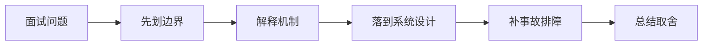

# 如何设计 CDN 缓存、文件上传下载和签名 URL？

## 面试定位

这道题关联 CDN 缓存、上传下载与签名 URL、HTTP 缓存、会话与认证边界，难度 4/5，出现频率 high。面试官真正想看的是：你能否把概念回答升级成架构、数据流、指标、取舍和真实故障处理。
回答主轴可以从「CDN 缓存、上传下载与签名 URL」切入：CDN 和文件传输题要从 Cache-Control、ETag、CDN 回源、签名 URL、分片上传、断点续传、权限和病毒/内容校验展开。

**第一句话建议**
我会先划清边界，再解释运行机制，最后用一个系统设计案例说明数据流、失败模式、指标和取舍。

**不要只答**
- 私有文件用 public cache
- 后端同步转发大文件拖垮线程池
- 只校验扩展名不校验 MIME/hash
- 签名 URL 有效期过长

## 30 秒回答

先区分静态公共资源、用户私有文件和动态接口：公共资源适合 CDN 长缓存和内容 hash，用户私有文件要鉴权、短期签名 URL 和防缓存泄漏。

回答时必须主动补数据流、关键字段、失败模式、指标和取舍，否则很容易停留在背概念。

## 架构与运行机制

### 标准回答骨架

- 先区分静态公共资源、用户私有文件和动态接口：公共资源适合 CDN 长缓存和内容 hash，用户私有文件要鉴权、短期签名 URL 和防缓存泄漏。
- 上传链路通常走前端直传对象存储或分片上传，后端只签发上传凭证、校验权限、记录 object key、校验大小/类型/hash，并通过回调或异步任务做扫描和状态确认。
- 下载链路要按用户权限生成短有效签名 URL，控制 Content-Disposition、Content-Type、Range、限速和审计；大文件支持断点续传和 CDN 回源保护。
- 缓存治理要关注 Cache-Control、ETag、Vary、stale-while-revalidate、purge、回源率和缓存穿透，指标看 cdn_hit_rate、origin_fetch_rate、upload_fail_rate、download_403_rate 和 object_scan_fail_count。
- CDN 和文件传输题要从 Cache-Control、ETag、CDN 回源、签名 URL、分片上传、断点续传、权限和病毒/内容校验展开。
- CDN 通过边缘节点缓存和分发内容，降低源站压力和用户延迟。
- 签名 URL 是把资源、权限、过期时间和签名绑定到临时访问链接。
- 断点续传是通过 Range 或分片状态恢复部分传输。
- 公共静态资源和私有用户文件要走不同缓存策略。
- 上传和下载都是有副作用和安全风险的 API，需要权限、限流和审计。
- 文件完整性要用 hash、大小、类型和服务端扫描共同确认。
- 源站回源要有限流和缓存预热，避免 CDN 失效打爆源站。
- CDN 适合静态和公共资源加速，用户私有文件要通过签名 URL、权限校验和短期有效期控制。
- 大文件上传下载要处理分片、断点续传、幂等、校验、限速、回源保护和存储生命周期。
- Web HTTP 题要讲清缓存控制、ETag、Cookie/Session/Token、CSRF、CORS、认证续期和敏感数据缓存边界。
- HTTP 缓存是浏览器、代理、CDN 和服务端围绕响应复用的协议机制。
- 认证确认用户身份，授权决定用户能访问什么资源。
- 敏感响应默认 private/no-store。
- Cookie 要设置 HttpOnly/Secure/SameSite。
- Token 要有过期和刷新策略。
- CORS 只控制浏览器跨域读取。
- CSRF 防护要结合 SameSite、token 和来源校验。
- Cache-Control、ETag 和 Last-Modified 控制浏览器/CDN 缓存。
- Cookie、Session、Token 各自有安全边界和失效策略。

### 数据流怎么讲

可以按浏览器、CDN、网关/BFF、认证授权、API 契约、缓存、文件传输、实时连接、安全策略和可观测性来讲。数据流通常是浏览器带着 cookie/token 和 trace context 访问 CDN 或 Gateway，网关做认证、限流、CORS/CSRF/权限校验，BFF/API 按 schema 执行业务，响应通过 Cache-Control、CSP、Set-Cookie、错误码和 trace_id 把协议边界暴露清楚。

### 落地实现细节

- Cache-Control + ETag：控制缓存和条件请求。
- Signed URL / signed cookie：临时授权访问私有文件。
- Multipart upload：大文件分片上传和断点恢复。
- Range request：支持断点下载和视频拖拽。
- Content-Disposition 要避免文件名注入和错误 MIME sniffing。
- 上传状态机要记录 uploading、uploaded、scanning、available、rejected。
- 文件扫描和转码应异步化，用户侧显示处理中状态。
- CDN purge 要按版本化 URL 或 hash 资源名设计，避免全站刷新。
- 上传要校验文件大小、类型、hash、权限、配额和内容安全，不能只相信前端。
- 下载要支持 Range、限速、签名过期、审计和防盗链，避免对象存储被刷爆。
- 定义 HTTP 缓存策略、会话边界、认证续期、CSRF/CORS 和敏感响应头。
- 为 API 设计 request schema、response schema、error code、idempotency key 和 version。
- 上线后跟踪 cache hit、auth error、api p95、4xx/5xx、idempotency conflict 和 security audit。
- Cache-Control/ETag。
- Session + Redis。
- JWT/opaque token。
- CSRF token。
- CORS allowlist。
- 用户态接口避免 public cache。
- Set-Cookie 配合 HttpOnly/Secure/SameSite。
- 权限变化要使 session/token 失效。
- 登录态响应要设置合适的 Cache-Control 和 SameSite/Secure/HttpOnly。
- CORS 不是权限系统，服务端仍要鉴权。
- 关键接口要有 schema、version、timeout、retry、幂等键和审计字段。

## 可画图

图 1：这类题不要直接背结论，先划清边界，再沿机制、设计、事故和取舍回答。

## 系统设计案例

### Web 登录态与缓存设计

**需求与边界**
- 公共资源可缓存。
- 敏感响应不共享缓存。
- 认证续期和退出可靠。

**架构拆解**
- Browser 缓存静态资源。
- CDN 缓存公共资源。
- API 鉴权 session/token。
- Redis 保存 session。

**数据流**
- 登录写 session。
- 请求带 cookie/token。
- 网关鉴权。
- 响应设置 cache header。

**扩展点与观测指标**
- Session 分片。
- Token 刷新限流。
- 监控 auth_error、cache_hit、csrf_block。

**取舍**
- 缓存提升性能但增加泄漏风险。
- JWT 无状态但撤销复杂。

## 真实问题与排障

真实线上问题一般从 status_code、api_error_rate、auth_error_rate、cors_error_count、csrf_block_count、xss_report_count、cache_hit_rate、cdn_origin_fetch_rate、upload_fail_rate、ws_disconnect_rate、schema_validation_error 和 trace_id 看起。回答时要先判断是浏览器策略、缓存、认证授权、网络、API 契约、实时连接还是后端依赖问题。

**现场排障回答法**
- 先说影响面：成功率、错误率、延迟、积压、成本或质量指标是否异常。
- 按数据流分段定位，不要一上来就改参数或调 prompt。
- 查看最近发布、配置变更、数据分布变化、下游限流和资源水位。
- 先止血再根因：降级、回滚、限流、暂停高风险动作、隔离异常租户或重放失败样本。
- 最后把样本沉淀为 eval/regression case，并补齐监控告警。

**重点指标**
- cdn_cache_hit_rate
- origin_fetch_rate
- upload_fail_rate
- download_403_count
- file_scan_reject_count
- cache_hit_rate
- auth_error_rate
- csrf_block_count
- cors_error_count
- session_refresh_fail_rate
- security_incident_count

## 多轮追问模拟

### 追问 1：为什么不让后端服务直接转发大文件？

**回答要点**：大文件转发会占用后端连接、线程、内存、带宽和超时时间，放大应用服务的资源压力。更常见做法是后端只做鉴权和签名，浏览器直传或直下对象存储/CDN，应用侧通过回调、轮询或事件确认状态。

**考察点**：直传、资源隔离

### 追问 2：签名 URL 怎么防盗链？

**回答要点**：签名 URL 要短有效期、绑定 object key、方法、过期时间、可选 IP/用户/响应头，并且私有资源默认不公开。下载前仍由业务后端校验用户权限和资源归属，签发过程写审计；泄漏时可以吊销对象版本或提升签名密钥版本。

**考察点**：短有效期、资源归属

### 追问 3：CDN 缓存错了怎么回滚？

**回答要点**：静态资源用内容 hash，发布错误时回滚引用即可；动态或半动态资源要有准确 Cache-Control、Vary 和 purge 能力。发生敏感数据缓存泄漏时要立即 purge、禁用相关 cache key、查访问日志和影响范围，并修复鉴权与缓存策略。

**考察点**：purge、Vary

### 延伸追问 1：为什么不让后端服务直接转发大文件？

回答时继续沿着边界、架构、数据流、指标、失败模式和取舍展开。可以落到这些项目证据：可以讲头像/附件/报告导出、私有 RAG 文档下载、模型产物分发。；把对象存储、CDN、签名 URL、权限校验、异步扫描和审计日志串成完整链路。

### 延伸追问 2：签名 URL 怎么防盗链？

回答时继续沿着边界、架构、数据流、指标、失败模式和取舍展开。可以落到这些项目证据：可以讲头像/附件/报告导出、私有 RAG 文档下载、模型产物分发。；把对象存储、CDN、签名 URL、权限校验、异步扫描和审计日志串成完整链路。

### 延伸追问 3：CDN 缓存错了怎么回滚？

回答时继续沿着边界、架构、数据流、指标、失败模式和取舍展开。可以落到这些项目证据：可以讲头像/附件/报告导出、私有 RAG 文档下载、模型产物分发。；把对象存储、CDN、签名 URL、权限校验、异步扫描和审计日志串成完整链路。

## 项目化回答与取舍

**项目证据怎么挂钩**
- 可以讲头像/附件/报告导出、私有 RAG 文档下载、模型产物分发。
- 把对象存储、CDN、签名 URL、权限校验、异步扫描和审计日志串成完整链路。

**取舍总结**
Web 工程的取舍是用户体验、性能、安全、兼容性、可演进和可观测性之间的平衡。面试追问通常会围绕 HTTP 缓存、Cookie/Session/JWT/OAuth、CORS/CSRF/XSS/CSP、CDN、上传下载、WebSocket/SSE、BFF、API 版本、错误码和 Agent tool schema 展开。

**收尾句**
这类问题最后要回到可验证结果：设计上有什么边界，线上看什么指标，失败后怎么恢复，哪些场景不该用这个方案。这样回答才经得起连续追问。

## 深挖技术细节

- Cache-Control + ETag：控制缓存和条件请求。
- Signed URL / signed cookie：临时授权访问私有文件。
- Multipart upload：大文件分片上传和断点恢复。
- Range request：支持断点下载和视频拖拽。
- Content-Disposition 要避免文件名注入和错误 MIME sniffing。
- 上传状态机要记录 uploading、uploaded、scanning、available、rejected。
- 文件扫描和转码应异步化，用户侧显示处理中状态。
- CDN purge 要按版本化 URL 或 hash 资源名设计，避免全站刷新。
- 上传要校验文件大小、类型、hash、权限、配额和内容安全，不能只相信前端。
- 下载要支持 Range、限速、签名过期、审计和防盗链，避免对象存储被刷爆。
- 定义 HTTP 缓存策略、会话边界、认证续期、CSRF/CORS 和敏感响应头。
- 为 API 设计 request schema、response schema、error code、idempotency key 和 version。
- 上线后跟踪 cache hit、auth error、api p95、4xx/5xx、idempotency conflict 和 security audit。
- Cache-Control/ETag。
- Session + Redis。
- JWT/opaque token。
- CSRF token。
- CORS allowlist。
- 用户态接口避免 public cache。
- Set-Cookie 配合 HttpOnly/Secure/SameSite。
- 权限变化要使 session/token 失效。
- 登录态响应要设置合适的 Cache-Control 和 SameSite/Secure/HttpOnly。
- CORS 不是权限系统，服务端仍要鉴权。
- CDN 和文件传输题要从 Cache-Control、ETag、CDN 回源、签名 URL、分片上传、断点续传、权限和病毒/内容校验展开。

## 边界条件与反例

反例一：如果业务需要强事务一致性，不能只靠缓存、搜索索引或异步读模型承载最终正确性。

反例二：如果没有指标、trace 和回归样例，方案在线上出问题时只能靠猜，不能证明稳定性。

反例三：为了追求低延迟而省略权限、幂等、超时或降级，会把局部性能优化变成系统性风险。

## 深问准备

被追问时优先沿四条线展开：为什么需要这个方案、关键数据结构是什么、失败后如何止血和定位、最终用什么指标证明修复有效。

- 准备一个线上事故：影响面、止血、根因、修复、回归。
- 准备一个系统设计：入口、状态、执行、存储、观测。
- 准备一个取舍：一致性、延迟、吞吐、成本和可维护性。

## 来源与延伸阅读

- [MDN: HTTP caching](https://developer.mozilla.org/en-US/docs/Web/HTTP/Guides/Caching)：用于确认官方语义边界、命令行为和工程约束。
- [RFC 9110: HTTP Semantics](https://www.rfc-editor.org/info/rfc9110)：用于确认官方语义边界、命令行为和工程约束。
- [OWASP API Security Project](https://owasp.org/www-project-api-security/)：用于确认官方语义边界、命令行为和工程约束。
- [RFC 9110: HTTP Semantics](https://www.rfc-editor.org/info/rfc9110)：用于确认官方语义边界、命令行为和工程约束。
- [MDN: HTTP caching](https://developer.mozilla.org/en-US/docs/Web/HTTP/Guides/Caching)：用于确认官方语义边界、命令行为和工程约束。
- [OWASP API Security Project](https://owasp.org/www-project-api-security/)：用于确认官方语义边界、命令行为和工程约束。
