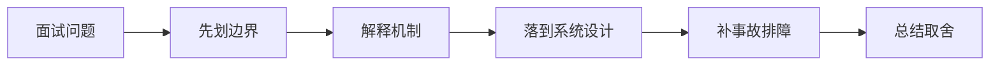

# 前后端契约和可观测性如何一起设计，才能快速定位线上问题？

## 面试定位

这道题关联 前后端契约、错误码与端到端可观测性、API 契约、幂等与安全治理，难度 4/5，出现频率 high。面试官真正想看的是：你能否把概念回答升级成架构、数据流、指标、取舍和真实故障处理。
回答主轴可以从「前后端契约、错误码与端到端可观测性」切入：前后端协作题要从 schema、错误码、空态、分页、兼容、契约测试、trace_id、前端埋点和用户可见问题定位展开。

**第一句话建议**
我会先划清边界，再解释运行机制，最后用一个系统设计案例说明数据流、失败模式、指标和取舍。

**不要只答**
- 前端根据中文 message 分支
- 后端错误码不可行动
- 没有 trace 贯通
- 只测 happy path

## 30 秒回答

契约层要明确 request/response schema、错误码、字段兼容、分页排序、权限、幂等和 trace_id；前端不能靠猜字段和字符串 message 写业务判断。

回答时必须主动补数据流、关键字段、失败模式、指标和取舍，否则很容易停留在背概念。

## 架构与运行机制

### 标准回答骨架

- 契约层要明确 request/response schema、错误码、字段兼容、分页排序、权限、幂等和 trace_id；前端不能靠猜字段和字符串 message 写业务判断。
- 可观测性要从浏览器到网关、BFF、后端服务和下游依赖贯通 request_id/traceparent，把前端 route、api name、status、duration、user action、错误码和后端 span 关联起来。
- 错误响应要可行动：code、message、retryable、request_id、details、docs_link 或 next_action，让客服、前端和后端看到同一个事实。
- 发布治理要有契约测试、mock、schema validation、灰度、前端埋点和回滚；指标看 frontend_error_rate、api_p95、schema_validation_error、unknown_error_code、trace_join_rate 和 user_impact_count。
- 前后端协作题要从 schema、错误码、空态、分页、兼容、契约测试、trace_id、前端埋点和用户可见问题定位展开。
- 前后端契约是前端和后端对数据、行为、错误、权限和兼容性的稳定约定。
- 错误码是机器和人都能理解的失败分类，用于决定重试、提示、降级或联系支持。
- 端到端可观测是从用户动作到后端依赖的完整证据链。
- 契约要以 schema 和测试固化，而不是靠文档和口头同步。
- 错误码要稳定、可行动，并区分用户错误、权限错误、系统错误和可重试错误。
- 前端埋点要能和后端 trace 关联，定位用户可见失败。
- 空态、加载态、部分失败和权限不可见都要在契约里定义。
- 前后端契约不仅是字段列表，还包括状态码、错误码、分页、排序、空态、权限、幂等和兼容策略。
- 端到端可观测要把前端 route、用户动作、request_id、trace_id、后端日志和业务结果串起来。
- API 设计题要讲清 request/response schema、版本、错误码、幂等键、权限、限流、安全审计和可观测性。
- API 契约是客户端和服务端对请求、响应、错误、版本和行为边界的稳定约定。
- API 安全治理是对认证、授权、输入、幂等、限流、审计和数据暴露的系统控制。
- Schema 要稳定可演进。
- 错误码要可行动。
- 写请求要幂等。
- 权限必须服务端校验。
- 高风险操作要审计和二次确认。
- API 契约包括字段、状态码、错误码、分页、排序、幂等和兼容策略。
- 安全治理要覆盖认证、授权、输入校验、限流和审计。

### 数据流怎么讲

可以按浏览器、CDN、网关/BFF、认证授权、API 契约、缓存、文件传输、实时连接、安全策略和可观测性来讲。数据流通常是浏览器带着 cookie/token 和 trace context 访问 CDN 或 Gateway，网关做认证、限流、CORS/CSRF/权限校验，BFF/API 按 schema 执行业务，响应通过 Cache-Control、CSP、Set-Cookie、错误码和 trace_id 把协议边界暴露清楚。

### 落地实现细节

- OpenAPI / JSON Schema：描述和校验 API 契约。
- Contract tests：消费者和提供者共同验证兼容性。
- Frontend RUM：采集页面性能、错误和用户动作。
- Trace correlation：前端 request_id/traceparent 贯穿后端。
- 分页契约要定义 cursor、limit、排序稳定性和 has_more。
- 部分失败要支持 partial data + warnings，而不是整体 500。
- 前端上报要脱敏，避免把用户输入和 token 直接发送到日志平台。
- Agent run 页面要把 run_id、step_id、tool_call_id 和 trace_id 串起来。
- 错误响应要有 code、message、retryable、request_id、details 和文档链接，避免前端猜错误。
- 契约测试和 mock 数据要从真实 schema 生成，避免前后端各写一套假接口。
- 定义 HTTP 缓存策略、会话边界、认证续期、CSRF/CORS 和敏感响应头。
- 为 API 设计 request schema、response schema、error code、idempotency key 和 version。
- 上线后跟踪 cache hit、auth error、api p95、4xx/5xx、idempotency conflict 和 security audit。
- OpenAPI/JSON Schema。
- Idempotency-Key。
- Rate limit。
- RBAC/ABAC。
- Audit log。
- 错误响应包含 code、message、retryable、request_id。
- 幂等记录保存 request_hash 和 result。
- 高风险 API 要有审批和审计。
- 字段新增要向后兼容，删除要灰度。
- 写接口支持 Idempotency-Key 和 request_id。
- 关键接口要有 schema、version、timeout、retry、幂等键和审计字段。

## 可画图

图 1：这类题不要直接背结论，先划清边界，再沿机制、设计、事故和取舍回答。

## 系统设计案例

### API 契约治理平台

**需求与边界**
- 契约可版本化。
- 写接口幂等。
- 安全与审计可观测。

**架构拆解**
- Schema Registry。
- Gateway 校验和限流。
- Authz Service。
- Audit Store。

**数据流**
- 请求校验 schema。
- 鉴权授权。
- 检查幂等键。
- 执行业务并审计。

**扩展点与观测指标**
- 按租户限流。
- schema 兼容检查。
- 监控 validation_error、rate_limited、permission_denied。

**取舍**
- 强契约降低灵活性但提升稳定性。
- 审计越细成本越高。

## 真实问题与排障

真实线上问题一般从 status_code、api_error_rate、auth_error_rate、cors_error_count、csrf_block_count、xss_report_count、cache_hit_rate、cdn_origin_fetch_rate、upload_fail_rate、ws_disconnect_rate、schema_validation_error 和 trace_id 看起。回答时要先判断是浏览器策略、缓存、认证授权、网络、API 契约、实时连接还是后端依赖问题。

**现场排障回答法**
- 先说影响面：成功率、错误率、延迟、积压、成本或质量指标是否异常。
- 按数据流分段定位，不要一上来就改参数或调 prompt。
- 查看最近发布、配置变更、数据分布变化、下游限流和资源水位。
- 先止血再根因：降级、回滚、限流、暂停高风险动作、隔离异常租户或重放失败样本。
- 最后把样本沉淀为 eval/regression case，并补齐监控告警。

**重点指标**
- frontend_error_rate
- api_error_rate
- schema_validation_error
- trace_join_rate
- empty_state_rate
- idempotency_conflict_count
- permission_denied_count
- rate_limited_count

## 多轮追问模拟

### 追问 1：前端怎么把错误报给后端定位？

**回答要点**：前端错误事件要带 route、api name、status、error_code、request_id/trace_id、duration、用户动作和浏览器环境，但不要带敏感字段。后端用 trace_id 串起网关、BFF、服务和依赖 span，再结合日志与指标定位是契约、权限、超时、限流还是下游故障。

**考察点**：trace_id、错误事件

### 追问 2：契约测试测什么？

**回答要点**：契约测试不只是接口能 200，而是 schema、必填字段、枚举、错误码、分页、排序、权限失败、幂等冲突、兼容字段和 deprecated 字段。前端 consumer contract 可以防后端删除字段或改变语义，后端 provider test 可以防实现偏离 OpenAPI/JSON Schema。

**考察点**：schema、兼容

### 追问 3：trace_id 暴露给用户有没有风险？

**回答要点**：trace_id 通常可以作为客服定位码展示，但要确保它本身不包含用户 ID、租户、资源路径或敏感信息。日志查询端仍要权限控制；用户拿到 trace_id 不应该能直接访问内部日志。高风险系统可以展示短定位码并在服务端映射真实 trace。

**考察点**：定位码、敏感信息

### 延伸追问 1：前端怎么把错误报给后端定位？

回答时继续沿着边界、架构、数据流、指标、失败模式和取舍展开。可以落到这些项目证据：可以讲管理后台表单、Agent 控制台工具执行、RAG 文档权限错误。；强调 trace_id、错误码、schema validation 和用户影响面统计，比只看控制台报错更专业。

### 延伸追问 2：契约测试测什么？

回答时继续沿着边界、架构、数据流、指标、失败模式和取舍展开。可以落到这些项目证据：可以讲管理后台表单、Agent 控制台工具执行、RAG 文档权限错误。；强调 trace_id、错误码、schema validation 和用户影响面统计，比只看控制台报错更专业。

### 延伸追问 3：trace_id 暴露给用户有没有风险？

回答时继续沿着边界、架构、数据流、指标、失败模式和取舍展开。可以落到这些项目证据：可以讲管理后台表单、Agent 控制台工具执行、RAG 文档权限错误。；强调 trace_id、错误码、schema validation 和用户影响面统计，比只看控制台报错更专业。

## 项目化回答与取舍

**项目证据怎么挂钩**
- 可以讲管理后台表单、Agent 控制台工具执行、RAG 文档权限错误。
- 强调 trace_id、错误码、schema validation 和用户影响面统计，比只看控制台报错更专业。

**取舍总结**
Web 工程的取舍是用户体验、性能、安全、兼容性、可演进和可观测性之间的平衡。面试追问通常会围绕 HTTP 缓存、Cookie/Session/JWT/OAuth、CORS/CSRF/XSS/CSP、CDN、上传下载、WebSocket/SSE、BFF、API 版本、错误码和 Agent tool schema 展开。

**收尾句**
这类问题最后要回到可验证结果：设计上有什么边界，线上看什么指标，失败后怎么恢复，哪些场景不该用这个方案。这样回答才经得起连续追问。

## 深挖技术细节

- OpenAPI / JSON Schema：描述和校验 API 契约。
- Contract tests：消费者和提供者共同验证兼容性。
- Frontend RUM：采集页面性能、错误和用户动作。
- Trace correlation：前端 request_id/traceparent 贯穿后端。
- 分页契约要定义 cursor、limit、排序稳定性和 has_more。
- 部分失败要支持 partial data + warnings，而不是整体 500。
- 前端上报要脱敏，避免把用户输入和 token 直接发送到日志平台。
- Agent run 页面要把 run_id、step_id、tool_call_id 和 trace_id 串起来。
- 错误响应要有 code、message、retryable、request_id、details 和文档链接，避免前端猜错误。
- 契约测试和 mock 数据要从真实 schema 生成，避免前后端各写一套假接口。
- 定义 HTTP 缓存策略、会话边界、认证续期、CSRF/CORS 和敏感响应头。
- 为 API 设计 request schema、response schema、error code、idempotency key 和 version。
- 上线后跟踪 cache hit、auth error、api p95、4xx/5xx、idempotency conflict 和 security audit。
- OpenAPI/JSON Schema。
- Idempotency-Key。
- Rate limit。
- RBAC/ABAC。
- Audit log。
- 错误响应包含 code、message、retryable、request_id。
- 幂等记录保存 request_hash 和 result。
- 高风险 API 要有审批和审计。
- 字段新增要向后兼容，删除要灰度。
- 写接口支持 Idempotency-Key 和 request_id。
- 前后端协作题要从 schema、错误码、空态、分页、兼容、契约测试、trace_id、前端埋点和用户可见问题定位展开。

## 边界条件与反例

反例一：如果业务需要强事务一致性，不能只靠缓存、搜索索引或异步读模型承载最终正确性。

反例二：如果没有指标、trace 和回归样例，方案在线上出问题时只能靠猜，不能证明稳定性。

反例三：为了追求低延迟而省略权限、幂等、超时或降级，会把局部性能优化变成系统性风险。

## 深问准备

被追问时优先沿四条线展开：为什么需要这个方案、关键数据结构是什么、失败后如何止血和定位、最终用什么指标证明修复有效。

- 准备一个线上事故：影响面、止血、根因、修复、回归。
- 准备一个系统设计：入口、状态、执行、存储、观测。
- 准备一个取舍：一致性、延迟、吞吐、成本和可维护性。

## 来源与延伸阅读

- [OWASP API Security Project](https://owasp.org/www-project-api-security/)：用于确认官方语义边界、命令行为和工程约束。
- [OpenTelemetry Documentation](https://opentelemetry.io/docs/)：用于确认官方语义边界、命令行为和工程约束。
- [RFC 9110: HTTP Semantics](https://www.rfc-editor.org/info/rfc9110)：用于确认官方语义边界、命令行为和工程约束。
- [RFC 9110: HTTP Semantics](https://www.rfc-editor.org/info/rfc9110)：用于确认官方语义边界、命令行为和工程约束。
- [OWASP API Security Project](https://owasp.org/www-project-api-security/)：用于确认官方语义边界、命令行为和工程约束。
- [Model Context Protocol](https://modelcontextprotocol.io/)：用于确认官方语义边界、命令行为和工程约束。
