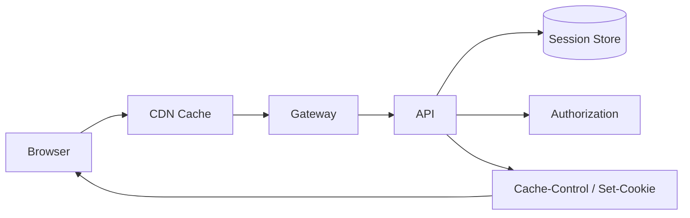

# HTTP 缓存、Cookie/Session/Token 和认证授权边界怎么设计？

## 面试定位

这道题考 Web 安全和缓存边界。回答要区分 HTTP 缓存、Redis 缓存、认证、授权、CORS、CSRF 和会话续期。不能把 CORS 当权限，也不能把敏感用户响应放进共享缓存。

## 30 秒回答

我会先区分公共资源和敏感响应。静态资源可以通过 CDN 长缓存，用户资料、订单、权限接口默认 `private` 或 `no-store`。Cookie 要设置 HttpOnly、Secure、SameSite；Session 服务端可控但依赖存储，Token/JWT 扩展好但撤销和权限变化复杂。

认证确认用户身份，授权决定用户能访问什么资源。CORS 只是浏览器跨域读取控制，不是服务端权限。CSRF 要结合 SameSite、CSRF token、Origin/Referer 校验和高风险操作二次确认。

## 架构与运行机制

图 1 展示 Web 请求数据流：浏览器/CDN 处理缓存，网关/API 做认证授权，Session Store 管登录态，响应头决定缓存和 Cookie 安全属性。

## 深挖技术细节

Cache-Control 要按数据敏感度设置。公共静态资源可 `public, max-age, immutable`；用户态 API 应 `private` 或 `no-store`。ETag 可减少带宽，但权限变化或用户态资源要谨慎。

Cookie 的 HttpOnly 防 JS 读取，Secure 要求 HTTPS，SameSite 降低 CSRF。Session 可以服务端撤销，适合权限变化频繁；JWT 无状态但撤销复杂，通常要短有效期、refresh token、黑名单或 session_version。

CORS 不是鉴权。非浏览器客户端不受 CORS 限制，服务端仍要校验 token、权限和资源归属。

## 关键数据结构与协议

| 字段/头 | 作用 | 风险 |
| --- | --- | --- |
| `Cache-Control` | 缓存策略 | 敏感响应泄漏 |
| `ETag` | 协商缓存 | 权限变化 |
| `Set-Cookie` | 会话 Cookie | 属性缺失 |
| `SameSite` | CSRF 防护 | 兼容问题 |
| `Authorization` | Token | 泄露和撤销 |
| `session_version` | 权限变化 | 失效控制 |

## 系统设计案例

管理后台登录态：静态资源 CDN 长缓存，API 响应 `no-store`，Session 存 Redis，Cookie 设置安全属性，网关鉴权，服务端按资源授权。数据流是 login -> session -> set-cookie -> authn/authz -> response headers。

取舍是：Session 可撤销但依赖 Redis；JWT 扩展好但撤销复杂；缓存提升性能但增加泄漏风险。

## 真实问题与排障

用户看到他人资料时，先查影响面、CDN 规则、Cache-Control、Vary、Authorization、Cookie 和权限日志。止血可以旁路 CDN、清理缓存、设置 no-store、撤销会话。根因定位看缓存 key 是否包含认证状态、服务端是否鉴权。

## 边界条件与反例

反例：敏感接口 public cache；CORS 当鉴权；退出登录只删前端状态；JWT 长期有效不可撤销。

## 项目表达

项目里可以说：我把静态资源和用户态 API 分开缓存，用户态响应默认 no-store，Cookie 配置 HttpOnly/Secure/SameSite，权限变化更新 session_version。指标看 auth_error_rate、csrf_block_count、cors_error_count 和 cache_hit_rate。

如果追问缓存泄漏怎么排查，可以从响应头、CDN cache key、Vary、Authorization、Cookie、用户切换和服务端授权日志查起。止血动作是旁路 CDN、清理缓存、撤销会话和补安全回归用例。

再补一句取舍：Session 更容易撤销和处理权限变化，但需要服务端存储；JWT 更容易水平扩展，但撤销和权限更新更麻烦。高风险后台常用短期 token、服务端版本号和强制失效组合。

如果追问浏览器后退看到旧页面怎么办，可以区分页面缓存和接口数据。敏感页面可设置 no-store，前端路由切换后重新拉取权限，关键操作提交前服务端再次鉴权，不能只依赖页面显示状态。

再补一句：认证是你是谁，授权是你能访问什么，审计是你做过什么。三者都要在服务端成立。

## 多轮追问模拟

1. 追问：`no-store` 和 `private` 有什么区别？
   - 回答要点：`no-store` 表示任何缓存都不应存储请求或响应，适合高敏感用户数据、权限接口、支付和后台管理；`private` 表示响应只允许用户代理等私有缓存存储，不允许共享缓存存储，适合可被浏览器缓存但不能进入 CDN 的用户态数据。敏感响应通常更保守地用 `no-store`。
   - 考察点：是否能按数据敏感度设置缓存头。
   - 常见坑：用户资料接口误设 `public, max-age`，导致共享缓存泄漏。

2. 追问：JWT 和 Session 怎么取舍？
   - 回答要点：Session 服务端存储，撤销和权限变化更直接，但依赖 Redis/DB；JWT 无状态，横向扩展好，但撤销、权限更新和泄露后的控制更复杂。高风险后台常用短有效期 token、refresh token、session_version、黑名单或服务端会话组合，不会只发一个长期 JWT。
   - 考察点：能否把扩展性、撤销性和安全性一起考虑。
   - 常见坑：说 JWT 一定更安全，或者退出登录只删除前端 token。

3. 追问：CORS 为什么不是权限控制？
   - 回答要点：CORS 是浏览器是否允许前端读取跨域响应的策略，非浏览器客户端不受限制；服务端仍要校验认证、授权、资源归属和租户边界。CORS 配错会造成浏览器侧数据暴露风险，但即使配对了，也不能替代后端鉴权。
   - 考察点：是否区分浏览器安全策略和服务端权限边界。
   - 常见坑：看到跨域报错就以为接口安全了。

4. 追问：CSRF 怎么防，SameSite 够不够？
   - 回答要点：SameSite 能降低跨站携带 Cookie 的风险，但要结合 CSRF token、Origin/Referer 校验、高风险操作二次确认和服务端授权；如果业务需要跨站嵌入或第三方登录，还要小心 SameSite=None; Secure 的场景。CSRF 防的是“用户浏览器带着合法 Cookie 被诱导发请求”。
   - 考察点：是否理解 Cookie 登录态下的跨站请求风险。
   - 常见坑：只设 CORS 或只靠前端校验。

## 公开阅读校验

这道题要把几个容易混淆的概念拆开：HTTP 缓存不是 Redis 缓存，CORS 不是鉴权，认证不是授权，JWT 签名不是加密，退出登录不是只删前端状态。一个可靠回答要先按数据敏感度决定缓存策略，再按会话生命周期设计撤销和续期，最后用服务端资源归属校验兜住权限。

项目场景可以讲用户资料或后台权限接口：静态资源走 CDN 长缓存，用户态 API 返回 `no-store`，Cookie 设置 HttpOnly、Secure、SameSite，Session Store 支持踢下线和 `session_version`，JWT 场景使用短有效期、refresh token rotation 和服务端撤销策略。CSRF 防护结合 SameSite、CSRF token、Origin/Referer 和高风险操作二次确认。

排障自测要覆盖缓存串用户、权限降级未生效、JWT 泄露、CORS 误放开、CSRF token 失效和浏览器后退缓存。指标看 `sensitive_cache_bypass_count`、`auth_error_rate`、`session_revoked_count`、`token_refresh_fail_rate`、`csrf_block_count`、`cors_error_count` 和多用户回归用例结果。

## 深问准备

1. no-store 和 private 区别？
2. JWT 和 Session 怎么取舍？
3. CORS 为什么不是安全边界？
4. CSRF 怎么防？
5. 权限变化如何让缓存失效？

## 来源与延伸阅读

- [RFC 9110 HTTP Semantics](https://www.rfc-editor.org/rfc/rfc9110)：用于确认认证、请求方法、状态码和通用 HTTP 语义。
- [RFC 9111 HTTP Caching](https://www.rfc-editor.org/rfc/rfc9111)：用于支撑 `Cache-Control`、共享缓存、私有缓存、`no-store` 和缓存失效语义。
- [MDN HTTP Caching](https://developer.mozilla.org/en-US/docs/Web/HTTP/Guides/Caching)：用于说明浏览器/CDN 缓存行为、协商缓存和缓存头使用方式。
- [MDN Set-Cookie](https://developer.mozilla.org/en-US/docs/Web/HTTP/Headers/Set-Cookie)：用于确认 `HttpOnly`、`Secure`、`SameSite` 等 Cookie 安全属性。
- [OWASP Cross-Site Request Forgery Prevention Cheat Sheet](https://cheatsheetseries.owasp.org/cheatsheets/Cross-Site_Request_Forgery_Prevention_Cheat_Sheet.html)：用于支持 SameSite、CSRF token、Origin/Referer 校验的组合防护。
- [OWASP API Security Top 10](https://owasp.org/API-Security/editions/2023/en/0x00-header/)：用于说明 API 认证、授权和资源访问控制的安全边界。
