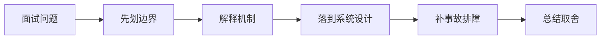

# 文件上传功能有哪些安全和稳定性风险？如何治理？

## 面试定位

这道题关联 CDN 缓存、上传下载与签名 URL、浏览器安全：CORS、CSRF、XSS 与 CSP，难度 4/5，出现频率 medium。面试官真正想看的是：你能否把概念回答升级成架构、数据流、指标、取舍和真实故障处理。
回答主轴可以从「CDN 缓存、上传下载与签名 URL」切入：CDN 和文件传输题要从 Cache-Control、ETag、CDN 回源、签名 URL、分片上传、断点续传、权限和病毒/内容校验展开。

**第一句话建议**
我会先划清边界，再解释运行机制，最后用一个系统设计案例说明数据流、失败模式、指标和取舍。

**不要只答**
- 相信前端 MIME
- 用原始文件名做存储 key
- 扫描前就公开下载
- 解析器和业务服务同权限运行

## 30 秒回答

上传不是简单收文件，要校验身份、权限、大小、数量、MIME、扩展名、内容 hash、文件名和业务对象归属，防止越权、覆盖和资源耗尽。

回答时必须主动补数据流、关键字段、失败模式、指标和取舍，否则很容易停留在背概念。

## 架构与运行机制

### 标准回答骨架

- 上传不是简单收文件，要校验身份、权限、大小、数量、MIME、扩展名、内容 hash、文件名和业务对象归属，防止越权、覆盖和资源耗尽。
- 文件内容要异步做病毒扫描、图片解码/转码、文档解析安全沙箱、敏感信息检测和状态机治理，未通过扫描前不能公开下载或进入 RAG 索引。
- 存储层要用随机 object key、租户隔离、版本控制、生命周期清理和最小权限，文件名只作为展示元数据。
- 稳定性上要支持分片上传、断点续传、限速、幂等、重试和失败清理；指标看 upload_p95、multipart_abort_count、scan_queue_depth、quarantine_count 和 storage_orphan_count。
- CDN 和文件传输题要从 Cache-Control、ETag、CDN 回源、签名 URL、分片上传、断点续传、权限和病毒/内容校验展开。
- CDN 通过边缘节点缓存和分发内容，降低源站压力和用户延迟。
- 签名 URL 是把资源、权限、过期时间和签名绑定到临时访问链接。
- 断点续传是通过 Range 或分片状态恢复部分传输。
- 公共静态资源和私有用户文件要走不同缓存策略。
- 上传和下载都是有副作用和安全风险的 API，需要权限、限流和审计。
- 文件完整性要用 hash、大小、类型和服务端扫描共同确认。
- 源站回源要有限流和缓存预热，避免 CDN 失效打爆源站。
- CDN 适合静态和公共资源加速，用户私有文件要通过签名 URL、权限校验和短期有效期控制。
- 大文件上传下载要处理分片、断点续传、幂等、校验、限速、回源保护和存储生命周期。
- 浏览器安全题要讲清同源策略、CORS 边界、CSRF 成因、XSS 防护、CSP、Cookie 属性和服务端授权。
- 同源策略限制脚本读取不同源的响应，是浏览器安全基础。
- CORS 是服务器声明哪些跨域来源可被浏览器读取的机制。
- CSP 是通过响应头限制脚本、样式、图片等资源加载和执行来源的策略。
- 认证授权必须在服务端完成，CORS 只是浏览器读取控制。
- CSRF 防护要保护有副作用请求，尤其是 Cookie 自动认证场景。
- XSS 防护要覆盖输入校验、输出编码、富文本净化、CSP 和依赖治理。
- 安全策略要有 report-only、灰度和误伤监控。
- CORS 控制浏览器是否允许脚本读取跨域响应，不替代服务端认证授权。
- CSRF 利用浏览器自动携带 Cookie 发起跨站请求，XSS 则利用脚本执行窃取数据或发起恶意操作。

### 数据流怎么讲

可以按浏览器、CDN、网关/BFF、认证授权、API 契约、缓存、文件传输、实时连接、安全策略和可观测性来讲。数据流通常是浏览器带着 cookie/token 和 trace context 访问 CDN 或 Gateway，网关做认证、限流、CORS/CSRF/权限校验，BFF/API 按 schema 执行业务，响应通过 Cache-Control、CSP、Set-Cookie、错误码和 trace_id 把协议边界暴露清楚。

### 落地实现细节

- Cache-Control + ETag：控制缓存和条件请求。
- Signed URL / signed cookie：临时授权访问私有文件。
- Multipart upload：大文件分片上传和断点恢复。
- Range request：支持断点下载和视频拖拽。
- Content-Disposition 要避免文件名注入和错误 MIME sniffing。
- 上传状态机要记录 uploading、uploaded、scanning、available、rejected。
- 文件扫描和转码应异步化，用户侧显示处理中状态。
- CDN purge 要按版本化 URL 或 hash 资源名设计，避免全站刷新。
- 上传要校验文件大小、类型、hash、权限、配额和内容安全，不能只相信前端。
- 下载要支持 Range、限速、签名过期、审计和防盗链，避免对象存储被刷爆。
- 定义 HTTP 缓存策略、会话边界、认证续期、CSRF/CORS 和敏感响应头。
- 为 API 设计 request schema、response schema、error code、idempotency key 和 version。
- 上线后跟踪 cache hit、auth error、api p95、4xx/5xx、idempotency conflict 和 security audit。
- CORS allowlist：限制可信 origin、method 和 header。
- SameSite Cookie：降低跨站自动带 Cookie 风险。
- CSRF token：为写操作增加不可预测校验值。
- CSP report-uri/report-to：发现潜在 XSS 和资源违规。
- Access-Control-Allow-Origin 不能在 credentials=true 时使用 `*`。
- 预检 OPTIONS 失败可能来自方法、header、凭证或网关未透传。
- 富文本渲染要做 HTML sanitizer，不能只相信后端已过滤。
- Agent 浏览器自动化要隔离登录态和工具权限，避免跨站脚本影响高权限操作。
- CORS 要使用明确 allowlist，不能在带凭证请求里使用泛化来源。
- 高风险写操作要结合 SameSite、CSRF token、Origin/Referer 校验和服务端权限校验。
- 关键接口要有 schema、version、timeout、retry、幂等键和审计字段。

## 可画图

图 1：这类题不要直接背结论，先划清边界，再沿机制、设计、事故和取舍回答。

## 系统设计案例

### 面试可展开的系统设计

典型设计题是管理后台、文件上传下载、实时通知、Web Agent 控制台、RAG 文档权限和 API 网关治理。架构上要包含 Cookie/SameSite/CSRF、CORS allowlist、CSP/XSS 防护、Session/Token/OAuth、CDN 缓存、签名 URL、WebSocket/SSE、BFF、版本兼容、错误码、审计和前后端契约测试。

**答题时建议画出的模块**
- 入口层：参数校验、权限、租户、幂等和 request_id。
- 业务服务层：决定同步流程、异步流程、缓存读写、数据库回源、下游调用或降级返回。
- 执行层：封装存储访问、外部调用和异步任务，统一 timeout、retry、error code 和审计。
- 状态层：保存任务状态、业务状态、checkpoint 和版本。
- 观测层：指标、日志、trace、回放和 regression case。

**数据流**
- 请求进入系统后生成唯一标识，并把用户约束和业务上下文落入状态。
- 业务服务读取缓存、数据库、异步事件或下游状态，选择执行路径。
- 执行结果以结构化结果写回状态，同时上报指标。
- 保护策略判断是否完成、重试、降级、补偿或转人工。

## 真实问题与排障

真实线上问题一般从 status_code、api_error_rate、auth_error_rate、cors_error_count、csrf_block_count、xss_report_count、cache_hit_rate、cdn_origin_fetch_rate、upload_fail_rate、ws_disconnect_rate、schema_validation_error 和 trace_id 看起。回答时要先判断是浏览器策略、缓存、认证授权、网络、API 契约、实时连接还是后端依赖问题。

**现场排障回答法**
- 先说影响面：成功率、错误率、延迟、积压、成本或质量指标是否异常。
- 按数据流分段定位，不要一上来就改参数或调 prompt。
- 查看最近发布、配置变更、数据分布变化、下游限流和资源水位。
- 先止血再根因：降级、回滚、限流、暂停高风险动作、隔离异常租户或重放失败样本。
- 最后把样本沉淀为 eval/regression case，并补齐监控告警。

**重点指标**
- cdn_cache_hit_rate
- origin_fetch_rate
- upload_fail_rate
- download_403_count
- file_scan_reject_count
- cors_error_count
- csrf_block_count
- xss_report_count
- permission_denied_count
- security_incident_count

## 多轮追问模拟

### 追问 1：为什么只校验文件后缀不够？

**回答要点**：后缀和前端 MIME 都可以伪造，攻击者可以上传脚本、压缩炸弹、畸形图片或恶意文档。服务端要检查 magic number、MIME、扩展名、大小、解码结果和业务白名单，并对高风险格式放入沙箱扫描。

**考察点**：magic number、压缩炸弹

### 追问 2：上传后什么时候能下载？

**回答要点**：上传完成只表示对象已落存储，不代表业务可用。应进入 scanning 状态，完成病毒扫描、格式校验、权限绑定和元数据入库后才变成 available；失败或风险文件进入 quarantined/failed。下载接口必须检查状态和权限。

**考察点**：状态机、权限

### 追问 3：解析文档为什么要隔离？

**回答要点**：PDF、Office、图片解析器历史上经常出现漏洞和资源耗尽风险。解析进程应与业务服务隔离，限制 CPU、内存、文件系统、网络、超时和输出大小；失败样本进入隔离队列，避免拖垮主服务或泄漏数据。

**考察点**：sandbox、资源限制

### 延伸追问 1：为什么只校验文件后缀不够？

回答时继续沿着边界、架构、数据流、指标、失败模式和取舍展开。可以落到这些项目证据：可以讲知识库文档上传、简历附件、后台批量导入。；强调状态机：uploaded -> scanning -> available/quarantined/failed，并把扫描结果写入审计。

### 延伸追问 2：上传后什么时候能下载？

回答时继续沿着边界、架构、数据流、指标、失败模式和取舍展开。可以落到这些项目证据：可以讲知识库文档上传、简历附件、后台批量导入。；强调状态机：uploaded -> scanning -> available/quarantined/failed，并把扫描结果写入审计。

### 延伸追问 3：解析文档为什么要隔离？

回答时继续沿着边界、架构、数据流、指标、失败模式和取舍展开。可以落到这些项目证据：可以讲知识库文档上传、简历附件、后台批量导入。；强调状态机：uploaded -> scanning -> available/quarantined/failed，并把扫描结果写入审计。

## 项目化回答与取舍

**项目证据怎么挂钩**
- 可以讲知识库文档上传、简历附件、后台批量导入。
- 强调状态机：uploaded -> scanning -> available/quarantined/failed，并把扫描结果写入审计。

**取舍总结**
Web 工程的取舍是用户体验、性能、安全、兼容性、可演进和可观测性之间的平衡。面试追问通常会围绕 HTTP 缓存、Cookie/Session/JWT/OAuth、CORS/CSRF/XSS/CSP、CDN、上传下载、WebSocket/SSE、BFF、API 版本、错误码和 Agent tool schema 展开。

**收尾句**
这类问题最后要回到可验证结果：设计上有什么边界，线上看什么指标，失败后怎么恢复，哪些场景不该用这个方案。这样回答才经得起连续追问。

## 深挖技术细节

- Cache-Control + ETag：控制缓存和条件请求。
- Signed URL / signed cookie：临时授权访问私有文件。
- Multipart upload：大文件分片上传和断点恢复。
- Range request：支持断点下载和视频拖拽。
- Content-Disposition 要避免文件名注入和错误 MIME sniffing。
- 上传状态机要记录 uploading、uploaded、scanning、available、rejected。
- 文件扫描和转码应异步化，用户侧显示处理中状态。
- CDN purge 要按版本化 URL 或 hash 资源名设计，避免全站刷新。
- 上传要校验文件大小、类型、hash、权限、配额和内容安全，不能只相信前端。
- 下载要支持 Range、限速、签名过期、审计和防盗链，避免对象存储被刷爆。
- 定义 HTTP 缓存策略、会话边界、认证续期、CSRF/CORS 和敏感响应头。
- 为 API 设计 request schema、response schema、error code、idempotency key 和 version。
- 上线后跟踪 cache hit、auth error、api p95、4xx/5xx、idempotency conflict 和 security audit。
- CORS allowlist：限制可信 origin、method 和 header。
- SameSite Cookie：降低跨站自动带 Cookie 风险。
- CSRF token：为写操作增加不可预测校验值。
- CSP report-uri/report-to：发现潜在 XSS 和资源违规。
- Access-Control-Allow-Origin 不能在 credentials=true 时使用 `*`。
- 预检 OPTIONS 失败可能来自方法、header、凭证或网关未透传。
- 富文本渲染要做 HTML sanitizer，不能只相信后端已过滤。
- Agent 浏览器自动化要隔离登录态和工具权限，避免跨站脚本影响高权限操作。
- CORS 要使用明确 allowlist，不能在带凭证请求里使用泛化来源。
- 高风险写操作要结合 SameSite、CSRF token、Origin/Referer 校验和服务端权限校验。
- CDN 和文件传输题要从 Cache-Control、ETag、CDN 回源、签名 URL、分片上传、断点续传、权限和病毒/内容校验展开。

## 边界条件与反例

反例一：如果业务需要强事务一致性，不能只靠缓存、搜索索引或异步读模型承载最终正确性。

反例二：如果没有指标、trace 和回归样例，方案在线上出问题时只能靠猜，不能证明稳定性。

反例三：为了追求低延迟而省略权限、幂等、超时或降级，会把局部性能优化变成系统性风险。

## 深问准备

被追问时优先沿四条线展开：为什么需要这个方案、关键数据结构是什么、失败后如何止血和定位、最终用什么指标证明修复有效。

- 准备一个线上事故：影响面、止血、根因、修复、回归。
- 准备一个系统设计：入口、状态、执行、存储、观测。
- 准备一个取舍：一致性、延迟、吞吐、成本和可维护性。

## 来源与延伸阅读

- [MDN: HTTP caching](https://developer.mozilla.org/en-US/docs/Web/HTTP/Guides/Caching)：用于确认官方语义边界、命令行为和工程约束。
- [RFC 9110: HTTP Semantics](https://www.rfc-editor.org/info/rfc9110)：用于确认官方语义边界、命令行为和工程约束。
- [OWASP API Security Project](https://owasp.org/www-project-api-security/)：用于确认官方语义边界、命令行为和工程约束。
- [MDN: Cross-Origin Resource Sharing](https://developer.mozilla.org/en-US/docs/Web/HTTP/Guides/CORS)：用于确认官方语义边界、命令行为和工程约束。
- [MDN: Content Security Policy](https://developer.mozilla.org/en-US/docs/Web/HTTP/Guides/CSP)：用于确认官方语义边界、命令行为和工程约束。
- [OWASP API Security Project](https://owasp.org/www-project-api-security/)：用于确认官方语义边界、命令行为和工程约束。
