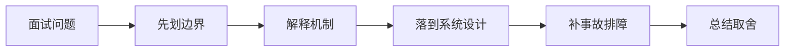

# WebSocket 和 SSE 怎么选？实时连接如何做稳定性治理？

## 面试定位

这道题关联 WebSocket、SSE 与实时通信治理、限流、熔断、降级与舱壁隔离，难度 4/5，出现频率 high。面试官真正想看的是：你能否把概念回答升级成架构、数据流、指标、取舍和真实故障处理。
回答主轴可以从「WebSocket、SSE 与实时通信治理」切入：实时通信题要从 WebSocket/SSE 选择、连接鉴权、心跳、重连、消息顺序、背压、广播和可观测性展开。

**第一句话建议**
我会先划清边界，再解释运行机制，最后用一个系统设计案例说明数据流、失败模式、指标和取舍。

**不要只答**
- 用 WebSocket 解决所有推送
- 没有心跳和重连
- 断线后重复执行业务动作
- 忽略代理 idle timeout

## 30 秒回答

选型先看通信方向：SSE 是服务端到浏览器的单向事件流，天然基于 HTTP，适合通知、进度、LLM streaming；WebSocket 是双向长连接，适合协同编辑、交易推送和高频交互。

回答时必须主动补数据流、关键字段、失败模式、指标和取舍，否则很容易停留在背概念。

## 架构与运行机制

### 标准回答骨架

- 选型先看通信方向：SSE 是服务端到浏览器的单向事件流，天然基于 HTTP，适合通知、进度、LLM streaming；WebSocket 是双向长连接，适合协同编辑、交易推送和高频交互。
- 稳定性要处理连接鉴权、心跳、断线重连、消息序号、幂等、背压、限流、房间/订阅管理和水平扩展；多实例下通常需要 Redis Pub/Sub、MQ 或专门网关做广播与路由。
- 代理和网络层要配置 idle timeout、keepalive、sticky session 或连接网关，避免负载均衡器、CDN、浏览器后台和移动网络导致异常断开。
- 观测指标看 active_connections、connect_fail_rate、disconnect_reason、message_lag、send_queue_depth、reconnect_rate、ws_error_rate 和 sse_stream_duration。
- 实时通信题要从 WebSocket/SSE 选择、连接鉴权、心跳、重连、消息顺序、背压、广播和可观测性展开。
- WebSocket 是浏览器和服务端之间的双向长连接协议。
- SSE 是基于 HTTP 的服务端单向事件推送机制。
- 背压是接收方处理不过来时让发送方减速、丢弃或断开的机制。
- 先判断是否需要双向通信，单向推送优先考虑 SSE。
- 实时消息要有 event_id、sequence、ack 或可恢复游标，避免断线后丢状态。
- 长连接要与负载均衡、扩容、发布和故障切换协同。
- 消息权限要在每次订阅和发送时校验。
- SSE 适合服务端到浏览器的单向事件流，WebSocket 适合双向低延迟交互。
- 实时连接是长连接状态，必须处理鉴权续期、心跳、断线重连、消息积压、负载均衡和实例迁移。
- 过载保护题要从入口限流、下游熔断、快速失败、降级返回、线程池隔离、重试预算和用户体验展开。
- 限流是在入口或调用点限制请求速率或并发，保护系统容量。
- 熔断是在依赖异常时快速失败，避免继续等待和放大故障。
- 舱壁隔离是把资源按业务或依赖切开，避免一个故障拖垮全局。
- 限流、熔断、降级都要有业务语义，不能只返回技术错误。
- 重试要有预算和退避，否则会和熔断/限流对抗。
- 隔离粒度要覆盖线程池、连接池、队列、缓存和租户。
- 降级要提前定义可丢弃、可延迟、可返回旧值的路径。
- 限流控制进入系统的请求量，熔断控制对异常依赖的调用，降级定义用户能接受的退化结果，舱壁隔离控制故障面。
- 这些机制要和重试、超时、队列、线程池、告警和业务优先级一起设计。

### 数据流怎么讲

可以按浏览器、CDN、网关/BFF、认证授权、API 契约、缓存、文件传输、实时连接、安全策略和可观测性来讲。数据流通常是浏览器带着 cookie/token 和 trace context 访问 CDN 或 Gateway，网关做认证、限流、CORS/CSRF/权限校验，BFF/API 按 schema 执行业务，响应通过 Cache-Control、CSP、Set-Cookie、错误码和 trace_id 把协议边界暴露清楚。

可以按用户入口、流量路由、负载均衡、服务发现、限流熔断、超时重试、状态存储、异步事件、一致性、容量、灾备和可观测性来讲。数据流通常是请求经过网关和负载均衡进入服务，服务通过发现/配置选择依赖，按 timeout、retry、circuit breaker 和 bulkhead 执行；状态变化写 DB/MQ/缓存，观测系统用指标、日志和 Trace 判断是否过载、降级或恢复。

### 落地实现细节

- SSE EventSource：简单服务端推送和自动重连。
- WebSocket heartbeat：检测半开连接和客户端失联。
- Fanout service：集中处理订阅和广播。
- Replay cursor：断线后从 last_event_id 恢复。
- WebSocket 鉴权 token 过期后要支持续期或主动断开。
- SSE 需要处理代理缓冲、超时和浏览器连接数限制。
- 广播消息要考虑租户隔离、频道权限和单用户多设备。
- 发布重启要 drain 连接，避免大量客户端同时重连打爆系统。
- 连接建立要鉴权，消息级也要校验权限，不能只在握手时信任用户。
- 慢客户端要有发送队列上限和断开策略，避免拖垮服务端内存。
- 定义 HTTP 缓存策略、会话边界、认证续期、CSRF/CORS 和敏感响应头。
- 为 API 设计 request schema、response schema、error code、idempotency key 和 version。
- 上线后跟踪 cache hit、auth error、api p95、4xx/5xx、idempotency conflict 和 security audit。
- Token bucket / leaky bucket：控制速率和平滑流量。
- Circuit breaker：按错误率、超时和并发打开熔断。
- Bulkhead：按下游或业务域隔离资源池。
- Retry budget：限制重试占比，避免重试风暴。
- 限流错误要区分用户限流、租户限流、系统过载和下游限流。
- 半开状态要小流量探测，成功后逐步恢复，失败则继续打开。
- 降级返回旧值要标注 stale 和有效期，避免用户误解。
- Agent 系统要按 workspace/user/tool/model 维度限制并发和成本。
- 限流维度要按用户、租户、接口、资源和下游容量设计，并返回 retry_after 或可理解错误。
- 熔断打开、半开、关闭都要有指标和事件，避免静默吞掉真实故障。
- 为每个跨服务动作定义 request_id、idempotency_key、timeout、retry policy 和 error code。

## 可画图

图 1：这类题不要直接背结论，先划清边界，再沿机制、设计、事故和取舍回答。

## 系统设计案例

### 面试可展开的系统设计

典型设计题是管理后台、文件上传下载、实时通知、Web Agent 控制台、RAG 文档权限和 API 网关治理。架构上要包含 Cookie/SameSite/CSRF、CORS allowlist、CSP/XSS 防护、Session/Token/OAuth、CDN 缓存、签名 URL、WebSocket/SSE、BFF、版本兼容、错误码、审计和前后端契约测试。

典型设计题是订单系统、支付链路、消息通知平台、Agent tool execution 集群或 RAG 检索服务。架构上要包含入口限流、路由策略、健康检查、服务发现、配置灰度、幂等重试、熔断降级、热点隔离、容量预估、多区域灾备、RPO/RTO 和演练。

**答题时建议画出的模块**
- 入口层：参数校验、权限、租户、幂等和 request_id。
- 业务服务层：决定同步流程、异步流程、缓存读写、数据库回源、下游调用或降级返回。
- 执行层：封装存储访问、外部调用和异步任务，统一 timeout、retry、error code 和审计。
- 状态层：保存任务状态、业务状态、checkpoint 和版本。
- 观测层：指标、日志、trace、回放和 regression case。

**数据流**
- 请求进入系统后生成唯一标识，并把用户约束和业务上下文落入状态。
- 业务服务读取缓存、数据库、异步事件或下游状态，选择执行路径。
- 执行结果以结构化结果写回状态，同时上报指标。
- 保护策略判断是否完成、重试、降级、补偿或转人工。

## 真实问题与排障

真实线上问题一般从 status_code、api_error_rate、auth_error_rate、cors_error_count、csrf_block_count、xss_report_count、cache_hit_rate、cdn_origin_fetch_rate、upload_fail_rate、ws_disconnect_rate、schema_validation_error 和 trace_id 看起。回答时要先判断是浏览器策略、缓存、认证授权、网络、API 契约、实时连接还是后端依赖问题。

真实线上问题一般从错误率、p95/p99、timeout_rate、retry_rate、queue_depth、consumer_lag、dependency_error_rate、circuit_open_count、hot_key_qps、capacity_headroom、failover_time 和 inconsistent_count 看起。回答时要先保护核心链路，再定位是入口流量、路由、依赖、状态、一致性、容量还是发布配置问题。

**现场排障回答法**
- 先说影响面：成功率、错误率、延迟、积压、成本或质量指标是否异常。
- 按数据流分段定位，不要一上来就改参数或调 prompt。
- 查看最近发布、配置变更、数据分布变化、下游限流和资源水位。
- 先止血再根因：降级、回滚、限流、暂停高风险动作、隔离异常租户或重放失败样本。
- 最后把样本沉淀为 eval/regression case，并补齐监控告警。

**重点指标**
- active_connections
- ws_disconnect_rate
- sse_reconnect_count
- message_queue_depth
- realtime_auth_error_rate
- rate_limited_count
- circuit_open_count
- fallback_count
- bulkhead_reject_count
- retry_budget_exhausted_count

## 多轮追问模拟

### 追问 1：LLM 流式输出用 SSE 还是 WebSocket？

**回答要点**：如果只是服务端向浏览器持续推 token，SSE 通常更简单：HTTP 语义清晰、可穿透代理、浏览器 EventSource 支持自动重连。若需要客户端频繁双向控制、多人协作或复杂实时协议，WebSocket 更合适。无论选谁，都要记录 chunk、finish_reason、trace_id 和中断原因。

**考察点**：单向流、双向交互

### 追问 2：断线重连如何避免消息丢失？

**回答要点**：服务端要给消息分配单调序号或 event id，客户端重连时带 last_event_id/last_seq，服务端从短期重放窗口补发。业务写操作要和推送解耦，推送失败不能导致重复业务副作用；消费端按 message_id 幂等处理。

**考察点**：event id、重放窗口

### 追问 3：长连接如何水平扩展？

**回答要点**：连接本身绑定到某个实例或连接网关，广播和点对点消息通过订阅关系、路由表、Redis/MQ 或专门实时网关转发。要治理连接数、房间规模、发送队列、慢客户端和跨实例 fan-out 成本，必要时按租户或房间分片。

**考察点**：连接网关、fan-out

### 延伸追问 1：LLM 流式输出用 SSE 还是 WebSocket？

回答时继续沿着边界、架构、数据流、指标、失败模式和取舍展开。可以落到这些项目证据：可以讲 AI 助手 streaming、任务进度通知、实时协作或后台告警推送。；用连接网关、消息序号、ack、重放窗口和队列深度指标体现工程完整度。

### 延伸追问 2：断线重连如何避免消息丢失？

回答时继续沿着边界、架构、数据流、指标、失败模式和取舍展开。可以落到这些项目证据：可以讲 AI 助手 streaming、任务进度通知、实时协作或后台告警推送。；用连接网关、消息序号、ack、重放窗口和队列深度指标体现工程完整度。

### 延伸追问 3：长连接如何水平扩展？

回答时继续沿着边界、架构、数据流、指标、失败模式和取舍展开。可以落到这些项目证据：可以讲 AI 助手 streaming、任务进度通知、实时协作或后台告警推送。；用连接网关、消息序号、ack、重放窗口和队列深度指标体现工程完整度。

## 项目化回答与取舍

**项目证据怎么挂钩**
- 可以讲 AI 助手 streaming、任务进度通知、实时协作或后台告警推送。
- 用连接网关、消息序号、ack、重放窗口和队列深度指标体现工程完整度。

**取舍总结**
Web 工程的取舍是用户体验、性能、安全、兼容性、可演进和可观测性之间的平衡。面试追问通常会围绕 HTTP 缓存、Cookie/Session/JWT/OAuth、CORS/CSRF/XSS/CSP、CDN、上传下载、WebSocket/SSE、BFF、API 版本、错误码和 Agent tool schema 展开。

系统设计的取舍是可用性、性能、一致性、成本、复杂度和可运维性之间的平衡。面试追问通常会围绕负载均衡策略、重试风暴、限流熔断、服务发现、配置灰度、选主共识、多活灾备、热点治理和容量规划展开。

**收尾句**
这类问题最后要回到可验证结果：设计上有什么边界，线上看什么指标，失败后怎么恢复，哪些场景不该用这个方案。这样回答才经得起连续追问。

## 深挖技术细节

- SSE EventSource：简单服务端推送和自动重连。
- WebSocket heartbeat：检测半开连接和客户端失联。
- Fanout service：集中处理订阅和广播。
- Replay cursor：断线后从 last_event_id 恢复。
- WebSocket 鉴权 token 过期后要支持续期或主动断开。
- SSE 需要处理代理缓冲、超时和浏览器连接数限制。
- 广播消息要考虑租户隔离、频道权限和单用户多设备。
- 发布重启要 drain 连接，避免大量客户端同时重连打爆系统。
- 连接建立要鉴权，消息级也要校验权限，不能只在握手时信任用户。
- 慢客户端要有发送队列上限和断开策略，避免拖垮服务端内存。
- 定义 HTTP 缓存策略、会话边界、认证续期、CSRF/CORS 和敏感响应头。
- 为 API 设计 request schema、response schema、error code、idempotency key 和 version。
- 上线后跟踪 cache hit、auth error、api p95、4xx/5xx、idempotency conflict 和 security audit。
- Token bucket / leaky bucket：控制速率和平滑流量。
- Circuit breaker：按错误率、超时和并发打开熔断。
- Bulkhead：按下游或业务域隔离资源池。
- Retry budget：限制重试占比，避免重试风暴。
- 限流错误要区分用户限流、租户限流、系统过载和下游限流。
- 半开状态要小流量探测，成功后逐步恢复，失败则继续打开。
- 降级返回旧值要标注 stale 和有效期，避免用户误解。
- Agent 系统要按 workspace/user/tool/model 维度限制并发和成本。
- 限流维度要按用户、租户、接口、资源和下游容量设计，并返回 retry_after 或可理解错误。
- 熔断打开、半开、关闭都要有指标和事件，避免静默吞掉真实故障。
- 为每个跨服务动作定义 request_id、idempotency_key、timeout、retry policy 和 error code。

## 边界条件与反例

反例一：如果业务需要强事务一致性，不能只靠缓存、搜索索引或异步读模型承载最终正确性。

反例二：如果没有指标、trace 和回归样例，方案在线上出问题时只能靠猜，不能证明稳定性。

反例三：为了追求低延迟而省略权限、幂等、超时或降级，会把局部性能优化变成系统性风险。

## 深问准备

被追问时优先沿四条线展开：为什么需要这个方案、关键数据结构是什么、失败后如何止血和定位、最终用什么指标证明修复有效。

- 准备一个线上事故：影响面、止血、根因、修复、回归。
- 准备一个系统设计：入口、状态、执行、存储、观测。
- 准备一个取舍：一致性、延迟、吞吐、成本和可维护性。

## 来源与延伸阅读

- [MDN: The WebSocket API](https://developer.mozilla.org/en-US/docs/Web/API/WebSockets_API)：用于确认官方语义边界、命令行为和工程约束。
- [MDN: Server-sent events](https://developer.mozilla.org/en-US/docs/Web/API/Server-sent_events)：用于确认官方语义边界、命令行为和工程约束。
- [RFC 9110: HTTP Semantics](https://www.rfc-editor.org/info/rfc9110)：用于确认官方语义边界、命令行为和工程约束。
- [AWS Builders Library: Timeouts, retries, and backoff with jitter](https://aws.amazon.com/builders-library/timeouts-retries-and-backoff-with-jitter/)：用于确认官方语义边界、命令行为和工程约束。
- [Envoy Documentation: Circuit Breaking](https://www.envoyproxy.io/docs/envoy/latest/intro/arch_overview/upstream/circuit_breaking)：用于确认官方语义边界、命令行为和工程约束。
- [Google SRE Book: Addressing Cascading Failures](https://sre.google/sre-book/addressing-cascading-failures/)：用于确认官方语义边界、命令行为和工程约束。
