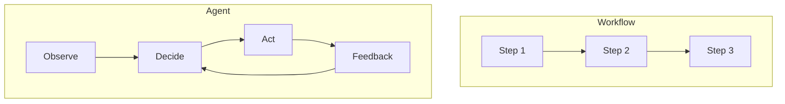

# Agent 和 Workflow 的本质区别是什么？

## 面试定位

这是 Agent 面试的分水岭问题。回答要从控制流讲起，再落到架构、数据流、指标、取舍和追问。

## 30 秒回答

Workflow 的本质是代码预定义控制流，下一步由规则、状态机或编排逻辑决定。Agent 的本质是模型参与控制流，下一步由模型结合目标、状态、工具结果和反馈动态决定。

所以区别不是有没有 LLM，而是 LLM 是否决定下一步。一个 workflow 可以调用 LLM 做分类或摘要，但只要路径仍由代码决定，它仍然是 workflow。

## 标准回答

我会从三个维度区分。第一，控制流：workflow 固定，Agent 动态。第二，可验证性：workflow 更容易写单元测试，Agent 需要 trace 和 eval。第三，适用场景：workflow 适合规则明确任务，Agent 适合开放任务。

生产系统常常不是二选一，而是 hybrid。外层 workflow 管权限、预算、审批和最终提交，内层 Agent 处理探索、检索、排障或代码修复。

## 架构与运行机制

Workflow 的数据流像状态机：输入、校验、分支、动作、状态更新、输出。Agent 的数据流像反馈循环：observe、decide、act、observe、verify。两者都可以调用工具，但 Agent 会根据 observation 改变下一步计划。

## 可画图

图 1：Workflow 的路径由预定义步骤推进，Agent 的路径由观察、决策、行动和反馈循环动态推进。

图里的本质差异是“谁决定下一步”。Workflow 中 Step 1 到 Step 3 的边由代码、状态机或编排器控制；LLM 即使参与某个节点，也只是节点能力。Agent 中 Decide 会读取目标、上下文、工具 observation、约束和 verifier feedback，再选择继续检索、调用工具、请求澄清、修复错误或停止。这个差异会直接影响权限、安全、trace 和评测设计。

## 系统设计案例

客服订单查询可以是 workflow：识别订单号、查状态、返回结果。复杂投诉归因可以是 Agent：需要查订单、物流、售后记录、政策文档，再根据证据提出处理建议。退款提交仍应回到 workflow。

## 真实问题与排障

如果 Agent 失败，要看动态决策链路：是否选错工具，是否误读反馈，是否目标漂移，是否停止条件错误。workflow 失败则更多看规则、状态和外部依赖。

指标取舍也不同。workflow 看分支覆盖率、错误率和延迟；Agent 还要看 `avg_steps`、`recovery_rate`、`trajectory_quality` 和 `unsafe_action_block_rate`。

## 面试官追问

### 追问 1：workflow 能调用 LLM 吗？

可以。LLM 做节点能力不等于 Agent，关键看谁控制下一步。

### 追问 2：Agent 一定比 workflow 高级吗？

不是。workflow 更可控、更便宜、更稳定。Agent 是为开放路径付出复杂度换灵活性。

### 追问 3：生产系统怎么组合？

常用 hybrid：workflow 管控制面，Agent 管探索面。

## 多轮追问模拟

### 追问 1：用了 LLM 的流程为什么不一定是 Agent？

回答要点：要看控制权。比如审批流中 LLM 只负责摘要、分类或生成邮件草稿，下一步仍由代码分支和审批状态决定，这还是 workflow+LLM node。只有模型根据目标、状态和 observation 动态决定下一步行动时，才进入 Agent 范畴。

考察点：是否能避免“LLM equals Agent”的误判。

容易掉坑：把所有接入 LLM 的自动化流程都叫 Agent，导致架构边界和验证方式混乱。

### 追问 2：什么时候不要用 Agent？

回答要点：规则稳定、风险高、失败路径可枚举、需要强一致或强审计的环节优先 workflow。例如支付、退款、权限变更、合同提交和生产发布审批。Agent 可以负责收集证据、生成建议或排障，但最终动作应回到 deterministic verifier 或审批 workflow。

考察点：是否知道 Agent 的灵活性也带来安全和验证成本。

容易掉坑：为了显得先进，把高风险动作完全交给模型自主决定。

### 追问 3：混合架构怎么设计验收？

回答要点：workflow 部分验收分支覆盖、状态一致性、权限和 SLA；Agent 部分验收 trajectory、工具选择、恢复能力、unsafe action block 和 cost_per_success。两者之间要定义 handoff contract：Agent 输出证据、建议和置信度，workflow 决定是否执行和如何审计。

考察点：是否能把概念差异落到工程验收。

容易掉坑：只说“外层 workflow、内层 Agent”，但没有讲 handoff 字段、验收条件和失败回退。

## 项目化回答

在 Coding Agent 中，搜索和修复循环是 Agent；apply patch 和 run tests 是受控工具；最后验收由 deterministic verifier 判断。这样能体现两者边界。

## 常见错误

- 认为用了 LLM 就是 Agent。
- 认为 Agent 必然替代 workflow。
- 不讲控制流和反馈。
- 不讲验证成本。

## 深挖技术细节

Workflow 和 Agent 的区别可以落到控制流字段上。Workflow 中下一步由代码状态机决定，例如 `state=approved -> send_email`；LLM 只是某个节点能力。Agent 中下一步由模型基于 `goal`、`state`、`tool_observation`、`constraints` 和 `verifier_feedback` 动态选择，例如继续检索、换工具、追问用户或停止。这个差别决定了测试、trace 和权限设计。

Workflow 的优势是确定、低成本、易审计，适合规则明确、分支稳定、失败路径可枚举的任务。Agent 的优势是处理未知环境、动态工具选择、多步排障和开放问题，但要付出 trace、eval、stop policy、guardrails 和成本控制。生产系统常用 hybrid：workflow 管权限、预算、审批和最终提交，Agent 处理探索和恢复。

评估时不要只看“是否用了 LLM”。Workflow 指标看 branch coverage、SLA、error rate、retry success；Agent 还要看 `avg_steps`、`trajectory_quality`、`recovery_rate`、`unsafe_action_block_rate`、`cost_per_success`。如果 Agent 的动态性没有提高成功率或降低人工成本，就应回到 workflow。

## 边界条件与反例

反例一：一个固定表单填报流程接了 LLM 文案润色，就说是 Agent。路径仍由代码决定，它更像 workflow+LLM node。反例二：把退款提交这种强规则、高风险流程交给 Agent 自主决定，造成审计和权限风险。反例三：Agent 探索完成后仍让模型决定是否真正付款，而不是回到 workflow 审批。

边界在于：workflow 不是低级，Agent 也不是更高级。规则稳定、风险高、需要强一致的部分应 workflow；路径开放、需要观察和推理的部分可 Agent。混合架构往往比“全 Agent”更生产级。

## 深问准备

- 问：workflow 能调用 LLM 吗？答：可以，关键看下一步控制权是否仍由代码决定。
- 问：什么时候用 Agent？答：路径无法预枚举、需要观察环境、动态选工具、异常恢复和证据收集时。
- 问：生产怎么组合？答：workflow 做控制面和审批，Agent 做探索、检索、排障，结果由 deterministic verifier 验收。
- 问：Agent 比 workflow 贵在哪里？答：更多模型调用、工具失败、trace 存储、eval 维护和安全门禁。

## 公开阅读校验

这篇文章公开发布时，最需要给读者一个不含糊的判定句：看控制权，不看是否接入 LLM。LLM 做摘要、分类、改写、query rewrite 或草稿生成时，系统仍可能是 workflow；只有模型根据目标、状态、工具反馈和约束选择下一步，才进入 Agent 范畴。这个标准能防止团队把普通自动化包装成 Agent，也能防止把高风险业务动作交给模型自治。

更实用的判断是验收方式不同。Workflow 要验收分支覆盖、状态一致性、权限、幂等、SLA 和回滚；Agent 还要验收 trajectory、工具选择、恢复、stop reason、unsafe action block 和 cost_per_success。两者混在一起时，需要定义 handoff contract：Agent 只能输出证据、候选动作、置信度和风险标签，workflow 才决定是否执行。

公开读者还应该看到一个取舍原则：workflow 是默认基线，Agent 是为开放路径支付复杂度。只要 workflow baseline 已经稳定、失败路径可枚举、风险高且收益有限，就不应为了技术名词迁移到 Agent。反过来，当任务需要持续观察、动态选工具、异常恢复和证据收集时，Agent 的灵活性才可能覆盖 trace、eval 和安全成本。

## 来源与延伸阅读

- [Anthropic Building effective agents](https://www.anthropic.com/engineering/building-effective-agents)：用于支持 workflow 与 agent 的核心区别在控制流和模型自主程度，而不是是否调用 LLM。
- [OpenAI A practical guide to building agents](https://cdn.openai.com/business-guides-and-resources/a-practical-guide-to-building-agents.pdf)：用于支持生产 Agent 需要 guardrails、tooling、handoff、evaluation 和 human oversight 等工程边界。
