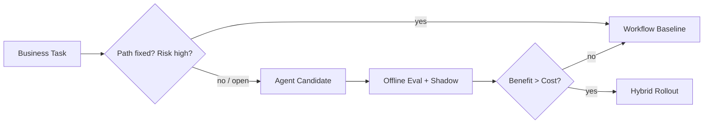

# 怎样判断一个业务场景应该用 workflow 还是 Agent？

## 面试定位

这道题要回答选择标准，不是概念区别。面试官会看你是否能用业务风险、路径确定性、评测、成本、取舍和上线策略做技术决策。

## 30 秒回答

我会先问四个问题：路径能否枚举，失败代价多高，中间结果是否改变下一步，是否能用 eval 证明 Agent 收益。如果路径固定、风险高、规则清楚，优先 workflow。如果路径开放、需要探索和反馈，才考虑 Agent。

最终通常做 hybrid：workflow 做控制面，Agent 做开放子任务。

## 标准回答

判断流程是：先做最小 workflow baseline，定义成功标准和失败类型。再找 baseline 覆盖不了的开放子任务。然后设计 Agent loop，并用离线 eval 或 shadow run 比较成功率、成本、延迟和人工接管率。

如果 Agent 只提高一点点体验，却带来明显延迟、成本和风险，就不值得上线。

## 架构与运行机制

数据流是：业务请求进入 classifier 或 policy router，低风险固定任务走 workflow，高不确定任务进入 Agent。Agent 输出 proposal 后，Verifier 判断质量和风险。最终动作仍由 workflow 执行。

## 可画图

图 1：Workflow 与 Agent 的上线决策路径，先用路径确定性和失败代价筛选，再用离线评测与 shadow run 判断 Agent 是否值得进入混合架构。

这张图的边界是：Agent 不是 workflow 的替代词，而是只在开放子任务上进入候选。`Workflow Baseline` 给出稳定下限，`Offline Eval + Shadow` 用历史任务和只读运行验证收益，`Decision` 要同时比较成功率、成本、延迟、人工接管率和危险动作拦截率。只有当 Agent 的增益能覆盖复杂度和风险时，才进入 `Hybrid Rollout`。

## 系统设计案例

企业知识库问答可以先 workflow：权限过滤、检索、生成、引用。如果用户要求跨多系统排查事故，需要多轮查日志、查指标、读 runbook、生成假设，就可以把排查子任务交给 Agent。

## 真实问题与排障

上线后如果失败率高，先看 routing 是否准确。再看 Agent 是否处理了本该 workflow 的高风险固定任务。然后看工具结果是否能支持下一步，Verifier 是否有效。

指标包括 `routing_accuracy`、`baseline_success_rate`、`agent_success_delta`、`p95_latency_delta`、`cost_delta`、`manual_handoff_rate` 和 `unsafe_block_rate`。

## 面试官追问

### 追问 1：如果业务方坚持用 Agent 呢？

先做受限范围的 Agent 子流程，用 baseline 和 eval 说话，不直接替换核心 workflow。

### 追问 2：没有 eval 集怎么办？

从历史工单、失败案例和人工标注构建 golden set，先覆盖高频和高风险场景。

### 追问 3：如何灰度？

先 shadow，再只读建议，再人工确认执行，最后才考虑自动执行低风险动作。

## 多轮追问模拟

**追问 1：怎样量化“路径是否开放”？**

可以看三件事：状态分支数量、下一步是否依赖 observation、失败样本是否能被固定规则覆盖。比如退款审批路径固定，金额和凭证规则清楚，适合 workflow；事故排查下一步取决于日志、指标和部署差异，分支多且需要假设更新，更接近 Agent。

**追问 2：Agent 比 baseline 成功率高 3%，要不要上线？**

不一定。要同时看 `p95_latency_delta`、`cost_delta`、`manual_handoff_rate`、`unsafe_block_rate` 和维护成本。如果 3% 的成功率提升只发生在低价值问题上，却引入高延迟和不可解释失败，就不值得自动化上线。可以保留为人工辅助建议。

**追问 3：为什么最终执行还要留在 workflow？**

因为执行层承担权限、幂等、事务、审计和回滚。Agent 擅长开放探索和候选生成，但不应把不确定推理直接变成写操作。让 Agent 输出 proposal，再由 verifier 和 deterministic executor 执行，是控制生产风险的关键。

## 项目化回答

Travel Agent 的候选方案生成可用 Agent，支付和改签必须 workflow。RAG 排障可以用 Agent 生成检索计划，但权限过滤和引用校验必须 deterministic。

## 常见错误

- 不做 baseline。
- 不量化成本和延迟。
- 让 Agent 接管高风险事务。
- 没有灰度和回滚。

## 深挖技术细节

我会把判断标准落成一张决策矩阵，而不是停在“确定性用 workflow，开放性用 Agent”。矩阵字段包括 `path_entropy`、`state_branching_factor`、`failure_cost`、`tool_side_effect_risk`、`eval_observability`、`human_handoff_cost` 和 `latency_budget`。如果路径分支少、状态可枚举、失败代价高，就用 workflow；如果中间 observation 会改变下一步计划，且能用 trace 和 eval 验证收益，才让 Agent 进入候选。

落地上我会保留 workflow control plane：鉴权、预算、审计、幂等、最终写操作都在 workflow。Agent 只负责开放子任务，例如检索计划生成、异常假设排序、候选方案解释。Agent 输出要是 proposal，而不是直接 side effect；proposal 进入 verifier 和 deterministic executor，避免模型把不确定推理直接变成生产动作。

## 边界条件与反例

一个常见反例是报销审批。虽然自然语言描述很多，但核心规则、金额阈值、发票校验和审批流都是确定的，应该 workflow 优先，Agent 可以帮助解释驳回原因。另一个反例是事故排查，如果 runbook 覆盖不了所有组合，需要跨日志、指标、部署记录和代码变更生成假设，就适合 Agent 做探索，但重启服务、扩容和回滚必须走受控 workflow。

如果没有 eval 集，不应直接上线 Agent。可以先用历史工单构造 golden cases：输入、可用工具、期望证据、禁止动作、人工标准答案和风险标签。Agent 在 shadow run 中只产出建议，通过 `agent_success_delta`、`unsafe_block_rate`、`manual_handoff_rate`、`p95_latency_delta` 和 `cost_delta` 决定是否扩大范围。

## 深问准备

被问到“hybrid 怎么设计”时，可以回答三层：router 负责把任务分到 workflow 或 Agent 子任务；Agent layer 只做计划、解释、候选生成；executor layer 统一做权限、幂等、事务和审计。这样既利用 Agent 的探索能力，又把生产风险收敛在确定性边界里。

如果追问“Agent 效果不稳定怎么办”，我会从 trace 归因：是路由错、上下文不足、工具 schema 不清、verifier 过弱，还是任务本身不适合 Agent。优化顺序是先缩 scope 和补 eval，再调 prompt/模型；不能一失败就换更强模型，也不能一成功就取消 workflow baseline。

最终的面试表达要落在“用证据选择复杂度”：先证明 workflow baseline 的上限，再证明 Agent 在开放子任务上带来可复现收益，最后用灰度和执行边界控制风险。这样答案才像工程决策，而不是工具偏好。

## 来源与延伸阅读

- [Anthropic Building effective agents](https://www.anthropic.com/engineering/building-effective-agents)：官方文章用于支持先区分 workflow 与 agent，再根据任务开放度选择更简单可靠架构的判断框架。
- [OpenAI A practical guide to building agents](https://cdn.openai.com/business-guides-and-resources/a-practical-guide-to-building-agents.pdf)：官方文档用于支持从任务边界、工具、guardrail 和评估出发设计 Agent，而不是把所有流程都交给模型。
- [LangSmith Evaluation](https://docs.smith.langchain.com/evaluation)：官方文档用于支持用离线数据集、shadow run 和回归评估比较 Agent 与 baseline 的真实收益。
