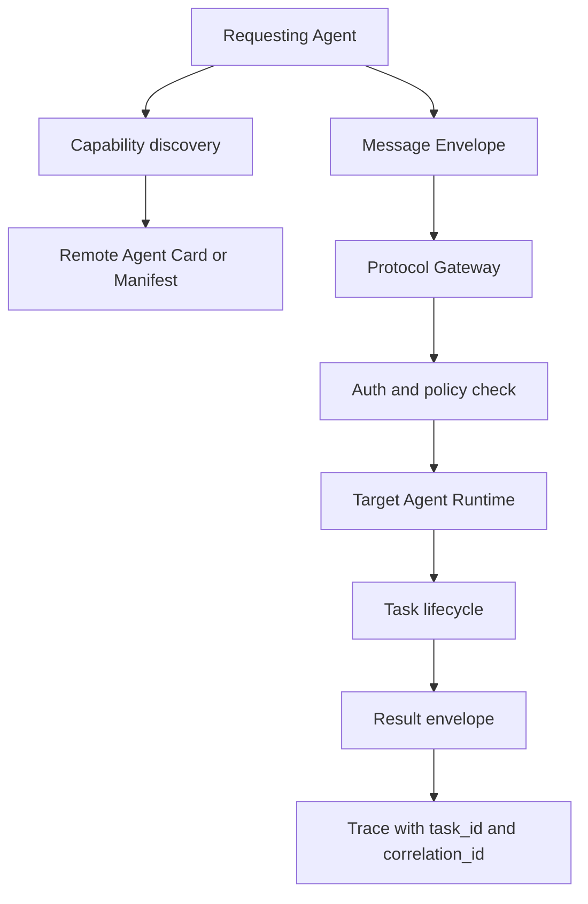

# A2A 与 ACP

## 一句话定义

A2A、ACP 这类 Agent 通信协议关注 Agent 之间如何发现 capability、交换 message envelope、跟踪 task_id 和 correlation_id、处理 auth 与 protocol boundary；MCP 更偏向模型应用连接 tools、resources 和 prompts。

## 面试定位

这道题容易被答成名词列表。面试官真正想看的是你能否区分“Agent 调工具”和“Agent 与 Agent 协作”这两类协议边界。

回答时可以把 MCP 放在工具上下文协议层，把 A2A 或 ACP 放在跨 Agent 协作层。不同项目命名和细节可能演进，但关键问题稳定：能力发现、消息封装、身份认证、任务生命周期、状态同步和可观测性。

## 为什么需要它

当一个 Agent 只调用本地工具时，tool schema 已经够用。可一旦多个 Agent 分属不同团队、进程或组织，就需要协议来描述“我是谁、我能做什么、这次任务是什么、上下文有哪些、结果如何返回、失败如何恢复”。

没有协议边界，系统会把跨 Agent 调用变成自然语言转发。这种方式短期能跑，长期会在权限、审计、追踪和兼容性上出问题。

## 核心架构

| 层次 | 解决的问题 | 关键字段 | 边界 |
| :--- | :--- | :--- | :--- |
| MCP | 应用接入工具和上下文 | tools、resources、prompts | Host 到 Server |
| A2A / ACP | Agent 间任务协作 | task_id、capability、message envelope | Agent 到 Agent |
| Tool schema | 单个动作调用 | name、input、output | Runtime 内部 |
| Workflow API | 业务流程编排 | state、step、retry | 应用后端 |

## 架构与运行机制

跨 Agent 协议至少需要三类能力。第一是 capability discovery，调用方能知道目标 Agent 支持什么任务、输入输出 schema、权限要求和 SLA。第二是 message envelope，所有消息携带 sender、receiver、task_id、correlation_id、intent、payload、context_refs、auth_scope 和 deadline。第三是 task lifecycle，任务要有 created、accepted、running、blocked、completed、failed、cancelled 等状态。

protocol boundary 不能泄漏内部实现。调用方不应该知道目标 Agent 的私有 prompt、内部工具或完整 workspace，只应看到公开 capability 和必要 schema。

## 运行机制

1. Requesting Agent 通过 registry、agent card 或 manifest 做 capability discovery。
2. Orchestrator 选择目标 Agent，并生成 task_id、correlation_id 和 auth token。
3. message envelope 携带任务意图、最小必要上下文、artifact_refs 和权限范围。
4. Protocol Gateway 做 auth、rate limit、schema validation 和 policy check。
5. Target Agent 接受或拒绝任务，并按生命周期回传进度。
6. 结果 envelope 写入 trace，调用方根据状态继续、重试或人工介入。

## 关键设计取舍

| 取舍 | 好处 | 代价 | 建议 |
| --- | --- | --- | --- |
| 直接 Agent 调用 | 灵活 | 安全和审计弱 | 只用于可信内网原型 |
| Gateway 协议层 | 权限清晰 | 多一层复杂度 | 生产跨团队更适合 |
| 传全文上下文 | 信息完整 | 泄漏和成本高 | 用 context_refs 和摘要 |
| 强 schema | 易验证 | 灵活性下降 | 关键字段必须结构化 |

## 生产落地细节

- capability discovery 只暴露必要能力、schema、限制和联系人，不暴露内部 prompt。
- message envelope 要带 task_id、correlation_id、sender、receiver、auth_scope、deadline 和 trace_id。
- auth 要支持租户隔离、最小权限、过期 token 和审计。
- protocol boundary 要明确哪些状态可见，哪些 artifact 只能通过引用读取。
- 指标关注 cross_agent_success_rate、protocol_error_rate、auth_denial_rate、timeout_rate 和 schema_violation_rate。

## 系统设计案例

假设企业内部有 Research Agent、Coding Agent 和 Security Agent。Research Agent 想让 Coding Agent 生成示例代码，不能直接发完整聊天记录。它应通过协议发送任务 envelope：目标、语言、约束、引用材料、期望输出、deadline 和权限范围。

数据流是：Research Agent 做 capability discovery，Gateway 校验 auth 和 schema，Coding Agent 接收任务并回传 artifact_refs，Security Agent 再通过同一个 task_id 进行审查。所有消息共享 correlation_id，便于排查链路。

## 真实问题与排障

跨 Agent 故障常见于 schema 不兼容、auth 过期、上下文引用失效、任务状态卡住和重复提交。排障先根据 correlation_id 查全链路，再检查 envelope、gateway verdict、目标 Agent trace 和 artifact 权限。

如果发现数据泄漏，要立刻缩小 capability discovery 暴露字段，收紧 context_refs 权限，并审计是否有不该进入 envelope 的敏感内容。

## 常见误区与排障

- 把 A2A/ACP 与 MCP 混为一谈。
- 用自然语言传递协议字段，导致无法校验。
- capability discovery 暴露内部工具和敏感 prompt。
- 没有 task lifecycle，调用方不知道任务是否被接收。
- 缺少 correlation_id，跨系统排障困难。

## 面试追问

- MCP 与 A2A 的职责边界是什么？
- message envelope 至少要有哪些字段？
- 跨 Agent auth 如何做最小权限？
- 如何避免目标 Agent 读取不必要上下文？
- 协议版本升级时如何兼容旧 Agent？

## 项目化表达

可以把它讲成“Agent 协作的 API 契约”。项目里你会定义 capability discovery、message envelope、task lifecycle、auth、protocol boundary 和 trace，而不是让 Agent 彼此自由聊天。这样回答既体现系统设计，也能接住安全追问。

## 深入技术细节

A2A/ACP 类协议的重点是跨 Agent 任务边界，而不是单个工具调用。调用方只应看到目标 Agent 的公开 capability、输入输出 schema、SLA、auth scope 和状态接口，不应看到内部 prompt、私有工具和完整 workspace。通信通过 message envelope，所有消息都带 task_id 和 correlation_id，便于跨系统追踪。

Task lifecycle 必须显式。created 表示任务创建，accepted 表示目标 Agent 接收，running 表示执行中，blocked 表示缺输入或权限，completed/failed/cancelled 表示终态。没有 lifecycle，调用方只能等待自然语言回复，无法做超时、取消、重试和人工接管。

## 关键数据结构与协议

| 字段 | 作用 | 风险控制 |
| :--- | :--- | :--- |
| `capability_id` | 发现可用能力 | 防止错派 |
| `task_id` | 任务生命周期 | 支持取消和追踪 |
| `correlation_id` | 跨系统链路 | 支持排障 |
| `auth_scope` | 最小授权 | 防越权 |
| `context_refs` | 最小上下文 | 防泄漏 |
| `protocol_version` | 兼容升级 | 防 schema 漂移 |

协议上要把 context 作为引用而不是全文复制。目标 Agent 需要证据时按权限读取 artifact_ref；这样既降低 token 和泄漏风险，也能在审计时知道它到底读了什么。

## 深问准备

被问“MCP 与 A2A 边界”时，可以回答：MCP 是 Host 接工具、资源和提示模板；A2A/ACP 是 Agent 之间转交任务、协商能力和回传结果。一个管外部能力，一个管协作任务。

被问“协议升级怎么兼容”，可以讲 versioned envelope、required/optional 字段、schema negotiation、灰度和 trace replay。新字段不要直接破坏旧 Agent，关键能力要有 fallback 或 reject reason。

## 来源与延伸阅读

- [Model Context Protocol 文档](https://modelcontextprotocol.io/docs)
- [MCP TypeScript SDK](https://github.com/modelcontextprotocol/typescript-sdk)
- [Agent2Agent 项目](https://github.com/a2aproject/A2A)
- [OpenAI Agents SDK Handoffs](https://openai.github.io/openai-agents-python/handoffs/)
