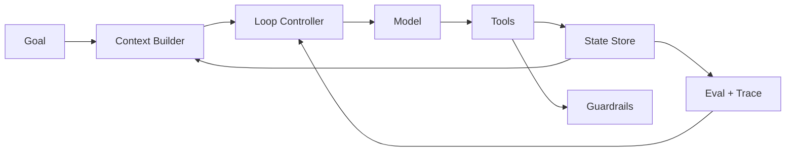
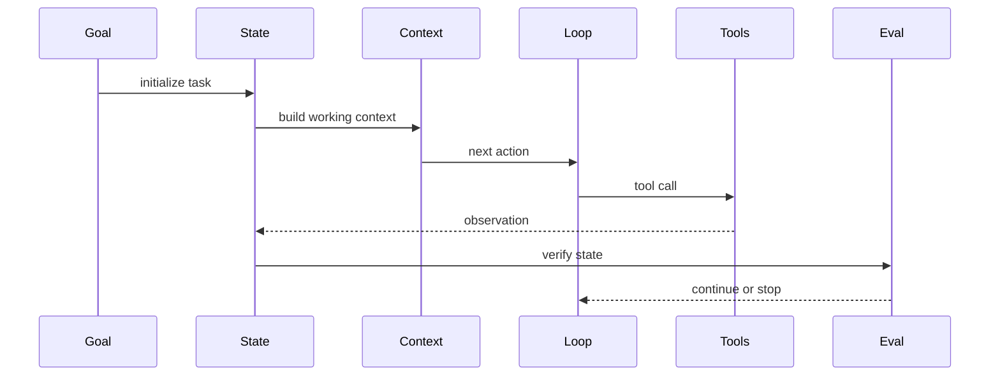

# Agent 七个核心模块

## 面试定位

这类题不是让你背组件清单，而是判断你能否审查一个 Agent 是否具备生产系统的骨架。回答要覆盖 Goal、State、Context、Tools、Loop、Guardrails、Eval，并说明它们之间的数据流和责任边界。

## 一句话定义

Agent 七个核心模块是：Goal 定义任务成功标准，State 保存可信运行状态，Context 给模型构造工作视图，Tools 连接外部能力，Loop 推进 observe/reason/act，Guardrails 管风险边界，Eval 证明系统有效。

缺少任一模块，Agent 都容易停在 demo：没有 State 就不可恢复，没有 Guardrails 就不安全，没有 Eval 就无法证明稳定。

## 为什么需要它

很多项目只把 LLM、prompt 和工具放在一起，就声称是 Agent。真正上线后会遇到目标漂移、状态丢失、工具误用、权限越界、循环不止和无法复盘。七模块是一套审查框架，能把“模型表现不好”拆成可定位的工程问题。

## 核心架构

图 1：Agent 七模块的最小生产闭环。

图里 Context 不是数据库，State 也不是聊天历史。State 是系统可信状态，Context 是给模型的一次性工作视图。Eval 不是上线后才补的报表，而是决定能否继续迭代的验证层。

## 架构与运行机制

数据流从 Goal 开始。用户目标和约束被转成成功标准，State 保存当前计划和工具结果，Context Builder 把相关状态、证据和工具说明放入模型上下文，Loop Controller 控制每一步动作，Tools 返回 observation，Guardrails 拦截风险，Eval 给出 verdict。

这些模块不是并列清单，而是一条闭环。Tools 的 observation 会更新 State，State 会影响下一轮 Context，Eval 会改变 Loop 的停止策略。

## 运行机制

实现时可以先做最小闭环：Goal、State、Tools、Trace 和 Verifier。再逐步增强 Context 压缩、权限策略、评测集和多 Agent。不要一开始堆复杂框架。

State 至少要记录 `goal`、`constraints`、`plan`、`current_step`、`tool_results`、`open_risks`、`state_version`。Trace 至少要记录 step、tool、arguments、observation、latency、cost 和 verdict。

七模块之间最容易混淆的是 Context、State 和 Memory。Context 是本轮传给模型的输入包，可以被裁剪、排序和压缩；State 是系统认为可信的当前事实，必须可恢复、可审计；Memory 是跨 run 的经验或用户偏好，进入 Context 前要经过选择和权限过滤。把三者都塞进 messages，会让 Agent 难以恢复，也难以解释为什么某一步做出了错误动作。

另一个关键边界是 Tools 与 Guardrails。工具 schema 只描述“怎么调用”，不等于“允许调用”。权限、风险等级、确认策略、速率限制和 side effect policy 应该由宿主或运行时掌握。模型可以提出 action proposal，宿主负责校验和执行，这样失败时才能区分“模型建议错了”还是“系统放行错了”。

## 关键设计取舍

| 模块 | 设计重点 | 常见风险 | 面试表达 |
| --- | --- | --- | --- |
| Goal | 成功标准和约束 | 目标模糊导致漂移 | 先定义 done |
| State | 可信状态和恢复点 | 只靠 messages 丢状态 | 可 checkpoint |
| Context | 预算内证据视图 | 上下文污染 | 有 builder 和过滤 |
| Tools | schema 与权限 | 裸露执行权 | 宿主管控 |
| Eval | 组件与轨迹评测 | 只看 demo | 有 regression |

## 生产落地细节

生产 Agent 要把七模块变成可观测对象。每次 run 要能回答：Goal 是什么，State 如何变化，Context 为什么包含这些信息，Tools 调了哪些，Guardrails 拦了什么，Eval 为什么通过或失败。

指标包括 `task_success_rate`、`tool_chain_success_rate`、`state_restore_success_rate`、`context_budget_usage`、`guardrail_trigger_rate` 和 `eval_regression_pass_rate`。

## 系统设计案例

Coding Agent Harness 可以按七模块拆：Goal 是 issue 和测试成功标准，State 是计划、已读文件和 patch，Context 是当前相关文件片段，Tools 是 read/apply_patch/run_tests，Loop 是修复迭代，Guardrails 是文件和 shell 权限，Eval 是测试和 diff 审查。

图 2：Coding Agent 中七模块的时序协作。

图 2 说明七模块不是静态清单，而是在每一步任务里反复闭合。Goal 初始化 State，Context Builder 从 State 取证据，Loop 选择下一步，Tools 产生 observation，Eval 决定继续、停止或回滚。面试里把这个时序讲清楚，比单纯背“七模块”更能体现工程理解。

## 真实问题与排障

如果一个 Agent 不稳定，先定位缺的是哪一层。目标漂移看 Goal 和 Verifier，重复调用看 Loop，越权看 Guardrails，答非所问看 Context，无法复盘看 Trace，修复后回归失败看 Eval。

排障时可以按“第一处不可解释状态变化”倒推。比如模型调用了错误工具，不要马上改 prompt，而要先看 Context 中工具说明是否污染、State 中计划是否过期、Tool schema 是否缺枚举约束、Guardrails 是否缺风险判断、Eval 是否把错误 observation 当成功。这样能把问题落到模块责任，而不是把所有故障都归因给模型。

## 常见误区与排障

常见误区是把 State 当聊天记录，把 Tools 当普通 API，把 Eval 当人工感觉。排障时不要只调 prompt，要沿模块检查数据流和指标。

## 面试追问

1. State 和 Context 的区别是什么？
2. 为什么 Tools 不能直接给模型执行权？
3. Eval 怎么证明 Agent 不是 demo？
4. 七模块里哪个最容易被忽略？

## 项目化表达

可以把任何项目按七模块讲一遍。Paper Agent 强调 Context、Citation 和 Eval；Travel Agent 强调 Goal、Tools 和 Guardrails；Coding Agent 强调 State、Loop、Trace 和测试 verifier。

## 深入技术细节

七模块真正落地时要有明确的数据契约。Goal 不只是标题，而是 `objective`、`success_criteria`、`constraints` 和 `stop_condition`；State 不只是聊天历史，而是 `state_version`、`plan`、`completed_steps`、`tool_results`、`risk_flags`；Context Builder 负责从 State、Memory、Evidence 和 Tool Specs 中裁剪本轮输入；Loop 只推进结构化 action；Eval 用外部证据、测试或规则给 verdict。

这些模块的边界决定排障路径。Context 出错会导致模型看不到关键证据，Tool 出错会导致 observation 不可信，State 出错会让旧错误被反复带入，Guardrails 出错会放大副作用，Eval 出错会把失败当成功。面试里能把一次失败映射到模块，比背组件名更有说服力。

## 关键数据结构与协议

| 字段 | 所属模块 | 工程作用 |
| :--- | :--- | :--- |
| `success_criteria` | Goal | 定义 done condition |
| `state_version` | State | 支持恢复和回滚 |
| `context_refs` | Context | 说明证据来源 |
| `tool_call_id` | Tools | 串联 action 和 observation |
| `risk_flags` | Guardrails | 控制高风险动作 |
| `verifier_verdict` | Eval | 决定继续或停止 |

协议上每一步都应进入 trace：输入的 context、模型输出的 action、工具 observation、state diff 和 verifier verdict。没有这些字段，Agent 失败后只能猜 prompt 哪里不对。

## 深问准备

被问“七模块怎么裁剪首版”时，可以回答先做 Goal、State、Tools、Trace、Verifier 的最小闭环，再补 Guardrails、Context 压缩和复杂 Eval。不要一开始堆多 Agent 或复杂记忆。

被问“State 和 Context 区别”时，强调 State 是可信持久事实，Context 是一次性工作视图；State 可恢复、可审计，Context 可压缩、可裁剪。把两者混用是很多长任务 Agent 不稳定的根因。

## 公开阅读校验

把七模块讲成文章时，最容易变成“组件清单”。公开读者真正需要的是一套可审查的验收口径：每个模块都要能落到数据结构、运行时事件和失败处置。一个 Agent 设计文档至少应说明 Goal 如何变成 done condition，State 哪些字段可恢复，Context 如何选择证据，Tools 的权限由谁裁决，Loop 什么时候停止，Guardrails 拦截哪些动作，Eval 用什么样本证明回归不过线。

生产验收可以用三张表串起来。第一张是模块责任表，列出 owner、输入、输出、持久化位置和失败码；第二张是 run trace 表，逐步记录 context_refs、action proposal、tool observation、state diff 和 verifier verdict；第三张是回归样本表，把历史失败映射到七模块中的责任层。这样团队讨论“Agent 不稳定”时，不会停留在模型或 prompt，而能定位到 State 污染、Context 缺证据、Tool schema 缺约束、Guardrail 放行错误或 Eval 漏测。

如果文章要给别人阅读，还要避免把七模块包装成必须一次建全的“大架构”。更稳的表达是分阶段：第一阶段先做 Goal、State、Tool、Trace、Verifier，证明任务能闭环；第二阶段补 Context Builder、权限策略和失败样本；第三阶段再引入长期记忆、多 Agent 或自动规划。这个顺序能把工程风险降下来，也更符合真实项目的交付节奏。

## 来源与延伸阅读

- [OpenAI A practical guide to building agents](https://cdn.openai.com/business-guides-and-resources/a-practical-guide-to-building-agents.pdf)：用于支撑“目标、工具、上下文、评估和运行控制需要工程化拆分”的总体框架。
- [Anthropic Building effective agents](https://www.anthropic.com/engineering/building-effective-agents)：用于支持从简单 workflow 到 agentic loop 的渐进式设计原则，避免一开始堆复杂自治系统。
- [AgentGuide Agent 学习地图](https://github.com/adongwanai/AgentGuide/blob/main/docs/00-getting-started/01-agent-map.md)：用于补充中文学习路径和面试语境下的模块化表达方式。
