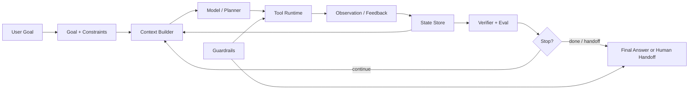
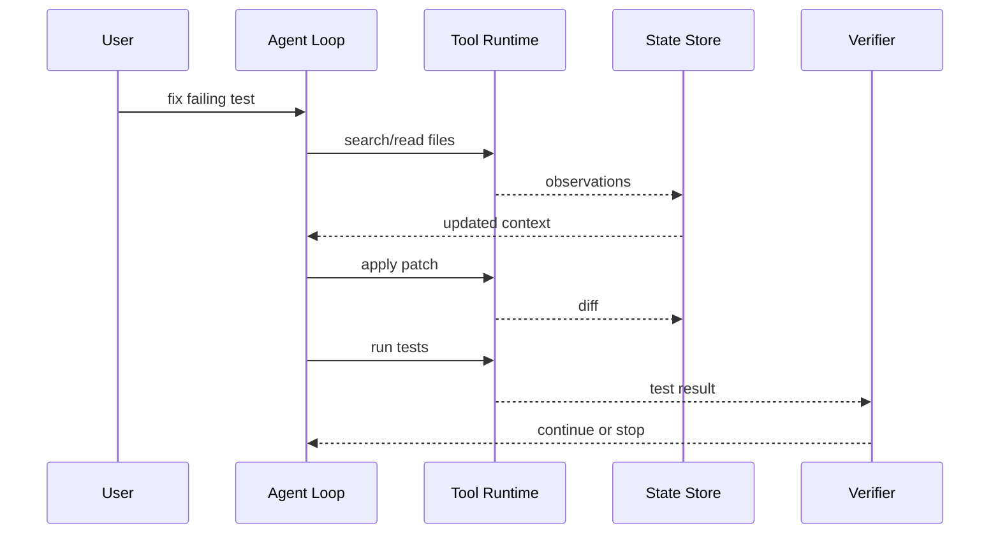

# Agent 的定义

## 面试定位

Agent 的定义不是背名词，而是划清系统边界。面试官通常想听你说明：什么任务值得让模型参与控制流，什么任务只需要 workflow；一个真实 Agent 为什么必须有 Goal、State、Tools、Feedback、Guardrails 和 Eval。

一个可用的开场是：Agent 是模型参与多步决策的工程系统，它围绕目标读取上下文、选择工具、接收环境反馈，并在受控边界内推进任务。它不是“接了 LLM 的聊天框”，也不是一次 function calling。

## 一句话定义

Agent 是由模型在受控运行环境中，根据目标、状态、工具结果和反馈，动态选择下一步动作并完成任务的系统。

这句话里最关键的是“受控”。模型可以参与决策，但执行权、权限边界、状态持久化、失败恢复和最终验收必须由宿主系统治理。

## 为什么需要它

当任务路径固定、分支明确、失败处理可枚举时，workflow 更稳定、更便宜、更容易验证。Agent 适合路径开放、需要环境反馈、步骤数不固定、工具结果会影响下一步决策的场景。

例如 Coding Agent 不知道一开始要读哪些文件，也不知道测试失败后要改哪一层。它需要 observe、plan、act、verify 的循环。但订单支付、退款提交这类强事务流程，不应该把整条路径交给 Agent。

## 核心架构

图 1：生产级 Agent 的核心控制闭环。

图 1 的重点是：Agent 不只是模型。Goal 定义成功标准，State 保存任务连续性，Tools 连接外部世界，Feedback 改变下一步决策，Guardrails 限制风险动作，Eval 决定结果是否可信。箭头里的循环意味着模型可以根据 observation 调整下一步，但所有工具执行、权限、预算、审计和停止条件仍由宿主系统治理。

## 架构与运行机制

Agent 的数据流通常是：用户目标进入系统，宿主提取约束和成功标准，Context Builder 选择相关状态、工具和资料，模型产生计划或动作，工具运行后返回 observation，State Store 记录状态变化，Verifier 判断继续、停止、重试或转人工。

这个机制里有两条边界必须讲清楚：

- 模型边界：模型参与决策，但不能直接拥有 API key、数据库连接或文件写入权。
- 系统边界：宿主负责权限、幂等、审计、预算、回滚、人工确认和失败复盘。

## 运行机制

一个生产级 Agent 至少要有这些对象：

- Goal：用户目标、成功标准、不能做的事。
- State：当前计划、已完成步骤、工具结果、open risks 和 state version。
- Tools：可调用能力、输入输出 schema、风险等级和超时策略。
- Feedback：工具返回、测试结果、检索证据、用户确认或拒绝。
- Guardrails：输入、输出和工具动作的风险控制。
- Eval：组件评测、轨迹评测和端到端任务成功率。

缺少 State，Agent 只能靠聊天历史硬撑。缺少 Eval，Agent 只能展示 demo。缺少 Guardrails，模型可能把不确定判断变成真实副作用。

## 关键设计取舍

| 选择 | 适用场景 | 优点 | 风险 |
| --- | --- | --- | --- |
| Workflow | 路径固定、合规强、状态机清楚 | 可控、便宜、易测试 | 难覆盖开放长尾 |
| Agent Loop | 步骤不确定、需要环境反馈 | 灵活，能探索和恢复 | 成本、延迟和失败形态更难控 |
| Hybrid | 大部分业务可编排，少数子任务开放 | 兼顾控制和灵活性 | 边界设计复杂 |
| Human-in-the-loop | 高风险写操作、交易、发布 | 降低误操作风险 | 用户等待时间增加 |

## 生产落地细节

生产系统不能只写 prompt。要先定义任务成功标准，再设计状态结构和工具契约。每个工具要有 schema、timeout、retry、risk level、owner 和 structured error。每次 run 要记录 `run_id`、`step_id`、tool call、observation、state diff、cost 和 verdict。

高风险动作要走 preview -> confirmation -> apply。长任务要有 checkpoint 和恢复策略。上下文压缩后必须能从 State 恢复，而不是依赖模型记住所有对话。

判断一个系统是否应该用 Agent，可以看四个条件：路径是否开放、步骤是否依赖环境反馈、失败是否需要动态恢复、成功标准是否能被验证。如果路径固定、状态强事务、错误处理可枚举，用 workflow 更稳；如果工具结果会改变下一步、问题空间需要探索、人工很难预先列出所有分支，Agent 才有价值。这个判断比“用了大模型所以是 Agent”更可靠。

## 系统设计案例

以 Coding Agent 为例，用户目标是“修复某个测试失败”。Agent 不应该直接开始改文件，而是先读取失败日志、搜索相关代码、形成计划、做最小补丁、运行测试、根据结果继续或回滚。

图 2：Coding Agent 的 observe-plan-act-verify 轨迹。

图 2 用 Coding Agent 展示“反馈改变控制流”的含义：Agent 先通过工具观察文件和测试，再根据 observation 修改 State，随后才应用补丁并运行验证。Verifier 不是装饰，它决定继续、停止、回滚还是交给人。没有这个验证节点，Agent 很容易把一次看似成功的生成误当成任务完成。

这个案例能说明 Agent 的价值来自反馈闭环，不是来自“用了大模型”这个标签。

## 真实问题与排障

Agent 线上失败要分层定位：Goal 是否含糊，Context 是否缺证据，Tool 是否参数错误，State 是否污染，Loop 是否停不下来，Guardrails 是否误放行，Eval 是否漏了失败样本。

常看指标包括 `task_success_rate`、`avg_steps`、`tool_error_rate`、`recovery_rate`、`unsafe_action_block_rate`、`human_handoff_rate`、`cost_per_task` 和 `p95_latency`。这些指标能把“Agent 不稳定”拆成可修的工程问题。

## 常见误区与排障

常见误区包括：把聊天机器人叫 Agent，把一次 function calling 叫 Agent，只讲框架名不讲状态和评测，用 prompt 替代权限控制。

排障时先看 trace。没有 trace 的 Agent 只能猜。好的 trace 应该能回答：模型为什么选这个工具，工具返回了什么，状态如何变化，Verifier 为什么允许继续或停止。

上线后还要区分“能力失败”和“治理失败”。能力失败可能是模型不会规划、检索证据不足或工具输出难理解；治理失败可能是权限过宽、工具错误码不结构化、状态污染、停止条件太松或评测集覆盖不够。前者需要改善模型上下文和工具设计，后者需要改运行时、guardrail、trace 和 eval，而不是简单换更大模型。

## 面试追问

1. Agent 和 workflow 的本质区别是什么？看你是否能讲控制流由谁决定。
2. 什么场景不该用 Agent？看你是否有工程取舍，而不是盲目追新。
3. Agent 必须有哪些模块？看你能否说出 Goal、State、Tools、Feedback、Guardrails、Eval。
4. 如何证明 Agent 不是 demo？看你是否理解 trace、eval 和 regression。

## 项目化表达

在 Paper Agent 里，Agent 价值是围绕论文证据反复检索、验证和引用，不是单次摘要。在 Travel Agent 里，Agent 价值是根据预算、时间和用户反馈动态调整方案，但支付、改签、取消必须由 workflow 和人工确认接管。在 Coding Agent 里，Agent 价值是根据测试和代码反馈迭代补丁。

## 深入技术细节

LLM Agent 可以定义为“模型参与多步控制流的受控工程系统”。关键不是是否用了 LLM，而是模型是否根据 State、Context、Tool Observation 和 Verifier Verdict 决定下一步。宿主系统负责权限、状态、工具执行、审计和停止条件，模型只参与决策。

一个生产 run 至少要记录 `goal`、`success_criteria`、`state_version`、`context_refs`、`tool_call`、`observation_ref`、`guardrail_verdict`、`verifier_verdict` 和 `stop_reason`。这些字段让 Agent 可复盘、可恢复、可评测。

## 关键数据结构与协议

| 字段 | 含义 | 边界 |
| :--- | :--- | :--- |
| `goal` | 用户目标 | 不等同聊天主题 |
| `state` | 可信进展 | 不等同上下文 |
| `context` | 本轮工作视图 | 可裁剪 |
| `tool_call` | 动作意图 | 宿主执行 |
| `observation` | 外部反馈 | 更新状态 |
| `eval` | 完成判断 | 阻止假完成 |

协议上，模型输出的 action 必须经过 runtime validation 和 policy gate。生产 Agent 是受控自主，不是无约束自治。

## 深问准备

被问“Agent 和聊天机器人区别”时，看控制流：聊天机器人主要生成回复；Agent 围绕目标、状态、工具和反馈推进任务，并有停止策略。

被问“如何证明不是 demo”，回答 trace、eval、失败样本、回归集和线上指标。单次成功演示不能证明 Agent 稳定。

## 来源与延伸阅读

- [Anthropic Building Effective Agents](https://www.anthropic.com/engineering/building-effective-agents)：用于支撑 workflow 与 agent 的边界、简单优先原则，以及何时才需要模型参与控制流。
- [OpenAI A Practical Guide to Building Agents](https://cdn.openai.com/business-guides-and-resources/a-practical-guide-to-building-agents.pdf)：用于说明模型、工具、指令、guardrails、handoff 和多 Agent 组成的工程框架。
- [OpenAI Agents SDK Concepts](https://openai.github.io/openai-agents-python/)：用于连接 Agent、tool、handoff、guardrail、trace 等运行时对象。
- [Model Context Protocol Documentation](https://modelcontextprotocol.io/docs)：用于补充工具和上下文接入协议，不把“能调工具”误判为完整 Agent。
- [AgentGuide Agent 学习地图](https://github.com/adongwanai/AgentGuide/blob/main/docs/00-getting-started/01-agent-map.md)：用于中文面试复习路径和概念导航，但生产判断仍以状态、工具、反馈和评测闭环为准。
