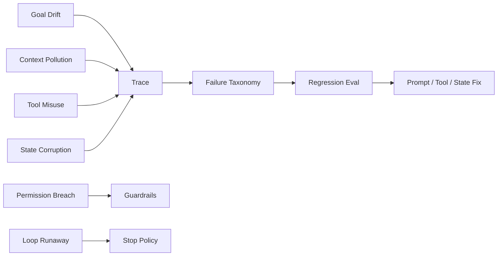
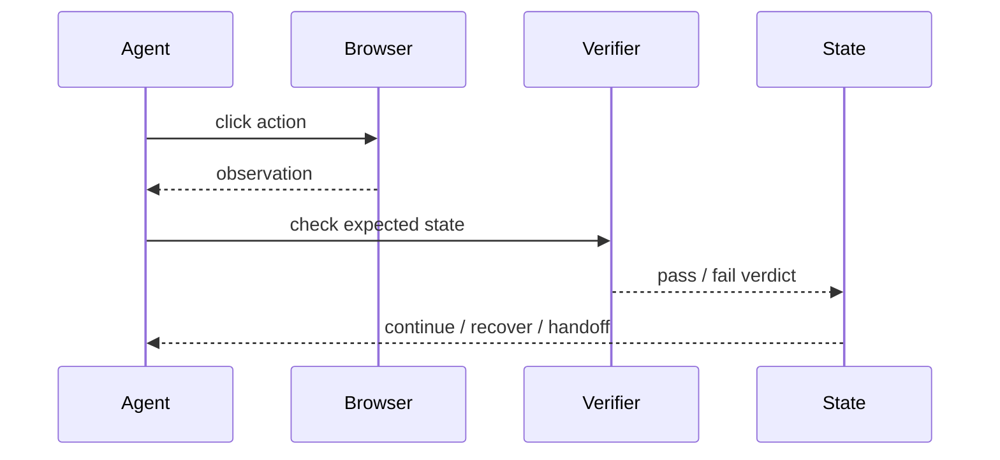

# Agent 常见失败模式

## 面试定位

Agent 失败模式题考的是线上治理能力。高质量回答要能把失败分成目标漂移、上下文污染、工具误用、状态污染、权限失控、循环不止和评测缺失，并说明如何用 trace 定位和恢复。

## 一句话定义

Agent 失败模式是模型、状态、工具、上下文、权限和评测在多步闭环里相互放大后产生的系统性故障。

它不是“模型偶尔答错”这么简单。开放任务会让错误沿工具链和状态链累积，所以必须用 taxonomy、trace、guardrails 和 regression 治理。

## 为什么需要它

只展示成功 demo 的 Agent 很容易误导。真实系统会遇到工具超时、上下文混入不可信指令、模型误选工具、状态被错误 observation 污染、循环无法停止、高风险动作误执行。提前定义失败模式，才能做监控和恢复。

## 核心架构

图 1：Agent 失败模式从信号到回归的治理链路。

这张图的关键是把失败变成分类数据，而不是事故后靠人回忆。每个失败样本都要能归因、复现和回归。

## 架构与运行机制

数据流上，失败通常在某一步 observation 后进入 State，再影响下一轮 Context，最后导致错误行动。比如一个错误检索结果进入上下文，模型据此调用写工具，权限层又没有拦截，就会形成复合故障。

因此排障要沿 run trace 看：输入、context、tool args、observation、state diff、guardrail verdict、stop reason。

失败模式通常不是单点错误，而是跨模块放大。比如一次检索噪声先变成错误 evidence，随后被 Context Builder 放进高优先级上下文，模型再据此生成错误 tool args，工具返回又被 State 当成可信事实，最后 Eval 没有识别偏差。这种链式故障只看最终答案很难定位，所以 taxonomy 必须记录“第一处偏离”和“放大路径”。

## 运行机制

常见恢复策略包括：目标重申、上下文隔离、工具参数修复、重试或换工具、回滚 state diff、人工接管、降级到 workflow、把样本加入 eval。

不要让模型自己判断所有错误是否可重试。`retryable` 应该由工具或宿主返回，并受预算和次数限制。

## 关键设计取舍

| 失败类型 | 典型症状 | 预防手段 | 恢复动作 |
| --- | --- | --- | --- |
| 目标漂移 | 做了无关任务 | success criteria | 重新规划 |
| 上下文污染 | 听从不可信内容 | source isolation | 清理 context |
| 工具误用 | 参数错或越权 | schema + permission | structured error |
| 状态污染 | 错误结果被记住 | state diff review | rollback |
| 循环不止 | 重复尝试 | max steps + stop policy | human handoff |

## 生产落地细节

Trace 至少记录 `run_id`、`step_id`、action、args hash、observation summary、state diff、guardrail verdict、error_code 和 stop_reason。Dashboard 要按 taxonomy 聚合失败，而不是只统计总失败率。

关键指标包括 `task_success_rate`、`tool_error_rate`、`recovery_rate`、`unsafe_action_block_rate`、`loop_timeout_rate`、`context_pollution_rate` 和 `regression_reopen_rate`。

## 系统设计案例

Web Agent 点击错误按钮后，后续状态可能继续基于错误页面执行。正确做法是每步 action 后都用 screenshot/DOM observation 验证目标状态，失败则停止、回退或转人工。

图 2：Web Agent 动作后的验证与恢复时序。

图 2 强调观察不是终点。Browser 返回 observation 后，Verifier 要检查是否达到预期状态，State 只接收经过判定的结果。若 verdict 为 fail，系统应该进入 recover 或 handoff，而不是让模型基于错误页面继续自由探索。

## 真实问题与排障

Agent 误判导致策略冲突时，先冻结当前 run，读取 trace，找到第一次错误 observation 或错误 state diff。再判断是模型选择问题、工具返回问题、上下文污染还是权限策略缺失。

排障报告最好包含四类证据：一是用户目标与 success criteria，证明系统当时应该做什么；二是关键 step 的 context refs 和 tool args，证明模型基于什么行动；三是 observation 与 state diff，证明错误如何进入系统状态；四是 guardrail 和 verifier verdict，证明为什么没有被拦截。没有这些证据，复盘容易停留在“模型不稳定”的空话。

## 常见误区与排障

常见误区是只调 prompt，不做 taxonomy；只看最终失败，不看中间轨迹；失败样本不入回归集。排障要从第一处偏差开始，而不是从最终答案倒猜。

## 面试追问

1. Agent 最常见失败有哪些？
2. 如何定位目标漂移？
3. 工具失败后如何恢复？
4. 如何避免失败样本反复出现？

## 项目化表达

Coding Agent 可以讲测试失败和 patch rollback。Paper Agent 可以讲 unsupported claim。Travel Agent 可以讲高风险动作确认。Web Agent 可以讲 action verifier 和截图回放。

## 深入技术细节

失败治理要从“最终答案错了”前移到“哪一步第一次偏离事实”。生产 trace 至少要保存 `run_id`、`step_id`、`goal_snapshot`、`context_refs`、`action_type`、`tool_args_hash`、`observation_id`、`state_diff`、`guardrail_verdict`、`error_code`、`verifier_verdict` 和 `stop_reason`。有了这些字段，才能判断是目标漂移、上下文污染、工具误用、状态污染还是权限缺口。

一个关键机制是 state diff review。每次 tool observation 写入 State 前，都应该标记来源、可信度和影响范围。检索结果、网页内容、用户输入和工具错误不能拥有同样可信级别；不可信 observation 只能进入 context 的证据区，不能直接覆盖任务事实。否则一次错误 observation 会在后续 loop 中被当成事实反复放大。

## 关键数据结构与协议

| 失败标签 | 首个可观测信号 | 处理动作 |
| --- | --- | --- |
| `goal_drift` | action 和 success criteria 不一致 | 重申目标或重规划 |
| `context_pollution` | 不可信来源影响指令 | 隔离 source 并清理 context |
| `tool_misuse` | invalid args 或错误工具 | 缩小工具面、修 schema |
| `state_corruption` | 错误 state diff 被持久化 | rollback state version |
| `loop_runaway` | 重复 action 无改进 | stop policy 或 handoff |
| `permission_gap` | 高风险动作未拦截 | 加 deterministic policy |

协议上要把失败样本进入 regression：保存输入、工具轨迹、预期行为、禁止动作和修复后的 verdict。只改 prompt 而不沉淀 taxonomy，下一次模型或工具版本变化后，同类问题仍会回来。

## 深问准备

如果面试官问“Agent 失败后怎么恢复”，可以按风险分层：读操作失败可以 retry 或 fallback，状态污染要 rollback，权限风险要立即停止，循环无改进要 handoff，高风险写操作要查 side effect status 并补偿。不同失败类型不能用同一个“再试一次”处理。

如果追问“怎么发现失败模式恶化”，看分层指标：`context_pollution_rate`、`loop_timeout_rate`、`tool_misuse_rate`、`state_rollback_count`、`unsafe_action_block_rate`、`regression_reopen_rate`。这些比单一 `task_success_rate` 更能定位工程问题。

## 公开阅读校验

失败模式文章要避免只罗列“可能出错”。公开读者更关心的是：发生问题时，系统怎样把事故变成可复现、可回归、可治理的样本。一个成熟的 Agent 失败治理流程，应该要求每个失败样本至少包含用户目标、成功标准、首个异常 step、上下文引用、工具参数、observation 摘要、state diff、guardrail verdict、最终影响和修复后的 regression verdict。

实践中可以把失败分成三层处理。第一层是即时止血：冻结 run、停止高风险工具、保存 trace、必要时回滚 state version。第二层是归因：判断首个偏离来自 Goal、Context、Tool、State、Guardrails、Loop 还是 Eval。第三层是沉淀：把输入、轨迹、禁止动作和期望行为写入 regression suite。只有走完第三层，才算真的修复了失败模式；否则只是把一次事故手工抹平。

还要强调“可重试”不是万能答案。读操作失败、网络抖动和临时限流可以受控重试；权限越界、状态污染、错误写入和循环失控应优先停止、回滚或人工接管。文章中把这些边界讲清楚，读者才会知道 Agent 工程不是盲目提升自治度，而是把可恢复性、可解释性和安全阈值前置。

一个可以写进方案评审的例子是：Web Agent 在设置页误点“删除”按钮。好的复盘不是说模型点错，而是还原为什么真实按钮和危险按钮都进入了候选集、ranker 为什么把危险按钮排前、policy gate 为什么没有识别高风险动作、verifier 为什么没有要求二次确认状态。这个例子能把失败模式从抽象标签落到工程责任链。

验收结论也应明确写出责任归属、下一次阻断点和复测样本编号。

## 来源与延伸阅读

- [Anthropic Building effective agents](https://www.anthropic.com/engineering/building-effective-agents)：用于支撑“简单、可组合 workflow 往往比过早自治更可靠”的失败治理原则。
- [OpenAI Agents SDK Tracing](https://openai.github.io/openai-agents-python/tracing/)：用于说明 agent、tool 和 workflow trace 是定位失败步骤、构建回归样本的基础。
- [AgentGuide 高质量资源筛选清单](https://github.com/adongwanai/AgentGuide/blob/main/docs/00-getting-started/03-resource-quality-checklist.md)：用于补充中文资料筛选与故障复盘时的证据质量意识。
