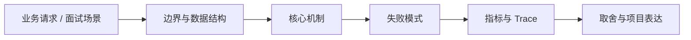

# State File、Verifier 与 Schedule

## 面试定位

State File、Verifier 与 Schedule 属于 AI 工程趋势与实战方案 / Loop Engineering 与 Agent Runtime。面试里它不是背概念题，而是用来判断你是否能把知识落到架构、数据流、指标和取舍上。
一句话定位：State file 保存目标、约束、进度、证据和下一步动作，verifier 负责判定是否继续、回滚、重试或交给人。

**必须讲清楚**
- State file 保存目标、约束、进度、证据和下一步动作，verifier 负责判定是否继续、回滚、重试或交给人。
- state 是事实源索引
- verifier 要看外部证据
- schedule 要有预算和截止条件

**常见追问方向**
- Agent state file 应该存哪些字段。
- 如何设计不会被模型自我说服的 verifier。
- state 版本、artifact 引用和恢复机制如何避免重复工作。
- 如果这个点落到 Coding Agent：代码库任务 Harness，架构如何设计？
- 线上失败时看哪些 trace、日志、指标，怎么回滚或补偿？

## 架构与运行机制

### 核心机制

- 长任务 Agent 不能只依赖聊天历史。
- schedule 负责把任务推进、暂停、恢复和超时策略显式化。

### 通用数据流

可以按用户目标、模型、上下文、状态、工具、执行循环、评测、安全和可观测性来讲。数据流是用户任务进入编排层，Context Builder 汇总系统指令、用户约束、RAG 证据、短期状态和工具结果，模型输出结构化动作，宿主程序执行工具并把 observation 写回 State 和 Trace。

### 工程落点

- state file 至少包含 state_version、goal、hard_constraints、plan、completed_steps、open_risks、artifact_refs。
- verifier 输入必须包含测试结果、截图、citation、diff 或工具 observation。
- 每次状态更新带 before_version 和 after_version，避免旧摘要覆盖新状态。
- 恢复前先校验 hard constraints、artifact 可访问性和 next_actions 是否仍有效。
- 字段至少包含 goal、constraints、plan、completed_steps、open_risks、artifact_refs、verifier_verdict、next_actions。
- verifier 不接受模型自评，必须读取测试、截图、引用或工具 observation。
- 把每个关键步骤都映射到可观测指标，避免只描述功能。
- 回答时主动说明哪些信息是强一致状态，哪些只是上下文或缓存视图。

## 可画图

图 1：State File、Verifier 与 Schedule 的回答要从业务入口进入，先讲边界和数据结构，再讲机制、失败模式、指标和取舍。

## 系统设计案例

### State File、Verifier 与 Schedule 的面试级设计题

典型设计题是企业内部 Agent、Coding Agent、Paper Agent 或 Web Agent：外层 deterministic workflow 管理权限、预算、审批和最终提交，内层 Agent loop 处理开放探索，Eval Gate 根据 golden case、轨迹评分、工具结果和人工反馈决定是否继续。

**可画架构**
- 入口层校验用户请求、权限、租户、参数和幂等键。
- 业务服务层决定同步处理、异步处理、缓存读写、数据库回源或降级返回。
- 状态层保存业务状态、缓存版本、事件状态和恢复点。
- 执行层处理存储访问、下游调用、异步任务和补偿动作，并把结构化结果写入 trace。
- 观测层用指标、日志和链路追踪证明系统可运行、可排障、可复盘。

**数据流**
- 请求进入入口层后生成 request_id/run_id。
- 业务服务读取缓存、数据库或异步事件状态，选择执行路径。
- 执行结果写回状态存储，并向监控系统上报延迟、错误和业务结果。
- 保护策略根据成功标准、失败次数、SLA 和风险等级决定继续、降级、补偿或停止。

## 真实问题与排障

真实线上问题一般从任务成功率、工具调用成功率、invalid args、上下文漂移、幻觉率、引用准确率、token 成本、延迟、guardrail block rate 和 human handoff rate 看起。回答时要把模型问题、检索问题、工具问题、状态问题和权限问题分开归因。

**排查顺序**
- 先确认用户可感知问题：错误率、延迟、成功率、数据一致性或结果质量是否异常。
- 再沿数据流定位是哪一段出了问题：入口、状态、缓存、数据库、异步事件、外部依赖或消费端。
- 对比最近发布、配置变更、流量变化、数据倾斜和下游限流。
- 先止血：限流、降级、回滚、暂停消费、隔离高风险工具或切换只读模式。
- 最后把失败样例进入 regression/eval，避免同类问题复发。

**重点指标**
- state_conflict_rate
- lost_constraint_rate
- verifier_false_accept_rate
- duplicate_work_rate
- artifact_ref_missing_rate

**常见误区**
- 摘要覆盖真实 trace
- verifier 只输出自然语言
- 没有版本号导致旧状态覆盖新状态

## 业界方案与技术取舍

AI Agent 的取舍是开放任务能力换来了不确定性、成本、延迟和治理复杂度。面试追问通常会围绕 workflow 与 agent 边界、memory 与 RAG 区别、function calling 是否等于 agent、eval 怎么证明不是 demo、如何做安全边界展开。

**方案对比**
- state file 是长任务 Agent 的任务账本，不是聊天摘要。
- verifier 要读取外部证据，不能接受模型一句“已经完成”。
- schedule 负责何时继续、暂停、重试、升级给人或终止。

**复习时要能讲出的细节**
- 这个知识点解决什么问题，不解决什么问题。
- 关键数据结构、状态变化、失败边界和可观测指标是什么。
- 面试官继续追问时，能从架构图、数据流、线上排障和项目证据四个角度展开。
- 能说明为什么这个取舍适合当前业务，而不是只背业界名词。

## 深入技术细节

State file 保存目标、约束、进度、证据和下一步动作，verifier 负责判定是否继续、回滚、重试或交给人。

面试深挖时要把对象、状态、协议、执行顺序和失败分支讲出来。不要只说“可以用 Redis/数据库/MQ 解决”，而要说明 key、字段、版本、超时、重试、幂等、降级和观测指标如何共同工作。

## 关键数据结构与协议

| 字段 | 所属对象 | 作用 | 排障价值 |
| :--- | :--- | :--- | :--- |
| `run_id` | State file | 串联一次长任务 | 复盘任务恢复路径 |
| `state_version` | 状态版本 | 标识每次状态更新 | 防止旧摘要覆盖新事实 |
| `hard_constraints` | 约束区 | 保存用户不可违反条件 | 排查约束丢失 |
| `artifact_refs` | 证据区 | 引用 diff、截图、测试、citation | 验证器读取外部事实 |
| `verifier_verdict` | 验证结果 | continue/retry/rollback/handoff/stop | 判断是否错误放行 |
| `schedule_policy` | 调度策略 | 预算、轮次、截止时间、暂停恢复 | 防止无限循环和重复工作 |

## 深问准备

被追问边界时，先说这个方案适合什么、不适合什么，再给反例。被追问线上故障时，按影响面、止血、根因、修复、回归五段回答。被追问项目时，把回答落到你做过的接口、缓存、队列、数据库、监控或 Agent 工程链路。

- 反例要明确，例如强事务事实源不能交给缓存或搜索读模型。
- 指标要可执行，例如 p95、error_rate、retry_rate、lag、miss_rate、stale_rate。
- 回归要可复现，例如固定输入、故障注入、压测脚本或 golden case。

## 趋势落地补充

State file 的难点不是把聊天记录落盘，而是把“可恢复任务”拆成事实字段。生产设计里应区分三类信息：目标和硬约束是不可被摘要覆盖的事实，plan 和 next_actions 是可重排的执行意图，tool observation、diff、截图、测试日志和引用是 verifier 需要读取的证据。这样恢复任务时才能判断“下一步还能不能做”，而不是只相信上一轮模型说自己做到哪里。

Verifier 也要分层：格式 verifier 检查结构化输出是否满足 schema，artifact verifier 检查文件、测试、截图或 citation 是否真实存在，policy verifier 判断是否越权、超预算或需要人工确认。最容易出事故的是 false accept，也就是模型把部分完成、截图过期或测试未跑说成完成。面试回答可以把 `verifier_false_accept_rate`、`duplicate_work_rate`、`resume_success_rate` 和 `artifact_ref_missing_rate` 作为核心指标。

## 生产验收清单

- 状态字段要有 `state_version`、`run_id`、`goal`、`hard_constraints`、`artifact_refs`、`verifier_verdict` 和 `next_actions`，并记录 before/after 版本。
- Schedule 要设置最大轮次、最大成本、超时、暂停恢复、人工门禁和终止条件，避免无限循环。
- 恢复演练要覆盖状态文件丢字段、artifact 不可访问、旧摘要覆盖新证据、工具结果过期和用户约束变更。
- 每次 verifier 放行都要能追到外部证据，不能只保存一句自然语言 verdict。

## 公开阅读校验

公开读者看 State File、Verifier 与 Schedule，要理解它解决的是长任务 Agent 的“可恢复”和“可证明完成”问题。State file 不是聊天记录，也不是自然语言总结，而是任务账本：目标、硬约束、进度、证据、风险、下一步和版本都要可读可比较。Verifier 不是让模型自评，而是读取外部证据后给出可执行 verdict。

一个生产方案至少要说明三件事。第一，状态如何防覆盖：每次更新有 before_version、after_version 和 state_diff。第二，证据如何防丢失：测试日志、截图、diff、citation 和工具 observation 都用 artifact_ref 管理。第三，调度如何防失控：max steps、cost budget、deadline、暂停恢复、人工接管和 stop reason 都要写入 schedule policy。

排障时可以围绕 false accept 复盘：verifier 是否读取了最新 artifact，artifact 是否过期，硬约束是否进入 state，模型是否把未验证假设提升成事实，schedule 是否允许重复执行同一步。能按这些字段复盘，文章才真正讲清了 State File 与 Verifier 的工程价值。

还可以补一个恢复场景：长任务执行到一半断开，恢复时系统先读取 state file，校验 `state_version`、`hard_constraints` 和 `artifact_refs`，再检查最近一次 verifier verdict 是否仍有效。如果测试日志已经过期、代码 diff 被用户改过、截图不可访问或用户新增约束，schedule 应暂停并重新规划，而不是继续执行旧的 next_action。这个例子能帮助读者理解 state file 是任务控制面，不是记忆备份。

## 来源与延伸阅读

- [Addy Osmani: Loop Engineering](https://addyosmani.com/blog/loop-engineering/)：用于确认官方语义边界、命令行为和工程约束。
- [OpenAI: A practical guide to building agents](https://cdn.openai.com/business-guides-and-resources/a-practical-guide-to-building-agents.pdf)：用于确认官方语义边界、命令行为和工程约束。
