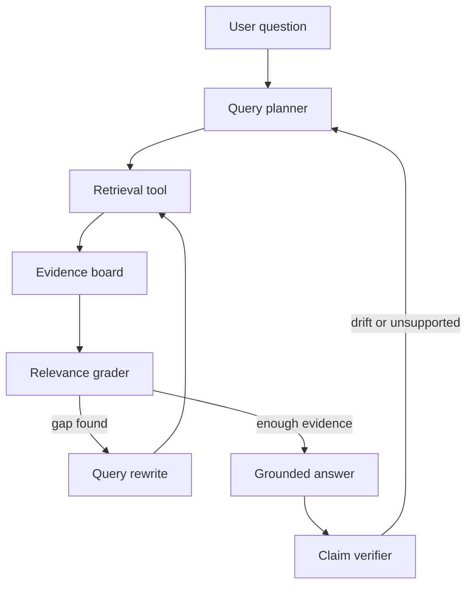

# Agentic RAG

## 一句话定义

Agentic RAG 是让 Agent 通过 query planner、retrieval tool、relevance grader、query rewrite 和循环控制，按证据缺口多轮检索、验证和生成答案的 RAG 模式。它的核心风险是 loop 失控和主题 drift。

## 面试定位

面试官问 Agentic RAG，通常想知道你是否理解普通 RAG 与 Agent 检索循环的差异。普通 RAG 是一次检索生成，Agentic RAG 会规划子问题、调用检索工具、评估证据缺口并决定是否继续。

回答要覆盖架构、数据流、指标、取舍和追问。重点不是“多查几次”，而是每次检索都要有理由和停止条件。

## 为什么需要它

复杂问题往往无法一次检索解决。比如比较多个框架、总结论文脉络或排查线上问题，需要先拆问题，再按子问题找证据，遇到冲突还要补查。

Agentic RAG 能提升复杂任务的覆盖度，但也带来成本、延迟、主题漂移和错误累积。因此必须有 query planner、relevance grader、stop policy 和 trace。

## 核心架构

图 1：Agentic RAG 的规划、检索、证据评估和回退闭环。

这张图里最重要的状态是 Evidence board。Planner 负责把用户问题拆成可检索的子问题，Retrieval tool 只负责召回候选，Relevance grader 判断证据是否能回答当前子问题，Query rewrite 只能针对明确 gap 继续检索。Claim verifier 是最后一道防线：如果答案漂移或 claim 没有证据，系统应回到 planner 或输出 unsupported，而不是继续编造。

| 模块 | 职责 | 关键指标 | 风险 |
| :--- | :--- | :--- | :--- |
| query planner | 拆子问题和检索计划 | plan_coverage | 过度拆分 |
| retrieval tool | 执行检索 | recall@k | 噪声召回 |
| relevance grader | 判断证据是否足够 | evidence_precision | 误判充分 |
| query rewrite | 生成下一轮查询 | gap_resolution | drift |
| stop policy | 控制循环 | loop_count、cost | 无限检索 |

## 架构与运行机制

Agentic RAG 的循环必须显式建模。每一轮都记录 query、检索结果、选择证据、缺口理由和是否继续。继续检索的原因应来自 evidence gap，例如缺定义、缺对比、来源过旧或证据冲突。

主题 drift 要靠原始问题和当前子查询对齐来控制。系统可以要求每次 query rewrite 都引用原始问题中的目标，并在 final answer 前检查 claim 是否仍对应用户问题。

## 运行机制

1. Query planner 将复杂问题拆成子问题和检索顺序。
2. Retrieval tool 执行 hybrid search 或专门数据源查询。
3. Evidence board 汇总证据、来源、时间和支持的 claim。
4. Relevance grader 判断证据是否足够回答子问题。
5. 缺口明确时生成 query rewrite，再进入下一轮检索。
6. Stop policy 根据证据充分度、轮数、成本和时间停止。
7. 最终答案走 citation grounding 和 claim verifier。

## 关键设计取舍

| 取舍 | 好处 | 代价 | 建议 |
| --- | --- | --- | --- |
| 单次 RAG | 快、简单 | 覆盖复杂问题弱 | 简单问答优先 |
| Agentic RAG | 覆盖度高 | 成本和漂移风险 | 复杂调研使用 |
| 自动循环 | 少打扰用户 | 可能跑偏 | 需要 stop policy |
| 人工澄清 | 方向更稳 | 交互成本 | 缺关键约束时触发 |

## 生产落地细节

- 每轮检索都要记录 query、reason、retriever、evidence_ids、grader verdict 和 cost。
- query rewrite 不能脱离原始问题，需要 drift detector。
- relevance grader 要区分“相关”和“能回答”。
- stop policy 要限制最大轮数、最大 cost 和最大 latency。
- 指标包括 evidence_gap_rate、loop_count、drift_rate、answer_success_rate、citation_precision 和 cost_per_answer。

工程上还要把 Agentic RAG 拆成可降级路径。如果 planner 生成过多子问题，可以先退化成普通 RAG；如果检索证据冲突，可以输出“证据不足”并列出冲突点；如果成本接近上限，可以停止循环并说明未覆盖的 gap。公开产品里，承认证据不足通常比生成一个看似完整但无来源的答案更可靠。

权限和数据源边界也要提前设计。企业知识库可能同时包含公开文档、客户数据、内部策略和用户私有文件。Evidence board 需要记录 source、ACL、freshness、confidence 和 allowed_usage，最终答案只能引用当前用户有权访问的证据。否则 Agentic RAG 的多轮检索会把普通 RAG 的权限问题放大。

## 系统设计案例

用户问“LangGraph 和 OpenAI Agents SDK 选型怎么做”。Agentic RAG 可以先规划子问题：状态建模、工具调用、handoff、trace、部署和生态。每个子问题分别检索官方文档，再把证据放入 evidence board。

数据流是：planner 拆解，retrieval tool 查资料，grader 判断是否缺少某个维度，query rewrite 补查，最后生成对比表。Claim verifier 确保每个选型结论都有 citation 支持。

## 真实问题与排障

如果 Agent 越查越偏，先看 query rewrite 是否偏离原始问题，再检查 relevance grader 是否把主题相近但无答案的文档判成充分。如果成本过高，检查 loop_count 和每轮 top_k。

止血可以降低最大轮数、要求人工确认新方向，或把复杂问题先拆成明确子任务。

如果答案看起来完整但引用不支持结论，要沿 evidence board 检查三件事：目标 claim 是否在检索计划里出现，selected evidence 是否真的覆盖该 claim，claim verifier 是否只检查了“有 citation”而没有检查“citation 支持什么”。很多 RAG 事故不是没有引用，而是引用与结论之间缺少可验证关系。

## 常见误区与排障

- 把 Agentic RAG 当成“多检索几次”。
- 没有 evidence gap，仍然盲目继续检索。
- query rewrite 逐轮漂移。
- 只记录最终答案，不保存检索轨迹。
- 不区分相关证据和可回答证据。

## 面试追问

- Agentic RAG 什么时候不值得用？
- 如何防止多轮检索主题漂移？
- relevance grader 失败怎么办？
- stop policy 应该看哪些指标？
- 如何用 trace 复盘错误答案？

## 项目化表达

项目里可以说：“我把 Agentic RAG 设计为带状态的检索循环。每轮检索都有 query planner、retrieval tool、relevance grader 和 stop policy，最终答案经过 citation grounding，trace 可回放每个证据缺口。”

## 深入技术细节

Agentic RAG 的核心状态是 evidence board，而不是聊天历史。每轮检索要写入 `sub_question`、`query`、`retriever`、`filters`、`candidate_ids`、`selected_evidence_ids`、`gap_reason`、`grader_verdict`、`drift_score` 和 `cost`。下一轮 query rewrite 必须引用原始问题和当前 gap，避免越查越偏。

Relevance grader 要区分相关、可回答和足够回答。一个文档提到 LangGraph，不代表能回答“LangGraph 和 Agents SDK 如何选型”。如果 grader 只看语义相似，就会把噪声证据判成充分，最终生成 unsupported claim。更稳的是按子问题检查 evidence 是否覆盖定义、机制、指标、边界和反例。

## 关键数据结构与协议

| 字段 | 含义 | 控制点 |
| --- | --- | --- |
| `sub_question` | 子问题 | 保持检索目标 |
| `gap_reason` | 缺什么证据 | 触发下一轮 |
| `drift_score` | 与原问题偏离度 | 防止主题漂移 |
| `loop_count` | 检索轮数 | 控制成本 |
| `evidence_board` | 证据集合 | 支持 grounding |
| `stop_verdict` | 充分/不足/超预算 | 决定输出形态 |

协议上 stop policy 必须能输出三种结果：证据充分，生成答案；证据不足但可继续，补检索；证据不足且超预算或缺关键约束，输出 unsupported 或追问用户。不能让循环无限寻找“更好证据”。

## 深问准备

被问“什么时候不值得用 Agentic RAG”时，可以回答：简单事实问答、答案来源单一、延迟要求极高、或没有可靠 verifier 的场景，普通 RAG 更合适。Agentic RAG 适合复杂调研和多跳问题，但成本和漂移风险更高。

被问“如何复盘错答”，从 trace 看正确证据是否被检索、grader 是否误判 gap、query rewrite 是否漂移、最终 claim 是否通过 citation verifier。这样能把错误定位到 retrieval、grading、planning 或 generation，而不是笼统说 RAG 失败。

## 来源与延伸阅读

- [Anthropic: Building effective agents](https://www.anthropic.com/engineering/building-effective-agents)：用于支撑“先用 workflow，必要时再引入 agentic loop”的设计取舍。
- [LangChain RAG tutorial](https://python.langchain.com/docs/tutorials/rag/)：用于补充检索、生成和应用层状态组织的基础做法，作为普通 RAG 与 Agentic RAG 的对照。
- [OpenAI Agents SDK Tools](https://openai.github.io/openai-agents-python/tools/)：用于说明工具调用、schema 和运行时控制是 Agentic RAG 检索循环可工程化的基础。
- [OpenAI Cookbook](https://cookbook.openai.com/)：用于补充检索增强、评估和结构化生成的实践样例。
