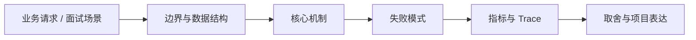

# AI Code Review Pipeline

## 面试定位

AI Code Review Pipeline 属于 AI 工程趋势与实战方案 / Coding Agent 工程化。面试里它不是背概念题，而是用来判断你是否能把知识落到架构、数据流、指标和取舍上。
一句话定位：AI Code Review 应是确定性规则、diff 分析、上下文检索、LLM review、行级评论和回归指标组成的 pipeline。

**必须讲清楚**
- AI Code Review 应是确定性规则、diff 分析、上下文检索、LLM review、行级评论和回归指标组成的 pipeline。
- review 先看 diff
- 规则和模型互补
- 评论要可定位可复核

**常见追问方向**
- AI Code Review pipeline 如何设计。
- 如何让评论可定位、可复核、低噪声。
- 规则、静态分析、测试和 LLM review 如何组合。
- 如果这个点落到 Coding Agent：代码库任务 Harness，架构如何设计？
- 线上失败时看哪些 trace、日志、指标，怎么回滚或补偿？

## 架构与运行机制

### 核心机制

- 好的 AI review 不只是让模型读完整仓库，而是围绕 changed files、dependency impact、test evidence 和风险规则组织上下文。
- LLM 负责语义风险和解释，规则负责确定性门禁。

### 通用数据流

可以按用户目标、模型、上下文、状态、工具、执行循环、评测、安全和可观测性来讲。数据流是用户任务进入编排层，Context Builder 汇总系统指令、用户约束、RAG 证据、短期状态和工具结果，模型输出结构化动作，宿主程序执行工具并把 observation 写回 State 和 Trace。

### 工程落点

- 解析 PR diff，提取 changed files、changed ranges、依赖影响和测试证据。
- 先跑 lint、typecheck、security rules、secret scan 等确定性检查。
- 为 LLM reviewer 构造最小上下文：diff、相关代码、规则结果、项目约束。
- 输出 finding schema：file、line、severity、evidence、confidence、fix_hint、model_version。
- 记录 finding_type、file、line、evidence、severity、confidence、rule_id、model_version。
- 用误报率、漏报率、comment_action_rate 和 review_latency 评估。
- 把每个关键步骤都映射到可观测指标，避免只描述功能。
- 回答时主动说明哪些信息是强一致状态，哪些只是上下文或缓存视图。

## 可画图

图 1：AI Code Review Pipeline 的回答要从业务入口进入，先讲边界和数据结构，再讲机制、失败模式、指标和取舍。

## 系统设计案例

### AI Code Review Pipeline 的面试级设计题

典型设计题是企业内部 Agent、Coding Agent、Paper Agent 或 Web Agent：外层 deterministic workflow 管理权限、预算、审批和最终提交，内层 Agent loop 处理开放探索，Eval Gate 根据 golden case、轨迹评分、工具结果和人工反馈决定是否继续。

**可画架构**
- 入口层校验用户请求、权限、租户、参数和幂等键。
- 业务服务层决定同步处理、异步处理、缓存读写、数据库回源或降级返回。
- 状态层保存业务状态、缓存版本、事件状态和恢复点。
- 执行层处理存储访问、下游调用、异步任务和补偿动作，并把结构化结果写入 trace。
- 观测层用指标、日志和链路追踪证明系统可运行、可排障、可复盘。

**数据流**
- 请求进入入口层后生成 request_id/run_id。
- 业务服务读取缓存、数据库或异步事件状态，选择执行路径。
- 执行结果写回状态存储，并向监控系统上报延迟、错误和业务结果。
- 保护策略根据成功标准、失败次数、SLA 和风险等级决定继续、降级、补偿或停止。

## 真实问题与排障

真实线上问题一般从任务成功率、工具调用成功率、invalid args、上下文漂移、幻觉率、引用准确率、token 成本、延迟、guardrail block rate 和 human handoff rate 看起。回答时要把模型问题、检索问题、工具问题、状态问题和权限问题分开归因。

**排查顺序**
- 先确认用户可感知问题：错误率、延迟、成功率、数据一致性或结果质量是否异常。
- 再沿数据流定位是哪一段出了问题：入口、状态、缓存、数据库、异步事件、外部依赖或消费端。
- 对比最近发布、配置变更、流量变化、数据倾斜和下游限流。
- 先止血：限流、降级、回滚、暂停消费、隔离高风险工具或切换只读模式。
- 最后把失败样例进入 regression/eval，避免同类问题复发。

**重点指标**
- false_positive_rate
- false_negative_rate
- comment_action_rate
- review_latency_p95
- defect_escape_rate

**常见误区**
- 整仓暴力塞上下文
- 只输出泛泛建议
- 没有误报和漏报评估

## 业界方案与技术取舍

AI Agent 的取舍是开放任务能力换来了不确定性、成本、延迟和治理复杂度。面试追问通常会围绕 workflow 与 agent 边界、memory 与 RAG 区别、function calling 是否等于 agent、eval 怎么证明不是 demo、如何做安全边界展开。

**方案对比**
- AI Code Review 不是把整个仓库塞进模型，而是围绕 diff 和风险信号构建审查流水线。
- 确定性规则负责可证明问题，LLM 负责语义风险、上下文解释和可读建议。
- 评论质量要用误报、漏报、采纳率和回归效果评估。

**复习时要能讲出的细节**
- 这个知识点解决什么问题，不解决什么问题。
- 关键数据结构、状态变化、失败边界和可观测指标是什么。
- 面试官继续追问时，能从架构图、数据流、线上排障和项目证据四个角度展开。
- 能说明为什么这个取舍适合当前业务，而不是只背业界名词。

## 深入技术细节

AI Code Review 应是确定性规则、diff 分析、上下文检索、LLM review、行级评论和回归指标组成的 pipeline。

面试深挖时要把对象、状态、协议、执行顺序和失败分支讲出来。不要只说“可以用 Redis/数据库/MQ 解决”，而要说明 key、字段、版本、超时、重试、幂等、降级和观测指标如何共同工作。

## 关键数据结构与协议

| 字段 | 所属对象 | 作用 | 排障价值 |
| :--- | :--- | :--- | :--- |
| `review_run_id` | Review run | 串联 diff、规则、LLM 评论和反馈 | 定位一次误报或漏报 |
| `changed_range` | Diff context | 限定评论必须落在可定位代码行 | 避免泛泛建议 |
| `evidence_ref` | Finding evidence | 指向规则结果、相关代码或测试失败 | 支持人工复核 |
| `severity` | Finding | 区分 blocker/major/minor/nit | 控制噪声和门禁 |
| `confidence` | Finding | 表达模型置信度 | 支持低置信过滤 |
| `rule_id/model_version` | 来源版本 | 区分规则发现和模型发现 | 追踪质量退化 |

## 深问准备

被追问边界时，先说这个方案适合什么、不适合什么，再给反例。被追问线上故障时，按影响面、止血、根因、修复、回归五段回答。被追问项目时，把回答落到你做过的接口、缓存、队列、数据库、监控或 Agent 工程链路。

- 反例要明确，例如强事务事实源不能交给缓存或搜索读模型。
- 指标要可执行，例如 p95、error_rate、retry_rate、lag、miss_rate、stale_rate。
- 回归要可复现，例如固定输入、故障注入、压测脚本或 golden case。

## 趋势落地补充

AI Code Review 的趋势重点是“把 review 做成流水线”，而不是“让模型发表意见”。稳定链路通常先解析 diff 和 changed ranges，再跑确定性规则、secret scan、类型检查和测试；随后只把相关上下文交给 LLM reviewer，最后把评论规范化成 file、line、severity、evidence、confidence 和 fix_hint。

动手实验可以从一个小仓库开始，收集 20 个 PR 或补丁样例，把人工确认的问题作为 golden findings。评估时分开看 false_positive_rate、false_negative_rate、comment_action_rate 和 review_latency_p95。这样能解释为什么 Open Code Review / code-review-graph 的价值在 pipeline 和证据，而不只是“模型能看代码”。

## 生产验收清单

- 输入必须固定为 PR diff、changed range、依赖影响、相关测试和项目规则，避免整仓暴力塞上下文。
- Finding schema 至少包含 `file`、`line`、`severity`、`evidence`、`confidence`、`rule_id/model_version` 和 `fix_hint`。
- 发布前要用历史 PR 样本回放，分别统计误报、漏报、重复评论、无行号评论和被开发者采纳的比例。
- 线上要支持按规则、模型版本、仓库、语言和目录关闭高噪声评论，并保留人工 override。
- 不能让 LLM review 替代编译、测试、安全扫描和 code owner 审批，它更适合补语义风险与上下文解释。

## 公开阅读校验

公开文章讲 AI Code Review Pipeline，要把“模型看代码”转成“审查流水线”。读者应看到输入先被限制在 PR diff、changed ranges、依赖影响、测试证据和项目规则内；确定性规则先跑，LLM 只处理语义风险、上下文解释和修复建议。这样能减少整仓上下文污染，也能避免模型替代已有门禁。

评论质量的验收不能只看“生成了多少条”。一条合格 finding 应有 file、line、severity、evidence、confidence、fix_hint 和来源版本，并且能被开发者复核。平台指标要看 false_positive_rate、false_negative_rate、duplicate_comment_rate、comment_action_rate 和 defect_escape_rate。评论多但采纳率低，说明系统在制造噪声。

还要说明灰度与回滚。Review 规则或模型升级前，应在历史 PR golden set 上回放，比较误报、漏报、延迟和高噪声目录。上线后支持按仓库、语言、目录、rule_id 或 model_version 关闭评论。这样 AI Review 才像工程系统，而不是一次性代码建议工具。

一个具体验收样例是：同一组历史 PR 先跑基线静态规则，再跑 AI review pipeline，最后由人工标注哪些评论有价值。报告要区分 blocking finding、actionable suggestion 和 style nit。只有 actionable suggestion 的采纳率提高、blocking finding 的漏报下降、重复评论减少，才说明 pipeline 带来收益。否则模型只是把 code review 变成更吵的通知流。

排障时也要沿流水线定位。无行号评论多，检查 diff parser 和 changed_range；证据不足，检查 context retrieval；误报集中在某个框架，检查规则和示例；漏报安全问题，检查 deterministic scanner 是否缺失。这样读者能看到 AI Review 的质量来自 pipeline 设计，而不是来自模型一次性判断。

## 来源与延伸阅读

- [Alibaba Open Code Review](https://github.com/alibaba/open-code-review)：用于确认官方语义边界、命令行为和工程约束。
- [Anthropic: Effective tools for agents](https://www.anthropic.com/engineering/effective-tools-for-agents)：用于确认官方语义边界、命令行为和工程约束。
