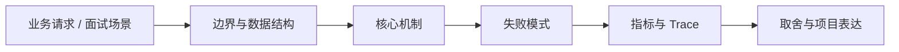

# 行为面试：AI 不确定性、失败复盘与工程取舍

## 面试定位

行为面试：AI 不确定性、失败复盘与工程取舍 属于 AI 求职作品集与项目表达 / 行为面试、失败与取舍。面试里它不是背概念题，而是用来判断你是否能把知识落到架构、数据流、指标和取舍上。
一句话定位：AI 岗位行为面试会追问不确定性、失败、合规、跨团队协作和成本取舍，需要准备真实复盘话术。

**必须讲清楚**
- 行为面试：AI 不确定性、失败复盘与工程取舍 是 AI 工程生产化能力的一部分，关注 behavioral story、failure review、cross-functional collaboration、risk and tradeoff。
- STAR story bank、failure retrospective、tradeoff matrix 是团队复盘、验收和面试表达的核心证据。
- 只讲技术成功，无法体现成熟工程判断和协作能力 是这个主题最容易被追问的生产风险。
- AI 岗位行为面试会追问不确定性、失败、合规、跨团队协作和成本取舍，需要准备真实复盘话术。
- behavioral story、failure review、cross-functional collaboration、risk and tradeoff 要服务生产问题
- STAR story bank、failure retrospective、tradeoff matrix 必须可版本化和可复盘
- 只讲技术成功，无法体现成熟工程判断和协作能力 要有门禁和降级

**常见追问方向**
- 面试官会追问这个能力在 demo 和 production 之间差在哪里。
- 高质量回答要能给出核心对象、关键字段、指标、失败路径和回归办法。
- 如果被问是否亲自做过，可以用 one-pager、eval report、trace、README 和事故复盘证据支撑。
- 如果这个点落到 Coding Agent：代码库任务 Harness，架构如何设计？
- 线上失败时看哪些 trace、日志、指标，怎么回滚或补偿？

## 架构与运行机制

### 核心机制

- 生产 AI 系统要先定义可验证边界，再谈模型效果。
- 所有关键配置、数据、prompt、模型、工具和评测结果都要可追溯。
- 质量、延迟、成本、安全和用户体验要一起权衡，不能只优化单一指标。
- 失败样本要进入回归集，避免同类问题重复发生。
- 行为面试：AI 不确定性、失败复盘与工程取舍 的面试重点是把 behavioral story、failure review、cross-functional collaboration、risk and tradeoff 拆成输入、处理、状态、输出、指标和失败路径。
- 生产落地时要保留 STAR story bank、failure retrospective、tradeoff matrix，并能解释它如何支持排障、回归和团队协作。
- Versioned artifact registry。
- Trace and eval pipeline。
- Canary release with rollback。
- Human review for high-risk cases。
- 关键字段至少包含 id、version、owner、tenant、input_hash、output_hash、status、error_code、trace_id 和 created_at。
- 指标看 story_bank_count、failure_learning_count、tradeoff_quality_score、collaboration_signal_count、behavioral_mock_pass_rate，并按场景、租户、模型版本和发布版本分桶。
- 排障时先定位 STAR story bank、failure retrospective、tradeoff matrix 的版本，再回放 trace、对比 eval、检查最近数据或配置变更。

### 通用数据流

可以按业务场景发现、用户 workflow、人机协同、置信度/引用/fallback、产品指标、失败 UX、生产 readiness、项目 one-pager、系统设计图、README、eval report、简历 bullet 和面试讲述来讲。数据流不是纯技术链路，而是从真实痛点进入方案、证据、指标、失败复盘和可展示产物。

### 工程落点

- 先定义目标、输入、输出、风险和成功指标，再选模型、工具或框架。
- 把 prompt、model、config、data、eval、trace 和 release 都版本化。
- 上线前准备 golden cases、回归门禁、成本预算、降级策略和人工接管路径。
- 设计时先定义 owner、version、tenant scope、timeout、retry、fallback 和 audit 字段。
- 上线前用 golden cases、trace replay、灰度和 rollback plan 验证 只讲技术成功，无法体现成熟工程判断和协作能力 不会扩散成生产事故。
- 把每个关键步骤都映射到可观测指标，避免只描述功能。
- 回答时主动说明哪些信息是强一致状态，哪些只是上下文或缓存视图。

## 可画图

图 1：行为面试：AI 不确定性、失败复盘与工程取舍 的回答要从业务入口进入，先讲边界和数据结构，再讲机制、失败模式、指标和取舍。

## 系统设计案例

### 行为面试：AI 不确定性、失败复盘与工程取舍 的面试级设计题

典型场景是把个人 AI 项目、公司 AI 功能或 take-home 作业包装成可信作品集。架构上要包含用户任务、约束、数据来源、模型/工具/RAG/Agent 设计、评测指标、上线边界、失败样例、截图/trace、成本和后续路线。

**可画架构**
- 问题发现层：明确用户、业务痛点、AI 适配度、非 AI baseline 和成功指标。
- 体验层：设计 HITL、置信度、引用、低置信度 fallback、失败 UX 和用户可控边界。
- 工程层：展示数据流、模型/工具/RAG/Agent 组件、权限、安全、成本和上线门禁。
- 证据层：README、系统设计图、eval report、trace screenshot、demo、incident/failure case 和指标。
- 表达层：简历 bullet、one-pager、5/15/45 分钟讲述、take-home 模板和行为面试复盘。

**数据流**
- 从真实用户任务出发，先定义 baseline、目标用户、成功指标和失败不可接受边界。
- 把 AI 能力拆成输入、上下文、模型、工具、验证、人审、输出和观测。
- 把工程结果沉淀为 README、架构图、eval 表、trace 截图、错误案例和产品指标。
- 面试时按时间窗口裁剪讲述：5 分钟讲价值和架构，15 分钟讲机制和指标，45 分钟讲系统设计与取舍。

## 真实问题与排障

真实求职表达问题一般从项目像 demo、没有业务指标、没有失败边界、README 只写安装、简历 bullet 没影响、系统设计讲不出取舍、面试故事过长或过短看起。回答时要把项目压成 5/15/45 分钟三个版本，并准备失败、成本、质量、安全和权衡追问。

**排查顺序**
- 先确认项目表达问题是业务价值不清、工程深度不够、指标缺失、失败边界空白还是材料不可读。
- 检查 README 是否有问题、架构、Quick Start、eval、quality gates、limitations 和 roadmap。
- 检查简历 bullet 是否包含动作、技术、指标、影响和约束，而不是只列框架名。
- 用模拟面试追问失败案例、成本、质量、安全、HITL、低置信度和上线差距。
- 把不能证明的能力降级表达为 future work 或 unsupported，避免 demo-only 叙事。

**重点指标**
- story_bank_count
- failure_learning_count
- tradeoff_quality_score
- collaboration_signal_count
- behavioral_mock_pass_rate

**常见误区**
- 回避失败
- 把问题都归咎模型
- 不讲沟通和取舍

## 业界方案与技术取舍

作品集表达的取舍是展示深度和可读性之间的平衡。面试追问通常会围绕为什么需要 AI、为什么不是规则系统、HITL 怎么设计、低置信度怎么处理、上线还差什么、指标如何证明有效、失败案例怎么复盘展开。

**方案对比**
- Versioned artifact registry。
- Trace and eval pipeline。
- Canary release with rollback。
- Human review for high-risk cases。
- 更强模型通常提升质量但增加成本、延迟和供应商依赖。
- 更严格门禁降低事故概率但会放慢发布节奏。
- 更完整观测提升可诊断性但增加存储、隐私和基数治理成本。
- AI 求职补强的核心不是再背一个框架名，而是能把模型、数据、服务、评测、安全、成本和项目表达串成可上线系统。
- 回答时先说明这个能力解决哪类生产问题，再讲数据流、失败模式、指标和取舍。
- 用户的 Java 架构经验应被迁移到 AI 系统：接口契约、异步任务、观测、灰度、回滚和事故复盘都是 AI 工程的底座。
- 可以把既有 Java 架构经验迁移到 AI 系统的契约、异步、观测、发布和事故治理。
- 面试表达时用业务目标、架构图、指标、失败案例和改进闭环证明不是停留在 demo。

**复习时要能讲出的细节**
- 这个知识点解决什么问题，不解决什么问题。
- 关键数据结构、状态变化、失败边界和可观测指标是什么。
- 面试官继续追问时，能从架构图、数据流、线上排障和项目证据四个角度展开。
- 能说明为什么这个取舍适合当前业务，而不是只背业界名词。

## 深入技术细节

AI 岗位行为面试会追问不确定性、失败、合规、跨团队协作和成本取舍，需要准备真实复盘话术。 行为面试：AI 不确定性、失败复盘与工程取舍 是 AI 工程生产化能力的一部分，关注 behavioral story、failure review、cross-functional collaboration、risk and tradeoff。 STAR story bank、failure retrospective、tradeoff matrix 是团队复盘、验收和面试表达的核心证据。 只讲技术成功，无法体现成熟工程判断和协作能力 是这个主题最容易被追问的生产风险。 生产 AI 系统要先定义可验证边界，再谈模型效果。 所有关键配置、数据、prompt、模型、工具和评测结果都要可追溯。 质量、延迟、成本、安全和用户体验要一起权衡，不能只优化单一指标。 失败样本要进入回归集，避免同类问题重复发生。

面试深挖时要把作品集从“我做了一个 AI demo”提升到“我发现问题、设计系统、验证指标、处理失败、知道上线差距”。

## 关键数据结构与协议

| 字段 | 所属对象 | 作用 | 排障价值 |
| :--- | :--- | :--- | :--- |
| `user_problem` | 场景 | 标识真实痛点 | 判断 AI 是否必要 |
| `baseline` | 对照方案 | 标识非 AI 或规则方案 | 证明收益不是空话 |
| `quality_metric` | 质量指标 | 衡量准确率、成功率或 groundedness | 支撑作品集可信度 |
| `cost_metric` | 成本指标 | 记录 token、延迟、人工审核或云资源 | 回答商业取舍 |
| `failure_case` | 失败样本 | 记录错答、拒答、越权或 UX 失败 | 证明你做过复盘 |
| `portfolio_artifact` | 展示材料 | README、one-pager、eval report 或 demo | 支撑面试讲述 |

## 深问准备

被追问边界时，先说这个方案适合什么、不适合什么，再给反例。被追问线上故障时，按影响面、止血、根因、修复、回归五段回答。被追问项目时，把回答落到你做过的接口、缓存、队列、数据库、监控或 Agent 工程链路。

- 反例要明确，例如强事务事实源不能交给缓存或搜索读模型。
- 指标要可执行，例如 p95、error_rate、retry_rate、lag、miss_rate、stale_rate。
- 回归要可复现，例如固定输入、故障注入、压测脚本或 golden case。

## 来源与延伸阅读

- [Anthropic Engineering: Building Effective Agents](https://www.anthropic.com/engineering/building-effective-agents)：用于确认官方语义边界、命令行为和工程约束。
- [OpenAI API Docs: Production Best Practices](https://platform.openai.com/docs/guides/production-best-practices)：用于确认官方语义边界、命令行为和工程约束。
