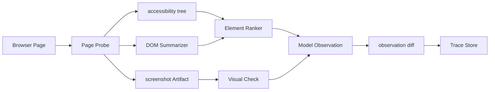

# Browser Agent 观察层

## 面试定位

Browser Agent 观察层考的是“模型看到的页面状态是否足够可靠”。面试官通常会追问：为什么不能把完整 DOM 直接塞给模型，accessibility tree、截图和可见文本各自解决什么问题，动作失败后怎样用 trace 复盘。

## 一句话定义

Browser Agent 观察层把页面的 URL、title、accessibility tree、可见文本、interactive_elements、screenshot 和 observation diff 压缩成模型可用的 observation，并把原始证据保存到 trace 或 artifact store。

## 为什么需要它

网页不是稳定 API。DOM 会变化，元素会被弹窗遮挡，canvas 和图片可能没有语义节点，第三方页面文本还可能包含 untrusted content。观察层的任务不是“尽量多给模型信息”，而是给出短、稳、可追溯的状态，让模型知道当前在哪里、能点什么、上一步造成了什么变化。

## 核心架构

图 1：Browser Agent 观察层的数据融合链路。

图中 Page Probe 是可信边界的入口，它负责把浏览器状态、语义树、DOM 摘要和截图证据拆成不同来源。Ranker 只把可交互候选和必要页面摘要交给模型，Trace Store 则保留更重的原始证据。这个边界很重要：模型不应该直接吃完整 DOM，也不应该把网页正文当成高优先级指令；它拿到的是经过压缩、标注和可回放的 observation。

## 架构与运行机制

数据流从页面采集开始。Page Probe 记录 URL、title、viewport、loading state 和截图引用。Accessibility Extractor 抽取 role、name、value、checked、disabled 等语义信息。DOM Summarizer 删除 script、style、hidden 噪声，只保留主内容、链接、输入框和按钮。Element Ranker 产出 interactive_elements，字段包括 id、role、name、locator candidates、bbox、visible、enabled、risk_level 和 source。

每次动作后都要生成 observation diff。diff 至少比较 URL、title、main_text_hash、元素状态、焦点元素和截图区域。网页内容默认是 untrusted content，只能作为 evidence，不能提升为 system 指令。

## 运行机制

accessibility tree 适合按钮、表单和菜单，因为它接近用户可感知语义。DOM 摘要适合稳定定位和结构化提取。screenshot 适合遮挡、弹窗、canvas、布局异常和 DOM 与视觉不一致的场景。生产系统通常先用语义和 DOM，遇到低置信或视觉任务再触发截图分析。

## 关键设计取舍

| 观察方式 | 强项 | 风险 | 面试表达 |
| --- | --- | --- | --- |
| accessibility tree | role/name 稳定，token 少 | 页面语义差时缺信息 | 优先作为可交互候选来源 |
| DOM summary | 结构清楚，可定位 | 完整 DOM 噪声大 | 只保留任务相关块 |
| screenshot | 处理遮挡和视觉状态 | 成本和延迟更高 | 作为 verifier 或低置信补充 |
| observation diff | 证明动作是否生效 | 需要保存前后状态 | 每步写 trace，失败可回放 |

## 生产落地细节

Observation schema 至少包含 `observation_id`、`url`、`title`、`visible_text_summary`、`interactive_elements`、`screenshot_ref`、`dom_hash`、`trust_labels` 和 `previous_diff`。关键指标包括 `element_hit_rate`、`observation_diff_accuracy`、`dom_screenshot_mismatch_rate`、`stale_observation_rate`、`context_tokens` 和 `vision_latency`。

发布到生产环境时，观察层还要区分三类失败。第一类是“看不见”：候选元素漏召、iframe 未展开、shadow DOM 未采集或 lazy loading 未完成。第二类是“看错了”：候选元素存在但被遮挡、同名按钮排序错误、视觉状态和 DOM 状态不一致。第三类是“看见但不能信”：页面文本包含 prompt injection、广告或第三方脚本输出，不能让它覆盖系统策略。三类失败对应不同修复方向，不能都推给模型推理能力。

一个成熟的 Observation Builder 会把 observation 设计成可差分对象：每一步都有前态、动作、后态和 expected_state。比如 `click(button#cancel)` 后，预期不是“click 成功”，而是 `confirmation_dialog.visible=true`、`url` 不发生异常跳转、焦点进入弹窗、主按钮集合发生变化。只有这些状态变化被验证，Agent 才能继续下一步。

## 系统设计案例

Web Agent 要在订单页面找到“取消订阅”按钮。观察层先输出页面标题、账户区域摘要和候选按钮。模型选择按钮后，执行层点击并重新 observe。若 URL 没变、按钮仍存在且截图出现二次确认弹窗，diff 应提示“动作进入确认步骤”，而不是让模型误以为任务完成。

## 真实问题与排障

如果 Agent 点错元素，先看 interactive_elements 是否漏了真实按钮。若按钮存在但 locator 错，检查 ranker 和 locator candidates。若 DOM 显示可点但页面没有反应，查看 screenshot 是否存在遮挡或 disabled 状态。若模型受网页恶意文本诱导，检查 trust label 是否丢失。

线上复盘时建议按“证据是否采到、候选是否排对、动作是否命中、状态是否变化、指令是否被污染”五层排查。证据未采到时补 probe；候选排错时调 ranker；动作命中但状态不变时看 actionability 和 overlay；状态变化被误判时补 diff 规则；指令污染时收紧 trust label 和 tool policy。这套链路能把“Agent 随机点错”拆成可修复的工程问题。

## 常见误区与排障

- 把完整 HTML 放进上下文，导致成本高且噪声大。
- 只依赖 CSS selector，页面轻微改版就失败。
- 只看 Playwright 动作成功，不验证页面状态变化。
- 把网页正文当成高优先级指令。

## 面试追问

1. DOM-only 和 screenshot+vision 如何取舍？先讲成本和覆盖，再讲 verifier。
2. observation diff 存什么？URL、title、文本 hash、元素状态、截图区域和焦点。
3. prompt injection 怎么隔离？网页内容标 untrusted content，工具权限由宿主判断。
4. 如何证明观察层有效？用 element hit、diff accuracy 和失败 replay。

## 项目化表达

可以说：我在 Web Agent 中把观察层做成 Page Probe、DOM Summarizer、Element Ranker 和 Diff Engine。模型只看压缩 observation，trace 保存 screenshot 与 DOM 引用。线上失败可以从 observation_id 复盘模型为什么认为某个元素可点。

## 深入技术细节

观察层的难点是把“不稳定页面”转成“稳定事实”。Page Probe 要采集 URL、title、viewport、loading state、focus、截图引用和 DOM hash；Accessibility Extractor 要保留 role、name、value、disabled、checked、expanded；Element Ranker 要为每个候选生成 locator candidates，并标注可见性、可点击性、bbox 和风险等级。

网页文本默认是不可信数据源。它可以作为 evidence 帮助模型理解页面，但不能改变系统指令、工具权限或安全策略。Observation Builder 应给不同来源打 trust label：系统工具结果、浏览器状态、网页正文、用户输入、第三方脚本，各自进入 context 的优先级不同。

## 关键数据结构与协议

| 字段 | 作用 | 排障用途 |
| :--- | :--- | :--- |
| `observation_id` | 标识一次观察 | 串联动作前后状态 |
| `interactive_elements` | 可操作候选 | 分析漏召或错点 |
| `locator_candidates` | 定位策略 | 恢复 selector drift |
| `screenshot_ref` | 视觉证据 | 排查遮挡和布局 |
| `trust_labels` | 来源可信级别 | 防 prompt injection |
| `previous_diff` | 前后变化 | 判断动作是否生效 |

协议上每个动作后都要重新 observe。不能因为 Playwright click 返回成功，就认为页面状态完成；必须用 diff 和 expected_state 证明页面真的进入下一阶段。

## 深问准备

被问“为什么不直接给完整 DOM”时，可以回答：完整 DOM 噪声大、token 高、含隐藏元素和不可信脚本；更稳的是给模型压缩 observation，把完整 DOM 和截图放 artifact store。

被问“截图什么时候用”时，说明截图适合视觉布局、遮挡、canvas、弹窗和 DOM/视觉不一致场景；默认主通道仍是 accessibility tree 和 DOM summary，因为它们更便宜、更结构化。

## 公开阅读校验

浏览器观察层的公开文章要特别防止一个误解：观察不是把页面内容尽可能多地交给模型，而是把页面状态转换成可信、短小、可复盘的操作事实。生产系统里，模型看到的 observation 应该比原始页面更少，但证据链要更完整。完整 DOM、截图、网络日志和 trace 可以留在 artifact store，模型只接收当前任务必要的候选元素、页面摘要、风险标签和前后 diff。

验收时可以准备一组页面状态用例：按钮同名、元素被遮挡、弹窗覆盖、iframe 嵌套、加载中、DOM 可见但不可点击、视觉状态与 accessibility tree 不一致、网页正文包含 prompt injection。每个用例都检查 observation 是否正确标注候选元素、可操作性、trust label 和 expected_state。这个用例集比单纯跑一个自动点击流程更能证明观察层可靠。

文章还应把动作执行和观察验证分开。`click` 返回成功只能说明浏览器接受了动作，不代表业务状态完成。观察层必须在动作后重新采集页面，并用 diff 对照预期状态，例如 URL 是否变化、焦点是否进入弹窗、按钮集合是否改变、错误提示是否出现。这个边界讲清楚，读者才会理解为什么 Browser Agent 需要 observation layer，而不是只靠 Playwright 或浏览器自动化 API。

## 来源与延伸阅读

- [Playwright Locators](https://playwright.dev/docs/locators)：官方文档用于支持“优先使用 role、label、text 等用户可感知定位方式”的设计原则。
- [Playwright Auto-waiting](https://playwright.dev/docs/actionability)：用于说明 click/fill 等动作前的 visible、stable、enabled、receives events 检查，支撑“动作成功不等于状态完成”的边界。
- [Playwright Best Practices](https://playwright.dev/docs/best-practices)：用于支持稳定定位、用户可见属性和端到端测试可维护性的工程实践。
- [Playwright Debugging](https://playwright.dev/docs/debug)：用于解释 actionability logs、截图和 trace viewer 如何服务于观察层排障。
