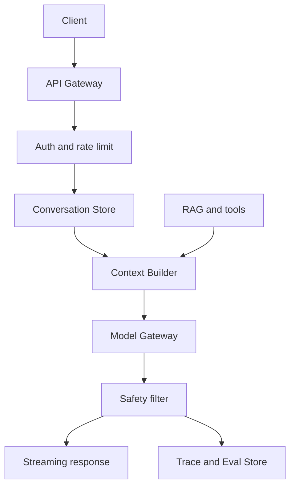

# ChatGPT 的运行链路

## 一句话定义

ChatGPT 类应用的运行链路，是一次用户请求从 API Gateway 进入后，经过身份与限流、Conversation Store、Context Builder、Model Gateway、safety filter、streaming 输出、Trace/Eval Store 的完整在线推理流程。

## 面试定位

面试官问 ChatGPT 运行链路，通常不是让你复述产品功能，而是看你能否从后端服务视角描述一个 LLM 应用请求如何稳定、安全、可观测地完成。

回答要覆盖架构、数据流、指标、取舍和追问。重点包括上下文如何构建、权限如何隔离、输出如何流式返回、失败如何降级。

## 为什么需要它

很多人以为 ChatGPT 就是“前端把问题发给模型”。真实系统要处理会话、权限、检索、工具、内容安全、成本、延迟、重试、审计和评测。

理解运行链路后，才能回答企业内部助手、代码助手、客服助手如何做权限隔离和可观测性。

## 核心架构

图 1：ChatGPT 类应用的一次在线推理链路。

图中 Client 到 API Gateway 是入口边界，Auth and rate limit 决定请求是否可以继续进入会话层。Conversation Store 只负责保存和读取历史状态，Context Builder 才负责把历史、证据、工具和策略组装成本轮 `ContextPack`。Model Gateway 是模型供应商、模型版本、超时和降级策略的边界；Safety filter 与 Trace/Eval Store 则保证输出既能被安全策略检查，也能在事故后按 `request_id` 回放。

| 模块 | 职责 | 关键指标 |
| --- | --- | --- |
| API Gateway | 鉴权、限流、request_id | 4xx/5xx、qps |
| Conversation Store | 保存消息和元数据 | read/write latency |
| Context Builder | 拼接指令、历史、证据和工具 | context_tokens |
| Model Gateway | 路由模型、timeout、retry、fallback | latency、cost |
| safety filter | 输入输出安全策略 | block_rate |
| streaming | 增量返回 token | first_token_latency |

## 架构与运行机制

一次请求会先通过网关鉴权、限流和场景路由。Conversation Store 读取历史消息和摘要。Context Builder 根据权限、窗口预算和任务类型组装上下文，包括 system instruction、用户问题、历史摘要、RAG evidence、tool schema 或 tool observation。

Model Gateway 选择模型和参数，并处理 timeout、retry、fallback、成本记录。输出可以 streaming 返回给客户端，同时进入 safety filter 和 trace。高风险输出需要 verifier 或人工确认。

这条链路最重要的工程边界是“会话状态”和“模型可见上下文”不能混为一谈。会话库里可能保存完整消息、附件、工具结果和用户反馈，但 Context Builder 每次只能选择当前用户、当前租户、当前任务有权限且有必要的片段。进入模型前应生成 context manifest，记录哪些内容被采用、哪些内容因 token budget、权限、过期或低相关性被裁掉。这样用户投诉“模型明明知道上次说过”时，排查对象不是模型记忆，而是本轮 manifest 是否读取了对应摘要或 evidence。

另一个边界是 streaming 与安全检查的先后关系。低风险问答可以边生成边返回，但涉及隐私、代码执行、金融、医疗、权限操作时，系统通常需要 sentence-level buffer、最终 schema check 或 delayed release。否则 first token 虽然快，但不安全内容可能已经发到客户端。面试里可以把它讲成三层控制：入口拦截恶意请求，中间控制工具和上下文，出口审计最终答案。

## 运行机制

1. Client 发送请求，API Gateway 生成 request_id。
2. Auth 层确认用户、租户、权限和速率限制。
3. Conversation Store 读取会话历史和摘要。
4. Context Builder 只拼接当前用户有权访问的内容。
5. Model Gateway 调用模型，并处理超时、重试和降级。
6. 输出通过 safety filter、schema check 或 verifier。
7. streaming 将 token 增量返回，Trace/Eval Store 记录链路。

## 关键设计取舍

| 取舍 | 收益 | 代价 | 建议 |
| --- | --- | --- | --- |
| streaming | 体感延迟低 | 中途拦截复杂 | 高延迟模型常用 |
| 长历史全量注入 | 上下文完整 | 成本和污染高 | 用摘要和检索 |
| 强安全过滤 | 风险低 | 误杀和延迟 | 分风险等级 |
| 多模型 fallback | 可用性高 | 一致性变差 | trace 记录模型 |

## 生产落地细节

- request_id 要贯穿客户端、网关、模型、工具和 trace。
- Context Builder 必须做权限过滤，避免跨用户或跨租户数据进入上下文。
- streaming 输出仍要做安全策略和最终审计。
- 对模型服务要设置 timeout、retry、circuit breaker 和 fallback。
- 指标包括 first_token_latency、end_to_end_latency、context_tokens、output_tokens、cost、fallback_rate、safety_block_rate 和 user_feedback_rate。

## 系统设计案例

企业内部 ChatGPT 助手处理制度问答时，API Gateway 先验证用户部门。Context Builder 只检索该用户有权限的制度文档。Model Gateway 选择低温度参数。答案输出前，verifier 检查 citation 和敏感信息。

数据流是：请求 -> 鉴权 -> 会话读取 -> 权限检索 -> 上下文构建 -> 模型 -> safety filter -> streaming -> trace。任何一步失败都能按 request_id 回放。

## 真实问题与排障

如果用户看到别的部门信息，优先查 Context Builder 的权限过滤和缓存 key。若首 token 很慢，拆分网关、检索、模型和安全过滤耗时。若成本激增，看 context_tokens、重试率和模型路由。

排障时不要只看模型日志，要看整条数据流。

一个典型事故是跨租户缓存污染：团队为了降低成本缓存了“同 prompt 的答案”，但 cache key 只包含 prompt hash，没有包含 tenant、user_scope、evidence version 和 model_route。影响面是相同问题下不同权限用户可能看到不该看的引用。止血动作是关闭共享缓存或切到 per-tenant cache；根因通常是把 prompt 文本等同于请求语义，忽略了上下文包的权限字段；回归检查要增加 `ContextPack` cache-key eval，断言同 prompt、不同 scope 必须生成不同 key。

## 常见误区与排障

- 把运行链路简化成前端调用模型。
- 历史消息无限拼接。
- 安全过滤只做输入，不做输出。
- streaming 时不记录完整 trace。
- 缓存 key 缺少 user 或 tenant。

## 面试追问

- Context Builder 如何控制权限和 token？
- streaming 输出如何做安全拦截？
- 模型超时时如何降级？
- 会话历史如何压缩？
- 企业内部助手如何防跨租户泄漏？

## 项目化表达

项目里可以说：“我把 ChatGPT 类应用设计成一条在线推理链路。API Gateway 管入口，Context Builder 管上下文和权限，Model Gateway 管模型调用，safety filter 管安全，Trace/Eval 管可观测和回归。”

## 深入技术细节

ChatGPT 类应用的核心状态不是单条 prompt，而是一组被版本化的上下文层。入口层生成 `request_id` 后，Auth 把 `tenant_id`、`user_id`、role、department、data_scope 写入 request context。Context Builder 根据 task type 选择是否读取 conversation summary、RAG evidence、memory record、tool schema。这里最容易出错的是把历史摘要、检索证据和用户新指令混成一段纯文本，导致权限、来源和优先级丢失。

Streaming 也不是简单把模型 token 原样转发。真实系统常见做法是首 token 快速返回，但同时保留最终输出审计：流式片段进入 buffer，结束后跑 schema check、citation verifier、PII/secret scan 和 safety verdict。高风险场景可以采用 delayed streaming 或 sentence-level buffering，让 safety filter 能在更完整的语义单元上判断。

## 关键数据结构与协议

请求上下文可以建模为 `RequestContext`：`request_id`、`session_id`、`tenant_id`、`user_scope`、`rate_limit_bucket`、`risk_level`、`model_route`、`trace_flags`。上下文包可以建模为 `ContextPack`：`system_policy`、`conversation_summary`、`evidence_items`、`tool_descriptors`、`memory_items`、`token_budget`、`dropped_context`。每个 evidence item 都应包含 `source_id`、`acl`、`version`、`retriever_score` 和 `expires_at`。

Trace 协议要能回答三个问题：请求为什么用了这个模型，模型看到了哪些证据，输出为什么被允许。建议记录 `model_name`、`prompt_hash`、`context_token_count`、`retrieval_top_k`、`first_token_ms`、`total_latency_ms`、`safety_verdict`、`fallback_reason`。这些字段比一大段不可检索日志更适合面试里讲可观测性。

## 深问准备

- 如果追问“streaming 时如何做安全”，回答要区分输入安全、流式中间缓冲、最终输出审计和高风险场景延迟发送。
- 如果追问“历史摘要会不会泄露权限”，要说明摘要本身也需要 scope、version 和重新授权，不能跨用户复用。
- 如果追问“Model Gateway 怎么做 fallback”，要讲 timeout、rate limit、模型不可用、质量降级和 trace 中的 fallback_reason。
- 如果追问“为什么缓存 key 要包含 tenant”，要说明相同 prompt 在不同权限上下文下答案证据不同，共享缓存会造成数据泄漏。

## 来源与延伸阅读

- [OpenAI Text generation guide](https://platform.openai.com/docs/guides/text)：官方文档，用于支持“文本生成请求需要明确输入、输出和模型参数”的基础链路。
- [OpenAI Streaming guide](https://developers.openai.com/api/docs/guides/streaming-responses)：官方文档，用于说明 streaming 输出、事件流和客户端增量消费的机制边界。
- [OpenAI Prompt engineering guide](https://platform.openai.com/docs/guides/prompt-engineering)：官方文档，用于解释指令、上下文和输出约束如何影响模型行为。
- [OpenAI Agents SDK Tracing](https://openai.github.io/openai-agents-python/tracing/)：官方文档，用于支持 trace、span、工具调用和运行回放在 Agent 应用中的可观测性设计。
