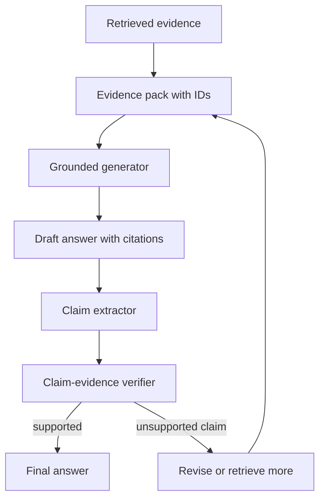

# 引用与 Grounding

## 一句话定义

引用与 Grounding 是让回答中的每个关键 claim 都能回到 citation、evidence span 或工具结果，并用 verifier 识别 unsupported claim，从而降低 RAG 或 Agent 的幻觉。

## 面试定位

这道题考的是“如何让答案有证据”。面试官不满足于你说“加引用”，而会继续问引用是否真的支持结论、如何评测 citation precision、冲突证据怎么办。

回答要覆盖架构、数据流、指标、取舍和追问。核心是 claim-to-evidence，而不是在答案末尾堆链接。

## 为什么需要它

RAG 系统即使检索到了文档，也可能把证据误读、过度概括或引用不支持结论的段落。Agent 还可能混合工具结果、记忆和网页内容，使来源边界更复杂。

Grounding 的目标是让模型回答受证据约束。每个关键 claim 都应能追溯到 evidence span。无法支持的内容要删除、降级为不确定，或者触发补检索。

## 核心架构

| 对象 | 定义 | 检查点 | 风险 |
| :--- | :--- | :--- | :--- |
| citation | 答案引用的来源标识 | 是否存在且可打开 | 链接堆砌 |
| evidence span | 支持 claim 的原文片段 | 是否直接支持 | 引错段落 |
| claim | 答案中的事实断言 | 是否被证据覆盖 | 幻觉 |
| grounding | claim 与证据的对应关系 | 支持、冲突或不足 | 过度概括 |
| verifier | 检查引用是否成立 | precision 和 recall | judge bias |

## 架构与运行机制

Evidence pack 要在生成前就结构化。每个 chunk 包含 evidence_id、source、section、timestamp、permission、text 和可信级别。模型生成时按 evidence_id 引用，不允许凭空引用。

生成后最好再做 claim extraction。系统抽取答案中的事实 claim，并逐条判断证据是否支持。对 unsupported claim，可以要求模型修订、触发补检索，或在答案中标注不确定。

## 运行机制

1. 检索阶段输出带 ID 的 evidence pack。
2. 生成阶段要求关键 claim 附 citation。
3. Claim extractor 抽取事实断言、数值、比较和建议。
4. Verifier 判断每个 claim 是否被 evidence span 支持。
5. unsupported claim 被删除、改写或触发补检索。
6. 评测阶段统计 citation precision、claim support rate 和 hallucination rate。

## 关键设计取舍

| 取舍 | 好处 | 代价 | 建议 |
| --- | --- | --- | --- |
| 生成时强制引用 | 输出可追溯 | 可能变啰嗦 | 技术文档必备 |
| 生成后验证 | 更可靠 | 延迟增加 | 高风险答案使用 |
| span 级证据 | 精准 | 标注成本高 | 关键 claim 使用 |
| 文档级引用 | 简单 | 支持关系弱 | 只做辅助 |

## 生产落地细节

- evidence_id 要稳定，并能回到原文、页码、URL、工具调用或数据库记录。
- 引用不能跨权限泄漏，citation 也要遵守 tenant 和 ACL。
- verifier 要覆盖“证据存在但不支持”的 hard negative。
- 冲突证据要显式展示差异，而不是只选一个来源。
- 指标包括 citation_precision、citation_recall、claim_support_rate、unsupported_claim_rate 和 hallucination_rate。

## 系统设计案例

Paper Agent 生成论文综述时，不能只在段落后贴论文链接。它应把每个结论拆成 claim，例如“方法 A 在数据集 B 上优于方法 C”，再指向具体表格、页码或实验段落。

数据流是：paper parser 抽取段落和表格，retriever 生成 evidence pack，模型生成带 citation 的草稿，claim verifier 检查结论是否被 evidence span 支持。失败的 claim 被打回重写或触发补检索。

## 真实问题与排障

如果引用看起来很多但不支持答案，先抽样检查 claim-to-evidence。常见原因是 chunk 太粗、检索只命中相关主题而非答案、模型把相邻段落推断过头。

修复方式包括改 chunk、提高 rerank 的 answerability 权重、增加 verifier、或要求模型在证据不足时拒答。

## 常见误区与排障

- 以为有链接就等于 grounded。
- citation 指到整篇文档，无法定位 evidence span。
- 不处理冲突证据。
- 评测只看答案好不好，不看引用是否支持。
- 模型生成后引用了未提供的来源。

## 面试追问

- citation precision 怎么算？
- claim extraction 会不会漏掉隐含结论？
- 证据冲突时如何回答？
- 工具结果和文档证据如何统一引用？
- 如何避免引用泄露无权限文档？

## 项目化表达

项目里可以说：“我把引用做成 claim-to-evidence 验证链路。生成前 evidence pack 带 ID，生成后抽 claim，verifier 检查 evidence span 是否支持，unsupported claim 会被删除或触发补检索。”

## 深入技术细节

Grounding 的核心不是“回答末尾有链接”，而是每个关键 claim 都能映射到具体 evidence span。Evidence pack 应包含 `evidence_id`、`source_uri`、`doc_version`、`section_path`、`page_or_offset`、`permission_scope`、`retrieved_at`、`text_span`、`score` 和 `source_type`。生成器只能引用 pack 中存在的 id，不能凭空造 citation。

生成后要做 claim extraction。claim 类型包括事实、数值、比较、因果、建议和限制条件；Verifier 对每个 claim 判定 supported、partially_supported、contradicted、not_enough_evidence。unsupported claim 不应被润色，而要删除、降级或触发补检索。冲突证据要显式展示差异，而不是让模型只挑一个更顺眼的来源。

## 关键数据结构与协议

| 字段 | 含义 | 作用 |
| --- | --- | --- |
| `claim_id` | 答案中的断言编号 | 绑定 verifier verdict |
| `evidence_id` | 证据片段编号 | 支持可追溯引用 |
| `support_label` | supported/partial/contradicted | 控制发布决策 |
| `permission_scope` | 租户和 ACL | 防止引用泄露 |
| `retrieved_at` | 检索时间 | 判断信息是否过期 |
| `source_type` | 文档、工具、数据库、网页 | 区分可信级别 |

协议上要保留 hard negatives：相关但不支持结论的证据。没有 hard negatives，verifier 容易把“主题相关”误判成“结论被支持”。这也是很多 RAG 系统 citation precision 虚高的原因。

## 深问准备

被问“citation precision 怎么算”时，可以说：抽取答案 claims，逐条检查引用的 evidence span 是否直接支持；precision 是被正确支持的引用占所有引用的比例。更进一步还要看 claim support rate，因为一个答案可能漏引关键 claim。

被问“工具结果和文档证据如何统一”时，可以把 tool observation 也包装成 evidence：带 `tool_call_id`、参数摘要、时间、结果状态和权限。这样数据库查询、浏览器截图、测试输出和文档 chunk 都能进入同一套 grounding trace。

## 来源与延伸阅读

- [OpenAI Cookbook](https://cookbook.openai.com/)
- [Anthropic: Building effective agents](https://www.anthropic.com/engineering/building-effective-agents)
- [OpenAI Agents SDK Guardrails](https://openai.github.io/openai-agents-python/guardrails/)
- [Elasticsearch RAG 示例](https://cookbook.openai.com/examples/vector_databases/elasticsearch/elasticsearch-retrieval-augmented-generation)
