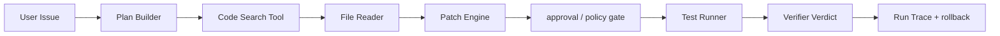

# Coding Agent Harness

## 面试定位

Coding Agent Harness 考的是你是否理解“模型写代码”背后的运行时。面试官会追问：workspace sandbox 如何隔离，Patch Engine 如何生成 diff，Test Runner 如何给出 ground truth，写操作如何 approval 和 rollback。

## 一句话定义

Coding Agent Harness 是围绕代码搜索、文件读取、补丁生成、测试执行、权限控制、审计和回滚构建的受控执行环境，让模型只能通过工具完成可验证的代码修改。

## 为什么需要它

模型本身不能安全地读写仓库、运行 shell 或判断测试是否真的通过。Harness 把开放式 coding 任务拆成受控动作：搜索、读取、计划、patch、测试、复盘。它提供 workspace sandbox、权限边界、结构化 trace 和验证命令，避免模型凭感觉声称修复完成。

## 核心架构

图 1：Coding Agent Harness 的受控修改链路。

图中 Planner、Search、Reader、Patch 和 Test Runner 不是普通工具堆叠，而是一条事务链。模型只能通过 Search/Reader 获取证据，通过 Patch Engine 提交可审计 diff，再由 Policy Gate 和 Test Runner 给出真实 verdict。Harness 的核心不是“让模型能执行更多命令”，而是让每个高风险动作都有 preview、验证和恢复路径。

## 架构与运行机制

workspace sandbox 隔离文件系统、网络、环境变量和命令权限。Code Search 负责 `rg`、symbol search、dependency map。File Reader 控制上下文窗口和敏感文件。Patch Engine 只接受 unified diff 或 apply_patch 风格修改，并保存 before hash。Test Runner 执行 lint、unit tests、build 和目标回归命令。Verifier 读取真实 exit code 与输出，不接受模型自报。

写操作进入 approval gate。低风险文档或测试修改可自动 preview，高风险 shell、删除、发布、依赖升级需要人工确认。rollback 依赖 patch 反向应用、备份文件或工作区快照。

## 运行机制

典型数据流是 issue 进入 Planner，模型先搜索相关代码，再读取最小上下文，Patch Engine 生成 diff，Test Runner 运行验证命令，Verifier 根据输出决定继续、回滚或完成。每一步都写入 trace：tool、args、artifact、stdout 摘要、state diff 和 verdict。

## 关键设计取舍

| 设计点 | 方案 | 收益 | 风险 |
| --- | --- | --- | --- |
| sandbox | 临时 workspace | 隔离误写 | 环境准备成本 |
| patch-only write | diff 作为唯一写入口 | 易 review 与 rollback | 不适合大规模生成 |
| command allowlist | 限制 shell 能力 | 降低破坏面 | 可能挡住必要调试 |
| test gate | 真实命令验证 | 证据强 | 测试慢或不完备 |

## 生产落地细节

关键字段包括 `run_id`、`workspace_id`、`changed_files`、`patch_id`、`approval_id`、`test_command`、`exit_code`、`artifact_ref`、`rollback_ref`。指标包括 `issue_resolution_rate`、`test_pass_rate`、`patch_apply_failure_rate`、`rollback_success_rate`、`unsafe_command_block_count` 和 `review_findings_per_patch`。

生产系统还要区分“工具失败”和“任务失败”。`npm test` 返回非 0 是任务观察结果，Agent 可以继续读取失败日志并修复；shell 权限拒绝、依赖缺失、超时、工作区损坏才是工具层故障。这个区分决定了恢复策略：任务失败走下一轮 patch，工具失败走环境修复或人工接管。

另一个关键边界是凭据和外部副作用。Coding Agent 可以读取普通源码和测试，但不能默认读取 `.env`、密钥文件、浏览器登录态或云账号凭据。会修改数据库、发布版本、删除文件、升级依赖、发邮件或调用付费 API 的命令，都应进入高风险 approval。公开讲 Harness 时，要强调它既是生产力系统，也是安全控制面。

## 系统设计案例

修复一个前端按钮溢出 bug 时，Agent 先读取失败截图或测试，再搜索组件和 CSS。Patch Engine 生成最小 diff。Test Runner 运行类型检查、UI contract 和构建。若构建失败，Verifier 把错误写回状态，Agent 继续修复。若补丁修改无关文件，review rubric 失败。

## 真实问题与排障

如果测试通过但问题未修，说明 verifier 覆盖不够。若 Agent 总是改无关文件，检查检索和计划阶段。若命令失败率高，排查 sandbox 依赖和环境变量。若误删文件，检查 Patch Engine 是否绕过 preview，以及 rollback 是否可用。

排查链路可以从四个问题开始：第一，Agent 是否读到了正确上下文；第二，diff 是否只落在需求相关文件；第三，验证命令是否覆盖原始症状；第四，回滚是否能恢复到修改前状态。如果其中任一项没有证据，就不能把任务标成完成。对公开文章来说，这一点比“模型会写代码”更重要，因为它直接决定用户能不能信任自动修改。

## 常见误区与排障

- 让模型直接运行任意 shell。
- 没读代码就生成补丁。
- 只看测试通过，不看 diff 范围和需求符合度。
- 没有 before hash、approval 和 rollback。

## 面试追问

1. Harness 和模型能力有什么关系？Harness 决定可执行、可验证和可恢复边界。
2. 为什么 patch-only？方便 review、审计和回滚。
3. 自动测试通过还要人工 review 吗？要，因为测试覆盖不了可维护性和安全风险。
4. workspace sandbox 限制什么？文件、网络、进程、凭据和外部副作用。

## 项目化表达

可以说：我的 Coding Agent 不直接写文件，而是通过 workspace sandbox、Patch Engine、Test Runner 和 Verifier 工作。每次修改都有 diff、approval、测试证据和 rollback 记录。

## 深入技术细节

Harness 的关键是把“模型想改代码”变成一组可审计事务。Patch Engine 不能只写文件，它要保存 `before_hash`、`after_hash`、`patch_id`、`changed_ranges`、`conflict_status` 和 `rollback_ref`。Test Runner 也不能只返回一段日志，而要返回 `command`、`exit_code`、`duration_ms`、`failed_tests`、`log_ref` 和 `environment_hash`。Verifier 用这些事实判断是否继续，而不是相信模型口头总结。

沙箱要限制文件系统、网络、环境变量、进程和凭据。读操作可以更宽，写操作必须经过 workspace scope 和 patch preview。命令执行最好有 allowlist、timeout 和输出截断；依赖安装、删除文件、发布、访问外网都应该被标成高风险。这样即使模型被 prompt injection 或错误计划影响，执行层仍能把破坏面收住。

## 关键数据结构与协议

| 字段 | 所属模块 | 作用 |
| --- | --- | --- |
| `workspace_id` | sandbox | 隔离一次任务的文件和命令 |
| `patch_id` | Patch Engine | 绑定 diff、review 和 rollback |
| `before_hash` | Patch Engine | 防止覆盖并发修改 |
| `approval_id` | Policy Gate | 记录高风险写操作确认 |
| `test_command` | Test Runner | 固定验证口径 |
| `exit_code` | Verifier | 判断真实通过或失败 |
| `rollback_ref` | Recovery | 支持撤回补丁 |

协议上要把测试失败当成 observation，而不是工具崩溃。`run_tests` 退出码非 0 时，Agent 应读取失败摘要并定位修复；只有命令不存在、环境坏、超时或权限拒绝才算工具错误。这个区分能显著提升排障质量。

## 深问准备

如果被问“测试通过为什么还要 review”，可以回答：测试覆盖不了可维护性、安全边界、无关 diff 和需求符合度。Harness 可以先做自动门禁，再对高风险补丁或大范围 diff 触发人工 review。

如果追问“如何防止 Agent 改无关文件”，我会用检索约束、plan scope、patch size limit、changed_files allowlist 和 diff verifier。指标看 `irrelevant_diff_rate`、`review_findings_per_patch`、`rollback_success_rate` 和 `regression_escape_rate`。

## 公开阅读校验

Coding Agent Harness 的文章要避免把重点放在“模型会不会写代码”，而要放在“系统能不能控制代码修改”。公开读者最需要看到的是可执行边界：哪些文件能读，哪些文件能写，哪些命令可运行，哪些操作需要 approval，验证失败时如何继续，出现副作用时如何回滚。

生产验收建议至少准备五类任务样本：小范围 bugfix、跨文件重构、测试失败修复、依赖或环境异常、以及带敏感文件或危险命令的拒绝样本。前四类证明 harness 能完成真实开发任务，第五类证明系统不会因为模型建议而越权。每个样本都要保存 changed_files、patch diff、test command、exit code、review verdict 和 rollback result。只展示成功 patch 不够，必须展示系统如何拒绝不该做的事。

文章还可以强调一个关键工程原则：Verifier 不能只读模型总结，必须读真实命令输出和 diff。比如测试通过但 diff 修改了无关文件，仍然不应通过；测试失败但日志指向明确，应该作为下一轮 observation，而不是直接宣布任务失败。把这些状态区分清楚，Coding Agent 才从“会生成代码的聊天机器人”变成可信的开发运行时。

实际落地时，还需要对“提交前状态”做快照。Harness 至少要保存 baseline commit、工作区 dirty 状态、依赖锁文件状态和验证命令版本。否则同一个 patch 在不同机器或不同依赖版本下可能得到不同 verdict。公开文章把这个点写出来，会让读者意识到 Harness 不是单个模型功能，而是贯穿代码、环境、权限和审计的运行时系统。

## 来源与延伸阅读

- [SWE-bench GitHub](https://github.com/swe-bench/SWE-bench)：用于支持 issue-to-patch 评测形式，说明 Coding Agent 需要在真实仓库里完成可验证修改。
- [SWE-bench Paper](https://arxiv.org/abs/2310.06770)：用于解释真实 GitHub issue 对检索、定位、补丁生成和回归测试的挑战。
- [OpenAI Agents SDK Tracing](https://openai.github.io/openai-agents-python/tracing/)：官方文档用于支持 tool call、handoff、guardrail 等运行轨迹需要被结构化记录。
- [OpenAI Agents SDK Tools](https://openai.github.io/openai-agents-python/tools/)：用于说明 Agent 工具是受接口约束的能力边界，不应等同于任意 shell 权限。
