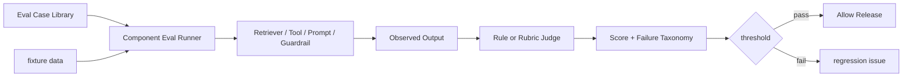

# Component Eval

## 面试定位

Component Eval 是 Agent 评测体系的最低层。面试官问它时，不是想听“让模型打分”，而是想知道你能否把 retriever、reranker、tool schema、parser、prompt、guardrail、Context Builder 这些组件拆开测试。好的回答会说明 fixture、expected_behavior、forbidden_behavior、threshold、regression 和 CI gate。

## 一句话定义

Component Eval 是对 Agent 系统中单个组件做可重复评测，目的是在端到端失败前发现问题，并在失败后准确归因。它不直接证明业务任务成功，但能回答“到底是检索坏了、工具参数错了、输出解析失败，还是 guardrail 漏拦了”。

## 为什么需要它

端到端成功率只能告诉你系统有没有完成任务，不能告诉你该修哪里。RAG 答错可能是 chunk 切分、召回、重排、引用、生成任一环节出了问题。工具调用失败可能是 schema 不清、权限拒绝、timeout 或模型选错工具。Component Eval 把这些环节拆开，用固定输入和可解释断言降低排障成本。

## 核心架构

图中 Judge 不一定是 LLM。很多核心约束应该用确定性规则，例如工具参数是否符合 schema、返回是否有 error_code、检索是否命中 expected evidence id。

## 架构与运行机制

每条 eval case 至少包含 input、fixture、expected_behavior、forbidden_behavior、rubric、tags、owner 和 threshold。fixture 要冻结外部环境，例如检索索引切片、工具 mock、网页 snapshot、PDF 页码或测试仓库状态。这样模型、prompt 或 schema 变化后才能比较差异。

核心数据流是 case library 生成输入，Eval Runner 注入 fixture，组件产出 observed output，Judge 给出 verdict，Gate 决定是否阻断发布。把这条数据流结构化之后，失败报告才能追到具体组件和具体断言，而不是只留下一个模糊分数。

运行时，Eval Runner 把 fixture 注入组件，收集 observed output，再由规则或 rubric 判断。输出不能只给一个分数，还要给 failure taxonomy，例如 retrieval_miss、invalid_args、unsafe_allow、parser_error、lost_constraint。这样 CI 失败时工程师知道修哪个模块。

## 运行机制

不同组件的断言不同。Retriever Eval 看 recall@k、MRR、metadata filter、权限过滤和 stale document。Tool Eval 看 valid_call_rate、invalid_args、permission_denied、timeout 和 structured error。Context Eval 看关键约束是否保留、evidence id 是否存在、工具是否正确裁剪。Guardrail Eval 看拦截率、误拦截率和高风险漏拦。

Component Eval 不替代 Trajectory Eval。组件都过了，不代表多步路径合理。它的价值是做底层回归和归因。

## 关键设计取舍

| Eval 类型 | 适用对象 | 优点 | 风险 | 面试表达 |
| --- | --- | --- | --- | --- |
| 规则断言 | schema、权限、引用 | 稳定、可进 CI | 覆盖语义弱 | 硬约束优先规则化 |
| Rubric 打分 | 回答质量、上下文保留 | 覆盖复杂场景 | 需要校准 | 用人工样本校准阈值 |
| LLM-as-judge | 长文本、路径解释 | 扩展快 | 漂移与偏差 | 只做辅助信号 |
| 人工抽检 | 高风险 case | 可信度高 | 成本高 | 用于校准和事故样本 |

## 生产落地细节

生产中要按组件维护 case 库。每个 case 有 owner 和标签，例如 `retriever:permission`、`tool:timeout`、`guardrail:prompt_injection`。CI gate 对核心 case 设置 threshold。新线上事故先生成 candidate case，人工确认后进入 regression 集合。这样系统质量会随事故沉淀，而不是只靠临时修 prompt。

关键指标包括 `component_pass_rate`、`case_flakiness_rate`、`threshold_violation_count`、`regression_escape_rate`、`eval_runtime_p95` 和 `owner_ack_time`。如果 case flakiness 高，说明 fixture 没冻结好，或者断言依赖实时环境。

## 系统设计案例

RAG 系统可以为 retriever 准备 100 条问题，每条标注 expected evidence id。评测只看是否召回正确证据，而不是最终答案是否漂亮。Tool Schema 可以准备 valid、invalid、permission denied、timeout 四类 fixture，断言工具返回结构化 observation 或 error envelope。Context Builder 可以断言“不要发送邮件”这类硬约束必须出现在 context manifest。

对于 Guardrails，准备 prompt injection 样本、PII 样本和越权工具调用样本。断言 unsafe request 进入 deny 或 confirm，而不是让模型自己解释为什么安全。

## 真实问题与排障

如果端到端失败率上升，先看最近改动涉及哪些组件。改了 embedding 或索引，先跑 retriever eval。改了 tool schema，先跑 tool eval。改了 prompt 或 context builder，先跑 constraint retention 和 parser eval。不要一上来重写整套 prompt，那会掩盖真实根因。

## 常见误区与排障

- 只做端到端评测，失败后不知道修哪里。
- Eval case 没有 fixture，结果随线上环境波动。
- 只比较文本相似度，不检查关键行为。
- threshold 没有 owner，失败后无人处理。

## 面试追问

1. Component Eval 和 E2E Eval 区别是什么？重点是归因与业务成功的分层。
2. Tool Eval 怎么写？重点是 schema、权限、timeout、error envelope。
3. RAG Retriever 怎么评？重点是 expected evidence ids、recall@k 和权限过滤。
4. 如何把线上失败变成回归？重点是 candidate case、人工确认和 regression。

## 项目化表达

在 Paper Agent 项目中，可以说：我为 retriever、citation verifier、context builder 和 output parser 分别写了 component eval。Retriever 只看 evidence hit，citation verifier 只看 claim 是否被引用支持，Context Builder 只看约束和证据是否保留。端到端失败时可以快速定位是哪一层坏了。

## 深入技术细节

Component Eval 的价值是归因。每个组件的输入、fixture、输出和 judge 要独立冻结。Retriever Eval 的 fixture 是 query、filters、expected evidence ids；Tool Eval 的 fixture 是参数、权限、模拟下游和预期 error envelope；Context Eval 的 fixture 是 state、memory、evidence、工具列表和 token budget。

Judge 应优先用确定性规则覆盖硬约束：schema 是否合法、权限是否拒绝、引用 id 是否存在、expected evidence 是否召回。LLM-as-judge 更适合开放文本质量，但要有人工样本校准，且不能作为高风险安全门禁的唯一依据。

## 关键数据结构与协议

| 字段 | 作用 | 示例 |
| :--- | :--- | :--- |
| `case_id` | 样本追踪 | retriever-permission-01 |
| `fixture_ref` | 冻结外部环境 | 索引切片/工具 mock |
| `expected_behavior` | 正向断言 | 召回 evidence id |
| `forbidden_behavior` | 反向断言 | 不暴露敏感工具 |
| `judge_version` | 评测版本 | 防漂移 |
| `failure_taxonomy` | 归因 | retrieval_miss |

协议上线上事故要先生成 candidate case，人工确认后进入 regression。否则修复只解决当次问题，未来模型、schema 或索引变更后仍会复发。

## 深问准备

被问“为什么不只做 E2E Eval”，可以回答：E2E 接近用户价值但失败难归因；Component Eval 能告诉你是 retriever、tool、context builder、guardrail 还是 parser 坏了。两者应该配合。

被问“如何处理 flakiness”，冻结 fixture、mock 外部依赖、记录 judge version、减少实时 API 依赖，并监控 `case_flakiness_rate`。不稳定 eval 不能当发布门禁。

## 来源与延伸阅读

- [Promptfoo](https://github.com/promptfoo/promptfoo)：用于理解 prompt 与模型输出评测的 case 管理。
- [DeepEval](https://github.com/confident-ai/deepeval)：用于理解 RAG、LLM 输出和指标化评测。
- [Inspect](https://inspect.aisi.org.uk/)：用于理解可复现 eval、样本、评分和任务组织。
