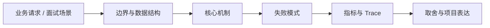

# Computer Use Agent 与 OSWorld

## 面试定位

Computer Use Agent 与 OSWorld 属于 AI 工程趋势与实战方案 / Computer Use 与 Browser Agent。面试里它不是背概念题，而是用来判断你是否能把知识落到架构、数据流、指标和取舍上。
一句话定位：Computer Use Agent 把观察和动作扩展到真实桌面环境，评测重点从网页成功率扩展到跨应用任务完成和安全边界。

**必须讲清楚**
- Computer Use Agent 把观察和动作扩展到真实桌面环境，评测重点从网页成功率扩展到跨应用任务完成和安全边界。
- 真实桌面比浏览器更开放
- benchmark 不等于生产可用
- 安全边界必须前置

**常见追问方向**
- Computer Use Agent 和 Browser Agent 的区别。
- 如何评测真实电脑操作 Agent 的可靠性和安全性。
- 为什么桌面任务需要更强权限、隔离和人工确认。
- 如果这个点落到 Web Agent：公开网页任务自动化与评测，架构如何设计？
- 线上失败时看哪些 trace、日志、指标，怎么回滚或补偿？

## 架构与运行机制

### 核心机制

- Agent S 和 OSWorld 类 benchmark 代表桌面操作 Agent 的发展方向。
- 桌面任务需要屏幕观察、窗口状态、文件系统、应用权限和动作恢复。

### 通用数据流

可以按用户目标、模型、上下文、状态、工具、执行循环、评测、安全和可观测性来讲。数据流是用户任务进入编排层，Context Builder 汇总系统指令、用户约束、RAG 证据、短期状态和工具结果，模型输出结构化动作，宿主程序执行工具并把 observation 写回 State 和 Trace。

### 工程落点

- 观察层保存 screenshot、active_app、window_title、ocr_text 和可操作区域。
- 动作层限制 click/type/hotkey/file 操作，并对高风险动作加 confirmation。
- 每步后用 verifier 检查 UI 状态、文件变化或任务产物。
- 评测集覆盖跨应用、文件处理、网络失败、弹窗和权限拦截。
- trace 字段包含 screenshot_ref、active_app、action_type、target_region、verifier_state、unsafe_action_blocked。
- 评测指标包括 task_success_rate、step_error_rate、recovery_rate、unsafe_action_rate。
- 把每个关键步骤都映射到可观测指标，避免只描述功能。
- 回答时主动说明哪些信息是强一致状态，哪些只是上下文或缓存视图。

## 可画图

图 1：Computer Use Agent 与 OSWorld 的回答要从业务入口进入，先讲边界和数据结构，再讲机制、失败模式、指标和取舍。

## 系统设计案例

### Computer Use Agent 与 OSWorld 的面试级设计题

典型设计题是企业内部 Agent、Coding Agent、Paper Agent 或 Web Agent：外层 deterministic workflow 管理权限、预算、审批和最终提交，内层 Agent loop 处理开放探索，Eval Gate 根据 golden case、轨迹评分、工具结果和人工反馈决定是否继续。

**可画架构**
- 入口层校验用户请求、权限、租户、参数和幂等键。
- 业务服务层决定同步处理、异步处理、缓存读写、数据库回源或降级返回。
- 状态层保存业务状态、缓存版本、事件状态和恢复点。
- 执行层处理存储访问、下游调用、异步任务和补偿动作，并把结构化结果写入 trace。
- 观测层用指标、日志和链路追踪证明系统可运行、可排障、可复盘。

**数据流**
- 请求进入入口层后生成 request_id/run_id。
- 业务服务读取缓存、数据库或异步事件状态，选择执行路径。
- 执行结果写回状态存储，并向监控系统上报延迟、错误和业务结果。
- 保护策略根据成功标准、失败次数、SLA 和风险等级决定继续、降级、补偿或停止。

## 真实问题与排障

真实线上问题一般从任务成功率、工具调用成功率、invalid args、上下文漂移、幻觉率、引用准确率、token 成本、延迟、guardrail block rate 和 human handoff rate 看起。回答时要把模型问题、检索问题、工具问题、状态问题和权限问题分开归因。

**排查顺序**
- 先确认用户可感知问题：错误率、延迟、成功率、数据一致性或结果质量是否异常。
- 再沿数据流定位是哪一段出了问题：入口、状态、缓存、数据库、异步事件、外部依赖或消费端。
- 对比最近发布、配置变更、流量变化、数据倾斜和下游限流。
- 先止血：限流、降级、回滚、暂停消费、隔离高风险工具或切换只读模式。
- 最后把失败样例进入 regression/eval，避免同类问题复发。

**重点指标**
- task_success_rate
- step_error_rate
- recovery_rate
- unsafe_action_block_rate
- trace_replay_success_rate

**常见误区**
- 用 benchmark 分数替代产品安全评估
- 没有敏感操作确认
- 截图观察无法复盘

## 业界方案与技术取舍

AI Agent 的取舍是开放任务能力换来了不确定性、成本、延迟和治理复杂度。面试追问通常会围绕 workflow 与 agent 边界、memory 与 RAG 区别、function calling 是否等于 agent、eval 怎么证明不是 demo、如何做安全边界展开。

**方案对比**
- Computer Use Agent 把动作空间从网页扩展到真实桌面，风险和不确定性都更高。
- OSWorld 类 benchmark 评估跨应用任务，但分数不等于生产安全可用。
- 桌面 Agent 必须把观察、动作、验证、安全确认和回放做成闭环。

**复习时要能讲出的细节**
- 这个知识点解决什么问题，不解决什么问题。
- 关键数据结构、状态变化、失败边界和可观测指标是什么。
- 面试官继续追问时，能从架构图、数据流、线上排障和项目证据四个角度展开。
- 能说明为什么这个取舍适合当前业务，而不是只背业界名词。

## 深入技术细节

Computer Use Agent 把观察和动作扩展到真实桌面环境，评测重点从网页成功率扩展到跨应用任务完成和安全边界。

面试深挖时要把对象、状态、协议、执行顺序和失败分支讲出来。不要只说“可以用 Redis/数据库/MQ 解决”，而要说明 key、字段、版本、超时、重试、幂等、降级和观测指标如何共同工作。

## 关键数据结构与协议

| 字段 | 所属对象 | 作用 | 排障价值 |
| :--- | :--- | :--- | :--- |
| `request_id` | 请求 | 串联入口、缓存、DB 和下游调用 | 定位单次异常 |
| `key_schema` | Redis/存储 | 固定业务域、实体和版本 | 排查误删、串租户和旧版本 |
| `source_version` | value/event | 标识事实源版本 | 防止旧值覆盖新值 |
| `ttl_policy` | 缓存策略 | 控制过期、抖动和刷新 | 排查击穿、雪崩和旧值窗口 |
| `trace_id` | 观测链路 | 串联服务、存储和异步任务 | 复盘慢请求和失败分支 |

## 深问准备

被追问边界时，先说这个方案适合什么、不适合什么，再给反例。被追问线上故障时，按影响面、止血、根因、修复、回归五段回答。被追问项目时，把回答落到你做过的接口、缓存、队列、数据库、监控或 Agent 工程链路。

- 反例要明确，例如强事务事实源不能交给缓存或搜索读模型。
- 指标要可执行，例如 p95、error_rate、retry_rate、lag、miss_rate、stale_rate。
- 回归要可复现，例如固定输入、故障注入、压测脚本或 golden case。

## 趋势落地补充

Computer Use Agent 的关键不是“能点鼠标键盘”，而是每个动作都必须有观察、执行、验证和安全边界。浏览器任务通常还能依赖 DOM 和 Playwright selector，桌面任务则要面对窗口焦点、截图识别、系统弹窗、文件副作用和跨应用状态，这会显著放大误操作风险。

动手实验可以先做一个只读桌面任务集，例如打开本地文档、读取窗口标题、截屏、提取可见文本，然后再逐步加入低风险输入动作。评估时记录 task_success_rate、step_error_rate、unsafe_action_block_rate 和 trace_replay_success_rate。面试回答要强调 benchmark 只是能力指标，生产落地还需要 sandbox、confirmation 和 audit。

## 生产验收清单

- 动作空间要白名单化，区分只读观察、低风险输入、高风险文件/网络/支付动作，并对高风险动作加人工确认。
- Trace 至少保存 screenshot_ref、active_app、window_title、ocr_text、action_type、target_region、verifier_state 和 blocked_reason。
- 评测不能只看最终成功率，还要看误点率、恢复率、敏感动作拦截率、重放成功率和任务平均步数。
- 生产环境要隔离账户、文件系统和网络权限，避免桌面 Agent 在真实用户环境里无边界执行。
- OSWorld 或 Agent S 分数只能说明 benchmark 能力，不能替代对权限、隐私、审计和业务副作用的上线评估。
- 一个合格试点可以从“只读观察 + 人工确认写入”开始，例如读取窗口状态、整理文件清单、生成操作计划，再由用户确认后执行低风险动作。
- 失败样例要保留截图、动作坐标、焦点窗口和验证结果，否则很难判断是视觉识别失败、动作执行失败还是目标应用状态变化。

## 来源与延伸阅读

- [Agent S](https://github.com/simular-ai/Agent-S)：用于确认官方语义边界、命令行为和工程约束。
- [OSWorld](https://github.com/xlang-ai/OSWorld)：用于确认官方语义边界、命令行为和工程约束。
