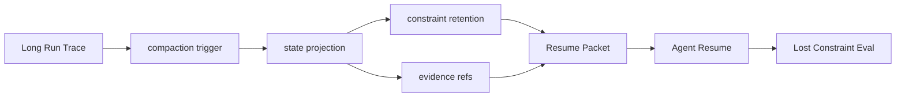

# Coding Agent 上下文压缩

## 面试定位

Coding Agent 上下文压缩考的是长任务如何跨窗口持续执行。面试官会追问：什么时候触发 compaction trigger，state projection 如何保留任务状态，constraint retention 怎么评估，恢复时怎样避免 lost constraint。

## 一句话定义

上下文压缩是把长对话、trace、日志、diff 和证据压成结构化 state projection，并保留 evidence refs、约束、决策和下一步动作，使 Agent 能在 resume 后继续可靠工作。

## 为什么需要它

Coding 任务会快速吃满上下文窗口。简单摘要容易丢掉用户约束、失败测试、已做决策和未解决风险。好的压缩不是“写一段总结”，而是把可恢复状态结构化：目标是什么，改了哪些文件，跑过哪些测试，哪些证据支持当前判断，下一步要做什么。

## 核心架构

图 1：Coding Agent 上下文压缩从长 trace 到恢复包的状态投影链路。长任务 trace 先触发 compaction trigger，Projector 抽取结构化 state projection，Constraint Retention 保留硬约束，Evidence Refs 保存可追溯证据，最后生成 Resume Packet 供下一轮 Agent 恢复。

这张图的关键边界是：压缩产物不是一段漂亮摘要，而是可恢复、可检查、可追溯的任务状态。硬约束、测试结果、变更文件、未完成风险和 evidence refs 是恢复执行的事实索引；原始 trace、日志、diff 和截图仍是事实源，不能被摘要替代。

压缩后的对象应该可被程序检查，而不是只靠模型读懂自然语言。

## 架构与运行机制

compaction trigger 可以来自 token 水位、阶段完成、测试结果、用户确认或长时间运行。Projector 把 trace 转成字段：goal、constraints、plan、completed_steps、changed_files、open_risks、test_results、decisions、artifact_refs、next_actions。constraint retention 检查用户硬约束、禁止事项、接口契约和安全边界是否仍在摘要中。

核心数据流是长 trace 触发压缩，Projector 生成 state projection，Constraint Checker 校验硬约束，Artifact Linker 写入 evidence refs，Resume Loader 在新上下文恢复任务。

evidence refs 很重要。完整日志、截图、diff、trace 和测试输出不应都塞进摘要。摘要保存引用、hash、关键结论和检索方式。恢复时 Agent 先加载 Resume Packet，再按需要读取 artifact。

## 运行机制

恢复流程要验证 state projection。Agent 应先复述当前 goal、未完成事项和风险，再继续执行。若发现缺少 evidence refs 或测试结论不明，应先补读，而不是凭摘要猜。对 coding 任务，changed_files、test_results 和 rollback_refs 是最小恢复集。

## 关键设计取舍

| 压缩策略 | 优点 | 风险 | 适用场景 |
| --- | --- | --- | --- |
| 自然语言摘要 | 便宜，易读 | 容易丢约束 | 低风险对话 |
| 结构化 state projection | 可检查，可恢复 | 设计成本高 | 长任务 Agent |
| artifact refs | 控制 token | 依赖存储完整性 | 日志、diff、截图 |
| 阶段性 compaction | 边界清晰 | 触发点要设计 | coding 和 research |

## 生产落地细节

Resume Packet 至少包含 `state_version`、`goal`、`hard_constraints`、`current_plan`、`changed_files`、`commands_run`、`test_results`、`decisions`、`open_questions`、`evidence_refs` 和 `next_actions`。指标包括 `resume_success_rate`、`lost_constraint_rate`、`artifact_ref_missing_rate`、`stale_summary_rate` 和 `post_resume_regression_rate`。

## 系统设计案例

Coding Agent 修复到一半触发上下文压缩。state projection 保存用户要求“不改公开 API”、已修改文件、失败测试、已排除方案和下一步要读的模块。恢复后，Agent 先读取失败测试 artifact，再继续 patch。若摘要缺少“不改公开 API”，lost constraint eval 应失败。

## 真实问题与排障

如果 resume 后重复做旧步骤，检查 completed_steps 和 state_version。若违反用户约束，检查 constraint retention。若无法复现测试失败，检查 evidence refs 和 artifact TTL。若摘要越来越长，说明没有分离状态和原始证据。

事故复盘要把“摘要错误”和“证据丢失”分开看。摘要错误通常表现为 hard constraints 丢失、next_actions 过期、test_results 只有结论没有命令和退出码；证据丢失通常表现为 artifact ref 过期、日志被截断、diff hash 对不上或截图访问权限不足。止血方式是暂停自动续跑，重新读取 trace 和 git diff，生成新的 Resume Packet，再把失败样本加入 lost-constraint eval。

## 常见误区与排障

- 把压缩等同于聊天总结。
- 只保留结论，不保留证据引用。
- 没有记录测试命令和退出码。
- 恢复后不校验 hard constraints。

## 面试追问

1. compaction trigger 怎么设？按 token、阶段、风险和用户确认触发。
2. state projection 存什么？目标、约束、计划、文件、测试、风险和 evidence refs。
3. lost constraint 怎么测？用固定约束 case 检查恢复后是否仍遵守。
4. 摘要和 trace 谁是事实源？trace 和 artifact 是事实源，摘要是索引。

## 项目化表达

可以说：我把 Coding Agent 的压缩结果设计成 Resume Packet，而不是自由文本。每个 packet 有 state_version、constraint retention 检查和 evidence refs。恢复后先验证约束，再继续执行。

## 深入技术细节

上下文压缩要区分三类内容：必须保留的任务状态、可按需读取的证据引用、可以丢弃的中间噪声。必须保留的是 `goal`、`hard_constraints`、`current_plan`、`completed_steps`、`changed_files`、`test_results`、`open_risks` 和 `next_actions`。证据引用包括 diff、日志、截图、测试输出和 trace event id。中间噪声包括重复讨论、长 stdout、已经被 verifier 否定的候选方案。

压缩不是单向总结，而是一次 state projection。Projector 从 trace 中提取结构化字段，Constraint Checker 校验用户硬约束是否完整，Artifact Linker 写入可恢复引用，Resume Loader 在新上下文里先做 self-check。恢复后第一步应确认 state version、未完成事项和风险，而不是直接继续写代码。

## 关键数据结构与协议

| 字段 | 来源 | 恢复用途 |
| --- | --- | --- |
| `state_version` | compaction event | 防止旧摘要覆盖新状态 |
| `hard_constraints` | 用户和系统要求 | 检查 lost constraint |
| `completed_steps` | trace | 避免重复工作 |
| `changed_files` | patch trace | 支持 diff 和 rollback |
| `test_results` | test runner | 确认验证状态 |
| `evidence_refs` | artifact store | 按需重读事实 |
| `next_actions` | planner/verifier | 恢复执行路线 |

协议上要定义压缩触发和验证门槛。触发可以是 token 水位、阶段完成、长日志出现、测试结果完成或用户确认；验证门槛是摘要必须通过 constraint retention、artifact ref 可访问、state_version 单调递增。

## 深问准备

如果被问“摘要和 trace 谁可信”，答案是 trace 和 artifact 是事实源，摘要只是索引和状态投影。摘要里写“测试通过”必须带 test command、exit code 和 log ref，否则恢复时要重新验证。

如果追问“如何评估压缩质量”，可以用 `resume_success_rate`、`lost_constraint_rate`、`artifact_ref_missing_rate`、`duplicate_work_rate` 和 `post_resume_regression_rate`。这些指标能证明压缩是否真的支持长任务，而不是只节省 token。

## 公开阅读校验

Coding Agent 上下文压缩的公开文章要强调“恢复正确”比“摘要漂亮”重要。一个压缩包如果没有保存测试命令、退出码、已改文件、未解决风险和用户硬约束，即使自然语言读起来顺，也不能支撑下一轮继续工作。面向生产的 Resume Packet 应该能被程序检查，而不是只让模型主观理解。

验收时可以设计 lost-constraint eval：给 Agent 一个长任务，过程中加入硬约束，例如“不改公开 API”“不要触碰配置文件”“失败测试必须保留原始命令”。触发压缩后，用 Resume Packet 继续任务，检查它是否重复已完成步骤、是否违反约束、是否能找到失败日志、是否能解释当前 diff。这个 eval 比压缩比例更有价值，因为它直接验证压缩是否保留了行动所需状态。

还要处理压缩链路里的时效问题。Artifact refs 可能过期，git diff 可能被后续修改覆盖，测试日志可能被清理。Resume Packet 因此需要记录 `state_version`、`source_trace_range`、artifact hash 和可重新获取方式。恢复时如果发现证据缺失，正确动作是重新读取事实源或重新运行验证命令，而不是相信旧摘要继续改代码。

一个可靠的 Resume Packet 还应写明“哪些内容不能从摘要推断”。例如摘要可以说某测试曾经失败，但不能因此推断当前仍失败；摘要可以记录某文件曾被修改，但恢复时仍要读取当前 diff；摘要可以保留下一步动作，但如果用户后来追加了约束，必须重新规划。这个负面边界能防止压缩产物被误用成新的事实源。

恢复前的自检结果也要写入新的 trace，并保留复查时间。

## 来源与延伸阅读

- [OpenAI Agents SDK Tracing](https://openai.github.io/openai-agents-python/tracing/)：用于支持 agent run 应以结构化事件记录输入、工具调用、结果和错误，作为压缩投影的事实来源。
- [LangGraph Persistence](https://docs.langchain.com/oss/python/langgraph/persistence)：用于支持 checkpoint 和 thread-scoped state 可以作为恢复执行的持久状态来源。
- [SWE-bench](https://www.swebench.com/)：用于支持真实代码任务包含跨文件修改、测试失败、长上下文和多轮恢复，不能只靠短摘要延续。
